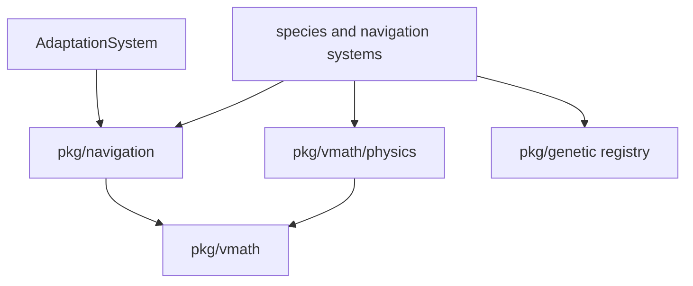
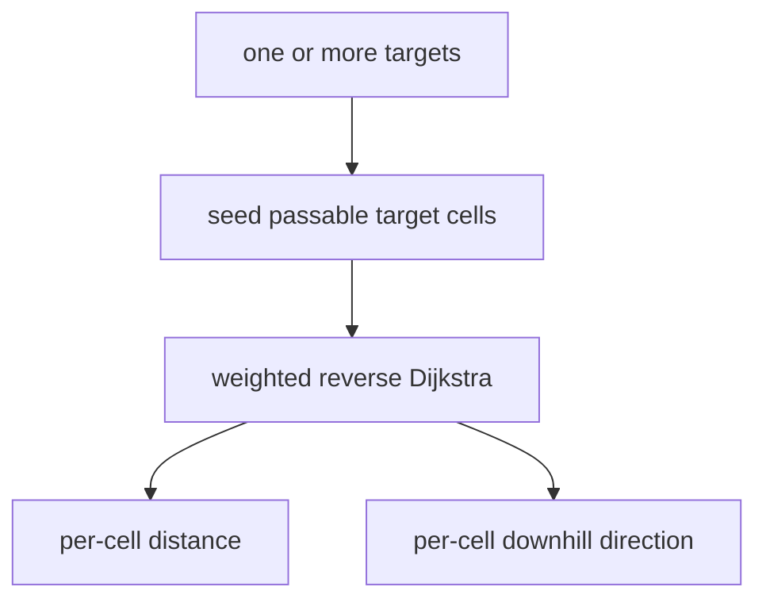
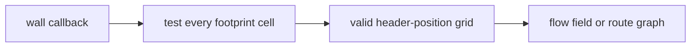
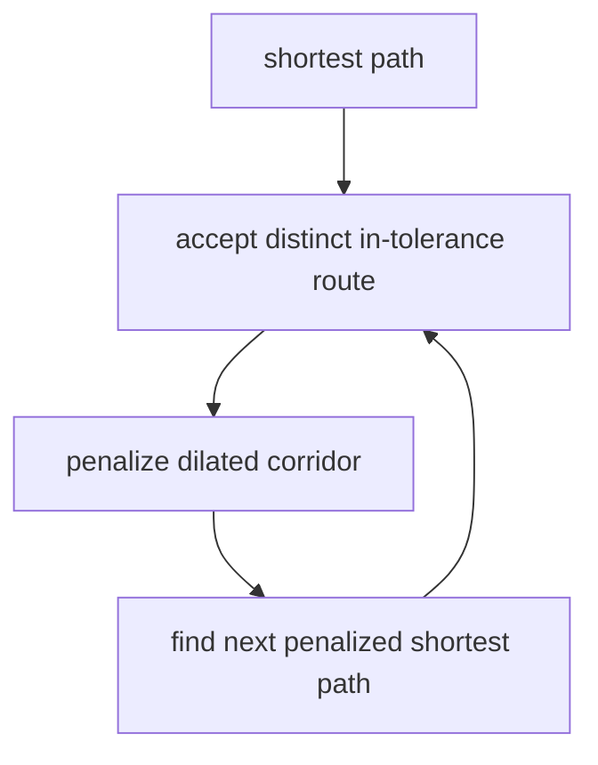
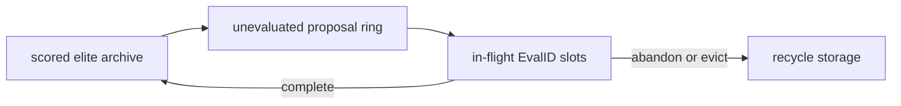

# Navigation, Physics, Adaptation, and Evolution

Vi-Fighter's moving actors share reusable math and algorithm packages, while
systems retain game-specific policy. This document covers four related layers:
grid navigation, continuous movement/collision, route adaptation, and genetic
parameter evolution.

## 1. Package relationships



`pkg/navigation` and `pkg/vmath/physics` accept data/callbacks instead of reaching
directly into the ECS where practical. `NavigationSystem` adapts wall/target
resources to those APIs. `GeneticSystem` adapts entity lifetime events to the
generic evolutionary registry. `AdaptationSystem` is separate from genetics:
it learns route selection, not actor parameters.

## 2. Flow fields

A `FlowField` runs weighted Dijkstra outward from one or more target cells and
stores, for every reachable cell, the direction that descends toward a target.

| Step | Weighted cost |
|---|---|
| Horizontal | 10 |
| Vertical | 20 |
| Diagonal | 22 |

The asymmetric costs compensate for a terminal cell's approximate 2:1 visual
aspect ratio. Eight-way movement is allowed, but a diagonal cannot cut the
corner when either adjacent cardinal cell is blocked.



If a requested target cell is blocked, the field searches outward up to eight
cells and seeds the first passable ring as virtual targets with axis-weighted
gap costs. This lets a large actor navigate toward an occupied anchor without
pretending its footprint can stand in the blocked cell.

Generation stamps avoid clearing full distance/direction arrays on each
recompute. A reusable binary min-heap reduces allocation. `DirNone` identifies
blocked/unreachable cells and `DirTarget` a seed/arrival cell.

## 3. Flow-field cache and target groups

Computing a field over a large map every 50 ms is too expensive, so
`FlowFieldCache` latches dirty state and throttles recomputation. It recomputes
when:

- target count changes;
- a target moves at least the configured Manhattan dirty distance;
- wall/level logic explicitly marks it dirty and the tick threshold is met;
- the existing field is invalid.

Target groups allow multiple actors/structures to define one navigation goal.
Group 0 contains the live cursor roster up to the eight-target navigation cap;
other groups can also contain up to eight targets. A field seeded from a group
naturally selects the nearest reachable target at each cell.

That last property is the group model's boundary, and it is worth stating as
one. "Nearest reachable cursor" is the right answer for a hostile species and
the wrong one for anything that belongs to a *particular* participant. Loot is
the case: a drop is owned by the cursor whose kill produced it, it is
player-domain, and it may only be collected by that cursor. Steered by group 0
it walked to whichever cursor was nearer and stalled there, and — worse — the
line-of-sight flag the same phase writes was computed against that nearest
cursor while the movement homed at the owner, so a drop beside somebody else's
cursor read "direct path" and drove into the wall between it and its own.

`LootSystem` therefore keeps one single-goal field per owner cursor, built from
the same `FlowFieldCache` and the same shared walls, and does its own
line-of-sight check against the same cursor it steers toward. A field is built
the first time a cursor drops something and released when that cursor goes; a
tick with none of its drops in flight recomputes nothing. Anything else that
becomes owned rather than contested belongs on the same seam: give it a private
single-goal field, do not add a target group per participant.

`NavigationComponent` records whether an actor follows a normal group flow
field or a route graph, along with graph/route IDs and movement state. The
system updates component actors but delegates special formation movement to
their species systems. Loot no longer carries one: its route is its owner's,
not its group's.

## 4. Composite passability

Point passability is insufficient for a 5-by-3 eye or other composite.
`CompositePassability` precomputes whether the entire footprint fits at every
candidate header coordinate, using header-to-top-left offsets.



It supports full rebuilds and region-of-interest rebuilds after local changes.
Its `IsBlocked` callback can be handed directly to flow-field and route-graph
algorithms. As a result, a path guarantees footprint clearance at sampled
header cells, rather than requiring the species to correct point paths after
the fact.

## 5. Route graphs

A route graph generates several meaningfully distinct, near-optimal corridors
between a source and target:

1. run a normal weighted Dijkstra to establish the optimal distance;
2. accept the path if within the configured tolerance;
3. dilate its corridor and penalize those cells;
4. rerun penalized Dijkstra to push the next candidate elsewhere;
5. reject paths whose corridor overlap is above the configured percentage;
6. stop at the route limit, attempt limit, no path, or excessive true cost.



Each accepted route stores decimated waypoints, true weighted distance, a
normalized inverse-distance initial weight, and a flow field constrained to its
dilated corridor. The graph also records the footprint/header offsets used to
compute it.

Graph IDs live in `RouteGraphResource`. Gateways attach the graph ID and a
sampled route ID to spawned species. `:graph` and `:flow` expose the structures
through the debug renderer.

## 6. Online route adaptation

`AdaptationSystem` maintains an independent route population for each
`(routeGraphID, species subtype)`. A newly computed graph seeds subtype 0 from
inverse-distance route weights; subtype-specific populations clone that
baseline lazily.

For each graph-routed species it caches route metadata before destruction. On
death, fitness is:

```text
progress = clamp(1 - remainingCorridorDistance / routeDistance, 0, 1)
efficiency = shortestRouteDistance / chosenRouteDistance
fitness = progress * efficiency
```

If collision knocked an actor just outside its corridor, a radius-five ring
search recovers the nearest valid corridor distance with an aspect-weighted gap
penalty. An actor disappearing without a normal death contributes zero.

The code historically calls its update `EXP3`, but the current implementation
is more accurately multiplicative-weights/Hedge over the mean observed fitness
per arm: rewards are not importance-weighted as canonical EXP3 requires. It:

- multiplies an observed route weight by `exp(learningRate * meanFitness)`;
- normalizes all weights;
- applies a 0.5% floor to avoid numeric extinction;
- samples 90% proportionally by CDF and 10% as uniform scouts;
- shuffles a reusable route pool consumed by spawns.

This distinction matters when reasoning about statistical guarantees. The
current policy is a pragmatic online route selector, not a textbook adversarial
bandit implementation.

Gateway despawn marks its adaptation entry as draining. After a timeout, the
system removes the entry, route graph, and buffered outcomes once in-flight
actors have had time to finish.

## 7. Genetic library

`pkg/genetic` offers two engines over generic solution and numeric fitness
types:

| Engine | Model | Suitable use |
|---|---|---|
| `StreamingEngine` | Caller-driven steady-state archive with asynchronous evaluation IDs. | Long-lived simulation actors whose score arrives on death. |
| `Engine` | Conventional synchronous generational evolution with optional parallel evaluators. | Offline/on-demand objective functions. |

The streaming engine separates:



Only scored candidates enter the fixed-capacity, descending archive, so elitism
is structural. Outcome count advances generations. Pending/proposal rings are
bounded; an evaluation can be abandoned explicitly or evicted when capacity is
overrun. The registry manages up to 256 independent species through atomic
slots and provides lock-free sampling/stat snapshots after registration.

The root `genetic` package uses `math/rand/v2` PCG streams and depends only on the
standard library. `Seed` is explicit (`0` is valid), and deterministic queue
refill is the default, so a seed plus one operation sequence yields one proposal
stream without consulting wall time. `StreamingEngine.Checkpoint`/`Restore`
carry the complete continuation point: PCG position, archive, queued proposals,
pending evaluations, partial generation, IDs and counters. Archive-only
`Snapshot`/`Inject` remain available when learned candidates should persist but
in-flight work need not.

Operators include tournament/roulette selection, uniform/N-point crossover,
bounded or Gaussian perturbation, and capacity-reusing slice cloning. The
optional fitness/tracking packages scalarize multi-metric lifetimes, and the
optional persistence package provides atomic store/codecs without coupling the
core engine to disk.

## 8. Game genetic adapter

The live game constructs `registry.NewRegistry(nil)`, so population state is
in memory only. Species register gene count, bounds, perturbation, probe bins,
and composite policy through events. Spawn systems request either an evolved
sample or a stratified scout and attach `EvalID`/genes to the entity.

The current game integration actively evaluates eyes. `GeneticSystem` tracks:

- closest squared distance to any target in the eye's target group;
- whether a self-destruct attack dealt its configured damage;
- subtype, species, route group, and evaluation ID;
- termination through normal death or loss of navigation state.

At completion it converts closest approach plus weighted successful damage into
fitness and reports it to the eye population. Runs with no positional signal
are abandoned rather than scored as zero.

On `:new`/game reset, in-flight evaluations and proposals are dropped but the
scored archive is retained, so learning survives a level reset. Because the
game registry has no persistence store, it does not survive process exit. The
generic persistence package is available but not wired into the application.

An authoritative multiplayer capture is different from file persistence. The
genetic D-19 carrier exports each registry engine's complete checkpoint, the
scout PCG/counter, and the game adapter's live fitness accumulators. A join or
correction therefore continues with the same next genotype and the same pending
evaluation IDs; it does not restart evolution from the scored archive.

## 9. Physics primitives

`pkg/vmath/physics` owns a `float64` `Kinetic` value that
`component.KineticComponent` embeds:

| Area | Facilities |
|---|---|
| Integration | acceleration/velocity/position integration and grid conversion |
| Bounds/walls | reflection, clamping, restitution, axis-separated substeps (up to 20) |
| Steering | speed caps, homing, arrival slowdown, drag, dead-zone snap |
| Collision | profile-based impulses, additive/override modes, mass ratio, variance, immunity |
| Shapes | point/ellipse/circle and entity-profile collision tests |
| Orbital | orbit constraints/forces and actor-specific field motion |
| 3D | `float64` vector integration/constraint helpers projected into the terminal plane |

`IntegrateWithBounce` limits a substep to roughly 0.45 cells to reduce wall
tunneling, moves one axis at a time, restores the prior axis position on a wall,
and scales reflected velocity by restitution. Projectiles with stricter swept
collision needs use grid traversal in their owning system rather than relying
only on final-cell overlap.

Homing separates desired cruise speed, acceleration, overspeed drag, arrival
radius, near-target drag/acceleration, and a snap dead zone. Profiles under
`internal/parameter` choose these values for loot, missiles, species, and
effects.

Two of those values are read together, because a constant pull toward a target
with nothing damping the sideways component of velocity is an orbit, not an
approach: the radius such a pull sustains is `cruise² / accel`. Overspeed drag
does not break it — a body circling at exactly the cruise speed is never
overspeed — so an actor whose sustained radius falls outside its arrival radius
circles until something else stops it. Loot did, at 60 cells per second against
120 cells per second squared: a thirty-cell orbit, six times the radius its
arrival damping covered. Every homing species also applies the cornering brake
(`TurnSeverity` × `NavCorneringBrake`), which damps a sideways heading at any
distance and is what actually forecloses the orbit; loot was the one homing
entity that did not, and does now.

## 10. Numeric model and determinism

`pkg/vmath` is a `float64` numeric and geometry package. It provides scalar and
vector operations, lookup-table trig/decay, ellipses/arcs, float grid
traversal, and a fast seeded RNG. `pkg/vmath/physics.Kinetic` stores precise
position in cells, velocity in cells per second, and acceleration in cells per
second squared, all as `float64`.

Integer `Point` and `Area` values describe discrete grid cells; they are not a
fixed-point representation. `Point.CenterF` is the sanctioned grid-to-precise
conversion and adds the half-cell offset, while `PointAtF` uses floor so
negative precise coordinates map to the correct cell. Terminal aspect
correction remains explicit in Y radii, weighted distances, and projection
rather than being encoded in the numeric type.

The retired fixed-point API and its companion files are no longer part of the
package. There is one numeric path for motion and physics: `float64` math,
plus integer values where the domain is inherently cell-indexed. Interactive
play also races scheduler/event/input paths for the world lock, so live event
timing is not a bit-exact source contract.

The runtime now defines a narrower guarantee: `ModeHeadless` and `ModeReplay`
use a `ManualClock` advanced only by `App.Tick`, and all simulation/content RNG
streams derive from the root seed and session. For one implementation build, a
driven run is a pure function of seed, resolved config, and injected event
groups; bit-exact journal replay is claimed for headless source runs. Floating
point still prevents treating that as a cross-platform lockstep guarantee, and
a live journal reconstructs input rather than promising an identical world.

## 11. Maze generation

`pkg/maze` generates odd-sized stochastic mazes using a recursive backtracker,
then optionally:

- reserves explicitly positioned or randomly placed rooms;
- removes outer borders;
- adds smart braiding/cycles while respecting topology constraints;
- connects rooms to passages and reports their entry points;
- forces start/end cells open;
- solves a BFS path from start to end.

Seed zero selects current time; a nonzero seed makes the generator's random
choices reproducible for the same configuration. Wall-system events translate
the resulting boolean grid and solution metadata into ECS walls/level state.

## 12. Extension guidance

- Use a shared flow field for many actors with the same footprint/targets; do
  not compute one per entity. Do give an actor whose goal is *one participant's*
  entity its own single-goal field: a group field selects the nearest target,
  which is a different question.
- Pair every homing profile with a damping term that acts at cruise speed — the
  cornering brake, in this codebase. Arrival damping alone leaves an orbit at
  `cruise² / accel` that nothing removes.
- Build composite passability before routing a large footprint.
- Choose route adaptation for path policy and genetics for continuous actor
  parameters; do not mix their fitness meanings.
- Cache entity metadata needed after death because component stores are wiped
  before deferred learning updates may run.
- Treat non-finite values, zero denominators, precision near cell boundaries,
  negative-coordinate flooring, and half-cell conversion as explicit boundary
  cases.
- Add debug/status observability for a new learner before trying to tune it.
- If persistence is enabled, version the gene schema and do not rely on
  process-local IDs.

## 13. Source map

| Concern | Primary source |
|---|---|
| Flow fields/cache | `pkg/navigation/flowfield.go`, `cache.go` |
| Flow steering (interpolation, escape) | `pkg/navigation/steering.go` |
| Owner-scoped loot routing | `internal/system/loot.go` |
| Composite navigation | `pkg/navigation/composite.go` |
| Route generation | `pkg/navigation/routegraph.go` |
| ECS navigation adapter | `internal/system/navigation.go` |
| Route learning | `internal/system/adaptation.go`, `internal/engine/resource.go` |
| Genetic engines | `pkg/genetic/*.go`, `pkg/genetic/README.md` |
| Registry/tracking/persistence | `pkg/genetic/{registry,tracking,fitness,persistence}` |
| Game genetic adapter | `internal/system/genetic.go`, `internal/system/eye.go` |
| Physics | `pkg/vmath/physics/*.go` |
| Numeric/geometry | `pkg/vmath/*.go` |
| Mazes | `pkg/maze/generator.go` |
