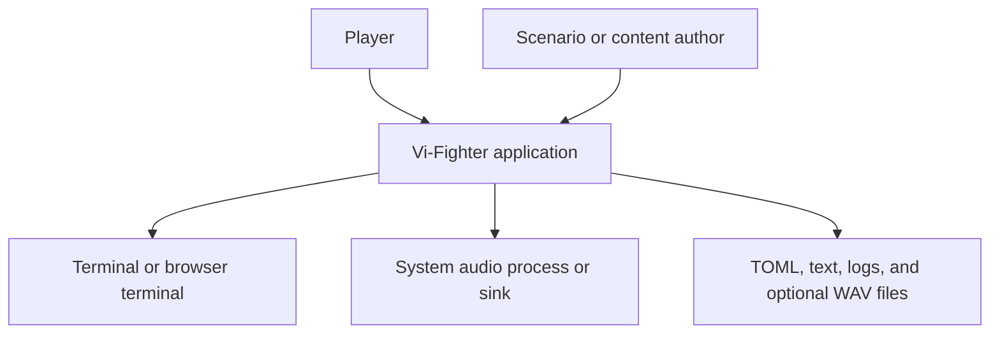
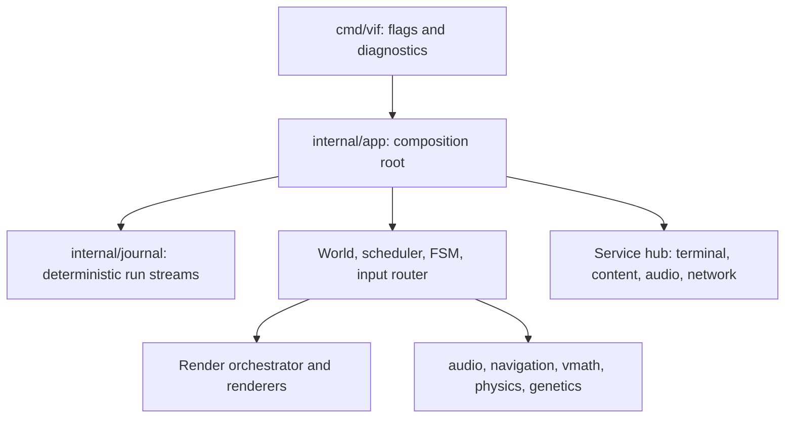
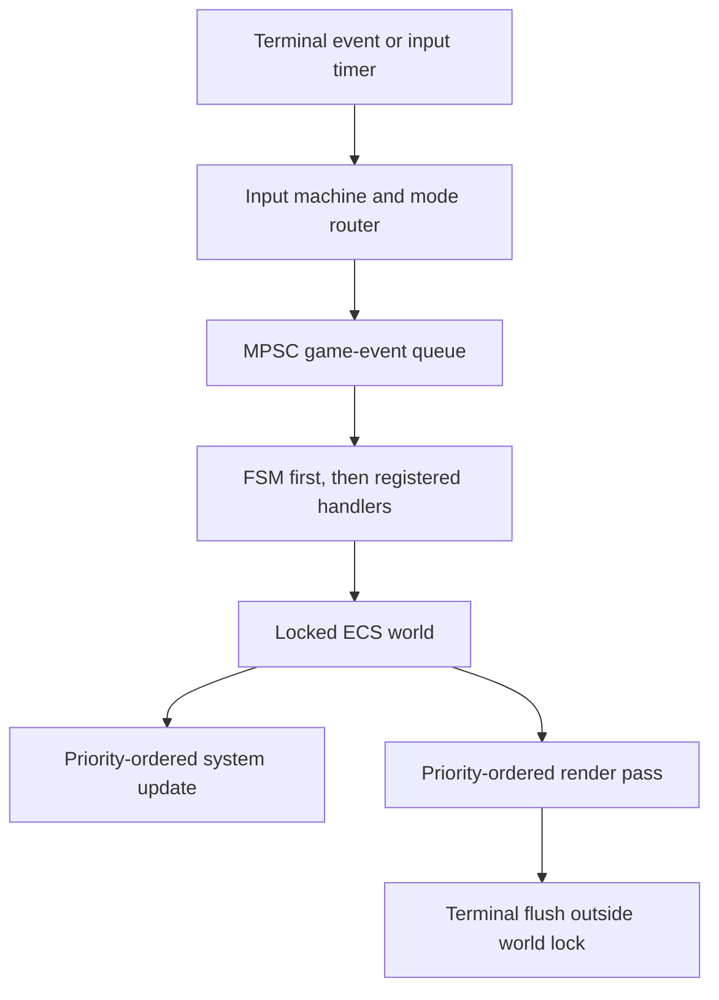

# Vi-Fighter Architecture Overview

Vi-Fighter is a Go terminal game built around a custom entity-component-system
(ECS), an event-settled fixed-step scheduler, a TOML-configured hierarchical
state machine, a layered terminal compositor, and a procedural audio engine.
The game combines vi-style cursor and text operations with real-time combat,
adaptive navigation, and evolving species parameters.

This document is the high-level entry point. It replaces the older assumptions
that the repository is standard-library-only and that all simulation math is
strictly deterministic. The current repository imports the separately
maintained `terminal`, `toml`, `color`, and `log` modules. Simulation math is
`float64`, with integer values reserved for discrete grid-cell topology; the
driven runtime's reproducibility is deliberately narrower than a
cross-platform lockstep guarantee.

## 1. System context

The application owns gameplay and orchestration. It delegates terminal
protocol details to `github.com/lixenwraith/terminal`, TOML parsing to
`github.com/lixenwraith/toml`, RGB operations to
`github.com/lixenwraith/color`, and asynchronous log transport to
`github.com/lixenwraith/log`.

## 2. Application containers

The main architectural planes are:

| Plane | Owners | Responsibility |
|---|---|---|
| Composition | `cmd/vif`, `internal/app`, `internal/manifest` | Resolve options, construct services/resources/systems/renderers, load the FSM, start and stop the process. |
| Simulation data | `internal/engine`, `internal/component`, `internal/core` | Entity identities, typed sparse-set component stores, singleton resources, spatial indexing, and shared time/state. |
| Simulation behavior | `internal/system`, `internal/fsm`, `internal/event` | Per-tick mechanics, event reactions, encounter control, reset, and system enablement. |
| Interaction | `internal/input`, `internal/mode` | Parse terminal events into semantic intents and apply them under the world lock. |
| Deterministic run streams | `internal/journal` | Attach recording sinks, capture/load journals, order replay records, generate seeded fuzz input, and execute authored tick scripts through App-independent target contracts. |
| Presentation | `internal/render`, `internal/render/renderer`, `internal/parameter/visual` | Snapshot frame context, layer cells, apply masks/effects, and flush to the terminal. |
| I/O boundaries | `internal/service`, `content`, `internal/network`, external modules | Terminal polling, corpus loading, audio device/process management, and framed network sessions. |
| Reusable algorithms | `pkg/*` | Audio, float64 math/physics, navigation, maze generation, evolution, and terminal-image conversion. |

See [Package map](package-map.md) for the medium-level dependency view.

## 3. Architectural control flow

`app.Mode` selects one of three application shapes before composition:

| Shape | I/O and presentation | Clock/owner |
|---|---|---|
| `ModePlay` | terminal, content, audio, and optional startup host/join networking; live input and geometry | pause/rate-aware clock; scheduler and event goroutines |
| `ModeHeadless` | content; caller supplies geometry and events; authored scripts may add startup host/join networking | manual clock advanced by a harness or `journal.ScriptDriver` |
| `ModeReplay` | terminal, content, audio; recorded input and geometry | manual clock advanced by `journal.ReplayDriver` |

The `Presents`, `Driven`, `OwnsGeometry`, `OwnsInput`, and `Audio` predicates
are the composition policy. A driven App spawns no scheduler/event goroutines,
so for one build its run is a pure function of seed, config, and injected event
groups. Interactive play instead has four cooperating execution paths:

1. The main goroutine selects terminal events, an input ticker, and a render
   ticker. It routes input and performs terminal output.
2. The scheduler goroutine advances simulation at a nominal 50 ms fixed step,
   gated by frame readiness.
3. The event goroutine settles queued events between simulation ticks and
   remains active while the game is paused.
4. Service-owned goroutines poll the terminal, mix audio, or, when `-host` or
   `-join` is selected, perform network I/O.

Queued events are not simply processed once per frame. The scheduler performs
bounded settling passes before the FSM update and again after it. Input can
request immediate settling, and a separate event loop handles inter-tick work.
This lets pre-tick, FSM, input, and reset cascades converge before their next
dependent phase. Events emitted by systems are normally picked up by the
inter-tick loop before the next frame; the next tick's initial settling is the
fallback. An iteration cap prevents an accidental event cycle from
monopolizing a thread.

An optional replay journal copies every non-system-origin event synchronously
at queue push. It uses a dedicated JSONL sink outside diagnostic level/scope
and stamps events in a `(run, tick, settle-boundary)` lattice. A headless
recording can therefore be reinjected at the same boundaries into a fresh
manual-clock App; a live recording reconstructs player input but is not the
source class for which bit-exact world comparison is claimed.

`internal/event` owns the queue-level record/anchor schema; `internal/journal`
owns everything that turns those values into a deterministic external run:
recording lifecycle, in-memory capture, rotated-file loading, replay ordering,
the seeded soak fuzzer, and the authored `-script` format. It imports no App.
`internal/app` supplies narrow adapters and retains configuration identity,
session startup, terminal playback, and process lifetime.

The exact lifecycle and synchronization rules are in
[Runtime and concurrency](runtime.md).

## 4. State ownership and concurrency model

The central invariant is deliberately simple: mutable ECS state has one lock.
The world's `updateMutex` serializes entity/component/position access from the
tick, event, input, reset, and render paths. Component stores and the spatial
grid therefore carry no inner locks.

Exceptions are explicit:

- status metrics and selected context flags use atomics;
- `GameState` owns a small lock for its APM history;
- target groups use their own read/write lock;
- the audio mixer owns its mutable sequencer/voice state on one goroutine and
  accepts commands over a bounded channel;
- service transports publish into bounded channels and never mutate the world
  from an I/O goroutine.

Diagnostics observe this model rather than participating in it. Status metrics
are per-value atomics; the periodic snapshot and the flight-recorder sample
both run after the world lock is released, so asynchronous logging can never
extend a critical section. See [Logging and diagnostics](logging-and-diagnostics.md).

Terminal output and other potentially blocking I/O happen outside the world
lock. Code reachable from `mode.Router.Handle` must not acquire that lock again,
because it is already held by the application and is non-reentrant.

Reset also has an explicit ownership split. Simulation entities/resources/FSM
state are rebuilt. Operator-owned free-mouse/auto-fire preferences, time scale,
and debug HUD/pins survive plain `:new`; `:new!` purges them. Replay comparison
drops that session record plus the exact observer-only keys in
`internal/app/snapshot.go` rather than treating whole metric groups as noise.

## 5. Data-oriented ECS

Entities are 64-bit integer identifiers. Most components live in generated,
type-specific sparse sets with dense component and entity slices. This gives
constant-time lookup and swap-removal while preserving compact iteration.
Generated component-mask bookkeeping lets destruction skip stores that an
entity never occupied.

Position is specialized rather than being an ordinary generated store. It also
maintains a fixed-capacity spatial grid used for cell queries, wall masks,
line-of-sight, patterns, and nearby free-space searches. Large actors use a
header/member composite model: an invisible or controlling header owns motion
and lifecycle, while member entities provide visible and collidable cells.

Singleton resources hold time, map/camera configuration, the bounded cursor
roster and local-player selection, targets, event queue, route graphs, adaptive
route populations, the genetic registry, transient effects, telemetry, and
capabilities contributed by services. The cursors themselves are ordinary ECS
entities created and removed by `CursorSystem`; each owns its energy, heat,
shield, boost, weapon, ping, and combat components. A roster slot also records
whether a human, in-simulation bot, or remote peer controls that cursor. The
mode router and camera follow the selected local slot, while gameplay systems
can iterate or address every cursor through the same event-driven path.

Every entity, event and RNG stream carries a replication domain. Shared state
is identical on every instance and replicated; player state is this instance's
participant and is never replicated. Systems declare which of the two they read
and write, and which other systems they need, as `SystemDef` data in
`internal/manifest/definition.go`; a test checks each declaration against the
code, and the declared dependencies resolve into a deterministic initialization
order that is separate from the tick order `Priority()` fixes.

See [ECS and events](ecs-and-events.md) and [the domain model](domain-design.md).

## 6. Data-driven encounter control

The generic HFSM supports hierarchical states and multiple parallel regions.
Each active region has a leaf, a root-to-leaf path, elapsed state time, a pause
flag, and delayed actions. Events and tick transitions bubble from the leaf
toward the root. Transition payloads can be captured into integer variables,
and actions can inject variables into nested event payload fields.

The machine itself is generic. `internal/fsm/std` provides reusable variables,
regions, guards, status/config access, and event actions through a capability
host. `internal/manifest/fsm_bridge.go` binds those capabilities to the ECS and
adds the small amount of game-specific behavior.

The embedded scenario runs foreground gameplay regions alongside a background
monitor. Alternate configurations include a blank authoring scaffold, an
expanded main encounter, and a tower-defense scenario.

See [HFSM and configuration](fsm-and-configuration.md) and the detailed
[authoring reference](../config/README.md).

## 7. Input as a semantic boundary

The external terminal emits keys, mouse reports, resize notifications, and
close/error events. `internal/input.Machine` converts them into pure-data
`Intent` values. It understands counts, operators, motions, character waits,
`g` prefixes, search/command text, overlays, and macro control. It has no ECS
dependency.

`internal/mode.Router` is the authoritative owner of game mode. Under the world
lock, it interprets intents against the current map and components, requests
movement for the local cursor, executes operators/search, publishes combat and
mode events, manages undo/command history, and schedules macro or mouse-repeat
input.

See [Input and modes](input-and-modes.md).

## 8. Rendering boundary

Renderers read ECS state but never write directly to the terminal. The
application first snapshots time, dimensions, camera, and the local cursor into
a value `RenderContext`. The orchestrator then clears a `RenderBuffer`, locks
the world, runs renderers in stable priority order, unlocks, finalizes
compositing, and flushes cells through the external terminal module.

The buffer supports foreground/background-specific blending, write masks,
dirty/touched tracking, deferred background overlays, TrueColor and palette
attributes, and masked grayscale/dim post-processing. Gameplay coordinates are
map based; `RenderContext` performs map-to-viewport and viewport-to-terminal
transforms.

See [Rendering](rendering.md).

## 9. Audio boundary

`pkg/audio` owns synthesis, pre-rendered sound caches, mixing, voices, harmony,
patterns, and a three-slot sequencer. It has no gameplay or APM concept.
`internal/system.MusicSystem` maps the game's five-second APM signal to tempo
and arrangement intensity; `AudioSystem` translates effect and mute/pause
events.

Audio output is zero-CGO but not device-native on most platforms: the engine
streams 44.1 kHz, 16-bit stereo PCM to an installed process such as `pacat`,
`pw-cat`, `aplay`, SoX `play`, or `ffplay`, or to FreeBSD OSS. Explicit `null`
and `wav:path` sinks support automation and offline capture. Missing backends
degrade to silence rather than aborting gameplay.

Audio service assembly is mode-dependent: play and replay register it;
headless does not. Journal anchors do not carry the original mute state, so
terminal playback intentionally starts audio unmuted.

See [Audio](audio.md).

## 10. Navigation, physics, adaptation, and evolution

Navigation uses aspect-weighted, eight-direction Dijkstra flow fields with
corner-cut prevention. Target groups share cached fields, while multi-cell
actors can use footprint-aware passability. Gateways may request multiple
distinct, penalized shortest-path corridors, each with a constrained flow
field.

Route adaptation is described in code as EXP3, but its current update is more
precisely a multiplicative-weights/Hedge-style learner: it applies exponential
updates to per-route mean fitness without importance weighting, then selects
with proportional exploitation plus a 10% uniform scout rate. This distinction
matters when reasoning about convergence.

The generic genetic library offers both classic generational and streaming
steady-state engines. The game adapter currently evolves eye parameters,
tracking closest approach and successful self-destruct damage as fitness. The
adapter uses an in-memory registry: archives survive an in-process `:new`, but
no persistence store is attached for cross-process saves.

Gameplay motion uses cell-centered `float64` positions, velocities, and
accelerations. Integer `Point`/`Area` values represent discrete cells, while
floor-based conversion maps precise positions—including negative
coordinates—back to the grid. `pkg/vmath` also provides float lookup-table
trigonometry/decay, vectors, shapes, arcs, traversal, and seeded randomness;
`pkg/vmath/physics` owns the float kinetic container and 2D/3D mechanics. No
parallel fixed-point API remains. Floating-point state and live play's
concurrent scheduling prevent treating the engine as a cross-platform
bitwise-deterministic simulation.

See [AI, navigation, physics, and evolution](ai-physics-and-evolution.md).

## 11. Externalized module boundaries

Several packages that older documentation treated as in-repository utilities
are now independent modules.

| Module | Boundary owned outside this repository |
|---|---|
| `github.com/lixenwraith/terminal` | Raw/alternate-screen lifecycle, terminal event decoding, color-mode detection, cells, mouse modes, syncing, and flushing. |
| `github.com/lixenwraith/toml` | Parsing, reflection-based decoding, and encoding used by scenarios, content, keymaps, audio specs, commands, and optional genetic persistence. |
| `github.com/lixenwraith/color` | RGB values, interpolation, blend operations, grayscale, and palette-related color manipulation. |
| `github.com/lixenwraith/log` | Buffered asynchronous structured-log sink, rotation, retention, and transport below `internal/vlog`. |

`golang.org/x/sys` and `golang.org/x/term` are indirect dependencies of this
module graph. Vi-Fighter has no application CGO requirement, although external
audio executables or an OSS device are runtime dependencies when sound is
enabled.

## 12. Deployment shapes and current limitations

The primary build targets Linux and FreeBSD terminals. On those builds the same
composition root supports interactive play, deterministic harnesses and authored
headless scripts, and terminal journal playback. A headless script has no terminal
or audio, but may deliberately attach the TCP service with `-host`/`-join`. A WASM build runs inside
the bundled xterm.js page, uses embedded configuration/content, and compiles out
logging; sound is disabled in the current web build. The Makefile also contains
an explicitly experimental Windows cross-build.

A trusted-peer TCP game of up to `parameter.MaxPlayers` participants is exposed
through `-host`, `-join` and `-players`. The join handshake resolves the host
anchor before the joining world is constructed, the roster every instance builds
from arrives with the start gate, every scheduler stays at tick zero until the
lobby closes, and the manifest-registered `NetworkSystem` drains framed input only
at the simulation's poll boundary. The fixed-delay artifact barrier exchanges
crossings without a synchronous per-tick round trip, and because every artifact
names the absolute tick it applies at, a node relays what it receives so a
participant reaches instances its producer never linked to. Roster changes travel
the same way, so a departure or an arrival lands on one tick everywhere.
Participants join at the tick-zero gate only: there is no mid-run join, no
reconnect, and no recovery once two instances disagree.

It has no lag compensation, authentication or CLI TLS identity, no restorable
world checkpoint, and no partition detection; `-join` dials one address,
so the links form a star even though the relay makes any graph work. The domain
boundary, event classification, wire protocol, their enforcing tests, and an
analysis of what the model does not yet cover are in rules D-1..D-17 and §9 of
[the domain model](domain-design.md). The observed incident, current failure
signals, and checkpoint-plus-suffix recovery recommendation are in
[Desynchronisation and recovery](desync.md).

For build, diagnostics, platform, and repository-health details, see
[Development and operations](development.md) and
[Services and networking](services-and-networking.md).
