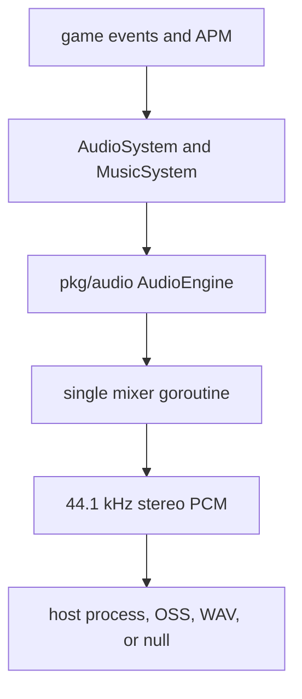
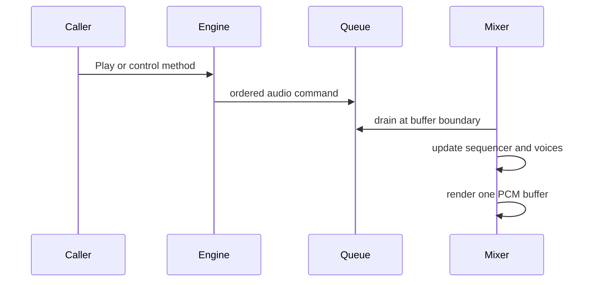
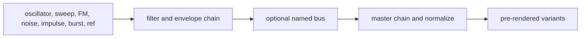

# Audio Architecture

Vi-Fighter includes a pure-Go synthesis, effects, mixing, and music-sequencing
engine. It streams raw PCM to an external host process/device; there is no CGO
audio dependency. Game policy is layered over the reusable `pkg/audio` engine
by the audio service and the `AudioSystem`/`MusicSystem` pair.

## 1. Layered design

| Layer | Responsibility |
|---|---|
| `internal/service.AudioService` | Configure, construct, start/stop, and contribute the engine capability. |
| `internal/system.AudioSystem` | Translate game sound/mute/pause events and publish audio telemetry. |
| `internal/system.MusicSystem` | Map APM and explicit music events to tempo, intensity, harmony, and patterns. |
| `pkg/audio.AudioEngine` | Public thread-safe control surface, sound/pattern registries, backend lifecycle/failover. |
| `pkg/audio.Mixer` | Own all live voices/sequencer state and render output buffers. |
| Backend | Consume signed 16-bit little-endian stereo frames. |

`pkg/audio` carries no ECS or APM concept. The app injects effect volumes and
shapes, and `MusicSystem` interprets the game's five-second APM signal.

Runtime mode selects whether this layer exists. `ModePlay` and `ModeReplay`
register the audio service; `ModeHeadless` does not. Replay rebuilds simulation
from recorded events, including sound requests, and starts playback unmuted
because the journal anchor has no original mute-state field. Terminal playback
controls pacing only; it does not route viewer keys through `AudioSystem` or
the gameplay keymap.

## 2. Stream contract

| Property | Value |
|---|---|
| Sample rate | 44,100 Hz |
| Channels | 2 (stereo) |
| Format | Signed 16-bit little-endian PCM |
| Bytes per frame | 4 |
| Buffer duration | 50 ms |
| Frames per buffer | 2,205 |

Every mixer pass drains pending commands, renders music and effects into
separate floating-point buses, sidechain-ducks music under effects, applies the
pause gain ramp, limits/converts samples, and writes one PCM buffer. The output
writer is the only backend-specific part of that path.

## 3. Backend detection and failover

Automatic candidates are tried in this order:

| Priority | Backend | Host target |
|---|---|---|
| 1 | `pacat` | PulseAudio protocol, also commonly available through PipeWire compatibility. |
| 2 | `pw-cat` | Native PipeWire. |
| 3 | `aplay` | ALSA command-line playback. |
| 4 | `sox` | The SoX `play` executable. |
| 5 | `ffplay` | FFmpeg playback. |
| 6 | `oss` | `/dev/dsp`, considered only on FreeBSD. |

Detection first checks executable/device availability. Attachment starts a
candidate, writes one silent buffer, and waits through a short survival window;
bad arguments, an unavailable daemon, or an immediate broken pipe fall through
to the next candidate. A process that accepts data but routes it nowhere cannot
be detected by this probe.

The supervisor can move to an untried candidate if the active process exits.
Backend lifecycle has its own mutex because failover and shutdown can race.

`-ab <name>` restricts selection to one backend. Two explicit-only synthetic
backends are useful in automation:

- `-ab null` runs the full mixer and discards samples;
- `-ab wav:path/to/out.wav` captures the live stream into a finalized WAV file.

If no backend survives, the service degrades to a valid silent engine. Gameplay
continues, sound requests become no-ops with rejection telemetry, and absence
of a device is not an application-start failure.

## 4. Concurrency and command ownership

All controls—including playback, mute, pause, tempo, patterns, harmony, and
hot reload—share one command channel, preserving arrival order. The live
sequencer, pattern players, voices, active effects, and buses are confined to
the mixer goroutine and need no inner locks.

Commands sent before `Start` are retained in a 64-entry ordered buffer. After
startup, the mixer channel holds 256 commands. A full queue rejects the command;
play rejections are categorized as not running, silent, paused, muted, bad ID,
or queue full. Played/dropped totals and rejection categories are surfaced
through the game status registry.

Shutdown stops the mixer/backend with a bounded wait so a wedged audio process
cannot prevent restoration of the terminal's raw mode.

## 5. Sound effects

Sound effects are declarative `SoundDef` values. A sound contains one or more
layers, optional intermediate buses, and processor chains:

Sources include oscillators, sweeps, FM, noise, impulses, burst trains,
references to earlier layers, and silence. Processors include filters,
envelopes/decay, modulation, shaping, clipping, and gain. Validation bounds
duration, frequencies/Nyquist behavior, topology, operation count, and authored
structure before rendering.

At startup the engine:

1. registers built-in sounds from `pkg/audio/builtin/sfx.toml`;
2. loads optional `./sounds.toml`, replacing same-name definitions;
3. freezes the name-to-ID registry;
4. pre-renders the variant cache and drum kit;
5. resolves game volume/shape overrides by stable sound name.

Each effect normally has three pre-rendered variants. The mixer rotates variants
to reduce repetition, allows at most two concurrent instances per sound ID and
12 effects globally, and steals according to its admission policy when needed.
Rapid repeats within 250 ms attenuate toward a 0.25 floor and recover over 600
ms. Active effects duck the music bus to 70%, with fast attack and slower
release.

Sound IDs are process-local registration values. Configuration and persistent
documents must use names, not numeric IDs.

## 6. Mixer buses, mute, and pause

Effects and music have independent mute bits. `Ctrl-S` cycles the composed game
mask through silence, effects-only, music-only, and both. CLI `-am` starts
muted, while system/config events can change channels independently.

Pause is a device/output state, not merely a gameplay-system toggle. It applies
even if `AudioSystem` is disabled and ramps the master gain over 250 ms to avoid
clicks. Music sequencing is frozen under mute/pause policy where appropriate;
the exact player state is retained for resume.

Disabling the audio gameplay system silences new gameplay sound behavior but
does not detach the service or lose the user's channel choices.

## 7. Music sequencer

The sequencer uses a 16th-note grid (`4` steps per beat), 4/4 bars, and three
crossfading slots:

| Slot | Conventional role |
|---|---|
| 0 | Rhythm/drums. |
| 1 | Melody/harmony-following layer. |
| 2 | Free layer or automatic phrase fill. |

A pattern has up to 64 steps, 32 tracks, and 512 events per track. Track events
define step position, velocity, scale degree, octave, duration, probability,
instrument, chord-following, and humanization. Tonal voices include bass,
piano/FM, pads, and fallback synthesis; the drum kit uses cached effects.

Tempo is clamped to 80–180 BPM. Tempo changes can wait for the next bar;
patterns can transition immediately or quantized with A/B crossfade. A minimum
256-sample fade prevents hard-cut voice tails. Track reveal supports staged
intensity build-up. Slot 2 can substitute a seeded fill on the last bar of each
eight-bar phrase and restore the previous pattern on the downbeat; explicit
slot-2 editing disables that surprise behavior.

Harmony holds root note, scale, and chord progression. Pattern degrees resolve
through the current harmony at trigger time. With the same seed and identical
bar-aligned command schedule, generated music is reproducible; wall-clock
arrival relative to bars is not a recorded replay contract.

## 8. Adaptive game conductor

`MusicSystem` is the conductor. Once per game update it observes five-second
music APM and maps it to:

| APM range | Intensity tier |
|---|---|
| below 60 | Calm |
| 60–139 | Normal |
| 140–219 | Elevated |
| 220–299 | Intense |
| 300 and above | Peak |

The target tempo is 100 BPM at calm activity, rises gradually through normal
play, and reaches the engine's 180 BPM maximum at peak. The conductor slews
rather than jumping (8 BPM/s upward, 10 BPM/s downward) and ignores changes
smaller than three BPM. Tier changes select registered rhythm/melody
arrangements and use quantization/crossfade/reveal policy.

Explicit music events can start/stop, set patterns, play a melody note, change
intensity, tempo, seed, swing, or harmony. A manually held intensity can later
be released so APM control resumes. APM policy stays under `internal/parameter`
and `internal/system`, leaving `pkg/audio` reusable.

## 9. Authored music and sound overrides

The service reads optional files from the process working directory:

- `sounds.toml` supplies sound definitions and name-based overrides;
- `music.toml` supplies pattern definitions.

Malformed user definitions currently degrade to successfully loaded built-ins;
the engine retains a combined specification error, but the game service does
not yet present that error to the player. Treat `soundlab validate/apply` and
tests as the authoring validation surface.

Built-in patterns and drums remain available even when no external file exists.
Later same-name registrations replace a definition while preserving its runtime
ID, which allows live tooling to update a playing registry.

## 10. Soundlab

`cmd/soundlab` is the supported terminal authoring environment built on the
same engine. It offers:

- a command REPL;
- a full-screen TUI with browser, structural inspector, piano recording, and
  beat-grid editing;
- headless `.slab` script execution;
- validation, live registry apply/revert, audition, sequencer slot assignment,
  TOML save, and WAV export.

The working document and live registry are separate: edits do not affect audio
until `apply`; `revert` restores the document from the canonical registry. Its
dotted path grammar follows TOML tags and Go types, while domain validation
runs at `validate`/`apply`. See `cmd/soundlab/README.md` for the command/TUI
reference.

## 11. Extension checklist

For a new game sound:

1. author and validate a named sound definition;
2. add it to built-ins or a tested override document;
3. add the semantic name to the game's sound table and volume/shape policy;
4. run startup resolution so a missing mapping fails early;
5. emit `EventSoundRequest` from the mechanic rather than calling the engine
   from arbitrary systems;
6. verify rapid-fire, polyphony, mute, pause, silent-backend, and 256-command
   saturation behavior.

For music, keep new APM/campaign decisions in `MusicSystem` or configuration
events and keep the sequencer unaware of gameplay concepts.

## 12. Source map

| Concern | Primary source |
|---|---|
| Engine/backend lifecycle | `pkg/audio/engine.go`, `detector.go`, `wav.go` |
| Mixer/SFX admission | `pkg/audio/mixer.go`, `cache.go`, `sound_render.go` |
| Sound schema | `pkg/audio/sound_spec.go`, `sound_valid.go` |
| Sequencer/patterns | `pkg/audio/sequencer.go`, `pattern*.go`, `track.go`, `voice.go` |
| Game service | `internal/service/adapter_audio.go` |
| Game event adapters | `internal/system/audio.go`, `music.go` |
| Mode selection and replay default | `internal/app/config.go`, `app.go`, `play.go` |
| Game policy | `internal/parameter/audio.go`, `music.go`, `sfx.go` |
| Authoring tool | `cmd/soundlab`, `cmd/soundlab/README.md` |
