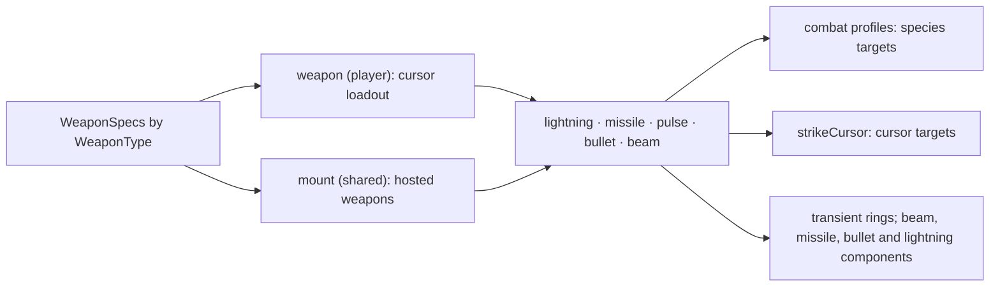

# Combat and weapons

How weapons are defined, who fires them, how their hits resolve, and what crosses
between instances. The domain rules cited as D-n are in
[the domain model](domain-design.md); per-weapon tuning is in `internal/parameter`.

## 1. The boundary

A weapon belongs to its host's domain, and nothing about a weapon leaks into
another one.

| | Weapon on a cursor | Weapon mounted on a Shared host |
|---|---|---|
| Simulated by | the cursor's owner only (D-2) | every instance, identically |
| State | `WeaponComponent`, owner-authored (D-13) | `MountComponent` on the host, in the capture |
| Positions read | the predicted cursor cell (D-18) | Shared positions only, roster order on ties |
| Shots and visuals | Player-domain, on the owner alone | Player-domain, re-derived on every instance (D-6) |
| What crosses | impacts only: damage, knockback, stun (D-3) | nothing |
| Hits on cursors | none (no PvP) | applied by each cursor's owner alone |

A peer never sees a remote cursor's orbs, projectiles, bolts, rings or beams, and
never receives its loadout's behaviour; it receives what that loadout did to the
Shared world, as the artifacts in §4. A mount raises only local events: its
cursor hits go through `strikeCursor`, which acts only on a cursor this instance
simulates.

## 2. Layers

`component.WeaponSpecs` is the one table of weapon kinds: status name, delivery,
combat attack family, cursor cooldown and charge cap, and the hosted range and
`CursorDamage`. A new kind adds a row; drivers and renderers index by kind.

| Kind | Delivery | On a cursor | Mounted |
|---|---|---|---|
| Rod | lightning | direct hit per unique nearest target, bolt from the orb | zaps the aimed cursor |
| Launcher | missile | one homing missile per charge; the blast is explosion geometry | one hostile missile that homes on cursors |
| Disruptor | pulse | stun burst centred on the orb when a target is inside | strikes every cursor inside its ring |
| Turret | bullet | one spread bullet per charge, direct damage | hostile bullets; storm's red circle is one |
| Beam | beam | sustained ray from the cursor through its orb, sweeping as the orb orbits | warns, fires, rests along a locked ray |

## 3. Drivers

**`weapon`** (player) owns cursor loadouts: charges and cooldowns, one orb per
held kind, and firing on main fire. Aimed deliveries share one nearest-target query
from the cursor, sized to the largest ready loadout; every shot leaves from its
kind's orb, or the cursor while the orb is unplaced. Spread draws from the Player
stream. Loot grants kinds; a zero crossing of the cursor's energy clears them.

**`mount`** (shared) fires the one weapon a Shared host carries. A level attaches
it with `EventMountRequest` (host, weapon, interval, range, muzzle, lane, width),
capturing the host from `EventSpeciesCreated` as a gateway is attached; a species
may set the component itself. Each tick it:

- aims at the nearest cursor within range, aspect-corrected, from Shared positions;
- fires when ready and, under `MountArmed`, only while the host holds `Armed`;
- leaves a shot from the host pushed `Muzzle` cells toward the aim;
- seeds a shot's spread from the tick and the host, never a stream, so store order
  and a correction's replay cannot reorder draws (D-8).

A beam is a `vmath.Ray` in a `BeamComponent`: any angle, run to the first wall or
the map edge, one width up to its knee and another past it. A cursor's beam sits on
its orb: laid every tick from the cursor through the orb, one cell wide to the orb
and three past it, so it sweeps as the orb orbits. It strikes every tick, and
combat's per-attacker immunity rates each target, because a sweep crosses a far
target in about one tick. More charges beam longer and multiply its area hits'
damage through `Scale`; its cooldown runs from firing, so they also beam more of it.

A beam mount cycles on its host's `BeamComponent`: at rest until ready, then a
warning with the ray laid and locked (its lane, or straight at the aim), then firing,
striking the cursors inside every `BeamHitInterval`, then rest for its interval. A
laned beam needs no cursor in range; that is the level obstacle. Width is the
mount's to set; a cursor's is fixed.

Storm's red circle carries a turret mount the storm arms from the state each tick
opens with, so the burst fires on its active ticks exactly; the storm renderer
reads the mount's aim for its muzzle.

## 4. Resolution and what crosses

Hits on species resolve through the profile matrix in `internal/profile/combat.go`,
`[attack][attacker][defender]`: damage type and value, knockback, stun, chain.
Immunity windows are per attacker (D-3). Hits on cursors are `CursorDamage`: energy
through an active shield, heat without one. Projectiles find the cursor they touch
with `CursorContactAt`, shields first.

| Cursor weapon hit | Artifact |
|---|---|
| Rod, turret bullet, cleaner on a Shared target | one direct request stamped Shared (stamped class) |
| Missile blast, disruptor pulse | explosion geometry: centre, radius, attack, owner |
| Beam on a Shared target, each tick it covers it | area crossing: target, member set, owner, scale |
| Any hit on a drain | local; drains are Player-domain |

The cleaner is the always-held main weapon: its impact chains into a lightning
direct attack whose energy-drain effect spawns the zap from the cursor, which is
why the cleaner's bolt starts at the cursor and the rod's at its orb.

## 5. Presentation

Renderers draw only what exists on their instance. Orbs take their kind's colour
from `orbPalette`. A discharge's `WeaponPalette` is positive or negative by the
cursor's energy, or hostile for a mount. Pulse rings are a fixed-capacity list in
`TransientResource`, raised by `EventPulseVisualRequest`. Beams are drawn straight
from their `BeamComponent`: a white core, sides in the palette where the ray widens,
a mount's warning as its core line alone. Missiles and bullets draw hostile colours
from their `Hostile` flag; lightning uses its colour table. Each has a 256-colour
path.

## 6. Tick order

`weapon` runs early with the player state. Host species run next, then `mount`
after every host so a host arms before its mount fires, then `combat`. Lightning,
missile and bullet integrate after combat; `transient` ages rings late.

## 7. Adding a weapon

1. Add the kind to `WeaponType` and its row to `WeaponSpecs`, with parameters.
2. Reuse a delivery, or add one with a case in `WeaponSystem.fireAllWeapons` and
   `MountSystem.fire`.
3. Give its attack family a profile against every cursor defender.
4. Add its orb colours, loot type, loot visual and a drop tier.
5. A player-domain push of a replicated event must be named in `crossingPushes`
   with the artifact it crosses; `TestEventClassMatchesSystemProfile` enforces it.

Telemetry: the `weapon` card holds the loadout and orbs, `weapon.fired` and
`weapon.rejects` the counters; `combat.damage.family` is the damage each attack
family deals, which is how a weapon's effect reads; `mount`, `missile` and `bullet`
hold their own.
