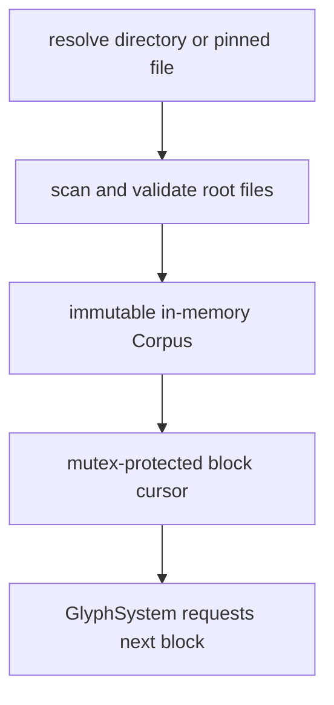
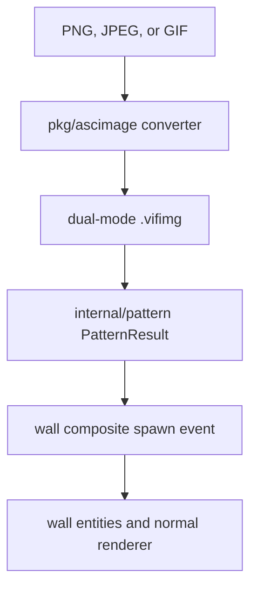

# Content, Assets, and Authoring Tools

Vi-Fighter loads typeable content once at startup, embeds a playable fallback,
and converts authored terminal-image assets into ordinary wall entities. This
document distinguishes the text corpus, embedded assets, visual patterns, and
the supported authoring tools.

## 1. Content service lifecycle



`ContentService.Init` reads and parses the entire source. No content disk I/O
occurs after startup. The immutable corpus is safe to inspect concurrently;
only the sequential/random cursor needs a mutex. `Start` and `Stop` have no
runtime work.

The service publishes source, file, block, line, rejection, current-file, and
served-block telemetry. `:content` presents a compact view during a run.

## 2. Content resolution

Source resolution is:

1. `-f <path>`: an explicit directory, or a single file pinned within its
   parent directory;
2. `./data`;
3. `$XDG_CONFIG_HOME/vi-fighter/data` (normally
   `~/.config/vi-fighter/data`);
4. embedded tutorial content.

`-d` skips discovery and forces the embedded FSM and corpus. It is mutually
exclusive with `-g` and `-f`.

An explicit path that cannot yield usable content is fatal. A discovered
directory that cannot be read or produces an empty corpus falls back to the
embedded corpus. This difference prevents a mistyped explicit source from being
silently ignored while keeping default startup resilient.

Only eligible files immediately at the directory root are loaded. Subfolders,
hidden names, and unrelated extensions are skipped.

## 3. Corpus model and limits

```go
type Corpus struct {
    Sources  []Source
    Rejected []Rejection
    Bytes    int64
}
```

Every accepted source contains at least one `core.CodeBlock`. Rejected eligible
files retain a name/reason for telemetry instead of aborting the whole corpus.
Only failure to read the directory itself is a hard loader error.

The default ingest policy is:

| Limit | Value |
|---|---|
| Accepted extensions | `.txt`, `.toml` |
| Encoding | Valid UTF-8 input |
| Stored character set | Printable ASCII `0x20` through `0x7e` |
| Maximum stored line | 256 runes |
| Maximum file size | 4 MiB |
| Corpus byte budget | 32 MiB |
| Maximum accepted files | 256 |
| Plain-text block size | 2–5 lines |
| Plain-text indent split | 2 columns at brace depth zero |
| Tab width for leading-indent measurement | 4 columns |

Printable ASCII is intentional: content must be typeable by the supported
input/keymap path. Non-ASCII/control characters are removed from lines even
though the file itself must be valid UTF-8.

## 4. Plain-text parsing

Plain `.txt` files are converted with source-code-oriented heuristics:

1. split into physical lines and remove carriage returns;
2. strip ANSI CSI/OSC escape sequences and control/non-ASCII runes;
3. measure leading spaces/tabs for structural splitting, then omit that leading
   indentation from the stored text;
4. collapse an interior tab to one space;
5. drop blank lines and lines beginning `//`, `#`, or `/*`;
6. collect consecutive usable lines into blocks.

A block closes at five lines, or when at least two lines have accumulated and a
top-level indentation shift of two or more columns occurs. Brace depth is
tracked across the whole file so an indent shift inside `{...}` does not split a
declaration prematurely. A trailing fragment shorter than two lines is
dropped.

The parser is heuristic, not a language parser. Braces in strings/comments may
affect depth, and only full-line comment prefixes are removed. This is acceptable
for varied source-like typing content but should not be used as a code-analysis
API.

## 5. Authored TOML content

TOML is the precise format for tutorials or intentionally grouped text:

```toml
schema = 1

[[blocks]]
id = "movement"
lines = [
  "move with h j k l",
  "type matching glyphs",
]
```

Rules differ from plain text:

- `schema` must be exactly `1`;
- each `[[blocks]]` supplies an optional author-facing `id` and `lines`;
- lines are literal with respect to comment/block grouping—`#` and `//` are not
  discarded;
- safety sanitization still strips ANSI, unsupported runes, indentation, and
  empty results;
- there is no two-line minimum;
- blocks longer than five usable lines are split into consecutive blocks rather
  than rejected.

The current runtime does not expose the authored block ID on `core.CodeBlock`;
it is parsed as document metadata but block delivery is line-only.

## 6. Block selection

A new cursor starts at a random accepted source, reads its blocks in authored
order, then hops to a different random source at EOF. With only one source it
cycles that source.

Passing `-f` a single eligible file pins the cursor to that filename and cycles
it forever. The loader still scans the containing directory, but delivery is
restricted to the named accepted source. Pinning fails if the file was rejected
or produced no usable blocks.

Random selection uses a named `vmath` stream derived from the App's root seed.
For the same accepted corpus, seed, config, and request order, source hopping is
therefore reproducible and part of the driven-App/replay contract. A journal
anchor records the resolved source/pin plus accepted file, block, and line
counts so replay rejects a corpus that changed behind the same path.

## 7. Embedded assets

`internal/asset` compiles three fallback asset groups into the executable:

| Asset | Source | Purpose |
|---|---|---|
| FSM bundle | `internal/asset/config/*.toml` | Default campaign and region files. |
| Content bundle | `internal/asset/content/*.toml` | Always-available tutorial corpus. |
| Splash font | `internal/asset/splash_font.go` | 95 printable ASCII glyphs plus fallback, each a 12-row bitmap. |

The embedded filesystems are narrowed with `fs.Sub`, so their runtime root is
the asset directory rather than `internal/asset/...`. Missing embedded bundles
panic during package initialization because they represent a broken build
artifact, not a recoverable user configuration error.

The splash renderer consumes the built-in bitmap font for large text overlays.
The font editor updates the source representation; it is not loaded from a
runtime font file.

## 8. Image and pattern pipeline



`pkg/ascimage` converts raster images into terminal cells using either:

- quadrant mode: a Unicode quadrant represents a 2-by-2 pixel group;
- background mode: one terminal background cell per sampled pixel.

Dual `.vifimg` files store truecolor and xterm-256 foreground/background data,
transparency, rune, dimensions, and an optional anchor hint. The pattern loader
selects the active color representation, preserves palette attributes, skips
transparent cells, and creates `PatternCell` offsets.

`PatternResult` supports translation, rectangular/function masking, tiling, and
last-write-wins merging. It converts cells to `WallCellDef` values and emits an
`EventWallCompositeSpawnRequest` with a block mask and optional box style.
Thus images participate in wall collision, ECS lifecycle, camera cropping, and
the normal wall renderer rather than drawing directly to the terminal.

A pattern can be blocking (`WallBlockAll` or directional mask) or a nonblocking
visual backdrop (`WallBlockNone`). Authored anchors are suggestions; the spawn
event still supplies the actual map coordinate.

The documented extension is `.vifimg`. The repository currently contains a
fixture named `cmd/ascimage/test.vfimg`; that shorter extension is inconsistent
with the command's actual `.vifimg` detection and should not be copied as a
format example.

## 9. Ascimage tool

`cmd/ascimage` converts and previews assets:

```bash
# Create one asset containing both color modes
ascimage -dual backdrop.vifimg -w 140 -m quadrant source.png

# Export one color mode as ANSI
ascimage -o backdrop.ans -c true backdrop.vifimg

# Interactive viewer
ascimage backdrop.vifimg
```

The viewer supports fit/actual size, quadrant/background mode, truecolor/256
toggle, zoom, pan, and status display. Transparent raster pixels are omitted
from dual output, so they create no wall entity. See `cmd/ascimage/README.md`
for its complete flag/control reference.

## 10. Other repository tools

| Tool | Purpose |
|---|---|
| `cmd/soundlab` | Edit, validate, audition, sequence, script, and export audio definitions. See [Audio](audio.md). |
| `tool/font-editor` | Edit the compiled 12-row splash font. |
| `tool/blend-tester` | Inspect compositing operations, masks, effects, truecolor, and palette interactions. |
| `tool/hierarchy-map` | Analyze Go imports and browse package hierarchy/dependency direction. |
| `tool/http-server` | Minimal static file server used by the WASM development target. |
| `sandbox/*` | Standalone visual/interaction prototypes, intentionally outside application assembly. |
| `benchmark/*` | Standalone math/random/render experiments rather than `go test -bench` packages. |

Only commands under `cmd` are primary user/developer programs. `tool`,
`sandbox`, and `benchmark` code may intentionally have narrower validation or
experimental dependencies.

## 11. Content author checklist

- Prefer TOML when exact block boundaries or one-line tutorial messages matter.
- Keep every output rune printable ASCII and every line within 256 runes.
- Run `vi-fighter -check -f <path>` to exercise the real loader without opening
  the game.
- Inspect `content.rejected`/`:content` rather than assuming every directory
  file was accepted.
- Treat third-party source as redistributed content and verify its license.
- Do not depend on directory recursion, hidden files, or live reload. Cross-file
  order is reproducible only for the same accepted corpus, seed, and request
  sequence; changing the corpus changes that input.

## 12. Source map

| Concern | Primary source |
|---|---|
| Corpus/policy | `content/corpus.go`, `policy.go`, `load.go` |
| Plain text | `content/text.go` |
| Authored TOML | `content/toml.go` |
| Selection cursor | `content/cursor.go` |
| Service/resolution | `internal/service/adapter_content.go`, `internal/app/path.go` |
| Embedded assets | `internal/asset/*.go`, `internal/asset/config`, `internal/asset/content` |
| Pattern conversion | `internal/pattern/*.go` |
| Image codec/tool | `pkg/ascimage`, `cmd/ascimage` |
