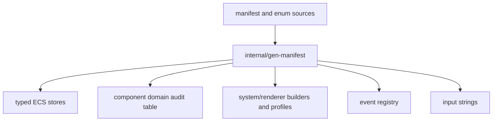

# Development, Builds, Diagnostics, and Operations

This guide covers the repository's generated-code contract, build variants,
verification surface, platform boundaries, and runtime diagnostics. The package
responsibility map is in [Package map](package-map.md).

## 1. Toolchain and dependencies

`go.mod` declares Go `1.26.5`; use that version or a compatible newer toolchain.
The application has no CGO requirement, but it is not standard-library-only.
Direct modules currently provide:

| Module | Responsibility used here |
|---|---|
| `github.com/lixenwraith/terminal` | Raw terminal, input events, cell flush, color-mode detection. |
| `github.com/lixenwraith/color` | RGB/palette values and blend functions. |
| `github.com/lixenwraith/toml` | FSM, content, keymap, audio, and persistence parsing/decoding. |
| `github.com/lixenwraith/log` | Asynchronous structured file logger behind `internal/vlog`. |
| `golang.org/x/sys`, `x/term` | Indirect platform/terminal support. |

Audio sends PCM to optional host commands; see [Audio](audio.md) for runtime
backend choices. A compiler, module download access, and a terminal are enough
to build the normal binary.

## 2. Common build workflow

```bash
git clone https://github.com/lixenwraith/vi-fighter
cd vi-fighter
make dev       # generated code + race-enabled debug build
./bin/vif
```

The Makefile targets are:

| Target | Effect |
|---|---|
| `generate` | Run the manifest/event/input code generator. |
| `dev` | Generate and build `cmd/vif` with the race detector/debug symbols. |
| `release` | Generate and build a stripped `-trimpath` native binary. |
| `nolog` | Release-style build with the `novlog` tag. |
| `wasm` | Generate and build `web/vif.wasm` for `js/wasm`. |
| `windows` | Experimental `windows/amd64`, `CGO_ENABLED=0` cross-build. |
| `run` | Build the dev binary and execute it. |
| `test` | Generate and run `go test -race ./...`. |
| `verify` | Generate, test, default/`novlog`/WASM build, then `go vet ./...`. |
| `arch-check` | Report `pkg/*` packages that import `internal/*`; diagnostic and separate from `verify`. |
| `tools` | Build `cmd/ascimage`, `cmd/soundlab`, and every `tool/*` command. |
| `serve` | Build WASM and the small HTTP server, then serve `web/`. |
| `clean` | Remove `bin/`. |

`TAGS` appends native build tags and `PORT` changes the WASM server port.
Release/nolog/wasm use stripped linker flags; `dev` intentionally retains
diagnostics and enables race instrumentation.

## 3. Generated code

The human-edited source is `internal/manifest/definition.go` plus the event and
input enum declarations. `go generate ./internal/manifest/...` runs
`internal/gen-manifest` and rewrites:

| Generated file | Derived from | Contains |
|---|---|---|
| `internal/engine/component_store_gen.go` | manifest components | typed component fields, mask bits, initialization, per-entity/batch removal/wipe |
| `internal/engine/component_domain_gen.go` | `ComponentDef.Domain` | `componentDomains`, the replication-domain audit table |
| `internal/manifest/build_gen.go` | systems/renderers | constructors, active-name lists, and `systemProfiles` |
| `internal/event/registry_gen.go` | `internal/event/type.go` and payload comments/types | event name/type/payload registry |
| `internal/input/strings_gen.go` | selected input enum const blocks | enum string/reverse lookup tables |



Do not edit files beginning `Code generated by gen-manifest`. Generation uses
the Go parser and formatter and deliberately sorts discovered enum/state data
where stable output matters. If formatting fails it leaves a `.err` artifact
beside the intended output for diagnosis.

Any change to components, system/renderer assembly, event declarations, or
input enums must include regenerated output. A clean-tree generation check is a
useful CI addition even though the current workflow does not perform one.

## 4. CLI reference

| Flag | Purpose |
|---|---|
| `-cx`, `-ct` | Force xterm-256 or truecolor; neither means auto-detect. |
| `-ab <backend>` | Force audio backend (`pacat`, `pw-cat`, `aplay`, `sox`, `ffplay`, `oss`, `null`, or `wav:path`). |
| `-am`, `-au` | Start muted/unmuted; default is muted. |
| `-f <path>` | Content directory or single pinned `.txt`/`.toml` file. |
| `-g <path>` | FSM `game.toml` or directory containing it. |
| `-d` | Force embedded FSM/content; mutually exclusive with `-g`/`-f`. |
| `-k <path>` | Keymap override TOML. |
| `-check` | Resolve and validate FSM/content, print result, exit. |
| `-schema` | Print FSM/event schema JSON, exit. |
| `-speed <rate>` | Initial play-mode rate: `1/8`, `1/4`, `1/2`, `1`, `2`, `4`, or `8`. |
| `-seed <uint64>` | Root RNG seed; zero draws a seed and logs it. |
| `-j`, `-journal` | Record non-system-origin events to a dedicated replay journal. |
| `-replay <file>` | Present a recorded journal instead of starting interactive play. |
| `-l` / `-log` | Enable structured logging; use `-l=DIR` for another directory. |
| `-lv <level>` | `trace`, `debug`, `info`, `warn`, or `error`; implies logging. |
| `-ls <scope>` | Scope mask such as `app+fsm+stat`, `afs`, `+event`, or `-lock`; implies logging. |
| `-lt <ticks>` | Status snapshot period; zero disables; implies logging. |
| `-lr <ticks>` | Flight recorder depth in ticks; zero disables; implies logging. |
| `-dev[=bool]` | Capture runtime stderr; defaults on in race builds. |

When both color flags are passed, truecolor wins because config translation
checks `-ct` first. When both audio start flags are passed, unmute wins.
`-lv`, `-ls`, `-lt`, and `-lr` each imply `-l`; `-ls` is parsed before
terminal startup. A bare `-l` remains boolean, so a directory requires
`-l=DIR`, not `-l DIR`.

`app.PlayJournal(paths ...string)` and `journal.Load` can reassemble several
rotated files by `jseq`. The current CLI flag stores one string and passes one
path, so positional paths after `-replay` are not a supported multi-file form.
The replay path rebuilds seed, config/content, timing, and geometry from its
anchor rather than `buildConfig`; normal gameplay flags do not override those
values. Session logging and `-dev` are still applied before playback starts;
`-j` is an App config flag and does not journal a replay.

## 5. Validation and tests

The intended local gate is:

```bash
make verify
```

It covers race-enabled tests, package compilation, `novlog`, `js/wasm`, and
vet. It does not cross-build Windows or exercise a real terminal/audio backend.

At the audited revision, 41 Go test files cover `cmd/vif`, `cmd/soundlab`, the
headless/replay application harness, clocks/scheduler/time control, event
journaling, input/help/mode commands, selected gameplay-system surfaces,
parameters, profiling, audio, genetics, `float64` vectors/geometry, cell
mapping, and physics. Focused system/renderer tests now also cover multi-cursor
ownership, delayed drain interactions, and cleaner trail behavior. The app
suite includes seeded soak, mutation, bisect, reset, journal-density, replay,
and operator-state comparisons. Coverage is still selective: many concrete
gameplay systems, renderers, content parsing paths, services, and network
failure modes have no focused test file. Standalone programs under `benchmark`
and `sandbox` remain experiments rather than production-supported tests.

Configuration work should also run:

```bash
go run ./cmd/vif -check -g path/to/scenario
go run ./cmd/vif -schema > /tmp/vif-schema.json
```

`-check` validates system names against the manifest and then the declared
dependency graph, rejecting a scenario that leaves an enabled system without a
system it requires. Two lints run inside `make verify` rather than as separate
commands: `TestNoOrderDependentMapRange` reports map iteration whose order can
reach simulation state, and `TestSystemDomainProfiles` checks every declared
domain profile against the RNG streams, entity domains and component stores its
system touches. Both carry an allowlist that wants a reason, not a name.

For audio documents, use `soundlab validate`; for visual behavior, exercise the
blend tester and both color modes. Runtime terminal interactions still need a
manual smoke test because unit tests do not reproduce every emulator.

## 6. Current CI workflow

`.github/workflows/test.yml` runs on pushes to selected development branches
and pull requests to `main`, `master`, or `develop`. Its single Go 1.26 job
downloads modules, runs `go vet ./...`, builds `./...`, and runs
`go test -race -v ./...` with race output redirected to `race.*`; those files
are uploaded for seven days on failure.

CI does not run generation followed by a clean-tree check, the `novlog` build,
the WASM build, Windows cross-compilation, or terminal/audio smoke tests.
`make verify` covers generation, race tests, default/`novlog`/WASM builds, and
vet locally; Windows and host-I/O behavior remain separate validation work.

The Makefile's `windows` help text says sound/logging are disabled, but the
recipe does not pass `novlog` or another disabling tag. Treat the recipe—not the
help sentence—as current behavior, and validate/update that target before
advertising a Windows capability.

## 7. Platform matrix

| Target | Status | Key behavior |
|---|---|---|
| Linux | Primary native target | Unix signals/crash reset; process audio backends; optional stderr fd capture. |
| FreeBSD | Native target | Unix handling plus optional `/dev/dsp` OSS backend. |
| `js/wasm` | Supported constrained build | xterm.js host, embedded config/content fallback, `vlog` stub, no native process audio backend. |
| Windows amd64 | Experimental/untested cross-build | `CGO_ENABLED=0`; non-Unix crash/redirect path; requires a compatible terminal; recipe needs live validation. |
| Other native OSes | Not a documented support contract | May compile through generic files but are not covered by Makefile verification. |

### WASM host

`web/index.html` creates an xterm.js terminal, optional WebGL renderer, fit
addon, and a Go WASM instance. JavaScript batches Go writes into microtasks,
forwards text/binary input, reports resizes, prevents the context menu, and
maintains focus. `make serve` builds `web/vif.wasm` and serves this directory.

The browser build cannot discover arbitrary host `game.toml`, keymap, content,
logs, or executable audio tools in the native filesystem sense. The embedded
assets make it playable; logging compiles to a stub. Feature claims for WASM
should be verified against the terminal module's browser implementation.

## 8. Structured logging

`internal/vlog` is a leaf facade over the external logger so any game package
can log without importing application composition. Normal native builds write
asynchronous JSON Lines files named `vif-log-<timestamp>.jsonl`.

| Policy | Current value |
|---|---|
| Queue | 8,192 records |
| Flush | 50 ms |
| File rotation | 64 MiB |
| Total log budget | 512 MiB |
| Minimum free disk | 100 MiB |
| Retention | 24 hours |
| Heartbeat | 60 seconds |
| Process-exit drain | 2 seconds |
| Panic flush | 200 ms |

Every record can carry subsystem plus run/tick/frame correlation stamps.
Scopes are `app`, `fsm`, `event`, `dispatch`, `push`, `input`, `stat`, `rec`,
`lock`, and `tap`; unknown subsystem labels fall into tap. Errors bypass scope
filtering, while level still applies.

[Logging and diagnostics](logging-and-diagnostics.md) is the full reference for
record shapes, scopes, the status registry, the flight recorder, and the
diagnostic playbooks. This section covers only the build-facing policy.

Replay capture is a separate `vif-jrn-*` JSONL sink. `-j` records every
non-system-origin event regardless of session log level/scope, and its anchor
carries the seed, RNG session, config/corpus identity and fingerprint, fixed
tick interval, and simulation geometry. `-replay` runs those records through a
manual-clock App; this is reproduction input, not another diagnostic scope.

Logging is disabled at compile time for `wasm` or `novlog`. In enabled builds,
log arguments are formatted asynchronously: call sites must pass primitive
values/copies, never component pointers, pooled event payloads, or reusable
scratch slices whose contents may change before formatting.

`:log` can start/stop a session and change level/scope/snapshot interval at
runtime. Stop detaches the sink immediately and drains off the world-locking
command goroutine.

## 9. Status and snapshots

`internal/status.Registry` dynamically registers typed atomic bool, int,
float, and string metrics. Systems cache returned pointers during initialization
and update them without map lookups in hot paths.

Snapshot indexing projects stable keys into bounded semantic groups and sorts
groups/members. Allocation buffers, combat attribution, FSM regions, and active
player slots therefore remain separate readable records without renaming keys.
`Registry.Freeze`, called by `ClockScheduler.Prepare` from either `Start` or a
driven tick/settle path, closes the metric set and caches that index permanently;
a registration afterwards yields a detached cell and increments `stat.late`. Periodic snapshots run after a completed tick and
after releasing the world lock, so all tick-owned writes are settled and async
logging cannot extend lock time.

`-lt`/`:log stat` controls periodic emission; the default period is a coarse
heartbeat because the flight recorder holds fine-grained history. `-lr`/`:log
rec` controls the recorder, which keeps the last N ticks of the full registry
in memory and writes only on a trigger. `:d save` writes an on-demand
standalone context plus registry snapshot while command mode has a stable paused
view.

## 10. Crash and runtime capture

Application goroutines should start through `core.Go`, which recovers panics,
invokes the logging crash hook, restores/finalizes the terminal, prints the
stack, and exits according to platform behavior. The crash hook first runs a
registered flush callback, so the flight-recorder window reaches disk ahead of
the panic record. The terminal poll goroutine has an additional emergency reset
because its blocking loop is especially capable of stranding raw mode.

Go runtime diagnostics such as race reports write directly to file descriptor
2 and would corrupt/disappear behind an alternate screen. `-dev` redirects
stderr to `vif-stderr-<timestamp>.log` before terminal startup, periodically
parses complete blocks, and logs lightweight path/offset/size summaries. At
shutdown it restores the original descriptor and removes an empty capture.
Race builds enable this automatically unless `-dev=false`.

This capture is supported by Unix descriptor helpers; generic/WASM builds use
different paths. Never treat runtime-capture files as unbounded permanent
telemetry—archive or remove them according to development needs.

## 11. Contribution workflow

1. Read the high-level architecture and the relevant domain document.
2. Keep edits within the package ownership rules in [Package map](package-map.md).
3. Update manifest/event/input source declarations and regenerate where needed.
   A new system is declared in `internal/manifest/definition.go`, profile and
   dependencies included; see [the domain model](domain-design.md).
4. Add focused tests, including error/overflow/pause/reset paths where the
   subsystem is concurrent.
5. Run formatting, `make verify`, config checks, and the appropriate manual
   terminal/color/audio smoke test.
6. Update domain docs when a public rule, lifecycle, configuration schema,
   external boundary, or known limitation changes.
7. Keep generated files and human source in the same commit.

Do not “fix” unrelated dirty-tree changes during a focused contribution. Avoid
blocking I/O inside the world lock, storing game behavior in renderers, calling
peer systems directly, or exposing host service implementations across package
boundaries. Anything iterating a map before a write, an RNG draw or an event
push has to sort first; determinism across instances is the invariant the
domain model rests on.

## 12. Source map

| Concern | Primary source |
|---|---|
| Build targets | `Makefile`, `go.mod` |
| CLI | `cmd/vif/main.go`, `internal/app/config.go`, `path.go` |
| Code generation | `internal/manifest/manifest.go`, `definition.go`, `internal/gen-manifest` |
| CI | `.github/workflows/test.yml` |
| Browser host | `web/index.html`, `web/terminal.js`, `web/terminal.css` |
| Logging | `internal/vlog/*.go` |
| Metrics and flight recorder | `internal/status/*.go`, `internal/engine/snapshot.go` |
| Journal and replay | `internal/event/journal*.go`, `origin.go`, `internal/journal`, `internal/app/replay.go`, `play.go` |
| Crash/runtime capture | `internal/core/crash_handler*.go`, `dev.go`, `redirect_*.go` |
