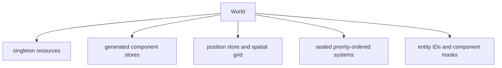
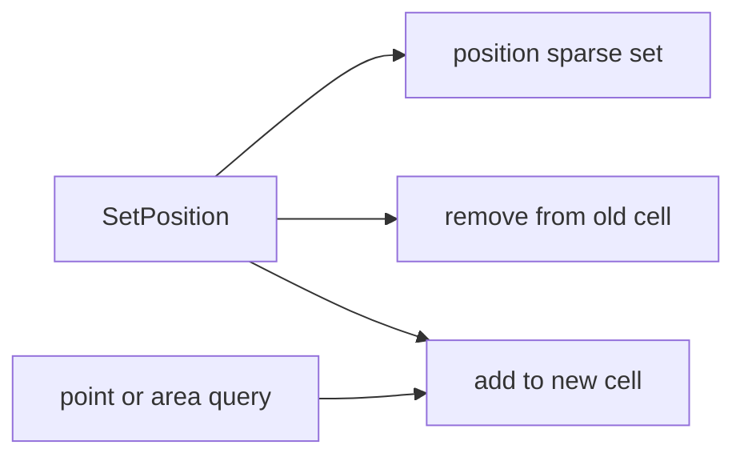
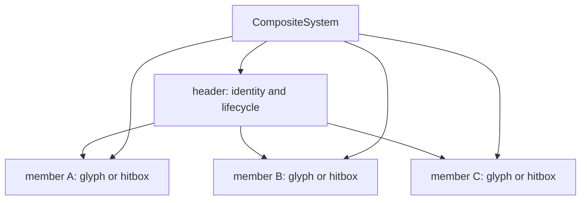
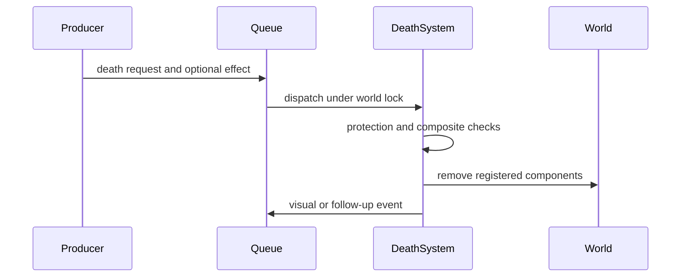

# ECS and Event Model

This document describes the data model used by the live game. It is the
medium-level companion to [Architecture overview](architecture.md) and
[Runtime model](runtime.md). The important design constraint is that component
storage, resources, systems, and event handlers all share one serialized world
mutation boundary.

## 1. World ownership

`internal/engine.World` owns the complete mutable simulation:



The world starts entity IDs at `1`; `0` is the conventional no-entity value.
`Clear` resets both the ID sequence and session entity counters. Component
masks let generated destruction code remove only the stores present on an
entity.

All component stores, positions, resources that participate in a tick, entity
IDs, and system execution are protected by the world's update mutex. The game
tick, event consumer, input router, and renderer acquire that same mutex. They
therefore observe whole state transitions rather than partially applied ones.
Atomic counters and explicitly self-synchronized resources are the exceptions
and are safe for post-tick telemetry.

Systems may be added only during construction. `ClockScheduler.Start` seals the
world; registering another system after that point panics. Constructors run in
declared dependency order. Tick execution remains sequential by ascending
priority, with manifest registration order breaking equal priorities.

## 2. Entities and typed stores

Most components use `engine.Store[T]`, a sparse-set-style typed store:

| Structure | Purpose |
|---|---|
| entity-to-index map | Finds a component's dense slot in expected constant time. |
| dense entity slice | Enumerates entities that have the component. |
| dense component slice | Stores values without interface conversion. |
| swap removal | Removes a component in expected constant time by moving the final slot. |

Operational rules:

- `GetComponent` returns a value copy; update it with `SetComponent`.
- `GetPtr` exposes an in-store pointer for a hot path, but any append or removal
  from that store can invalidate it.
- Entity slices returned for live iteration must not be used while structurally
  changing the same store. Collect work first or use a snapshot/copy helper.
- Entity destruction is generated from the component manifest and removes all
  bits/stores represented by the entity's mask.
- Store access assumes the caller already owns the world lock; stores do not add
  nested locks.

Position is the deliberate exception. `engine.Position` mirrors the typed-store
operations while also maintaining the spatial index, so movement cannot update
one without updating the other.

## 3. Position and spatial queries

`SpatialGrid` maps every map coordinate to a fixed-capacity `Cell`. A cell can
hold up to `parameter.MaxEntitiesPerCell` entity IDs (currently 31). This avoids
per-query allocation in collision, typing, and targeting hot paths.



The position layer provides point and area queries, out-of-bounds checks, wall
masks, line-of-sight traversal, and free-space searches using patterns or a
spiral. Bresenham-style grid traversal is used where a mechanic needs a line
through cells.

Cell capacity is a performance contract, not a hard entity limit. If more than
the configured maximum occupy one cell, the position store still contains the
extra entities but the fixed cell index cannot represent all of them. Collision
or lookup code that relies only on that cell may therefore soft-clip excess
occupants. Spawn and movement designs should avoid pathological stacking.

## 4. Component catalog

`internal/manifest/definition.go` is the authoritative component registration
list. The following grouping is conceptual; every registered component gets a
generated typed store and mask bit.

| Domain | Components |
|---|---|
| Identity and presentation | `Glyph`, `Sigil`, `Nugget`, `Cursor`, `Protection`, `Kinetic`, `Wall`, `Loot`, `Gateway` |
| Player state | `Energy`, `Heat`, `Shield`, `Boost`, `Weapon`, `Orb`, `Ping` |
| General behavior | `Decay`, `Blossom`, `Cleaner`, `Dust`, `Navigation`, `Combat`, `Genotype`, `Lightning`, `Missile`, `Pulse`, `Spirit`, `Materialize` |
| Species and structures | `Target`, `TargetAnchor`, `Drain`, `Quasar`, `Swarm`, `Storm`, `StormCircle`, `Bullet`, `Pylon`, `Snake`, `SnakeHead`, `SnakeBody`, `SnakeMember`, `Eye`, `Tower` |
| Composite entities | `Header`, `Member` |
| Transient effects | `Flash`, `Fadeout`, `Splash`, `Marker` |
| Lifecycle | `Death`, `Timer` |
| Special storage | `Position` |

Components should remain data-oriented. Behavior belongs in systems, and
cross-domain requests belong in events. Related enum values and static profiles
live alongside a component when they define the meaning of that data, such as
weapon types, loot profiles, or glyph levels.

## 5. Singleton resources

Resources carry state that has exactly one instance per world or coordinates
services shared by many systems.

| Resource | Role |
|---|---|
| `Time` | Current game time, tick delta, and pause-aware clock data. |
| `Config` | Validated dimensions, runtime options, and enabled-system state. |
| `Game` | Mode, paused state, and session-level game state. |
| `Player` | Bounded cursor roster, occupied slots, and the slot selected for local input/camera. |
| `Event` | Event queue and related runtime wiring. |
| `Target` | Navigation target groups and target cycling state. |
| `RouteGraph` | Navigation graph instances and route distributions. |
| `Adaptation` | Per-graph route-selection learner state. |
| `Genetics` | Population registry and evolutionary session data. |
| `Transient` | Shared transient-effect bookkeeping. |
| `Status` | Atomic, dynamically registered metrics. |
| `Content` | Loaded immutable content corpus capability. |
| `Audio` | Sound/music capability and state exposed to game systems. |
| `Network` | Optional transport capability; not wired into the default game. |

Target group `0` is reserved for live cursors and contains up to the navigation
target cap of eight, even though the player roster itself has 16 slots. A field
seeded from that group routes an actor toward the nearest reachable cursor.
Other groups can likewise retain up to eight entity or position targets, which
is relevant to eye/tower scenarios.

`CursorSystem` is the sole owner of cursor lifecycle and placement. FSM,
terminal input, replay, bots, and eventual network input all request spawn,
despawn, local-slot selection, or movement through typed events. The system
updates the ordinary cursor component/entity and then announces the applied
result, keeping one path for every producer.

## 6. Composite entities

Large actors and formations are modeled as one header plus member entities.
`HeaderComponent` owns member entries containing entity IDs and relative
offsets; each `MemberComponent` points back to its header.



Composite types define where damage and ownership live:

| Type | Damage/lifecycle meaning | Examples |
|---|---|---|
| `CompositeUnit` | Header is the actor; members provide visual or collision hitboxes. | Quasar and swarm. |
| `CompositeAblative` | Members can be destroyed independently as protection is stripped. | Storm circles and player towers. |
| `CompositeContainer` | Header groups members but does not impose unit-style damage. | Storm root/grouping structures. |

`CompositeSystem` synchronizes non-skipped member positions to header offsets,
detects missing members, tombstones dead entries, and compacts the member list.
It emits integrity-breach events instead of silently leaving broken backlinks.
Species-specific systems still own special formation motion and lifecycle.

Typing and combat deliberately work at either layer: a typed member can report
to its header for ordered word mechanics, while a combat hitbox can route damage
according to the composite type.

## 7. Destruction and protection

Destruction is event-oriented when effects, protection checks, or composite
semantics matter. `DeathSystem` collects requests and then performs immediate or
batched removal using reusable buffers.



`ProtectionComponent` masks operations such as deletion or blanket destruction;
each cursor is created with full protection. `CursorSystem` deliberately owns
the direct destruction path for an explicit cursor despawn. Other direct
`World.DestroyEntity` and batch-destruction callers assume they have already
established that removal is safe, so gameplay code should prefer the
appropriate death request unless it owns that invariant.

The optimized one-entity death event packs the effect ID into the high 16 bits
and the entity ID into the low 48 bits. Batch payloads can come from pools. Code
must not retain a pooled payload after its handler returns.

## 8. Event transport

Systems do not call peer systems. They publish `event.GameEvent` values:

```go
type GameEvent struct {
    Payload any
    Type    EventType
    Seq     uint64
    Origin  Origin
}
```

`Seq` is the queue slot assigned at push and orders concurrent producers.
`Origin` names the producer (`system`, `input`, `macro`, `command`, `network`,
or `debug`); it never changes dispatch behavior.

`EventNone` is zero and is also used as the scheduler's tick sentinel; it does
not represent a dispatched gameplay effect.

The queue is a bounded, lock-free multi-producer/single-consumer ring:

- producers reserve a slot and publish it with a per-slot flag;
- scheduler-owned dispatch paths form one logical consumer; the event loop,
  tick, immediate-input, and reset paths serialize consumption with the world
  lock;
- consumption and handler execution happen while the world lock is held;
- if producers outrun the consumer, the oldest pending item is overwritten and
  the dropped-event metric increments;
- before a non-system event is published, an installed replay journal copies
  its typed payload and queue/stamp metadata while the producer still owns it;
- the default queue capacity is 2,048 events.

Each event is offered to the HFSM before registered system handlers. This makes
state transitions and captures part of the same deterministic event-settling
phase as gameplay reactions. Immediate settling paths drain events in rounds,
up to 16 rounds, so reactions can publish follow-up work without unbounded
recursion. These paths run before a tick, after the FSM phase, and after
input/reset work—not after the systems phase itself. The independent 4 ms event
loop settles system-emitted and other asynchronous requests between 50 ms game
ticks.

### Replay capture

The queue also owns the replay position `(run, tick, boundary)`. Run advances
when reset rebases tick, tick opens at the top of a simulation body, and
boundary advances after each non-empty explicit settle group. These counters
advance even without a journal, so one attached mid-run stamps its first event
honestly. `OriginSystem` events are derived simulation work and are omitted;
every other origin is captured and later reinjected in queue-slot order.

`JournalRecord` stores TOML payload text against the generated registry
prototype plus dense journal sequence and sparse queue sequence. Periodic
`JournalAnchor` records carry seed/session, config and corpus identity,
fingerprint counts, tick interval, and simulation geometry. The dedicated file
and replay constraints are documented in
[Logging and diagnostics](logging-and-diagnostics.md) §9.

## 9. Event catalog and payload contracts

`internal/event/type.go` is the authoritative event list. Its declaration
comments are consumed by generation to produce event names, payload reflection,
schema output, and command-mode `:emit` support. When adding or changing an
event, update the declaration and payload together, then regenerate.

The catalog covers these domains:

| Domain | Representative responsibilities |
|---|---|
| Session and level | init, reset, level creation, pause, content and environment changes |
| Audio and music | effects, mute state, pause/fade, tempo/intensity and sequencing requests |
| FSM and meta | region control, variables, delayed actions, system toggles, telemetry |
| Player and typing | cursor lifecycle/placement, character input, deletion, per-cursor energy, heat, boost, shield, and weapons |
| World structure | walls, maze, composites, gateways, towers, navigation graphs |
| Species and combat | creation, attacks, damage, death, fusion, projectiles, adaptation, genetics |
| Visual effects | flash, fade, splash, dust, cleaner, markers and explosions |
| Experimental network | connect/disconnect and transport notifications |

Payload ownership depends on the event. Several high-frequency payloads are
pooled and returned by the consumer; handlers must treat payloads as borrowed
for the duration of `HandleEvent`. A handler that needs data later should copy
the fields it owns into a component, resource, or new value.

## 10. Adding ECS behavior safely

1. Add data to `internal/component` and register a new component in the
   manifest only if per-entity storage is required.
2. Add event types and typed payloads for cross-system requests or domain facts.
3. Implement behavior as a system with a stable `Name`, priority, `Update`, and
   explicit `EventTypes` subscription.
4. Register its domain plus required and optional dependencies in the manifest;
   keep the key and `Name()` equal so configuration diagnostics stay exact.
5. Do not retain live store pointers/slices across structural mutation or event
   boundaries.
6. Make protection, composite routing, and pooled-payload ownership explicit.
7. Run generation and the verification workflow described in
   [Development guide](development.md).

## 11. Source map

| Concern | Primary source |
|---|---|
| World and lock | `internal/engine/world.go`, `internal/engine/sync_*.go` |
| Generic store | `internal/engine/store.go` |
| Generated stores/masks | `internal/engine/component_store_gen.go` |
| Positions and grid | `internal/engine/position.go`, `internal/engine/spatial_grid.go` |
| Resources | `internal/engine/resource.go`, `internal/engine/resource_transient.go` |
| Components | `internal/component/*.go`, `internal/manifest/definition.go` |
| Composites | `internal/component/header.go`, `member.go`, `internal/system/composite.go` |
| Events and producer origins | `internal/event/type.go`, `payload.go`, `origin.go`, `queue.go`, `router.go` |
| Replay record and anchor schema | `internal/event/journal.go`, `journal_sink.go` |
| Destruction | `internal/system/death.go` |
