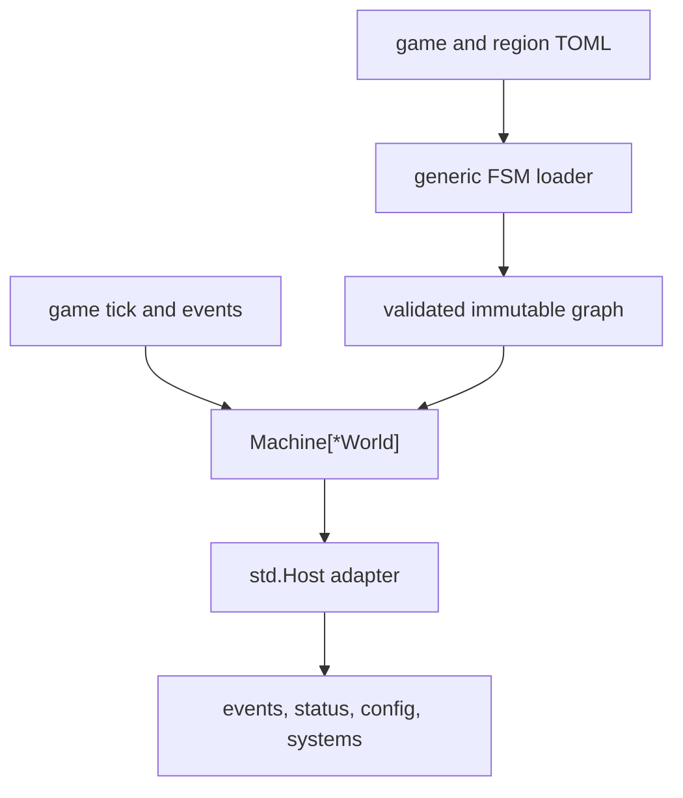
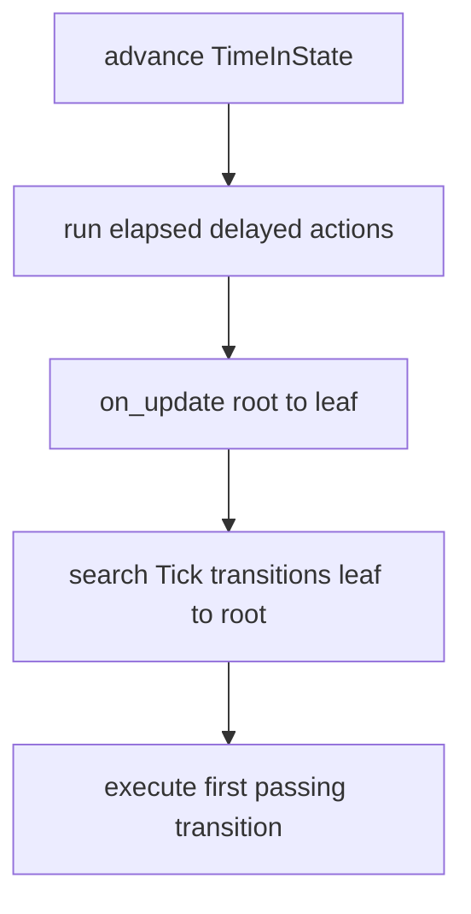
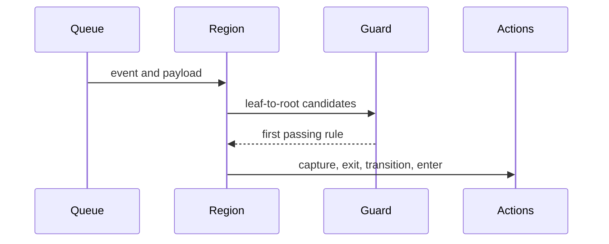
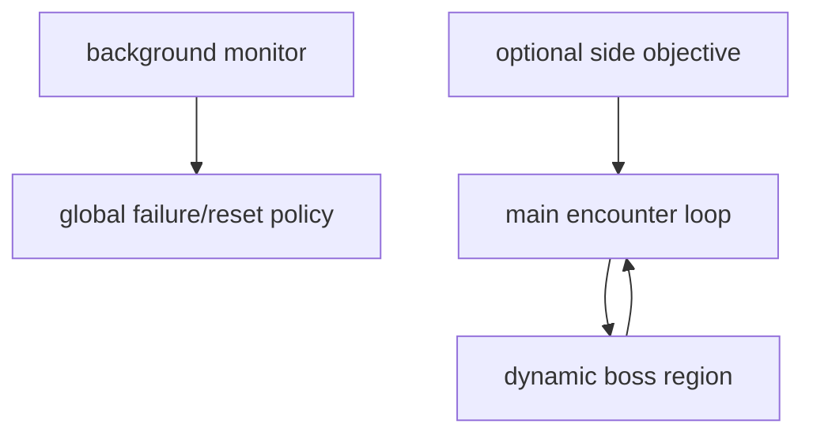

# FSM and Gameplay Configuration

Vi-Fighter's encounter progression is a generic hierarchical state machine
bound to the game through a small host adapter. TOML defines regions, state
hierarchies, transitions, guards, and actions; Go systems implement the actual
mechanics those actions request.

## 1. Boundary and data flow



`internal/fsm` is generic over its context type and imports no gameplay
systems. `internal/fsm/std` defines reusable actions/guards against a capability
`Host[T]`. `internal/manifest/fsm_bridge.go` supplies those capabilities for
`*engine.World` and registers the small game-specific `ResetKillVars` action.

The result is a strict policy/mechanism split:

- TOML decides when encounters start, end, repeat, pause, or escalate;
- the FSM decides deterministic transition semantics;
- events request mechanics without knowing which state caused them;
- systems implement mechanics without knowing the campaign graph.

## 2. Configuration resolution

Entry configuration is resolved in this order:

1. `-g <path>`, where the path is `game.toml` or a directory containing it;
2. `./game.toml`;
3. `./config/game.toml`;
4. the user config location, normally
   `$XDG_CONFIG_HOME/vi-fighter/game.toml` or
   `~/.config/vi-fighter/game.toml`;
5. the embedded default.

`-d` selects the embedded FSM and content. It is mutually exclusive with `-g`
and `-f`; combining them fails configuration validation. It is a single flag;
the older `-gd` wording was inaccurate.

Region files are resolved through the same filesystem as the entry file and
relative to its directory. They may contain only `[states]`; nested region
declarations or other top-level keys are rejected. Circular includes and
duplicate state names are errors, and filesystem traversal outside the config
root is not accepted.

Use `vi-fighter -check [-g <path>]` to resolve, parse, assemble, and validate
the configuration without starting the terminal game. `vi-fighter -schema`
prints generated JSON describing known events, actions, guards, and payloads.

## 3. Root schema

```toml
[systems]
disabled_systems = ["system_runtime_name"]

[regions.main]
initial = "MainStart"
file = "main.toml"
background = false
enabled_systems = ["glyph"]
disabled_systems = ["decay"]

[regions.boss]
file = "boss.toml" # no initial: dynamic region
```

| Field | Meaning |
|---|---|
| `systems.disabled_systems` | Systems disabled after FSM initialization. Names are validated against runtime `System.Name()` values. |
| `regions.<name>.initial` | Initial state for a region started during machine initialization. Omit for a region spawned later. |
| `file` | File supplying additional `[states.*]` tables. |
| `background` | Excludes the region from normal telemetry/overlay presentation; it still updates and handles events. |
| `enabled_systems` | Systems enabled when the region is spawned or resumed. |
| `disabled_systems` | Systems disabled when the region is spawned or resumed. |

Initial regions are sorted by name before startup. That sorted insertion order
becomes their deterministic update/event order. Dynamically spawned regions are
appended in spawn order.

## 4. States and hierarchy

```toml
[states.Wave]
parent = "Root"
on_enter = [
    { action = "SetVar", payload = { name = "remaining", value = 5 } },
]
on_update = []
on_exit = []
transitions = []

[states.WaveActive]
parent = "Wave"
```

Every state defaults to parent `Root`. The loader assigns deterministic state
IDs by sorted state name, verifies parent references, and compiles root-to-leaf
paths for least-common-ancestor transitions. User actions are forbidden on the
shared `Root` node because they would execute once per active region; put
one-shot work in a dedicated initial state.

Each live region owns:

- its name and active leaf state;
- the root-to-leaf active path;
- time in the active leaf;
- a pause flag;
- delayed actions associated with state owners.

Variables are signed 64-bit integers shared across all regions of one machine.
They reset on machine initialization/reset.

## 5. Tick processing

For each unpaused active region, a game tick performs:



Only one tick transition can be taken per region per FSM update. Within a
state, declaration order is priority. If none passes, lookup bubbles to the
parent. A passing internal `Tick` transition consumes that tick and can shadow
outer tick transitions, so use it deliberately.

Region time and delayed-action countdown use pause-aware game delta. A paused
region neither updates nor handles events; other regions continue.

## 6. Event processing

The event queue offers each event to the FSM before system handlers. For every
unpaused region in its deterministic snapshot, the machine looks for matching
transitions from leaf to root and executes the first whose guard passes.

Regions spawned while handling an event do not receive that same event because
iteration uses a snapshot. A region terminated during handling is skipped when
its turn arrives.



One event may cause one transition in each parallel region. Handling in one
region does not prevent another region from observing it.

## 7. Transition semantics

```toml
{ trigger = "EventGoldCompleted", target = "Reward" }
{ trigger = "Tick", target = "Timeout",
  guard = "StateTimeExceeds", guard_args = { ms = 5000 } }
{ trigger = "EventSpeciesCreated", internal = true,
  guard = "PayloadIntCompare", guard_args = { field = "species", op = "eq", value = 1 },
  actions = [{ action = "IncrementVar", payload = { name = "seen" } }] }
```

Normal transition order is:

1. capture requested payload fields into variables;
2. execute `on_exit` from active leaf up to, but not including, the LCA;
3. remove delayed actions owned by exited states;
4. commit the target path and reset leaf time;
5. execute transition actions;
6. execute `on_enter` from below the LCA to the new leaf.

A transition targeting the current leaf is action-only: it does not exit,
re-enter, or reset `TimeInState`. An `internal = true` transition has no target,
consumes the trigger, runs its actions, and preserves state/time. Internal
transitions declared on ancestors remain active for every descendant.

### Payload capture

`capture_vars` maps an event payload field to an FSM variable:

```toml
{ trigger = "EventSpeciesCreated", target = "Attach",
  guard = "PayloadIntCompare", guard_args = { field = "species", op = "eq", value = 5 },
  capture_vars = { entity = "anchor_id" } }
```

Fields resolve by TOML tag and then Go field name. Signed/unsigned integers,
entity IDs, floats, and booleans are converted to `int64` (boolean true is 1).
Capture precedes exit/transition/enter actions, so the target state's
`on_enter` can use the value.

## 8. Actions and delayed work

Actions can appear in `on_enter`, `on_update`, `on_exit`, or a transition. Every
action supports an optional guard and `delay_ms`.

| Group | Actions |
|---|---|
| Variables | `SetVar`, `IncrementVar`, `DecrementVar`, `MultiplyVar`, `DivideVar`, `ModuloVar`, `ClampVar`, `CopyVar` |
| Regions | `SpawnRegion`, `TerminateRegion`, `PauseRegion`, `ResumeRegion` |
| Systems | `EnableSystem`, `DisableSystem`, `ApplyRegionSystemConfigs` |
| Game bridge | `EmitEvent` |
| Status/config | `SetStatusInt`, `ResetStatusInt`, `ConfigToVar` |
| Game-specific | `ResetKillVars` |

Variable arithmetic can use literal `value`/`delta` or `source_var`, and can
apply optional `min`/`max` clamps. Division and modulo by zero are no-ops.

`EmitEvent` compiles its event name and payload type at config load time:

```toml
{ action = "EmitEvent", event = "EventGatewaySpawnRequest",
  payload = { anchor_entity = 0, species = 7 },
  payload_vars = { anchor_entity = "anchor_id" } }
```

`payload_vars` can replace nested fields using quoted dot paths such as
`"rooms.0.center_x"`. Struct segments use TOML tags first; numeric segments
index an already populated slice. Injection does not append elements.

A delayed action is scheduled against its owning state and counts down in
region time. It survives child-to-child transitions while its owner remains on
the active path and is discarded when that owner exits. Transition-delayed
actions are owned by the target state; internal-transition-delayed actions by
the current leaf.

## 9. Guards

Comparison operators are `eq`, `neq`, `gt`, `gte`, `lt`, and `lte`.

| Guard | Arguments | Meaning |
|---|---|---|
| `StateTimeExceeds` | `ms` | Active leaf time has reached the duration. |
| `RegionExists` | `region` | Named region is currently active. |
| `VarEquals` | `var`, `value` | FSM variable equality. |
| `VarCompare` | `var`, `op`, `value` | Variable/literal comparison. |
| `VarCompareVar` | `var_a`, `op`, `var_b` | Variable/variable comparison. |
| `StatusBoolEquals` | `key`, `value` | Live boolean status metric comparison. |
| `StatusIntCompare` | `key`, `op`, `value` | Live integer status metric comparison. |
| `ConfigIntCompare` | `field`, `op`, `value` | Supported integer config field comparison. |
| `ConfigBoolCompare` | `field`, `value` | Supported boolean config field comparison. |
| `PayloadIntCompare` | `field`, `op`, `value` | Event payload numeric field comparison. |
| `PayloadBoolEquals` | `field`, `value` | Event payload boolean field comparison. |
| `PayloadStringEquals` | `field`, `value` | Event payload string field comparison. |
| `PayloadExists` | none | Event payload is non-nil. |
| `And`, `Or` | nested `guards` array | Recursively combine parameterized/static guards. |
| `AlwaysTrue` | none | Always passes. |
| `StateTimeExceeds2s`, `StateTimeExceeds10s` | none | Convenience static duration guards. |

`ConfigToVar` and the config guards expose only fields accepted by
`engine.ConfigIntAccessor`/`ConfigBoolAccessor`, not arbitrary reflection over
the resource. Consult `-schema` and the accessors when authoring.

## 10. Region lifecycle and system policy

`SpawnRegion` validates the declared region and initial state, creates a fresh
runtime region, then performs root-to-leaf entry. `TerminateRegion` removes the
runtime region and its delayed actions. Pause/resume preserves active state and
time.

When a region is spawned or resumed,
`ApplyRegionSystemConfigs` can apply its enabled/disabled lists through meta
events. Global disabled systems are applied during initialization/reset. This
allows a scenario to keep mechanics constructed but dormant until needed.

System lists use runtime names, which now equal their manifest keys. A system
also has to subscribe to and honor `EventMetaSystemCommandRequest`;
construction alone does not guarantee runtime toggle support.

A disable is checked against the declared dependency graph. `-check` rejects a
config that leaves an enabled system without a required dependency, naming the
region, and `World.AllowSystemDisable` refuses the same request from an
`EnableSystem`/`DisableSystem` action or the `:system` command. Disabling both
ends stays legal; an optional dependency is reported once, not per resume.

### Operator region primitives

`:region` exposes the scheduler-owned region lifecycle without reaching
through `App` to the machine:

| Command | Primitive |
|---|---|
| `:region list` | Report every declared region and whether it is active, paused, and in which state. |
| `:region spawn <name> <state>` | Spawn one declared inactive region at a named state. |
| `:region pause <name>` | Pause one active region without changing its state/time. |
| `:region resume <name>` | Resume one active region. |
| `:region terminate <name>` | Exit and remove one active region and its delayed work. |

Each command publishes exactly one `EventFSMRegionRequest` primitive. Compound
policy remains explicit: for example, entering a region that an escalation
chain would normally reach is issued as `pause` and then `spawn`, not hidden in
one command. Every successful mutating operation reapplies region system policy.

### Telemetry and transition taps

Before registry freeze, the scheduler registers five metrics for every
declared region:

`fsm.<region>.state`, `.index`, `.elapsed`, `.max_duration`, and `.paused`.

Inactive regions publish `-`, `-1`, zero durations, and `false`. The older
foreground summary (`fsm.state`, `fsm.elapsed`, and related fields) remains,
but the per-region sets preserve simultaneous background activity.

`Machine.OnTransition` observes every transition. External transitions emit
an info record with region, from/to state, trigger, state index, and maximum
duration; internal transitions emit a debug `msg="internal"` record instead.
`Machine.OnRegion` emits info records for spawn/pause/resume/terminate lifecycle
operations. These are observation taps, not policy callbacks.

`:log rec fsm on` asks the flight recorder to flush on each external
transition with reason `fsm:<region>`; it is off by default because a busy FSM
would otherwise write continuously. `:step ... fsm` uses the same transition
tap to trip a run-until breakpoint after the transition record is emitted.

## 11. Authoring pattern

A maintainable scenario usually separates concerns into regions:



- Put perpetual failure or resource monitoring in a background region.
- Spawn the required cursor roster from an initial/background region and wait
  for `EventCursorSpawned` (or retry `EventCursorSpawnFailed`) before emitting
  player-state events. A new world intentionally contains no cursor.
- Put one encounter family in one external state file.
- Spawn boss/side regions dynamically and pause the loop they supersede.
- Treat system status metrics as observations and events as domain facts.
- Use defensive tick transitions when an expected destruction event could be
  absent because an entity went out of bounds or a scenario was modified.
- Keep actions small; complex mechanics should remain Go systems triggered by a
  typed event.

The embedded config demonstrates this structure with `main`, `quasar`, `storm`,
`monitor`, and `placeholder`; its monitor also owns the cursor boot/retry
sequence. The full current flow is summarized in [Gameplay design](gameplay.md),
and [the authoring reference](../config/README.md) shows cursor spawn payloads
and capture.

## 12. Validation rules and diagnostics

The loader validates at least:

- presence of regions and valid initial states;
- unique state names and valid parent/target references;
- known event, guard, and action names;
- action/guard argument decoding and event payload shapes;
- legal internal transitions;
- external-file cycles, illegal top-level content, and duplicate states;
- state hierarchy/path validity;
- referenced runtime system names during app-level validation.

State compilation accumulates multiple per-state errors where practical, so
`-check` is more useful than fail-on-first-error parsing. It does not execute a
full playthrough; runtime conditions and balance still require tests/manual
exercise.

## 13. Example

```toml
[regions.wave]
initial = "WaveStart"

[states.WaveStart]
on_enter = [
    { action = "SetVar", payload = { name = "kills", value = 0 } },
    { action = "EmitEvent", event = "EventDrainResume" },
]
transitions = [
    { trigger = "EventSpeciesKilled", internal = true,
      guard = "PayloadIntCompare", guard_args = { field = "species", op = "eq", value = 1 },
      actions = [{ action = "IncrementVar", payload = { name = "kills" } }] },
    { trigger = "Tick", target = "WaveDone", guard = "VarCompare",
      guard_args = { var = "kills", op = "gte", value = 10 } },
]

[states.WaveDone]
on_enter = [
    { action = "EmitEvent", event = "EventDrainPause" },
]
```

In a real scenario, use the existing kill status metrics unless a local counter
has a distinct semantic purpose. The example mainly demonstrates an internal
event counter plus an outer tick transition.

## 14. Source map

| Concern | Primary source |
|---|---|
| Runtime semantics | `internal/fsm/machine.go`, `types.go` |
| Region commands and scheduler adapter | `internal/mode/commands.go`, `internal/engine/clock_scheduler.go` |
| TOML schema/compiler | `internal/fsm/config.go`, `loader.go`, `builder.go` |
| External files | `internal/fsm/file_loader.go` |
| Standard actions/guards | `internal/fsm/std/*.go` |
| Game host adapter | `internal/manifest/fsm_bridge.go` |
| Current embedded campaign | `internal/asset/config/*.toml` |
| External examples | `config/main`, `config/td`, `config/blank` |
| Extended syntax examples | `config/README.md` |
