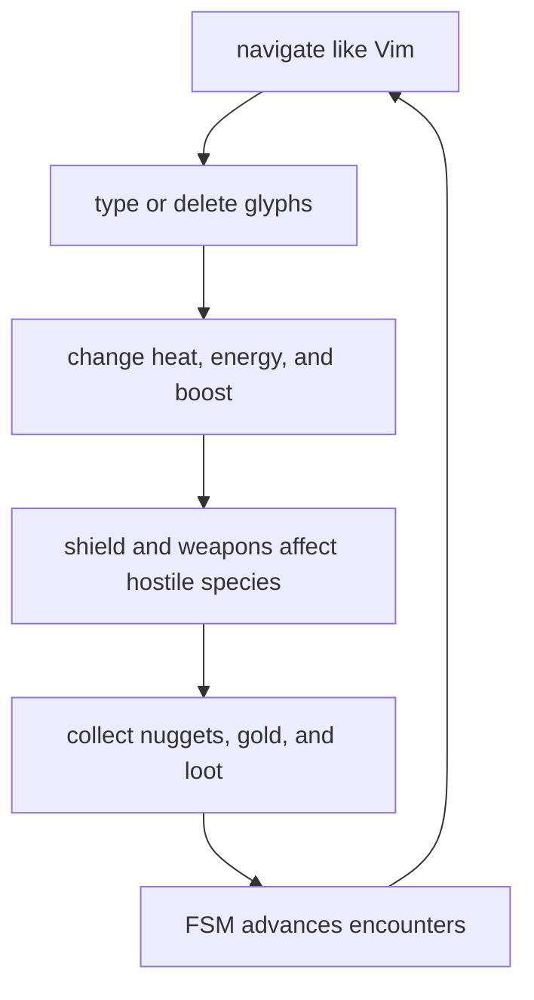
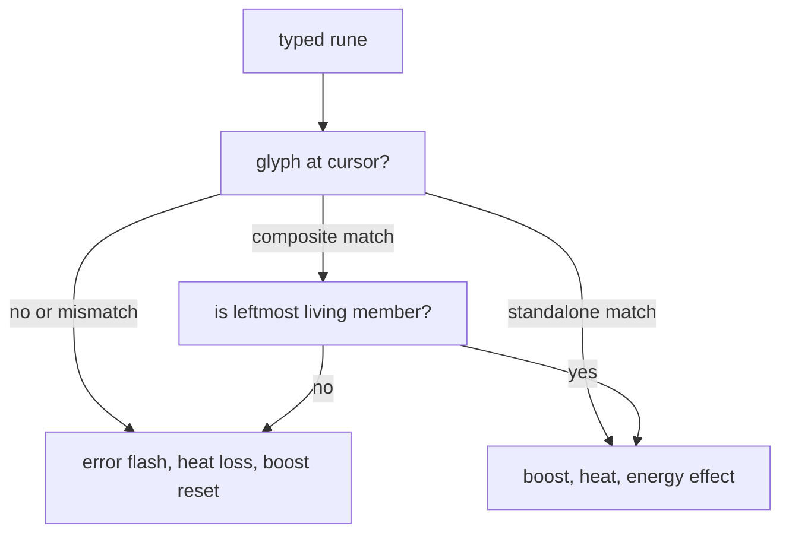
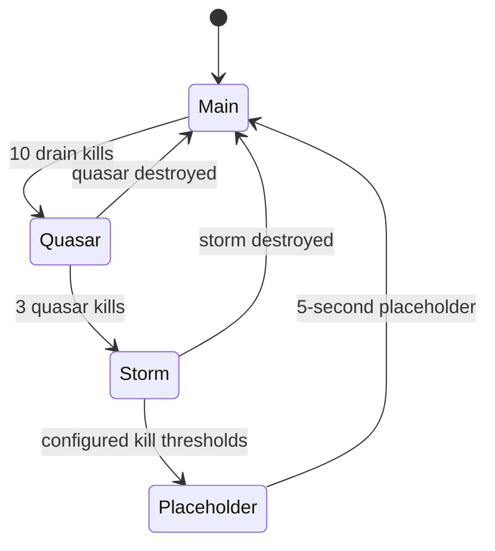

# Gameplay Design

Vi-Fighter combines Vim-style text navigation with a real-time typing and
survival game. This document describes the current mechanics as implemented.
Key bindings and parser details are in [Input and modes](input-and-modes.md),
while campaign sequencing is authored through the state machine described in
[FSM and configuration](fsm-and-configuration.md).

## 1. Core gameplay loop

The local cursor is both the player's text-editing position and the player
combat entity. Movement is discrete on the character grid. Hostile species,
projectiles, and effects may keep higher-precision `float64` kinetic state but
are projected back into the same grid for collision and rendering.

The embedded/default campaign is endless rather than a fixed sequence of
levels. Typing drives the resource economy, drains supply the first hostile
pressure, and kill counters let the FSM introduce composite encounters. The
author may replace that progression entirely with external TOML configuration.

## 2. Cursor and player state

The world starts with an empty, 16-slot cursor roster. The playable shipped FSM
configurations request a protected cursor at the map center; `CursorSystem`
then creates the entity and attaches cursor, ping, energy, heat, shield, boost,
weapon, and combat components. Each cursor owns an independent copy of that
state. A roster slot identifies its human, bot, or remote control source, while
one selected local slot receives terminal input and anchors the camera/UI.

The shipped games currently spawn one human-controlled local cursor. The
ordinary-entity roster is the simulation foundation for bots and multiplayer,
not a claim that the normal CLI exposes a multiplayer mode.

| State | Meaning |
|---|---|
| Position | Text cursor, player collision point, weapon origin, and camera subject. |
| Energy | Signed resource whose nonzero polarity activates the shield and colors attacks. |
| Heat | Bounded typing momentum; excess becomes overheat and can trigger a burst. |
| Boost | Timed reward from correct typing or credited kills that protects ordinary energy penalties and accelerates heat gain. |
| Shield | Elliptical defensive/collection area active whenever energy is nonzero. |
| Weapon | Charge counts, orbiting indicators, and independent cooldowns for three weapon types. |
| Ping | Crosshair, selection/grid feedback, and cursor movement visuals. |
| Combat | Player ownership/type and hit-point metadata used by the combat matrix. |

Cursor entities cannot be destroyed through ordinary gameplay because their
protection mask is `ProtectAll`. `CursorSystem` owns explicit despawn, and a
level reset clears the roster before the reset FSM requests replacement
cursors.

## 3. Typing rules

Insert-mode character input emits a character event at the cursor cell.
`TypingSystem` selects the first glyph in that cell and validates the rune.

A correct character:

- activates boost for 9 seconds, or extends an already active boost by 10
  seconds;
- adds one heat, or two if boost was already active before the key;
- changes energy according to the glyph color and current heat;
- increments correct-input and streak metrics;
- emits visual/audio feedback, removes the glyph, and moves the cursor one cell
  right when the map edge permits.

A typing error flashes the cursor, removes 10 heat, deactivates boost, plays the
error sound, increments the error metric, and resets the streak.

For composite text, the next valid member is the living member with the lowest
X, then Y, then entity ID. This enforces visible left-to-right typing even if
members were internally created in a different order. Gold members use the
universal heat/boost reward but omit normal color energy conversion; the FSM
owns the completion reward.

Delete operators are spatial actions, not simulated keystrokes. Characterwise
ranges clamp X on their first and last rows; linewise ranges cover every glyph
on selected rows. Glyphs with `ProtectFromDelete` survive. Deletion gathers
targets before publishing a batched death request, avoiding mutation during
store iteration.

## 4. Glyph production and decay

`GlyphSystem` pulls blocks from the immutable content corpus and places lines in
available map space. Blue and green glyphs are the regular resource-producing
text; levels dark, normal, and bright control presentation and energy cost.
Red, white, and gold exist for hostile/special mechanics.

Spawn pacing adapts to screen occupancy: sparse maps receive text faster while
dense maps sharply reduce new placement. Placement excludes a region around the
cursor and retries only a bounded number of positions.

Decay is an explicit wave mechanic. `DecaySystem` marks eligible glyphs and
removes them over time, respecting `ProtectFromDecay`. Blossom creates a
different spreading/transforming behavior. Dust, flash, fade, splash, marker,
explosion, and motion-marker systems are transient feedback rather than durable
text state.

## 5. Energy, heat, boost, and shield

### Energy

Energy is signed. Positive and negative values are both useful: either polarity
activates the shield, while attack color/polarity derives from the sign.

| Delta class | Rule |
|---|---|
| Reward | Increases absolute magnitude without crossing through zero. |
| Penalty | Converges toward zero, clamps there, and is multiplied by the current encounter damage multiplier. Boost or ember can block it. |
| Passive | Converges toward zero and clamps, but bypasses boost/ember protection. |
| Spend | Converges toward zero and may cross it; used by explicit player actions such as jumps. |

Blue, green, and red glyphs start with different signed base values. The energy
system adjusts the actual change with current heat, so the relationship is part
of the live resource economy rather than a fixed reward table. Completing a
storm cycle increases the penalty multiplier; reset returns it to one.

### Heat and ember

Heat is clamped from `0` to `100`. Positive additions beyond the cap accumulate
overheat. Reaching the overheat threshold emits a heat burst, flashes the meter,
and activates the ember phase. Ember decays heat periodically and protects
ordinary energy penalties while active. A negative heat delta also clears the
overheat accumulation.

The background monitor region reacts to `EventHeatBurst` by requesting a
sweeping cleaner. This reaction is campaign policy, not hard-coded into the heat
component itself.

### Boost

Boost is a per-cursor timed reward. A correct character or a species kill
credited to that cursor activates it for 9 seconds when inactive or extends it
by 10 seconds when already active. Combat systems retain the last damaging
cursor on the target, and fatal species lifecycle paths publish
`EventSpeciesKilled` carrying that credit; lifecycle deaths or unowned attacks
carry no cursor and grant no boost. A typing error deactivates the typing
cursor's boost.

While active, boost doubles the per-character heat gain and prevents ordinary
energy penalties. Passive drain and explicit spends remain effective.

### Shield

The shield activates whenever energy is nonzero and deactivates at zero. It is
an ellipse around the cursor, not a rectangular grid range. It:

- absorbs or converts several hostile-species contacts into energy penalties;
- collects nuggets and nearby homing loot;
- supplies the bounds shown in Visual mode;
- consumes a percentage of current energy over time as passive drain.

Because passive drain converges to zero, keeping a shield active is never free.
Collision behavior still varies by attacker through combat/species profiles.

## 6. Collectibles

### Nuggets

At most one normal nugget is tracked by `NuggetSystem`. When absent, the system
attempts a random free-cell spawn after the one-second spawn interval. A beacon
periodically emits a directional cleaner cue toward it.

A nugget is collected by exact cursor overlap or by entering the active
shield/ember collection ellipse. Collection adds 10 heat. `Tab` jumps to the
nugget and spends one percent energy when a target exists.

### Gold sequences

A gold encounter creates a protected, bright, 10-character alphanumeric
composite at a free horizontal span. It lasts 10 seconds and must be typed in
left-to-right member order. Gold members resist deletion and decay.

`Shift-Tab` jumps to the first remaining gold member and spends ten percent
energy. Completion, timeout, external damage, and explicit cancellation emit
different events. The Gold system cleans up the composite, but the active FSM
decides what completion earns. In the embedded campaign, completion adds heat
and energy.

### Species loot

Kills are evaluated against ordered, species-specific drop tiers. Unique tiers
skip weapon loot that is already owned or active; skipped entries can add a
fallback count to a later tier. Pity-adjusted rolls improve repeated misses.
Drops burst away from the death point, then home using direct line of sight or a
flow field and collect near the player.

| Loot | Collection effect |
|---|---|
| Rod | Adds a rod charge/orb. |
| Launcher | Adds a launcher charge/orb. |
| Disruptor | Adds a disruptor charge/orb. |
| Heat | Adds the configured heat reward (currently 10). |
| Energy | Adds the configured energy reward (currently 10,000). |

The exact tier rates are gameplay balance data in
`internal/component/loot.go`; documentation does not duplicate every rate
because those values are expected to change during tuning.

## 7. Weapons and attacks

Main fire has its own cooldown. It emits a directional cleaner colored by
energy polarity and asks every owned, ready weapon to fire. Auto-fire is enabled
by default in a new process and is maintained by input state rather than the
weapon system.

| Weapon | Model |
|---|---|
| Main cleaner | Directional player attack/effect originating at the owning cursor. |
| Rod | Direct lightning against unique nearest targets, up to the number of charges. |
| Launcher | Homing/area missiles assigned from the nearest-target set. |
| Disruptor | Pulse/disruption behavior centered through its charged orb path. |

Weapon ownership is represented by charge count: zero means not owned. Each
owned type has an orbiting orb entity and a separate cooldown. The combat system
uses attack profiles to route attacker/defender pairs, damage types, collision
profiles, chained attacks, and kinetic effects. This central matrix avoids
embedding every target-specific response in projectile systems.

The special-fire input path is separate from main fire; Backspace or Space uses
it under the default mapping. See source and keymap documentation when changing
this behavior because fire requests, auto-fire, macros, and mouse repeat all
share timing constraints.

Cleaner visuals are background-only moving trails. They preserve any glyph
foreground in a traversed cell, use max-background blending so overlapping
auto-fire does not accumulate into a flash, and shrink the visible tail while
a blocked cleaner drains to its stop point.

## 8. Hostile and structural actors

| Actor | Current design role |
|---|---|
| Drain | Baseline hostile species population tied to heat. Materializes, approaches the cursor, periodically drains energy inside the shield, and removes heat on an unshielded cursor collision. |
| Quasar | Large composite, 5 cells wide by 3 high. Tracks the cursor and emits lightning when the cursor leaves its effective range. It is created by fusing drains in the default progression. |
| Swarm | Fast composite, 4 cells wide by 2 high, created from enraged drains. It tracks/charges, may teleport around blocked line of sight, absorbs drains, and has bounded charges/lifetime. |
| Storm | Multi-part boss with independently moving circles and 3D orbital dynamics. Circle types provide distinct attacks, including bullets and swarm pressure. |
| Pylon | Stationary ablative hostile structure/damage sponge that pushes nearby species. |
| Snake | Segmented composite species with separately modeled head and body members and formation lifecycle. |
| Eye | Five-by-three composite navigation attacker. It belongs to a target group, homes along routes, and self-destructs on contact; its parameters are evolution-managed. |
| Tower | Player-owned stationary ablative structure. It blocks cursor placement and acts as a target in tower-defense scenarios. |
| Gateway | Timed anchored spawner. It emits eye or snake spawn requests with route/adaptation metadata and disappears when its anchor is gone. |
| Bullet | Straight projectile with bounds, wall, shield, and cursor collision handling. |

The component `SpeciesType` catalog includes drain, swarm, quasar, storm,
pylon, snake, eye, and tower. Gateway and bullet are mechanics/entities but are
not genetic species. Species systems own formation-specific movement and
spawning; common damage is delegated to `CombatSystem`, common movement math to
`pkg/vmath/physics`, and path selection to `pkg/navigation`.

## 9. Walls, maps, and navigation

Walls are grid entities with directional masks and optional energy/visual
properties. Level setup can size the logical map independently of the terminal
viewport, decide whether resizing crops it, and clear or preserve entities.
Camera offsets translate between map, viewport, and screen coordinates.

Maze events can generate a maze, rooms, braiding, entrance/exit data, and a
solution path. Pattern assets can also become wall layouts. Navigation then uses
either flow fields toward a target or precomputed multi-route graphs. More
detail is in [AI, physics, and evolution](ai-physics-and-evolution.md).

## 10. Embedded campaign progression

The default `game.toml` declares five parallel-capable regions. Only `main` and
the background `monitor` start immediately; the other three are spawned as
needed.

The actual flow is:

1. `main` repeatedly spawns a gold sequence, waits five seconds, starts a decay
   wave, waits five seconds, and repeats.
2. At ten drain kills it resets that counter, spawns `quasar`, and pauses
   `main`.
3. `quasar` starts grayout/strobe, pauses drains, requests fusion, and runs a
   faster gold/dust loop until the quasar dies.
4. Before three cumulative quasar kills it resumes `main`; at three it starts
   `storm` instead.
5. Destroying a storm increases the species energy-damage multiplier. Current
   threshold guards may route to a five-second placeholder region; otherwise
   drains and `main` resume.
6. The background monitor waits until the player has held heat or nonzero
   energy. If both later reach zero, it cancels live encounters, resets kill
   tracking and the damage multiplier, clears/rebuilds the level, and respawns
   `main`.

This is data, not a guaranteed product rule. `config/main` extends the game
with a tower scenario; `config/td` is a standalone 500-by-250 tower-defense
configuration using towers, pylons, gateways, route pressure, quasars, and a
storm finale. `config/blank` is a minimal authoring scaffold with most gameplay
and audio systems disabled.

## 11. System inventory

The manifest registers these tick systems, grouped here by responsibility. The
grouping is editorial and is not the replication domain, which each system
declares for itself:

| Group | Systems |
|---|---|
| Frame/player | `cursor`, `ping`, `transient`, `camera`, `energy`, `shield`, `heat`, `boost`, `weapon` |
| Typing/world | `typing`, `composite`, `wall`, `tower`, `gateway`, `loot`, `glyph`, `nugget`, `decay`, `blossom`, `gold` |
| Spawning/effects | `materialize`, `cleaner`, `fuse`, `spirit`, `lightning`, `missile` |
| Motion/combat | `navigation`, `soft_collision`, `combat` |
| Species | `drain`, `quasar`, `swarm`, `storm`, `pylon`, `snake`, `eye`, `bullet` |
| Particles | `dust`, `flash`, `fadeout`, `marker`, `explosion`, `motion_marker`, `splash` |
| Lifecycle/learning | `environment`, `death`, `timer`, `adaptation`, `genetic` |
| Sound | `audio`, `music` |

The table uses runtime `Name()` values, which the manifest keys now match;
`TestActiveSystemsMatchRuntimeNames` keeps the two together, so configuration
validation, the `:system` command and the manifest all name a system the same
way. `MetaSystem` is event-only: declared in `manifest.ContextSystems` and added
directly by the app, since it takes a `GameContext` rather than a `World`.

Each entry declares a domain profile and its dependencies as `SystemDef` data
in the manifest; see [the domain model](domain-design.md).

## 12. Balance and ownership map

| Concern | Source of truth |
|---|---|
| Player and collectible constants | `internal/parameter/gameplay.go`, `player.go`, `collectible.go` |
| Species tuning | `internal/parameter/{drain,quasar,swarm,storm,pylon,snake,eye,tower}.go` |
| Combat matrix and profiles | `internal/component/combat.go`, `internal/system/combat.go` |
| Drop tables and rewards | `internal/component/loot.go`, `internal/parameter/loot.go` |
| System behavior | Matching files in `internal/system` |
| Default progression | `internal/asset/config/*.toml` |
| External scenarios | `config/main`, `config/td`, `config/blank` |

Changing a number in `parameter` changes a mechanic; changing a transition in
TOML changes when that mechanic is invoked. Keep that distinction intact when
adding a campaign or balancing a system.
