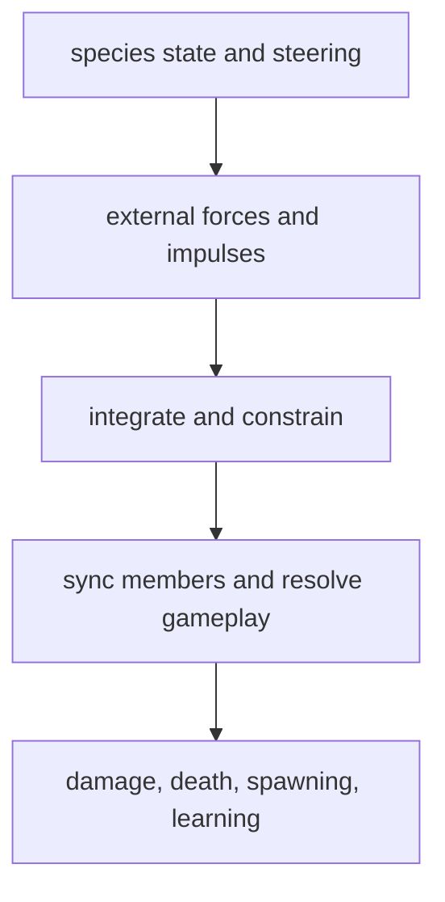

# Generic kinetic analysis

This document inventories Vi-Fighter's kinetic behavior and evaluates whether it
can move into a common `internal/system/kinetic.go` helper or a registered
`KineticSystem`. It is a design report and implementation plan, not a commitment
to make every moving entity use one update loop.

## 1. Conclusion

A single registered system that blindly integrates every `KineticComponent` is
not a safe near-term refactor. Movement is interleaved with species state
machines, combat immunity, footprint-specific wall checks, swept gameplay
collisions, member synchronization, and lifecycle decisions. Storm circles also
use a 3D state as their authority while `Kinetic` is only a 2D interoperability
mirror. Moving integration out of those owners would change same-tick behavior
unless each species were split into pre-motion and post-motion phases.

A partial refactor is both feasible and worthwhile:

1. keep scheduling and lifecycle in each owning system;
2. add an unregistered `internal/system/kinetic.go` pseudo-system, like
   `interaction.go` and `targeting.go`, for ECS-aware motion adapters;
3. separate persistent/intrinsic acceleration from per-tick external forces;
4. describe bodies with explicit mass, footprint, bounds, wall mask, and motion
   authority instead of inferring behavior from the presence of `Kinetic`;
5. migrate the ordinary 2D species first, leaving storm, snake body members,
   cursor, and scripted movers behind explicit adapters.

That direction removes repetitive steering/bounce/synchronization code while
preserving the current priority order. A registered `KineticSystem` should be
considered only after those adapters make movement a three-phase protocol.

## 2. Current representation and units

`component.KineticComponent` embeds `pkg/vmath/physics.Kinetic`:

| Field | Unit | Meaning |
|---|---|---|
| `PreciseX`, `PreciseY` | cells | Cell-centered sub-cell position. |
| `VelX`, `VelY` | cells/second | Terminal-plane velocity. |
| `AccelX`, `AccelY` | cells/second² | Persistent acceleration consumed by acceleration-aware integrators. |

`physics.Integrate` and `physics.IntegrateWithBounceStats` use semi-implicit
Euler: update velocity from acceleration, then position from the new velocity.
The bounce variant applies acceleration once before choosing swept substeps; its
result therefore does not depend on how many anti-tunnelling steps were needed.
`physics.IntegratePosition` deliberately ignores acceleration and is used by
ballistic, orbital, spring-follow, and other controller-owned paths.

The integer `PositionComponent` and spatial grid are the collision/rendering
projection of precise state. `Point.CenterF` converts a cell to precise space and
`PointAtF` converts back with floor semantics. Y grows downward. Angles therefore
use the existing terminal-plane convention: 0 points right, π/2 points down, π
points left, and 3π/2 points up.

Mass is not part of `Kinetic`. `internal/profile/mass.go` supplies relative masses
used by collision profiles and wind. Consequently, having a `KineticComponent`
does not by itself make an entity a physical body with a known mass.

## 3. Species kinetic inventory

| Species | Kinetic authority | Steering/force sources | Integration and contacts | Overrides and synchronization |
|---|---|---|---|---|
| Drain | 2D `Kinetic` on each Player-domain drain | Homing toward its resolved target, overspeed drag, cornering brake, combat/shield/explosion/dust impulses, soft separation, wind | `Integrate`, map-bound reflection, grid traversal through kinetic walls, per-cell gameplay collision | Stun freezes all movement. Kinetic immunity suppresses homing/drag but preserves displacement from an existing impulse. |
| Swarm | 2D `Kinetic` on the Shared composite header | Homing and cornering in chase; exact charge velocity; combat/soft-collision impulses; wind | Acceleration-aware swept bounce against a 4×2 footprint | Lock freezes; charge rewrites velocity; teleport rewrites position and velocity; decelerate scales velocity. Header cell changes synchronize all members. |
| Quasar | 2D `Kinetic` on the Shared composite header | Homing with arrival steering, progressive speed multiplier, cornering brake, combat/soft-collision impulses, wind | Speed cap then acceleration-aware swept bounce against a 5×3 footprint | Stun freezes. Zapping pauses movement. Homing settlement snaps to the target only without an external acceleration. Members follow the header. |
| Eye | 2D `Kinetic` on the Shared composite header | Type-specific homing, route guidance, cornering brake, combat impulses, wind | Acceleration-aware swept bounce against the eye footprint | Stun freezes; kinetic immunity suppresses homing but not integration. Header movement synchronizes members. Target contact self-destructs. |
| Snake head | 2D `Kinetic` on the Shared head header | Homing, route guidance, speed cap, combat impulses, wind | Acceleration-aware swept bounce against the head footprint | Stun freezes. Velocity also chooses facing; movement feeds the trail used by the body. Head members follow the header. |
| Snake body | One 2D `Kinetic` per living body member, not on the body header | Combat impulses and a spring toward a trail-derived rest point | Displaced members use `SpringToRest` plus position-only integration | Members normally snap to rest and zero velocity. They are followers, not independent movers; head wind moves the formation, while body-local wind is intentionally deferred. |
| Storm circle | `StormCircle.Pos3D`/`Vel3D` are authoritative; 2D `Kinetic` is a compatibility mirror | Pairwise gravity/repulsion, Z equilibrium spring, damping, speed cap, 3D collision, combat/dust/wind 2D impulses | Custom axis-separated 3D integration, bounds, wall destruction, sphere overlap/collision | Before physics, deltas written to 2D velocity are folded into `Vel3D.XY`; after physics, 3D position/velocity overwrite the 2D mirror. Stun skips physics. |
| Pylon | No `Kinetic` in current entities | Acts as an effectively immovable soft-collision source; `MassPylon` exists | None | A typed wind path exists, but there is nothing to update until a pylon gains `Kinetic`. |
| Tower | No `Kinetic` and no mass profile | None; stationary target/structure | None | Remains outside generic motion until physical behavior is designed. |

Composite member offsets are gameplay geometry, not independent rigid-body
degrees of freedom. Swarm, quasar, eye, and snake-head members should therefore
continue to follow one header body. Treating every member with `Kinetic` as a
standalone actor would double-apply forces or tear formations apart.

## 4. Other uses of `Kinetic`

These entities establish why “has `Kinetic`” cannot be the eligibility rule for
wind or a generic integration pass.

| Entity/effect | Current motion model | Why it needs an explicit policy |
|---|---|---|
| Cleaner | Cardinal constant velocity, normal integration, swept wall/entity checks, then a stationary tail-drain phase | It is a weapon/effect, not a wind target; acceleration would also break the cardinal-only traversal branches. |
| Missile | Homing or ballistic velocity, speed cap, position-only integration, swept impact, lifetime | Targeting and detonation are part of the same step; it intentionally ignores `Accel`. |
| Bullet | Ballistic position-only integration plus swept wall/shield/cursor collision | A projectile should not inherit environmental forces merely because it stores precise motion. |
| Loot | Owner-specific line of sight/flow homing, cornering brake or velocity bleed, swept bounce | It is Player-domain and owned; current wind scope excludes it. |
| Dust | Random jitter, orbital equilibrium, aspect-corrected orbital damping, quadratic drag, position-only integration, damped wall reflection | It has bespoke field dynamics and is explicitly deferred until mass/physical interaction are designed. Dust also batches impulses onto drains. |
| Decay | Initial downward velocity and persistent downward acceleration, normal integration, swept transform/destruction | It already owns `AccelY`, has no mass, and is explicitly outside wind for now. |
| Blossom | Initial upward velocity and persistent upward acceleration, normal integration, swept transform/destruction | Same limitation as decay, with the opposite acceleration. |
| Weapon orb | Orbit angle and cursor position are authoritative; `Kinetic.Precise` is overwritten as a positional mirror | It is a scripted attachment, not an integrated body. |
| Cursor | No `Kinetic`; position changes through owner-authored absolute-cell events and local prediction | Adding forces requires an authority and prediction design before adding a component. |

Several visual systems move or interpolate positions without `Kinetic` at all.
That is appropriate when motion is presentation or an authored animation rather
than physical gameplay. A generic kinetic refactor should not absorb those paths.

## 5. Cross-cutting kinetic effects

### Steering and navigation

`targeting.go` resolves a base target, direct line of sight, flow direction, and
lookahead. The species system then applies homing, arrival control, and cornering
drag. Navigation chooses a target vector; it does not own motion.

This sequence is repeated across drain, swarm, quasar, snake, and eye with small
but important differences:

- whether kinetic immunity suppresses steering;
- whether homing drag is allowed on a routed segment;
- speed multiplier and cap placement;
- arrival snap behavior;
- state-machine phases that replace ordinary homing.

The reusable unit is therefore a configured “steer this body” adapter, not a
system that assumes all homing actors share one state machine.

### Impulses, mass, immunity, and stun

Combat collision profiles combine impactor/target mass ratio, impulse magnitude
range, angular variance, additive-versus-override mode, and member-hit offset.
Direct hits prefer a kinetic body on an ablative hit member, then fall back to the
resolved header. Area hits use a radial direction and a hit-member centroid for
composites. The target domain selects the random stream.

`RemainingKineticImmunity` prevents repeated combat/soft-collision impulses and
usually suppresses homing so an accepted knockback can displace the actor.
`IsEnraged` suppresses kinetic attacks during protected species phases. Stun is
stronger: combat zeros velocity and species systems skip movement while its timer
is positive.

Soft collision is a separate pre-motion pass. It applies randomized instantaneous
scatter between configured species pairs and continuous flocking separation for
configured targets. Pylons can be sources without being movable targets. Dust is
another producer: it aggregates many particle hits per drain and applies one
diminishing-return velocity delta.

These are different operations and should stay named separately:

- a **force/acceleration** changes velocity proportionally to `dt`;
- an **impulse** is an immediate velocity delta;
- an **override** replaces velocity;
- a **constraint** changes position/velocity to satisfy bounds, walls, formation,
  or state-machine rules.

Collapsing all four into “set velocity” would make priority bugs difficult to see.

### Integration, contacts, and gameplay consequences

Ordinary composite movers can share swept bounce math because the caller supplies
the footprint offset, valid header bounds, restitution, and wall query. Drain,
dust, cleaner, missile, bullet, decay, and blossom instead traverse the precise
segment because entering intermediate cells has gameplay consequences. Storm
destroys walls in an ellipse while integrating. Those contact callbacks may emit
death, damage, collection, or transformation events, so they cannot be moved
after lifecycle processing without changing behavior.

Precise integration and grid synchronization are also not interchangeable. A
header move may synchronize members; a snake-head move records a trail; a storm
projection updates both `Position` and its 2D mirror; a projectile may be destroyed
before its final cell is ever committed.

## 6. Wind as the first environment effect

`EnvironmentSystem` is now a dual-domain gameplay system, distinct from the
Player-domain transient renderer effects such as grayout and strobe.

`EventWindStart` carries base force, direction in radians, and duration.
`EventWindCancel` stops the one active wind. A valid start replaces the prior
wind; invalid/non-finite or non-positive input is ignored. Direction is the vector
entities travel toward, not the point the wind originates from. Under the current
coordinates, a wind from top-right toward bottom-left is a 3π/4 (135°) vector.

Each active tick samples one global gust:

- force uniformly within ±`WindForceVariationRatio` (currently 10%);
- direction uniformly within ±`WindDirectionVariation` (currently about 5°).

The system consumes exactly two Shared RNG draws per active tick, even when there
are no species or each participant has a different number of drains. It then
computes `acceleration = force / profile mass`. Sampling once and applying many
times prevents entity count, dense-store order, or Player-domain population from
changing the shared random sequence.

Wind writes acceleration only to the ordinary mobile species: drain, swarm,
quasar, eye, and snake head. Storm receives an equivalent per-tick velocity delta
on its 2D mirror for the 3D system to absorb. Pylon is typed but currently
immobile. Tower, cursor, snake body members, cleaner, missile, bullet, loot, weapon
orbs, dust, decay, and blossom are not affected.

The environment runs after soft collision and before every ordinary species
mover. This makes external acceleration the last velocity contribution before the
2D integrator, so steering drag does not erase the same tick's gust. Homing's
dead-zone snap is also suppressed while external acceleration is present; without
that rule a modest steady field would be reset every tick at the target. A final
partial-duration tick scales the force to the active fraction. Cancellation,
replacement, disable, and the tick after natural expiry clear the previously
written acceleration.

### Multiplayer behavior

Wind start/cancel are `ClassShared` events. When a Shared FSM emits them, it does
so on every instance from the same transition; `event.OnWire` must not transport
them or the receiver would apply the same start twice. The base wind and remaining
duration are private Shared state declared as a D-19 snapshot carrier. Captures
also carry the shared species' kinetic components and the environment RNG stream
position.

Player drains are not captured because each instance owns its Player domain. They
still receive the same sampled gust locally. Since sampling consumes a fixed two
draws before entity iteration, different Player populations do not perturb Shared
state. A guest prediction can drift in floating point as before; host correction
replaces Shared kinetic/environment/RNG state.

If a future player action can originate wind, that action must cross a smallest
`ClassBus` request at an agreed apply tick. The shared result can then emit or
install the existing wind state locally. Reclassifying the re-derived
`EventWindStart` itself as a wire event would be wrong.

### Current limitation exposed by wind

`Kinetic.Accel` has no source separation. The current eligible species otherwise
leave it zero, so Environment can own those fields safely. Decay and blossom are
excluded partly because they already use intrinsic acceleration. Before a second
external force or those particles are added, the representation should distinguish
intrinsic acceleration from per-tick external contributions. Otherwise one system
will overwrite another or stale force will survive a skipped integration.

## 7. Why a registered `KineticSystem` is not yet safe

The ideal central loop would collect controller output, accumulate external
forces, integrate every body, resolve contacts, and publish positions. Today no
single priority can do that:

Each current species system owns nodes on both sides of `Integrate`. A central
system inserted before it lacks steering and state decisions; one inserted after
it is too late for same-tick positions. Making it correct requires splitting every
owner into pre-kinetic and post-kinetic phases or introducing queued motion jobs
that contain callbacks and stable result routing.

Other blockers are concrete:

- `Kinetic` does not identify mass, footprint, wall mask, restitution, or whether
  its state is authoritative, mirrored, or scripted.
- state machines intentionally freeze, teleport, snap, cap, or overwrite velocity;
  generic integration cannot infer which rule wins.
- drain and projectile traversal causes gameplay at intermediate cells.
- composite motion must update members atomically with the header result.
- storm owns 3D state and treats 2D velocity differences as external impulses.
- snake body members alternate between direct formation snaps and spring motion.
- shared and Player bodies have different ownership/correction rules.
- removals during traversal require per-system buffering and lifecycle ordering.
- event handlers settle before the system pass; events emitted during the pass are
  not a substitute for an in-pass movement result.

An entity query such as “all `Kinetic` components” would therefore be concise but
semantically incorrect.

## 8. Feasible pseudo-system design

The first extraction should be an unregistered `internal/system/kinetic.go` with
pure or ECS-adapter functions and no `Name`, `Priority`, `Update`, RNG ownership,
or hidden state. Like `interaction.go` and `targeting.go`, callers retain scheduling
and supply all policy.

The conceptual API should separate these responsibilities:

| Adapter | Inputs | Output/side effect |
|---|---|---|
| Body resolution | entity plus explicit physical kind/profile | mass, authority mode, kinetic target, domain |
| Homing controller | body, target result, homing/cornering profile, immunity flags, `dt` | velocity update and settled flag |
| External-force accumulator | body, source enum, force vector | deterministic per-tick acceleration contribution |
| 2D swept step | body, footprint/bounds/restitution/wall callback, `dt` | precise/grid result and contact stats |
| Position commit | entity, old/new cell, composite strategy | header/member/spatial synchronization |
| Storm bridge | circle, 2D impulse/force, `dt` | transfer into authoritative `Vel3D` |

Do not hide component lookups inside a generic loop when the caller already has a
pointer. Helpers should accept resolved pointers/descriptors to avoid repeated ECS
queries and to keep removal rules obvious.

For external forces, prefer a fixed, ordered source representation over a map. One
option is a per-tick accumulator component with force/acceleration and impulse
channels, cleared exactly once by the owning integrator. Another is a fixed array
indexed by a `KineticForceSource` enum and reduced in enum order. Either makes
wind additive with future gravity/status fields, avoids overwriting decay's native
acceleration, and keeps floating-point summation order deterministic.

Mass lookup should likewise become explicit. A `PhysicalBodyComponent` or
profile resolver can carry mass and motion kind; a bare `KineticComponent` should
remain valid for precise scripted motion that has no collision mass. Tower,
cursor, decay, blossom, and new actors then opt in through a deliberate profile
instead of acquiring behavior accidentally.

Adding a new helper file changes the pinned unattributed-file set in
`internal/system/domain_test.go`; the migration must add `kinetic.go` there and
retain explicit domain scopes at callers. This is a useful guard, not bookkeeping
to bypass.

## 9. Cursor as a future kinetic entity

Cursor motion currently has a single-writer contract: the owner predicts discrete
input locally and crosses absolute destination cells; remote instances apply those
positions, and corrections preserve receiver-owned values. Adding a Shared
`KineticComponent` without changing that contract creates two writers if every
instance also integrates wind.

Choose one authority model first:

1. **Owner-authored kinetics (closest to current behavior).** The owner combines
   input and environmental force, authors precise position/velocity, and crosses
   canonical state. Remote instances transport rather than re-derive it. Capture,
   digest normalization, correction preservation, `CursorStatePayload`, and local
   prediction all need the new kinetic fields. The main cost is more frequent or
   larger owner-state updates.
2. **Shared deterministic kinetics.** Input crosses as intent/impulse, and every
   instance integrates the same cursor body. This makes wind naturally re-derived
   but replaces absolute-cell cursor crossing and requires rollback/prediction of
   precise physics, wall contacts, and interactions.

A hybrid where the owner sends absolute cells while every peer independently
integrates external forces is not viable: correction would alternate between two
authorities. The owner-authored model is the lower-risk first step. It should keep
the text cursor's discrete target separate from physical displacement so a gust
does not silently reinterpret Vim motions. A likely shape is a desired cell plus a
kinetic offset/velocity that settles back under an explicit controller.

Required cursor work includes:

- define mass, footprint, bounds, restitution, wall and collision behavior;
- decide whether shield collision acts through the cursor body's velocity or
  remains an attack emitted from the shield;
- extend owner-state transport and correction preservation to precise
  position/velocity;
- reconcile local prediction after authoritative kinetic state arrives;
- define how teleports/jumps clear or retain velocity;
- ensure cursor kinetic state never influences Shared species from a private
  predicted position (D-18);
- add two-participant tests for wind, simultaneous input, correction, resize, and
  reconnect.

## 10. Migration plan

### Phase 0 — pin behavior

- Add table-driven tests for each current mover's order: state gate, steering,
  impulse immunity, acceleration, integration, bounds/wall response, position
  commit, and member sync.
- Add deterministic tests where entity counts and dense-store order differ.
- Record which intermediate-cell contacts are gameplay-significant.

### Phase 1 — define physical metadata and force semantics

- Introduce an explicit body kind/profile that resolves mass, authority mode,
  footprint, wall mask, bounds, and restitution.
- Introduce a deterministic per-tick external-force/impulse accumulator.
- Specify clearing behavior for frozen, teleported, destroyed, and newly spawned
  bodies and carry any future-affecting state through components or a D-19 carrier.
- Migrate wind off exclusive ownership of `Kinetic.Accel` without changing output.

### Phase 2 — extract the pseudo-system helpers

- Add `internal/system/kinetic.go` and pin it in the domain boundary test.
- Extract homing plus cornering configuration used by drain, swarm, quasar, snake,
  and eye while leaving state gates at call sites.
- Extract the ordinary composite swept step and header/member commit.
- Keep drain's gameplay traversal as a specialized callback/adapter.

### Phase 3 — migrate ordinary 2D species

- Move drain, eye, quasar, and chase-state swarm/snake head to the adapters one at
  a time, comparing deterministic snapshots before and after each migration.
- Express swarm lock/charge/teleport/decelerate as explicit controller modes, not
  conditionals hidden inside the integrator.
- Keep body/member synchronization in post-step adapters owned by each species.

### Phase 4 — isolate exceptional authorities

- Give storm a first-class 2D-to-3D external-force adapter and remove reliance on
  an undocumented velocity difference only after parity tests cover combat, dust,
  wind, stun, damping, and collision.
- Represent snake body follow/spring as an explicit constrained-body mode.
- Add mass/physical profiles for dust, decay, and blossom only when their gameplay
  interaction is designed; then opt them into wind deliberately.

### Phase 5 — add cursor kinetics

- Implement the chosen owner-authority contract, transport fields, prediction,
  correction preservation, and tests before enabling environmental force.
- Add `MassCursor` to the general body resolver only when that contract is live.

### Phase 6 — reassess a registered coordinator

Once controllers produce motion intents and consequences consume motion results,
measure whether one registered `KineticSystem` improves clarity or performance.
If adopted, split the schedule into controller, force, integration, and
post-contact phases. If it would merely dispatch back into species callbacks, keep
the pseudo-system: shared code without centralized scheduling is a valid end
state.

## 11. Verification requirements

Every migration phase should retain these invariants:

- same-build headless runs remain deterministic for seed, config, and injected
  event groups;
- RNG draw counts do not depend on Player entity counts or map iteration;
- forces scale as `F/m`, impulses remain velocity deltas, and overrides remain
  visibly distinct;
- acceleration is applied once per tick, never once per swept substep;
- frozen phases do not bank an unbounded force for later release;
- shared component/state/RNG changes are captured and correctable;
- Player entities remain locally simulated and absent from Shared capture;
- composite members commit with their header, and intermediate-cell gameplay
  contacts are neither skipped nor duplicated;
- storm's 3D and 2D states agree at the end of each tick;
- cursor prediction never becomes an input to Shared derivation.

Run focused motion/domain/snapshot tests during each step, followed by
`go generate ./internal/manifest/...`, `go test ./...`, `go vet ./...`, and the
repository's multi-architecture verification gate.
