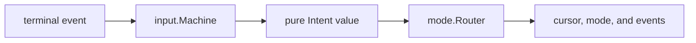
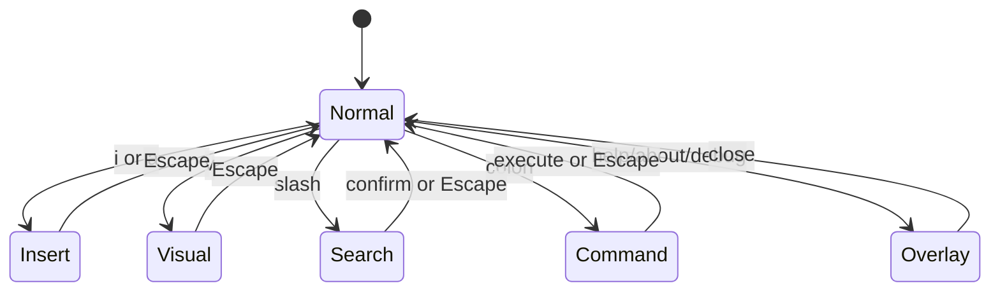

# Input, Modes, and Commands

The interaction layer deliberately separates terminal key decoding from game
behavior. `internal/input` parses host events into engine-independent semantic
intents; `internal/mode` applies those intents to the world while holding its
update lock.

## 1. Input pipeline



The terminal service polls in its own goroutine and writes to a bounded event
channel. The application input loop passes events to `input.Machine`, which
maintains only parsing context. The router owns engine-aware state such as
selection anchors, search results, history, undo, macros, mouse holds, and
auto-fire. It drives only the roster's selected local cursor; `CursorSystem`
applies and announces placement so live input, replay, bots, and remote
producers share the same entity-owned path.

`Intent` is a data structure, not a callback. It includes intent type, motion,
operator, special action, target mode, count, optional character, captured
command text, and a flag identifying macro playback. This boundary makes the
parser testable without constructing an ECS world.

## 2. Modes



| Mode | Purpose | Simulation behavior |
|---|---|---|
| Normal | Motions, counts, operators, find/search repeat, actions, macros. | Continues unless the game was separately paused. |
| Visual | Select a characterwise range from an anchor and apply delete operations. | Continues; active shield bounds are exposed as the selection/ping boundary. |
| Insert | Type glyphs at the cursor; arrows move; Delete/Space/Backspace support edit-like deletion. | Continues in real time. |
| Search | Edit and confirm a forward search pattern; `n`/`N` repeat later. | Uses text-entry routing. |
| Command | Edit and execute a colon command with history. | Pauses while the command line is active. |
| Overlay | Navigate help, about, or debug content. | Pauses while the overlay owns input. |

Escape resets pending parser state and normally returns to Normal. Command and
overlay completion coordinate their own pause result so a command such as
`:new`, `:help`, or `:debug` can intentionally keep the game paused until its
follow-up state is ready.

## 3. Normal-mode grammar

The parser implements a focused Vim-like grammar rather than forwarding raw
key sequences:

```text
[count] motion
[count] d [count] motion
[count] d d
[count] f|F|t|T character
[count] d f|F|t|T character
g command
g direction color
q register / @ register
```

The internal parser states are idle, numeric count, character wait, operator
wait, operator-character wait, `g` prefix, operator-`g` prefix, marker color
wait, macro-record register wait, macro-play register wait, and infinite macro
wait. Invalid continuations cancel the pending grammar rather than leaking a
partial action into the game.

Counts begin with `1` through `9`; `0` continues an existing count but is a line
motion when idle. Operator and motion counts compose. Motions are clamped by map
bounds and apply game-specific definitions of words, paragraphs, columns, and
screen positions over the glyph grid.

## 4. Default bindings

### Global and action keys

| Key | Action |
|---|---|
| `Ctrl-Q`, `Ctrl-C` | Quit. |
| `Ctrl-S` | Cycle audio mute state. |
| `Esc` | Cancel pending input or return toward Normal mode. |
| Arrow keys | Move in the applicable mode. |
| `Tab` | Jump to the active nugget. |
| `Shift-Tab` | Jump to the first remaining gold character. |
| `Enter` in Normal | Fire main weapons. |
| `Backspace` in Normal | Fire the special weapon path. |
| `Space` in Normal | Fire the special weapon path. |
| `PageUp`, `PageDown` | Half-page vertical motion; page overlays when an overlay owns input. |

### Normal motions

| Keys | Motion |
|---|---|
| `h j k l` | Left, down, up, right. |
| `H J K L` | Half-page left, down, up, right. |
| `w W` | Next word / next whitespace-delimited WORD. |
| `b B` | Previous word / WORD. |
| `e E` | End of word / WORD. |
| `0 ^ $` | Line start, first non-whitespace, line end. |
| `[ O` / `] o` | Previous / next occupied column target. |
| `M m G` | Vertical middle, horizontal middle, screen bottom. |
| `{ }` | Previous / next paragraph. |
| `%` | Matching bracket. |
| `f F t T` + character | Find/till forward or backward. |
| `; ,` | Repeat the last find in the same or opposite direction. |

### Prefixes, editing, and modes

| Keys | Action |
|---|---|
| `gg` | Screen top. |
| `go`, `g$`, `gm` | Map origin, map end, map center. |
| `gh`, `gj`, `gk`, `gl` then `r`, `g`, or `b` | Show and jump to a red, green, or blue glyph in that direction. Repeating the direction key uses its repeat behavior. |
| `d` + motion | Delete the motion range. |
| `dd` | Delete the current line. |
| `x`, `D` | Delete current glyph / through line end. |
| `u` | Cursor-motion undo. |
| `i`, `a` | Enter Insert at the cursor / after it. |
| `v` | Enter Visual mode. |
| `/` | Enter Search mode. |
| `:` | Enter Command mode. |
| `n`, `N` | Repeat search forward/backward. |

The implementation is Vim-inspired, not an attempt to reproduce every Vim
edge case. Commands operate on the two-dimensional game grid and delete glyph
entities, so behavior around empty cells, camera edges, and composites is
defined by Vi-Fighter's motion/operator code.

## 5. Insert, search, and command text editing

Printable Insert input becomes `EventCharacterTyped`. Arrow/Home/End/Page keys
remain navigation. Delete removes the current glyph. Insert-mode Space and
Backspace use forward/back deletion semantics in addition to moving the cursor.

Search and Command keep their own editable rune buffers and cursor positions.
Home/End and Left/Right edit the line; Up/Down browse command history in Command
mode. Search remembers its last pattern and find commands remember their last
target/direction for `n`, `N`, `;`, and `,`.

The router retains up to 256 cursor undo positions and 256 command-history
entries. These are session interaction structures, not persisted editor files.

## 6. Macros

Macros record semantic intents after parsing, so they replay the same actions
even when they contain multi-key motions or commands.

| Sequence | Behavior |
|---|---|
| `qa` ... `q` | Record into register `a`; an empty recording clears it. |
| `@a` | Play register `a` once. |
| `3@a` | Play it three times. |
| `@@a` | Play it indefinitely. |
| `@@@` | Play every non-empty register indefinitely. |
| `q` + playing register | Stop that register's playback. |
| `q@` or `Ctrl-@` | Stop all playback. |

Registers are lowercase `a` through `z`. Different registers can play
concurrently. The 16 ms input ticker polls playback; each active register emits
at most one intent when its 250 ms playback interval has elapsed. Simultaneous
work is ordered by playback start time. Recorded intents originating from
playback are marked, preventing recursive re-recording and excluding synthetic
activity from APM.

Macro state resets on both `:new` and `:new!` and is not saved across process
runs. Other operator preferences have a different reset contract below.

## 7. Mouse and automatic fire

When terminal mouse reporting is enabled:

| Input | Behavior |
|---|---|
| Left press | Move the cursor to the translated map cell and fire main. |
| Left drag | Continue moving the cursor. |
| Held left | Repeat main fire at the shared repeat interval. |
| Right press/hold | Fire/repeat special without moving first. |
| Wheel | Move the cursor using the event coordinates. |
| Bare motion | Move only when free-mouse mode is enabled. |

`:mouse enable|disable|free` controls reporting and free motion. `:free` is a
short toggle for free mouse motion. Input is ignored while suspended, in
Command mode, or where pause/overlay policy blocks it.

Auto-fire independently requests main and special firing at its interval and
is enabled by default for a new process. `:auto [on|off]` changes it. Held-button
and auto-fire deadlines share de-duplication so both do not fire the same path
twice in one cooldown slot.

## 8. APM signal

APM exists to drive adaptive music, not to score macros or raw device event
rate. The router admits player intents through a weighted gate:

- macro-playback and automatic actions are excluded;
- identical actions within 250 ms are dropped; later repeats have lower weight;
- raw mouse movement is sampled at most every 150 ms;
- admission is capped at the equivalent of five full actions per second.

`GameState` publishes a 60-second APM and a five-second music APM. The music
system maps the short window to tempo and intensity; see [Audio](audio.md).

## 9. Command mode

The command dispatcher recognizes aliases shown in the first column.

| Command | Purpose |
|---|---|
| `:quit`, `:q` | Exit. |
| `:new`, `:n` | Reset simulation state; keep operator preferences. |
| `:new!` | Reset and purge free-mouse, auto-fire, speed, debug HUD, and pins. |
| `:help`, `:h`, `:?`; `:about` | Open overlays. |
| `:content` | Show corpus telemetry. |
| `:free [on\|off]`, `:auto [on\|off]` | Toggle free mouse and auto-fire. |
| `:mouse enable\|disable\|free` | Control terminal mouse input. |
| `:system <runtime-name> enable\|disable` | Toggle a system that honors meta-system commands. |
| `:flow [group]`, `:graph [group]` | Toggle navigation flow-field or route-graph debug views. |
| `:speed [rate\|+\|-\|reset]`, `:sp` | Report or set the rational simulation rate. |
| `:step [n]`, `:st` | Pause and advance complete ticks. |
| `:step [rate] fsm [region] [pause]` | Run until an FSM transition, optionally pausing there. |
| `:step [rate] ev <Event> [pause]` | Run until the named event is dispatched. |
| `:step off` | Disarm run-until and restore 1x. |
| `:region list\|spawn\|pause\|resume\|terminate ...` | Issue one scheduler-owned region primitive. |
| `:log ...` | Start/stop logging; set level/scope and snapshot period. |
| `:log rec [ticks\|flush\|fsm [on\|off]]` | Configure, request, or transition-trigger the flight recorder. |
| `:debug [save]` | Open debug overlay or write a point-in-time status snapshot. |
| `:emit <EventName> [{ TOML payload }]` | Construct and publish a registered event for testing. |
| `:energy <value>`, `:heat <0-100>`, `:boost` | Directly manipulate player state for development. |
| `:god`, `:demon` | Apply high positive/negative energy test states. |
| `:blossom`, `:decay`, `:cleaner`, `:dust` | Trigger effect/gameplay events directly. |

The event registry validates `:emit` names and uses generated payload type
metadata to decode optional inline TOML. Commands below the first six rows are
primarily developer/authoring controls and can substantially alter a live run.

Free-mouse and auto-fire preferences, time scale, debug HUD visibility, and
pinned overlay cards are operator-owned and survive plain `:new`. Both reset
forms clear macros and transient command/overlay state. `:new!` additionally
turns the two preferences off, restores 1x, and clears HUD/pins. Logging state
is process diagnostic configuration and survives both forms.

Debug cards contain at most 15 metrics. Empty player slots are omitted until
they become active. A clipped selected card consumes `j`/`k` scroll steps before
selection moves beyond it; page motions still move by viewport rows. The live
HUD starts at the viewport's top-left and wraps pinned cards into columns. If
the viewport cannot fit every whole card, a `hidden` line names the omitted
groups; the HUD intentionally has no focus or navigation mode of its own.

Replay terminal keys are not entries in this command table or the keymap. A
`ModeReplay` App reserves `SPACE . + - h j k l 0 q` for viewer pause, step,
speed, pan/reset, and quit; those keys never become simulation intents.

System control uses `System.Name()`. Generation and tests require it to equal
the manifest key so authored configuration and runtime diagnostics agree.

## 10. Keymap override files

Resolution order is:

1. path passed with `-k`;
2. `./keymap.toml`;
3. the user configuration path;
4. compiled defaults.

An override is sparse: unspecified bindings retain defaults. The accepted TOML
sections are:

| Section | Key form | Context |
|---|---|---|
| `[normal]` | one rune, `space`, or `backslash` | Normal-mode rune bindings. |
| `[normal_keys]` | terminal key name | Normal/global special keys. |
| `[operator]` | rune | Motions accepted after `d`. |
| `[prefix_g]` | rune | Second key after `g`. |
| `[overlay]` | rune | Overlay rune bindings. |
| `[overlay_keys]` | terminal key name | Overlay special keys. |
| `[text_keys]` | terminal key name | Insert/Search/Command navigation/edit keys. |

Values are canonical action names from `internal/input/actionnames.go`. Use
`"none"` to unbind a default. Unknown sections are ignored by the explicit
section reader, while invalid key or action names inside supported sections
fail loading.

```toml
[normal]
space = "fire_main"
v = "none"

[normal_keys]
backspace = "undo"

[prefix_g]
m = "motion_origin"
```

## 11. Change checklist

When adding interaction behavior:

1. Add or reuse a semantic intent; do not embed an engine callback in the key
   table.
2. Extend parser state only when the action requires a multi-key grammar.
3. Route the intent under the world lock and emit a domain event where another
   system owns the effect.
4. Add the canonical action to the action registry if it is remappable.
5. Update default mappings, help overlay content, keymap examples, and tests
   together.
6. Decide explicitly whether the action counts toward APM, can be recorded, can
   run from playback, and is allowed while paused.

## 12. Source map

| Concern | Primary source |
|---|---|
| Intent/parser types | `internal/input/intent.go`, `state.go`, `machine.go` |
| Bindings and overrides | `internal/input/keytable.go`, `actionnames.go`, `keyconfig.go` |
| Mode routing | `internal/mode/router.go`, `actions.go`, `motions*.go`, `operators.go` |
| Search | `internal/mode/search.go` |
| Commands | `internal/mode/commands.go` |
| Macros | `internal/mode/macro.go` |
| APM | `internal/parameter/apm.go`, `internal/engine/game_state.go` |
