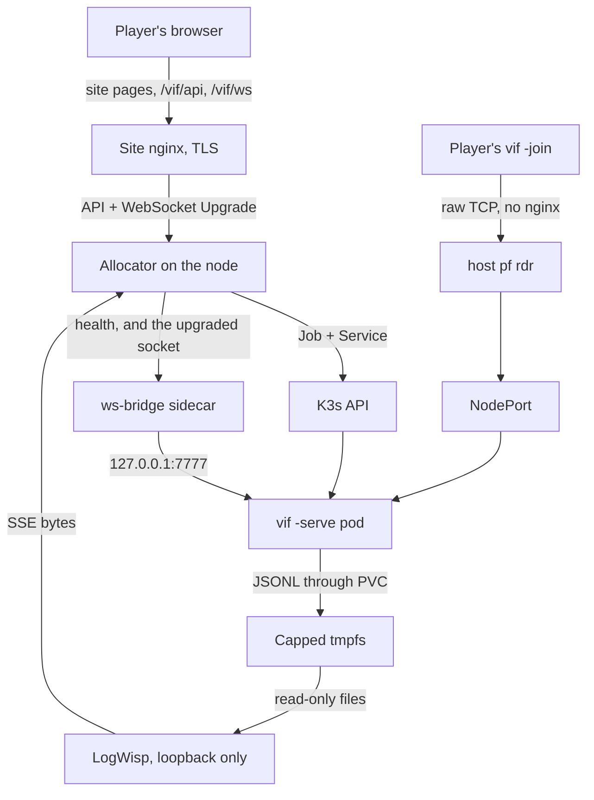

# Deploying the session fleet

A website asks for a game, one container appears on a K3s node, a player dials it,
and it ends itself when nobody is in it.

| You want to | Run |
|---|---|
| Deploy a change to a running node | `git pull && ./deploy/update.sh --diff && ./deploy/update.sh` |
| Operate it: status, drain, allocate, logs | [`deploy/runbook.md`](../deploy/runbook.md) |
| Commission a new node | this document, §3 to §14, once |

`deploy/update.sh` brings every component to the checkout's HEAD — K3s objects,
scenario volume, bridge image, session image, allocator, LogWisp — skipping what is
current and showing each change as a diff first. The design and open work behind
the fleet are [the fleet plan](kubernetes-fleet.md); where each host artifact lands
and how to back one out is [`deploy/guest/README.md`](../deploy/guest/README.md).

The production node is an Arch Linux guest on a FreeBSD host that owns routing and
packet filtering. The host, its `pf`, and the site's nginx are site configuration
kept outside this repository; §2 and §12 state only what they must provide.

## 0. Decisions

| # | Decision |
|---|---|
| D1 | **One node, no registry.** Images are imported straight into the node's containerd and every session container uses `imagePullPolicy: IfNotPresent`. |
| D2 | **Docker is a build tool, not a runtime.** K3s runs its own containerd; Docker is started for a session-image or LogWisp build and disabled afterwards, because its `iptables` rules share a table with K3s's. |
| D3 | **Cluster commands run through `sudo kubectl`.** K3s's kubeconfig stays root-readable (mode `0640`); never copy it to a login user. |
| D4 | **The vif JSON line is the log contract.** Records originate in `internal/vlog` and every hop preserves those bytes; nothing reads a Kubernetes pod log. |
| D5 | **The allocator runs on the node.** It needs the K3s API and node-local access to the pod probes; port 6443 never leaves the node. |
| D6 | **The session transports are unauthenticated.** Anyone who can reach a forwarded port or the browser route can join; the forwarded surface and the application limits are the controls (fleet plan §4). |

## 1. The shape



The native game transport is raw framed TCP, not HTTP, so it never enters nginx. A
session is a thing that ends, so it is a Job, not a Deployment. The allocator
hands a player three opaque strings and nothing may rebuild one from a port:

| String | What it is | Who reads it |
|---|---|---|
| `https://<site-host>/projects/vif/session/<id>/` | The shareable page. | A browser. |
| `<site-host>:31703` | Raw framed TCP straight to the session's forwarded port. | `vif -join`. |
| `wss://<site-host>/vif/ws/<session>` | The browser route, through the site and the allocator to the pod's bridge. | The WASM build. |

The coordinator speaks first and a plaintext game connection names no session, so
the destination port is the whole of the native routing: ten NodePorts for ten
sessions, and the deployed session sets no `-name`.

## 2. The public edge

Site configuration, kept outside this repository. What it must provide:

| Requirement | Why |
|---|---|
| Forward TCP 31700–31709, and only those, to the node | The whole player-facing native surface. 7778, 8081 and 6443 are unauthenticated operational data and never leave the node. |
| Do not rewrite the source address | Services use `externalTrafficPolicy: Local` and the session's admission limiter keys on the dialling address. |
| Keep established TCP mappings for hours | A session holds one long-lived connection per player and heartbeats every ten seconds. |
| Admit the site host to the node's 9080 | The allocator's API and browser route, reached only through the site's nginx (§12). |

Test the public ports from a machine off the host: host-originated traffic bypasses
a `rdr` and can return an RST that looks like a filter rejection.

## 3. Node prerequisites

Record every version with the deployment. Then one package set covers the procedure:

```sh
uname -a; findmnt -no FSTYPE /sys/fs/cgroup   # expect: cgroup2fs
sudo pacman -Syu --needed \
  curl git go jq make python util-linux iptables-nft conntrack-tools \
  ethtool tcpdump nftables docker
sudo systemctl enable --now systemd-timesyncd
```

(Ubuntu: the same set through `apt-get`, with `golang-go`, `python3`, `iptables`,
`conntrack` and `docker.io`.) Add `rust` only on a node with no websocat package
(§8.1).

Swap off, and staying off — mask a zram generator's unit, not just `fstab`:

```sh
systemctl list-unit-files --no-legend 'dev-zram*.swap' |
  while read -r unit _; do sudo systemctl mask --now "$unit"; done
sudo swapoff -a && sudo sed -i '/\sswap\s/s/^/#/' /etc/fstab
free -m                                    # expect: Swap total 0
```

Pod networking needs both modules and both sysctls:

```sh
printf 'overlay\nbr_netfilter\n' | sudo tee /etc/modules-load.d/k3s.conf
sudo modprobe overlay br_netfilter
printf 'net.ipv4.ip_forward=1\nnet.bridge.bridge-nf-call-iptables=1\n' \
  | sudo tee /etc/sysctl.d/99-k3s.conf
sudo sysctl --system
```

Clone the repository once and run everything below from its root. Size the node
for the host, the OS and K3s plus ten sessions at their 192 MiB limit (1.9 GiB,
held by [`10-quota.yaml`](../deploy/k3s/10-quota.yaml)) and the 256 MiB log tmpfs.

## 4. Docker, for builds only

```sh
sudo usermod -aG docker "$USER"            # log out and back in
sudo systemctl disable --now docker.service docker.socket containerd.service
```

That is the baseline every build helper restores (D2). Docker sets the `FORWARD`
policy to `DROP` on start, which severs NodePort traffic, and a stop does not undo
it; the helpers set it back to `ACCEPT`. After any manual Docker use:

```sh
sudo iptables -S FORWARD | head -1         # expect: -P FORWARD ACCEPT
```

## 5. K3s

```sh
curl -sfL https://get.k3s.io | INSTALL_K3S_VERSION=v1.34.6+k3s1 sh -s - \
    --write-kubeconfig-mode 0640 \
    --disable traefik \
    --disable servicelb \
    --secrets-encryption \
    --kube-apiserver-arg=service-node-port-range=31700-31709
sudo k3s check-config
sudo kubectl get nodes -o wide
```

Traefik and servicelb have nothing to route: sessions are raw TCP on NodePorts. The
NodePort range is exactly the ten ports §2 forwards, so the API server refuses a
session anywhere else. Network policy stays enabled — `20-networkpolicy.yaml` is
load bearing.

## 6. The node's own filter

The host decides who reaches the node from the Internet; this decides what reaches
it from its own network. **Never `flush ruleset`**: K3s and Docker program their
rules through `iptables-nft` into ordinary nftables tables, and a flush destroys
them. [`deploy/guest/nftables.conf`](../deploy/guest/nftables.conf) owns one table,
`inet vif`, and nothing else.

Take the operator address and SSH port from the live session, then install behind a
timed rollback and open a second SSH connection before cancelling it:

```sh
set -- $SSH_CONNECTION
[ "$#" -eq 4 ] || { echo 'SSH_CONNECTION is unavailable'; exit 1; }
sudo install -d -m 0755 /etc/nftables.d
printf 'define operator_addr = %s\ndefine operator_ports = { %s }\n' \
  "$1" "$4" | sudo tee /etc/nftables.d/vif-operator.nft

sudo install -m 0644 deploy/guest/nftables.conf /etc/nftables.conf
sudo nft delete table inet filter 2>/dev/null || true
sudo systemd-run --on-active=20m --unit=nft-rollback /usr/bin/nft delete table inet vif
sudo nft -f /etc/nftables.conf
sudo systemctl enable nftables
sudo systemctl stop nft-rollback.timer     # from the second connection
```

`sudo nft list ruleset | grep '^table'` must show `inet vif` and the tables K3s
installed, and no `inet filter`: stock Arch can ship one with a `forward` hook and
`policy drop`, which blackholes NodePort traffic while everything else keeps
working. Treat an Arch `/etc/nftables.conf.pacnew` as hostile. §11 adds 9080 to
`operator_ports`.

## 7. The node's log tmpfs

Sessions write `<session-id>.jsonl` to a 256 MiB tmpfs through a node-affine local
PV, and K3s is made to *require* the mount, so a failed mount cannot fall through
to root storage:

```sh
MOUNT_UNIT='var-log-vif\x2dfleet.mount'
sudo install -D -m 0644 deploy/guest/vif-fleet.sysusers /etc/sysusers.d/vif-fleet.conf
sudo systemd-sysusers /etc/sysusers.d/vif-fleet.conf
test "$(id -u vif-fleet)" = 65532 && test "$(id -g vif-fleet)" = 65532
sudo install -D -m 0644 "deploy/guest/$MOUNT_UNIT" "/etc/systemd/system/$MOUNT_UNIT"
sudo install -D -m 0644 deploy/guest/k3s.service.d/10-vif-fleet-logs.conf \
  /etc/systemd/system/k3s.service.d/10-vif-fleet-logs.conf
sudo install -D -m 0644 deploy/guest/vif-fleet-log-cleanup.py /usr/local/libexec/vif-fleet-log-cleanup.py
sudo install -D -m 0644 -t /etc/systemd/system \
  deploy/guest/vif-fleet-log-cleanup.service deploy/guest/vif-fleet-log-cleanup.timer
sudo systemctl daemon-reload
sudo systemctl enable "$MOUNT_UNIT" vif-fleet-log-cleanup.timer
sudo systemctl restart k3s.service         # pulls the mount in; empty the fleet first on a live node
sudo systemctl start vif-fleet-log-cleanup.timer
findmnt -no TARGET,FSTYPE,SIZE,OPTIONS /var/log/vif-fleet
```

Expected: `tmpfs`, about `256M`, `nodev,nosuid,noexec`, mode `770`, owner `65532`.
The cleanup timer owns retention: two recent rotations per session, and nothing
older than the match ceiling.

## 8. The session image

```sh
./deploy/update.sh image
```

It builds the `vif_headless` profile once with Docker, refuses an image without the
`headless` OCI label, runs its own `-check` as UID 65532 read-only with no network,
imports it into K3s, records it as `VIF_ALLOCATOR_IMAGE`, removes older tags, and
restores the Docker baseline. Later runs rebuild only when `cmd`, `internal`,
`pkg`, `go.mod`, `go.sum` or the Dockerfile changed since the installed tag.

### 8.1 The browser bridge image

The browser route needs websocat as a sidecar image in every session pod: it is the
one process that speaks WebSocket, turning each upgraded connection into a loopback
TCP connection to the game. `./deploy/update.sh bridge` packages the websocat on
`PATH` (Arch: AUR) or, when there is none, builds the pinned GitHub release with
`deploy/guest/build-websocat.sh`. No Docker, no drain.

## 9. The fleet objects and the shared volumes

```sh
./deploy/update.sh objects wad             # namespace, quota, policy, Role; the scenario volume's files
```

The two local volumes are pinned to this node (`nodeAffinity` is immutable), so
`update.sh` reports a change to them and never applies one. Create them once:

```sh
NODE_NAME=$(sudo kubectl get nodes -o jsonpath='{.items[0].metadata.name}')
: "${NODE_NAME:?no node came back from kubectl}"
for f in 05-log-volume 07-wad-volume; do
  sed "s|\${NODE_NAME}|$NODE_NAME|g" "deploy/k3s/$f.yaml" | sudo kubectl apply -f -
done
sudo kubectl get pv vif-fleet-logs vif-fleet-wad    # values: ["<node>"], Available
```

`WaitForFirstConsumer` leaves both claims `Pending` until something mounts them.
Bind them with the checked-in probe, which loads a scenario through the wad claim
and writes a record through the log claim:

```sh
VIF_TAG=$(git rev-parse --short=8 HEAD)
sed -e "s|\${IMAGE}|docker.io/library/vif:$VIF_TAG|g" -e "s|\${SCENARIO}|main|g" \
  deploy/k3s/06-log-volume-check.yaml | sudo kubectl apply -f -
sudo kubectl -n vif wait --for=jsonpath='{.status.phase}'=Succeeded \
  pod/vif-log-volume-check --timeout=90s
sudo jq -r 'select(.fields.msg == "scenario") | .fields | "\(.name) \(.digest)"' \
  /var/log/vif-fleet/volume-check.jsonl                # main <digest>, not embedded
sudo kubectl -n vif delete pod vif-log-volume-check --wait=true
sudo find /var/log/vif-fleet -maxdepth 1 -name 'volume-check*.jsonl' -delete
```

`30-session.yaml` is a template, not an object: the allocator renders it per
session. Scenarios live on the node volume, not in the image, so
`./deploy/update.sh wad` changes what the fleet serves without a rebuild; a running
match keeps the tree it mounted.

## 10. LogWisp, the node log reader

One node service reads `/var/log/vif-fleet/*.jsonl` and serves SSE on loopback. It
holds no Kubernetes credential and is pinned to the upstream revision in
`deploy/logwisp/REVISION`, which must be reachable from upstream `main`:

```sh
./deploy/guest/install-logwisp.sh            # once; later: ./deploy/update.sh logwisp
systemctl is-active logwisp.service
test "$(sudo ss -ltnH 'sport = :8081' | awk 'NR == 1 {print $4}')" = 127.0.0.1:8081
```

What the stream may lose is the `rate_limit` in
[`aggregator.toml`](../deploy/logwisp/aggregator.toml) and nothing else; §16 names
the symptoms of a queue below the burst or a pin older than the rotation fix.

## 11. The allocator

[`tool/vif-allocator`](../tool/vif-allocator/README.md) is the narrow HTTP boundary
between the site and the `vif` namespace, and the browser route's WebSocket proxy.
Its settings are [`deploy/guest/vif-allocator.env`](../deploy/guest/vif-allocator.env):
edit them there, never on the node. First install, after §9 applied its Role:

```sh
make allocator
getent group vif-allocator >/dev/null || sudo groupadd --system vif-allocator
id -u vif-allocator >/dev/null 2>&1 || sudo useradd --system \
  --gid vif-allocator --home-dir / --shell /usr/bin/nologin vif-allocator
sudo install -d -o root -g vif-allocator -m 0750 /etc/vif-allocator
sudo install -o root -g root -m 0755 bin/vif-allocator /usr/local/bin/vif-allocator
sudo install -o root -g vif-allocator -m 0640 \
  /var/lib/rancher/k3s/server/tls/server-ca.crt /etc/vif-allocator/server-ca.crt
{ cat deploy/guest/vif-allocator.env
  echo "VIF_ALLOCATOR_IMAGE=docker.io/library/vif:$(git rev-parse --short=8 HEAD)"; } |
  sudo install -o root -g vif-allocator -m 0640 /dev/stdin /etc/vif-allocator/allocator.env
sudo install -D -o root -g root -m 0755 deploy/guest/vif-allocator-refresh-token.sh \
  /usr/local/libexec/vif-allocator-refresh-token
sudo install -o root -g root -m 0644 -t /etc/systemd/system \
  deploy/guest/vif-allocator.service \
  deploy/guest/vif-allocator-token.service deploy/guest/vif-allocator-token.timer
sudo systemctl daemon-reload
sudo systemctl enable --now vif-allocator-token.timer vif-allocator.service
curl -fsS http://127.0.0.1:9080/readyz      # ok
```

The image line names the tag §8 imported. From then on, `./deploy/update.sh
allocator` rebuilds, installs the env file and unit, restarts behind an empty-fleet
gate, and keeps one `.previous` set to roll back to.

The credential is a short-lived ServiceAccount token in a file, re-read on every
request and rotated by the root timer; never give the allocator the node's root
kubeconfig. Open 9080 to the site host only, in `/etc/nftables.d/vif-operator.nft`
(`define operator_ports = { 22, 9080 }`), then `sudo systemctl restart nftables`.
There is deliberately no public delete endpoint: an anonymous caller must not end
somebody else's match.

## 12. The site's front door

Site configuration, kept outside this repository.
[`deploy/website/vif.nginx.example`](../deploy/website/vif.nginx.example) is the
reference: the exact `/vif/api/sessions` and `/vif/api/logs` locations, the
`/vif/ws/<session>` Upgrade location with its rate limits keyed on
`$proxy_protocol_addr`, and no `/healthz` or `/readyz`. Three properties decide
whether it works: `Upgrade` and `Connection` forwarded for the browser route,
buffering off with an hour-long read timeout for the streams, and `Origin`
untouched — the allocator compares it against `VIF_ALLOCATOR_WEB_ORIGIN`. The
page's `connect-src 'self'` is what permits the same-origin socket.

The launcher is [`web/`](../web), copied to the site as it stands together with the
`vif.wasm` that `make wasm` writes; editing a path in it forks the launcher.

## 13. First session

The acceptance check for the node, and the one to repeat after any change to a live
workload, the allocator, the Role, the mount or LogWisp. Have `bin/vif` ready on a
second machine: **the 90-second first-join clock starts when `allocate` returns.**

```sh
curl -fsS http://127.0.0.1:9080/readyz && ./deploy/k3s/session.sh blockers &&
  SESSION_ID=$(./deploy/k3s/session.sh allocate)
bin/vif -join '<join target>'                    # on the second machine, at once
./deploy/k3s/session.sh state "$SESSION_ID"     # phase=occupied, guests>=1
```

Where the browser route is published, check it in the same window, from off the
node, against `https://<site-host>/vif/ws/<session>`:

```sh
ws=https://<site-host>/vif/ws/<session-id>
code() { curl -o /dev/null -sw '%{http_code}\n' "$@"; }
code "$ws"                                                           # 400
code -H 'Connection: Upgrade' -H 'Upgrade: websocket' \
     -H 'Origin: https://elsewhere.example' "$ws"                    # 403
code -H 'Connection: Upgrade' -H 'Upgrade: websocket' -H 'Origin: https://<site-host>' \
     -H 'Sec-WebSocket-Version: 13' -H 'Sec-WebSocket-Key: AAAAAAAAAAAAAAAAAAAAAA==' "$ws"   # 101
```

Then prove the policy is enforced and the node is exempt from it, with the session
still live:

```sh
POD_IP=$(sudo kubectl -n vif get pod -l app.kubernetes.io/component=session \
  -o jsonpath='{.items[0].status.podIP}')
: "${POD_IP:?no session pod is running}"
bash -c "</dev/tcp/$POD_IP/7777" && echo "node -> 7777 open"
bash -c "</dev/tcp/$POD_IP/7779" && echo "node -> 7779 open"
sudo kubectl -n default run np-probe --rm -i --restart=Never --image=busybox --quiet \
  --command -- sh -c "for p in 7777 7778 7779; do nc -zw2 $POD_IP \$p && echo \$p open || echo \$p refused; done" </dev/null
```

Expect both node lines, then `7777 open`, `7778 refused`, `7779 refused`. All open
means NetworkPolicy is not enforced; a node line failing means node traffic is not
exempt, and `20-networkpolicy.yaml` names the `ipBlock` fix.

Quit the client, read the session's file before it goes, then delete:

```sh
sudo jq -s -e --arg id "$SESSION_ID" 'map(select(.sub != null)) | length > 0 and
  all(.[]; .fields.session_id == $id)' "/var/log/vif-fleet/$SESSION_ID.jsonl"
./deploy/k3s/session.sh delete "$SESSION_ID"
./deploy/k3s/session.sh status                   # the fleet is empty, five active units
```

If it fails, separate the allocator from the workload: `session.sh create` renders
the same template without the allocator.

```sh
FIRST_JOIN=20m EMPTY_GRACE=20m ./deploy/k3s/session.sh create s1 31700 \
  "docker.io/library/vif:$(git rev-parse --short=8 HEAD)"
./deploy/k3s/session.sh delete s1
```

A pod's `/health` answers on its pod IP without a Service:
`curl -fsS "http://$POD_IP:7778/health"`. Read its words — `live`, `ready`,
`phase` — rather than a moving tick: a vacant pod is `ready=true clock=paused`.

## 14. The reboot gate

A reboot ends every match. Drain, reboot, and check the six things a reboot can
undo, then run §13 again:

```sh
./deploy/k3s/session.sh drain && sudo systemctl reboot
# after reconnecting:
sudo kubectl get nodes -o wide                  # Ready
free -m                                         # Swap total 0
sudo nft list ruleset | grep '^table'           # inet vif, no inet filter
sudo iptables -S FORWARD | head -1              # -P FORWARD ACCEPT
findmnt -no TARGET,FSTYPE,SIZE /var/log/vif-fleet
./deploy/update.sh --diff                       # every component current
./deploy/k3s/session.sh status
```

## 15. Operating

Day-to-day is [`deploy/runbook.md`](../deploy/runbook.md). One line ends every
session and names why:

```json
{"msg":"session ended","phase":"expired","reason":"roster empty for 1m30s","guests":0,"tick":240}
```

`reason` is `no guest connected within …`, `roster empty for …`, `drained`,
`drain deadline … reached holding N guest(s)`, or an operator's cause. Sessions
expiring with `no guest connected` far more often than players report failed joins
is a broken path between the page and the forwarded range; start at the
EndpointSlice and walk outward with §16. Open work is the fleet plan's
[work list](kubernetes-fleet.md#3-work-list).

## 16. Troubleshooting

### When the boundary looks wrong

The namespace, quota, policy and Role are whatever the four files in §9 say, and
the session pod is whatever `30-session.yaml` says. These assertions name which one
drifted; none of them belongs in a deployment that is going well.

Restricted admission must refuse a privileged pod and a direct `hostPath`:

```sh
sudo kubectl -n vif run pstest --image=busybox --restart=Never \
    --overrides='{"spec":{"containers":[{"name":"c","image":"busybox","securityContext":{"privileged":true}}]}}'
# expect: forbidden ... violates PodSecurity "restricted"

sudo kubectl create --dry-run=server -f - <<'YAML'
apiVersion: v1
kind: Pod
metadata: {name: vif-hostpath-must-fail, namespace: vif}
spec:
  restartPolicy: Never
  automountServiceAccountToken: false
  securityContext: {runAsNonRoot: true, seccompProfile: {type: RuntimeDefault}}
  containers:
    - name: check
      image: registry.k8s.io/pause:3.10
      securityContext:
        allowPrivilegeEscalation: false
        readOnlyRootFilesystem: true
        runAsNonRoot: true
        capabilities: {drop: ["ALL"]}
      volumeMounts: [{name: forbidden, mountPath: /forbidden, readOnly: true}]
  volumes:
    - name: forbidden
      hostPath: {path: /var/log/vif-fleet, type: Directory}
YAML
# expect: a refusal naming restricted / hostPath
sudo kubectl -n vif delete pod pstest --ignore-not-found
```

The allocator must be able to allocate without being able to read a Secret or a pod
log:

```sh
for check in \
  'create jobs.batch:yes' 'delete jobs.batch:yes' 'create services:yes' \
  'list services:yes' 'get pods:yes' 'list endpointslices.discovery.k8s.io:yes' \
  'get secrets:no'
do
  verb=${check%:*}; want=${check#*:}
  got=$(sudo kubectl auth can-i $verb \
    --as=system:serviceaccount:vif:vif-allocator -n vif)
  test "$got" = "$want" || printf 'RBAC DRIFT: %s = %s, want %s\n' "$verb" "$got" "$want"
done
test "$(sudo kubectl auth can-i get pods --subresource=log \
  --as=system:serviceaccount:vif:vif-allocator -n vif)" = no
```

A live session's Job must carry exactly the shape the template describes — one
container, no token, no `hostPath`, no `-log-stdout`, the PVC mounted only in the
game container, and its own session id on the command line:

```sh
sudo kubectl -n vif get job "vif-session-$SESSION_ID" -o json |
  jq -e --arg id "$SESSION_ID" '
    .spec.template.spec as $pod |
    ($pod.automountServiceAccountToken == false) and
    ($pod.containers | length == 1) and
    ($pod.containers[0].name == "session") and
    ($pod.containers[0].args | index("-l=/var/log/vif-fleet") != null) and
    ($pod.containers[0].args | index("-log-session-id=" + $id) != null) and
    ($pod.containers[0].args | index("-log-stdout") == null) and
    any($pod.containers[0].volumeMounts[]?;
      .name == "fleet-logs" and .mountPath == "/var/log/vif-fleet") and
    any($pod.volumes[]?;
      .name == "fleet-logs" and
      .persistentVolumeClaim.claimName == "vif-fleet-logs") and
    all($pod.volumes[]?; has("hostPath") | not) and
    all($pod.initContainers[]?; ((.volumeMounts // []) | length) == 0) and
    ($pod.containers[0].securityContext.allowPrivilegeEscalation == false) and
    ($pod.containers[0].securityContext.readOnlyRootFilesystem == true) and
    ($pod.containers[0].securityContext.runAsNonRoot == true) and
    ($pod.containers[0].securityContext.capabilities.drop | index("ALL") != null)'
```

LogWisp must hold the tmpfs read-only through the group alone, run the files the
repository holds, and depend on neither K3s nor the allocator:

```sh
LOGWISP_PID=$(systemctl show logwisp.service -p MainPID --value)
sudo grep '^Groups:' "/proc/$LOGWISP_PID/status" |
  grep -Eq '(^|[[:space:]])65532([[:space:]]|$)'
sudo nsenter -t "$LOGWISP_PID" -m -- \
  findmnt -no TARGET,FSTYPE,OPTIONS /var/log/vif-fleet
sudo cmp -s deploy/logwisp/aggregator.toml /etc/logwisp/vif-fleet.toml
sudo cmp -s deploy/guest/logwisp.service /etc/systemd/system/logwisp.service
systemctl show logwisp.service -p Requires -p Wants -p After
unset LOGWISP_PID
```

The host `findmnt` stays `rw`; inside LogWisp's mount namespace the final entry for
that target must contain `ro`. `RequiresMountsFor=` may add a mount requirement,
but `Requires`, `Wants` and `After` must not name `k3s.service` or
`vif-allocator.service`.

NetworkPolicy enforcement is per-pod and cannot be seen before a pod exists. K3s
embeds the kube-router controller in the `k3s` process, so there is no
`kube-router` pod to find; the proof is a counter delta across one connection, not
the existence of the API object:

```sh
sudo iptables-save -c | grep 'KUBE-POD-FW-'
# Make one game-port connection, then repeat and confirm a counter moved.
```

### When a join does not arrive

**Walk outward from the pod, never inward from the Internet.** Each boundary names
one component; a single test from a browser combines all of them and names none.
These commands read a session that is live, so allocate one with an extended
`FIRST_JOIN` first (§13) and set `SESSION_ID` to its identity.
`bash -c "</dev/tcp/host/port"` is enough when `nc` is absent:

```sh
SERVICE="vif-session-$SESSION_ID"
sudo kubectl -n vif get endpointslice \
  -l "kubernetes.io/service-name=$SERVICE" -o wide
POD_IP=$(sudo kubectl -n vif get pod \
  -l "vif.lixenwraith.dev/session=$SESSION_ID" \
  -o jsonpath='{.items[0].status.podIP}')
CLUSTER_IP=$(sudo kubectl -n vif get svc "$SERVICE" -o jsonpath='{.spec.clusterIP}')

bash -c "</dev/tcp/$POD_IP/7777"          # pod route and policy
bash -c "</dev/tcp/$POD_IP/7779"          # the bridge, which no policy admits
bash -c "</dev/tcp/$CLUSTER_IP/7777"      # Service DNAT
bash -c "</dev/tcp/127.0.0.1/31700"       # local NodePort
bash -c "</dev/tcp/192.0.2.20/31700"      # node address and NodePort
```

From the FreeBSD host, test `192.0.2.20:31700`. Test the public address only from
an off-box machine (§2).

When a step does not answer, take counter snapshots immediately before and after
**exactly one** connection attempt. The last rule whose counter moves names the
component that handled the packet:

```sh
sudo iptables-save -c > /tmp/iptables.before
sudo nft list ruleset > /tmp/nft.before
# Make exactly one connection attempt here.
sudo iptables-save -c > /tmp/iptables.after
sudo nft list ruleset > /tmp/nft.after
diff -u /tmp/iptables.before /tmp/iptables.after
diff -u /tmp/nft.before /tmp/nft.after

sudo conntrack -L -p tcp | grep 31700
sudo tcpdump -ni cni0 'tcp port 7777'
```

Each row below was a dead end in the proof-of-concept run when it was not known:

| Observation | What it means |
|---|---|
| Nothing appears in the node's `input` drop log. | Expected for a NodePort SYN: kube-proxy DNATs it in `prerouting`, then routing sends it through `forward`, not `input`. |
| Every rule in `iptables-save -c` accepts, but the connection still fails. | Another nftables table can drop on the same hook. Only `nft list ruleset` shows every table — usually a surviving `table inet filter` with `policy drop` (§6). |
| One before/after attempt changes a counter. | The last moving rule identifies the component that handled the packet; take both `iptables-save -c` and `nft list ruleset` around one attempt. |
| Forward counters move but the tuple has no conntrack entry. | The packet was accepted for forwarding and dropped by another hook before the routing decision completed. |
| Traffic is visible on `cni0`. | It reached the pod side of routing. A moving `KUBE-POD-FW-*` counter proves the NetworkPolicy path ran. |
| A finished session first refuses and later times out. | While its Service exists with no endpoint, kube-proxy rejects; after Job TTL garbage-collects the Service, the node filter drops an unassigned port. |
| A pod shows `0/2` and never becomes Ready. | A pod is Ready only when every container is. A healthy session beside a second container in `ImagePullBackOff` reads as not Ready. |
| A create answers `504 session_not_ready` and the pod never leaves `Init`. | A sidecar that cannot start holds the containers after it. `kubectl -n vif describe pod` names the bridge image it could not pull: run `update-vif-ws-bridge.sh`. |
| The browser route answers `503 session_unreachable` while `vif -join` works. | The allocator reached the pod's `/health` and not its 7779. The bridge is the difference: read its container's state, then test `$POD_IP/7779` above. A refusal there with a running bridge is the policy case `20-networkpolicy.yaml` names. |
| The handshake answers `400` with no `Upgrade` reaching the allocator. | An edge that dropped the hop-by-hop headers. The `map` must be in the `http` context and both headers set in the location (§12). |
| A browser session ends after about thirty seconds of a full lobby. | A stream-layer `proxy_timeout` shorter than the game's ten-second heartbeat, or an idle-connection bound below it somewhere on the TLS path (§12). |
| A NodePort that answered before does not now. | `FORWARD` policy is `DROP`. Docker sets it and a stop does not restore it (§4). |
| The Docker build cannot resolve DNS. | The node ruleset does not accept `docker0`. Build with `--network host` (§8). |
| `kubectl auth can-i get pods/log` answers `yes`. | Positional `pods/log` parses as `TYPE/NAME`. Use `--subresource=log` (§9). |
| LogWisp shows no lines written before it started. | A watcher seeks to end-of-file on discovery. The source needs `from = "start"` (§10). |
| `dropped_writes` rises on `/status` with one reader and an idle node. | Records lost from a burst larger than `client_buffer_size`, not backpressure. Keep that queue at or above the `rate_limit` burst (§10). |
| The viewer's `duplicates` counter jumps, and live records thin out for a minute. | A session crossed the 8 MiB file cap. Pinned LogWisp older than the rotation fix replays the whole archive it renames, and the replay spends the rate limit (§10). |
| The viewer reconnects while the fleet is quiet, or its `reconnects` climbs on an idle node. | Pinned LogWisp older than the idle keepalive: a stream carrying nothing was idle-expired and evicted on the next record (§10). |
| `Watcher failed … watcher stopped` in LogWisp's journal. | Read only the invocation running the pinned binary (§10); earlier entries belong to whatever it replaced. |
| A build stops with `pinned revision is not an ancestor of LogWisp main`. | `deploy/logwisp/REVISION` names a pull-request head a squash merge discarded. Repin to the merged commit. |
| `curl` to `:9080` is refused right after `systemctl start`. | Only on an allocator that predates `Type=notify`; otherwise the bind has already happened and the refusal is real. |
| Testing the public address from the FreeBSD host returns an immediate RST. | Host-originated traffic bypasses `rdr`. Test from off-box, or test the node address directly (§2). |
