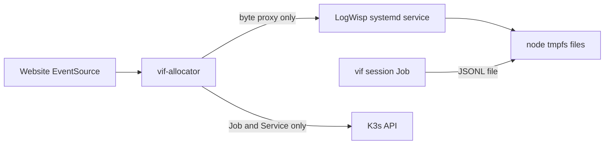

# Kubernetes fleet logging pivot: implementation plan

Status: approved direction, not yet deployed. This document is the source of
truth for the next implementation session. The currently deployed allocator and
session fleet remain on the stdout/CRI-log path until the migration gates below
pass.

The target is one direct, bounded file path from every game process to one
standalone LogWisp daemon on the Arch node. Kubernetes still creates and deletes
the session Jobs, but its API server is not in the log data path.

## 1. Starting point

The following is implemented and verified:

- one `vif -serve` process per K3s Job and one NodePort Service per session;
- the host-side `vif-allocator` creates, lists, probes, reconciles, and cleans up
  those objects;
- allocator liveness/readiness, an allocator-created session, an off-box join,
  and occupied/vacant state changes have passed;
- session JSON logs currently go to container stdout and are available through
  the CRI/Kubernetes pod-log path;
- `/vif/api/logs` deliberately returns `501 log_stream_not_configured`;
- `deploy/logwisp/aggregator.toml` describes an experiment, but LogWisp is not a
  child of the allocator and no node fan-in is deployed.

The old plan described pod-log following, JSON splicing, and a LogWisp child as
though those were allocator code to remove. They were never implemented. The
new work replaces that proposal; it does not refactor a running log pipeline.
Nor has ten-session load proved that K3s would be overwhelmed. The reason to
pivot now is that long-lived `pods/log` requests would put avoidable data traffic
and reconnect state through the control plane and make the allocator own an
unrelated stream processor.

This planning PR also adds `vif -log-session-id=<id>`. When present it:

- validates the ID as a DNS-safe lowercase alphanumeric-and-hyphen session name;
- adds `fields.session_id` to every application record emitted by `internal/vlog`;
- names the active file `<id>.jsonl` when the file sink is selected; and
- changes nothing when the flag is absent.

`fields.session_id`, rather than a new top-level key, is intentional. The suffix
also distinguishes the deployment ID from the existing RNG/replay payload key
named `session`. The existing
top-level `sub`, `run`, `tick`, and `frame` envelope is the stable contract used
by `vif-log`, and the current logging library has one string context slot already
used by `sub`. The public consumer can select `fields.session` without an
allocator rewrite. If a top-level `session` key later proves necessary, extend
`github.com/lixenwraith/log` with static envelope fields first; do not relocate
`sub` or splice serialized JSON.

## 2. Target shape



The control and data paths have separate owners:

| Concern | Owner |
|---|---|
| Allocate, probe, list, and delete session Jobs/Services | `vif-allocator` and K3s |
| Produce the log envelope and session tag | `vif` |
| Bound volatile node storage | systemd tmpfs mount and log cleanup unit |
| Discover/tail files, apply stream limits, serve SSE | standalone LogWisp |
| Preserve the same-origin public route | allocator byte proxy initially, nginx in front |
| Bound rows, reconnects, and rendering work | website |

The allocator will not fetch `pods/log`, parse JSON, insert fields, or supervise
LogWisp. Retaining `/vif/api/logs` as a thin reverse proxy keeps one guest-facing
HTTP boundary and the existing same-origin route. Direct nginx-to-LogWisp routing
can be reconsidered later, but is not needed for this migration.

Alternatives considered:

| Alternative | Decision |
|---|---|
| Tail kubelet/containerd CRI files on the node | Keeps stdout and Restricted admission, but couples the public feed to runtime-specific paths and CRI framing and still needs pod-to-session discovery. Keep as rollback architecture, not the target. |
| One LogWisp sidecar per session | Isolates files cleanly but multiplies processes, listeners, and memory for a ten-session fan-in. Drop it. |
| Direct `hostPath` in each Job | Simple data path, but Baseline and Restricted both reject it. Drop it. |
| Local PV/PVC backed by node tmpfs | Chosen: direct node files, no log API stream, one aggregator, and Restricted pod specs. |

## 3. Corrected storage decision

### 3.1 Keep Pod Security `restricted`

Do **not** change `deploy/k3s/00-namespace.yaml` to `baseline`. Kubernetes Pod
Security forbids `hostPath` in the Baseline policy, and Restricted includes every
Baseline restriction. Namespace Pod Security Admission has no per-volume
`hostPath` exemption.

Instead, expose the node directory through a statically provisioned local
PersistentVolume and one PersistentVolumeClaim. The pod spec mounts only a PVC,
which is an allowed Restricted volume type. The PV supplies the required node
affinity, so a future second node cannot schedule a writer away from the files.

References:

- [Pod Security Standards](https://kubernetes.io/docs/concepts/security/pod-security-standards/)
- [Local volumes](https://kubernetes.io/docs/concepts/storage/volumes/#local)
- [PersistentVolume node affinity](https://kubernetes.io/docs/concepts/storage/persistent-volumes/#node-affinity)

### 3.2 Fail closed onto tmpfs

The backing path is `/var/log/vif-fleet`, mounted as node tmpfs before K3s and
LogWisp start. The mount must have an explicit size and
`nodev,nosuid,noexec`; choose the size only after recording node RAM and the
measured ten-session log rate. Start with a candidate such as `256MiB`, not an
unbounded percentage.

Add these deployment artifacts:

- `deploy/guest/var-log-vif\x2dfleet.mount`, whose escaped name is required by
  systemd for the path;
- a K3s systemd drop-in with `Requires=` and `After=` on that mount;
- `deploy/k3s/05-log-volume.yaml` containing a no-provisioner StorageClass,
  local PV, and `vif` namespace PVC; and
- a bounded cleanup service/timer for rotated and completed-session files.

Do not use `hostPath.type: DirectoryOrCreate`. If the tmpfs mount fails, that
setting silently creates the directory on the root filesystem and converts a RAM
log into disk wear. K3s must remain stopped when the mount is absent.

The local PV should use:

```yaml
storageClassName: vif-node-log
accessModes: [ReadWriteOnce]
persistentVolumeReclaimPolicy: Retain
volumeMode: Filesystem
local:
  path: /var/log/vif-fleet
nodeAffinity:
  required:
    nodeSelectorTerms:
      - matchExpressions:
          - key: kubernetes.io/hostname
            operator: In
            values: ["${NODE_NAME}"]
```

`ReadWriteOnce` means one node, not one pod; all ten Jobs on this single node can
mount the claim. The PV capacity advertises scheduling capacity, while the tmpfs
`size=` option is the actual hard bound.

### 3.3 Explicit residual risk and lifecycle

All session containers currently run as UID/GID 65532. A shared writable claim
therefore lets a compromised session process read or alter another session's
public game log. These files are entertainment telemetry, not an audit trail or a
secret, so this is accepted for the first single-node version. K3s, kernel, host,
allocator, and LogWisp service logs remain outside the directory and must never
enter the public stream.

Before deployment, change the fleet logger policy so each process cannot run the
logging library's directory-wide retention against other sessions:

- retain a bounded per-file rotation size suitable for ten sessions;
- disable the per-process directory-wide total-size and retention deletion in
  commissioned (`-log-session-id`) mode;
- let the node cleanup unit delete rotated files after LogWisp has consumed them
  and delete inactive `<session>.jsonl` files after the four-hour Job ceiling plus
  a safety margin; and
- verify that full tmpfs causes bounded log drops while the game and health probe
  remain alive.

The tmpfs is intentionally empty after reboot. No match state is stored there.

## 4. Implementation batches

Each batch ends with the common game-session check in §5. Do not start a batch
that changes live objects while a Job is active.

### Batch A — finish the writer contract

1. Merge this planning/self-tagging PR and run the Go suite in an environment
   with the repository's Go toolchain.
2. Add commissioned-mode logger limits described in §3.3. Keep ordinary desktop
   logging unchanged.
3. Test both flag states:
   - absent: the filename and JSON schema are unchanged and `session` is absent;
   - present: the active filename is `<id>.jsonl`, every application record has
     `fields.session_id=<id>`, `fields.msg` remains the first payload key, and an
     unsafe or empty ID is refused.
4. Exercise rotation with two different IDs in one directory. Neither logger may
   delete, rename, or append to the other ID's active file.

Gate: no Kubernetes change until the writer collision and cross-session cleanup
tests pass.

### Batch B — provision volatile node storage

1. Record `free -h`, the K3s node name, and the filesystem ownership expected by
   UID/GID 65532. Put placeholders, never machine IPs, in repository docs.
2. Install and start the tmpfs mount unit. Add the K3s ordering drop-in, then
   restart K3s once during a declared maintenance window.
3. Apply `deploy/k3s/05-log-volume.yaml` with the real node name supplied at
   deployment time.
4. Verify the PV/PVC is Bound and the namespace still enforces Restricted.
5. Run a temporary Restricted test pod mounting the PVC as UID/GID 65532, write
   one JSONL file, observe it at the node path, then delete the pod and file.

Gate: `findmnt` reports tmpfs with the chosen cap, K3s depends on its mount unit,
the PVC is Bound, and a direct `hostPath` admission test remains rejected.

Rollback: stop K3s, remove only the K3s drop-in, unmount tmpfs, and restart K3s.
Do not delete a bound PV/PVC or unmount the path while a pod uses it.

### Batch C — switch session Jobs from stdout to files

Update both workload sources together:

- `tool/vif-allocator/manifest.go`, which is the live allocator path; and
- `deploy/k3s/30-session.yaml`, which is the human-readable/manual template.

The session container arguments become:

```text
-l=/var/log/vif-fleet
-log-session-id=${SESSION_ID}
-lv=info
-ls=all+dispatch
```

`-l` names a **directory**. Do not pass
`-l=/var/log/vif-fleet/${SESSION_ID}.jsonl`; older binaries interpret that as a
directory. `-log-session-id` supplies both the safe active filename and the
record tag.

Mount the `vif-fleet-logs` PVC at `/var/log/vif-fleet` only in the session
container. Keep the root filesystem read-only, all capabilities dropped,
`runAsNonRoot`, RuntimeDefault seccomp, and the empty ServiceAccount token. The
config-check init container does not need the volume.

Extend `tool/vif-allocator/manifest_test.go` to assert the new args, PVC mount,
absence of `-log-stdout`, and unchanged hardening. Remove the obsolete sidecar
shape and `${LOGWISP_IMAGE}` placeholder from `30-session.yaml`; there will be no
LogWisp container per session.

Gate: one allocator-created session becomes ready, can be joined remotely, and
produces a node file whose JSON lines carry the returned session ID. `kubectl
logs` may contain process startup text, but it is no longer the public log
contract.

Rollback: deploy the previous image/allocator manifest using `-log-stdout` and no
PVC mount. The node volume may remain installed and empty.

### Batch D — remove the unused Kubernetes log permission

Delete the `pods/log` rule from `deploy/k3s/40-allocator-rbac.yaml` and apply the
Role. There is no allocator tailing code to remove.

Gate:

```sh
sudo kubectl auth can-i get pods/log \
  --as=system:serviceaccount:vif:vif-allocator -n vif
```

must print `no`, while allocator `/readyz`, create, and list still work.

### Batch E — deploy LogWisp as one focused change

This batch owns all LogWisp work so the writer/storage path is already proven.

1. Replace the console source in `deploy/logwisp/aggregator.toml` with:

   ```toml
   [[pipelines.plugin_sources]]
   id = "fleet"
   type = "file"
   [pipelines.plugin_sources.config]
   directory = "/var/log/vif-fleet"
   pattern = "*.jsonl"
   check_interval_ms = 100
   raw = true
   from = "start"
   ```

   Keep the flow formatter `raw`, the entry-size/rate bounds, and the HTTP sink
   at `127.0.0.1:8081/stream`.
2. Add `deploy/guest/logwisp.service`. Run it as its own unprivileged user with
   read-only access to the fleet directory and configuration, no Kubernetes
   token, and the same systemd hardening style as the allocator. Order it after
   the tmpfs mount and restart it on failure.
3. Install the binary and config, start the service, and inspect its loopback
   `/status` before changing the allocator.
4. Start two sessions close together and prove the file source discovers both,
   preserves each JSON line byte-for-byte, and keeps their `fields.session_id`
   values distinct.

`from="start"` prevents loss between file creation and the directory scanner's
first discovery. It does **not** provide per-browser history: an SSE client sees
entries emitted after it connects. Restarting LogWisp creates new watchers and
replays every retained file from byte zero, so duplicate display rows and a
bounded replay burst are accepted for this first version and must be tested. If
that is unacceptable, the correct follow-up is persisted file offsets or stable
record IDs—not silently changing to `from="end"` and losing early records.

Gate: stopping LogWisp never stops a game or allocator session operation; starting
it again restores the stream with the documented replay behavior.

### Batch F — make the allocator a byte proxy

1. Add a validated `-log-stream-url` allocator option defaulting to the loopback
   LogWisp stream.
2. Replace the `/vif/api/logs` 501 handler with an `httputil.ReverseProxy` that
   accepts `GET`/`HEAD`, flushes SSE promptly, does not buffer or decode payloads,
   and returns a stable `503 log_stream_unavailable` when LogWisp cannot be
   reached.
3. Separate the SSE lifetime from the finite create-response deadline. The
   current server-wide `WriteTimeout` is intentionally finite and would terminate
   SSE; use endpoint-specific deadlines or a separate HTTP server rather than
   making all API writes unbounded by accident.
4. Add `httptest` coverage for headers, streaming flush, cancellation, upstream
   failure, and byte preservation.
5. Keep `deploy/guest/vif-allocator.service` independent of the LogWisp binary.
   It may order after or want `logwisp.service`, but must not `Require=` it.

Gate: allocator create/list remain available while LogWisp is down, and
`/vif/api/logs` streams the same JSON bytes when it is up. Allocator memory and
goroutine counts remain bounded across repeated browser reconnects.

### Batch G — reconcile documentation and prepare the website handoff

After the deployed path passes, update these documents to describe reality:

- `doc/kube_docker_deploy.md` §§1, 8, 10, status checks, rollback, and
  troubleshooting;
- `doc/kubernetes-fleet.md` current shape, Work List, Decisions, security tradeoff,
  and verification matrix;
- `deploy/README.md`, `deploy/guest/README.md` if added, and allocator README;
- remove all prose saying the allocator follows pod logs, splices JSON, or owns a
  LogWisp child; and
- record that the namespace remained Restricted and the pod uses a local PVC.

Then produce the separate website prompt. It must tell the site implementation
to use `EventSource` on the same-origin `/vif/api/logs`, read
`fields.session_id`, cap retained rows/render rate/reconnect backoff, tolerate replay
duplicates, and degrade independently from session creation. Exact admitted
client addresses from the pending source-preservation check are operator data and
must not be sent to this public feed.

## 5. Common end-of-batch session check

Run this after every batch that changes the guest. It proves allocation and the
actual game data path, not merely pod phase. Use the current imported image tag
and public host; do not copy either into documentation.

```sh
curl -fsS http://127.0.0.1:9080/healthz
curl -fsS http://127.0.0.1:9080/readyz

SESSION_JSON=$(curl -fsS -X POST \
  -H 'Content-Type: application/json' -d '{}' \
  http://127.0.0.1:9080/vif/api/sessions)
printf '%s\n' "$SESSION_JSON"
```

From the development machine, join the returned `join_target`, play briefly, and
quit. Back on the guest, verify the same ID becomes `occupied`, then `vacant`, and
delete it with `deploy/k3s/session.sh delete <id>` if the batch must not wait for
empty-grace/TTL cleanup. A logging batch also verifies:

```sh
sudo test -s /var/log/vif-fleet/<id>.jsonl
sudo jq -e --arg id '<id>' \
  'select(.fields.session_id == $id)' \
  /var/log/vif-fleet/<id>.jsonl >/dev/null
```

Expected result: both probes return `ok`, the client connects, allocator state
tracks occupied/vacant, the JSONL file matches the allocator ID, and temporary
Jobs/Services/files are eventually removed.

## 6. Remaining fleet work that the pivot does not replace

Carry these existing items forward instead of hiding them inside logging work:

| Item | When | Completion gate |
|---|---|---|
| Startup-handshake abuse bounds (H1) | before broad public exposure | silent/half-open first peers time out and an abandoned lobby returns to waiting |
| Source-address preservation (H11) | before relying on per-address admission | operator-only record proves the pod sees the off-box source; never expose the address over SSE |
| Occupied lifecycle matrix (H12) | before website launch | empty expiry, near-deadline rejoin, SIGTERM drain, and capacity gates pass |
| Ten-session/full-roster measurement (H3) | after file logging, before final sizing | CPU, memory, tmpfs, tick slips, log rate, and LogWisp drops justify limits |
| Automated image delivery (H16) | after the manual boundary is stable | release CI reproduces `deploy/guest/update-vif-image.sh` without inbound cluster credentials |
| Website/nginx integration (H15) | after Batch F | same-origin create/list/log paths and remote game join all pass |

## 7. Final acceptance and rollback gate

The pivot is complete only when all of these hold:

- ten concurrent session files have distinct names and matching self-tags;
- session pods still pass Restricted admission and have no `hostPath` or token;
- no component opens a long-lived `pods/log` request and allocator RBAC cannot;
- tmpfs is hard-capped, K3s fails closed without its mount, and reboot clears it;
- a full tmpfs degrades logging without terminating a match;
- LogWisp runs independently, uses no Kubernetes credential, and binds only
  loopback;
- SSE preserves the original JSON object, is bounded under a slow client, and has
  documented restart/replay behavior;
- allocator create/list remain usable during LogWisp failure;
- the public stream contains only game records and no host, K3s, credential, or
  exact client-address data; and
- the common game-session check passes after a reboot.

Keep the previous imported image and allocator binary until this gate passes. A
rollback selects the previous image/manifest (`-log-stdout`, no PVC), restores the
501 log handler or disables its nginx route, and stops LogWisp. It does not lower
Pod Security, delete active Kubernetes storage objects, or remove the tmpfs mount
while K3s is running.
