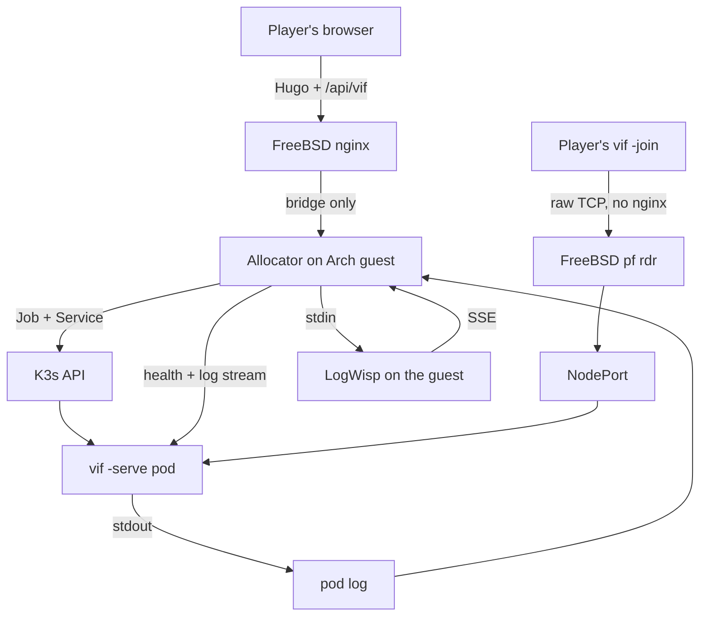

# Deploying the session fleet on a FreeBSD host

This is the blueprint for the proof-of-concept deployment: a website asks for a
game, one container appears on a K3s node, a player somewhere on the Internet dials
it, and it ends itself when nobody is in it. The node is an Arch Linux bhyve guest
on FreeBSD 15.1; the FreeBSD host owns routing and packet filtering with `pf`.

The plan, the gap register and the acceptance gates are in
[K3s dedicated-server fleet plan](kubernetes-fleet.md); the objects are in
[`deploy/`](../deploy/README.md). This document is the part you type, in the order
you type it.

## 0. What this assumes, and what you must decide

Read this section before step 1. Each entry names the step it becomes effective at,
because most of them change what that step should say.

| # | Assumption or decision | Effective at |
|---|---|---|
| A1 | **Every address here is an example** from RFC 5737 documentation ranges and is meant to be substituted: `203.0.113.7` for the host's public address, `192.0.2.20` for the Arch guest, `198.51.100.0/24` for the jails already on the host. Nothing in this repository holds a real address. | §3 |
| A2 | **`pf` owns the path and `ipfw` is not in it.** The rules below are FreeBSD's classic `rdr`/`nat` syntax. If the host's `pf.conf` is written in the newer `match … rdr-to` form, translate them rather than mixing the two — a ruleset with both is refused. | §3 |
| A3 | **The jails are already using `rdr` rules.** The fleet's port range must not collide with theirs, and the fleet's rules must be evaluated in the same pass. §3 puts them in a named anchor so the two rulesets stay separable. | §3 |
| A4 | **The Arch guest is on a private /24 behind a bhyve bridge.** The FreeBSD host is that subnet's gateway; the guest reaches the Internet and nothing reaches it unasked. The only public inbound path is the `rdr` in §3. §6 adds an `nftables` ruleset on the guest so that stays true of the guest's own network too, and so it survives a `pf` mistake. | §4 |
| A5 | **Docker is a build tool here, not a runtime.** K3s runs containerd. Docker exists on the guest to build the image and is stopped afterwards, because its `iptables` rules and K3s's share one table. | §5 |
| A6 | **One node, no registry.** The vi-fighter image is imported straight into the node's containerd and every session container uses `imagePullPolicy: IfNotPresent`. A second node or a real registry changes §7 and nothing else. | §7 |
| A7 | **A session is reached on its own port.** Ten NodePorts, one per container, forwarded as one range. It is the whole of the routing, and it is why the deployed session manifest sets no `-name`. §2 says what a single fixed public port would cost instead; §11 is that alternative, worked but not pursued. | §2 |
| A8 | **The website path and the game connection are independent.** Hugo pages and the allocator API are HTTPS through the host's nginx; the game is raw TCP straight to a forwarded port and never passes through nginx. Page TLS therefore has no bearing on a join, and the allocator commissions the route without proxying it. | §2 |
| A9 | **There is no authentication and no transport encryption, by decision.** Anyone who can reach a forwarded port can join the session behind it, and the link is public. What bounds a stranger is the forwarded surface being ten ports and nothing else. | §2 |
| A10 | **The allocator runs on the Arch guest.** It needs the K3s API and node-local access to the pod probes; neither the player nor nginx does. Port 6443 does not leave the guest. The host's nginx reaches only the allocator's narrow HTTP API across the bridge. | §10 |
| A11 | **The session's playout lead is chosen from its *first* guest's link** and holds for the life of the match. A session opened by a nearby player and joined by a distant one runs at the near player's lead. The late-crossing fence makes that cost freshness rather than correctness (fleet plan §5), but it is the reason a full-roster measurement (H3) is worth doing over real links rather than a LAN. | §9 |
| A12 | **The resource envelope is unmeasured at a full roster.** The requests and limits in the manifest come from single-guest runs. Ten sessions per node is a claim until an hour of four-player play says otherwise. | §8 |
| A13 | **Cluster commands in this procedure run through `sudo kubectl`.** K3s is installed with kubeconfig mode `0640`; the install script self-escalates, but the resulting kubeconfig is not made readable to the ordinary login user. | §6 |
| A14 | **The fleet's log stream is fanned in on the node, not served from each pod.** A session writes its JSON lines to stdout, the allocator follows the pod log through the Kubernetes API, and one LogWisp on the guest serves the merged result. The in-pod sidecar is retained as the H9 experiment because its file source cannot carry the envelope intact; the acceptance run used the same `-log-stdout` shape with no sidecar. | §10 |
| A15 | **Source-address preservation is intended, not proved.** `externalTrafficPolicy: Local` and `pf rdr` should leave the off-box player's address visible to the pod, but the acceptance run did not record it. The per-address admission bound depends on this. | §9 |
| A16 | **The allocator and Hugo integration are designed, not built.** §10 fixes their location, credentials and API/page contract; none of that path was exercised by the acceptance run. | §10 |
| A17 | **The pod log is the log contract.** `-log-stdout` puts vi-fighter's own JSON line on stdout and the Kubernetes pod-log endpoint returns it verbatim, so nothing between the session and the browser reinterprets the envelope. Anything that parses a line — the sidecar's file source today — is a component that can drop fields, and is therefore kept off this path. | §10 |

## 1. The shape



What a session is, what bounds its life, and what it costs are in the fleet plan's
[§1](kubernetes-fleet.md#1-what-is-deployed) and [§6](kubernetes-fleet.md#6-resources);
they are not repeated here. The three facts this procedure turns on: the game
transport is **raw framed TCP, not HTTP**, so nothing here is an Ingress and the
game connection never enters nginx (A8); a session is **a thing that ends**, so it
is a Job and not a Deployment; and there is **one node and one cluster**, so every
Service, port and rule below has exactly one place to be.

## 2. The link a player is given

Two strings, and keeping them apart is the whole of the design:

| String | What it is | Who reads it |
|---|---|---|
| `https://lixen.com/projects/vi-fighter/session/31703/` | The shareable link. A Hugo page over TLS, served by the host's nginx from the project's document root. | A browser. |
| `lixen.com:31703` | The join target. Raw framed TCP straight to a forwarded port. | `vif -join`. |

The page will be what a player clicks and forwards to a friend; its contract is to
show the join command, the roster the allocator read from `/health`, and how long
the session has left. That page and allocator are not built yet (A16). The game
connection they describe does not pass through nginx, is not TLS, and is not
affected by page rendering — which is why a certificate problem cannot break a
join, and why the game needs no HTTP anything (A8).

One nginx location will serve every session's page, because the only thing that
differs between them is the port:

```nginx
# The project page and one page per live session, from the same Hugo output.
location = /projects/vi-fighter/ { try_files $uri /projects/vi-fighter/index.html; }

# The port names the container; session.html reads it from its own URL and asks
# the allocator for that session's health-derived status.
location ~ "^/projects/vi-fighter/session/(?<vifport>3170[0-9])/$" {
    try_files /projects/vi-fighter/session.html =404;
}
```

**Why the port is the whole of the routing.** The coordinator speaks first: a dialer
that has connected receives `MsgJoinOffer` before it says anything. Nothing in a
plaintext game connection names a session — there is no HTTP path to route on and no
TLS SNI to read — so the destination port is the only signal a router or a firewall
has. Ten ports for ten containers makes that signal exact and needs no component to
interpret it. The route is intended to preserve the player's source address, which
the per-address admission limiter is keyed on; §9 keeps that as an A15 gate rather
than claiming the acceptance run proved it.

The consequence, and it is deliberate: **the deployed session sets no `-name`.** A
pod started with one refuses every dial that does not name it, and a player dialing
`lixen.com:31703` names nothing. The name mechanism exists, is tested, and belongs to
the single-port alternative in §11, which is not the path taken here.

## 3. FreeBSD: forward the range to the guest

The public address, the guest's address and the jail network below are examples
(A1). `pf` is the only filter in the path (A2).

```sh
# /etc/pf.conf, at the top with the other macros
ext_if      = "em0"
pub_ip      = "203.0.113.7"
vm_ip       = "192.0.2.20"          # the Arch guest
jail_net    = "198.51.100.0/24"     # bastille, already here
vif_ports   = "31700:31709"         # ten sessions, one port each
```

Redirection, in its own anchor so the fleet's rules and the jails' stay separable
(A3). The anchor is declared where the rest of the translation rules are, and its
body is loaded from a file:

```sh
# translation rules, before the filter rules
nat on $ext_if from $jail_net to any -> ($ext_if)
rdr-anchor "vif/*"
```

```sh
# /etc/pf.vif.conf
rdr pass on $ext_if inet proto tcp from any to $pub_ip port $vif_ports -> $vm_ip
```

```sh
sudo pfctl -a vif -f /etc/pf.vif.conf
sudo pfctl -s nat -a vif          # the rule is loaded
sudo pfctl -s state | grep 3170   # a state appears when a player connects
```

The public-address test is valid only from a machine off the FreeBSD host.
`rdr on $ext_if` matches packets arriving inbound on that interface; a connection
originated by the host to `203.0.113.7` bypasses translation and can return an
immediate RST that looks like a filter rejection. From the host, test the guest
directly instead: `nc -vz 192.0.2.20 31700`.

Four requirements this has to keep meeting, and one that is easy to get wrong:

| Requirement | Why |
|---|---|
| Forward **only** 31700-31709 | It is the whole player-facing surface. 7778 (health, metrics), 8080 (the log stream) and 6443 (the K3s API) are unauthenticated operational data and never leave the guest. |
| Do not rewrite the source address | The Services use `externalTrafficPolicy: Local` and the session's admission limiter is keyed on the dialing address. `rdr` rather than same-direction `nat` is the intended preserving path; the off-box address must still be verified at the pod (A15). |
| Leave `tcp.established` alone | A session holds one long-lived connection per player. The default is hours and the protocol sends a heartbeat every ten seconds, so an idle mapping is not the failure mode — a *short* `set timeout tcp.established` is. |
| Do not collide with the jails | `pfctl -s nat` shows every anchor's rules; check the range is unclaimed before loading it. |
| Fix the MTU before blaming the game | Measure end to end with non-fragmenting payloads. A bridged/tap VirtIO attachment with a stable address is the configuration to test first. |

**The host's nginx has no part in this.** It terminates TLS for the page and nothing
else (A8); the game ports are `rdr`ed past it in the kernel. If you would rather have
nginx carry them anyway — one `stream { server { listen 31703; proxy_pass … } }` per
port — it works, and it costs the second row of the table above: an nginx `stream`
proxy replaces the client's source address with the host's unless it is run
transparently. Prefer the `rdr`.

## 4. Arch guest prerequisites

Record every version with the acceptance run; Arch is rolling and an unrecorded
upgrade must not silently change the baseline.

```sh
uname -a                                 # kernel, recorded
systemd-detect-virt                      # expect: bhyve
findmnt -no FSTYPE /sys/fs/cgroup        # expect: cgroup2fs
timedatectl status                       # expect: synchronized
lscpu | grep -E 'Model name|^CPU\(s\)'
ip -br link; ip route
```

```sh
sudo pacman -Syu --needed curl git make iptables-nft conntrack-tools ethtool tcpdump
sudo systemctl enable --now systemd-timesyncd

# zram-generator can recreate swap after fstab is clean. Mask the generated swap
# unit shown on this guest before switching it off.
systemctl list-units --all 'dev-zram*.swap'
sudo systemctl mask --now dev-zram0.swap
sudo swapoff -a && sudo sed -i '/\sswap\s/s/^/#/' /etc/fstab
free -m                                    # expect: Swap total 0

# Pod networking needs both; neither is on by default on a fresh guest.
printf 'overlay\nbr_netfilter\n' | sudo tee /etc/modules-load.d/k3s.conf
sudo modprobe overlay br_netfilter
printf 'net.ipv4.ip_forward=1\nnet.bridge.bridge-nf-call-iptables=1\n' \
  | sudo tee /etc/sysctl.d/99-k3s.conf
sudo sysctl --system
```

`swapoff -a` and an edited `fstab` are not sufficient when Arch's
`zram-generator` recreates its generated unit. If `free -m` still reports swap and
`k3s check-config` still warns, mask the actual `dev-zram*.swap` unit printed above,
switch it off, and recheck before installing K3s.

**Sizing, before anything is installed.** Reserve memory for FreeBSD, for the guest
itself and for the K3s control plane before counting sessions. Ten sessions at the
manifest's 192 MiB limit is 1.9 GiB of game, and the quota in
[`10-quota.yaml`](../deploy/k3s/10-quota.yaml) is what holds the number to it.

## 5. Docker, for building the image

Docker is here to build (A5). It is not what runs the sessions.

```sh
sudo pacman -S --needed docker
sudo systemctl enable --now docker
sudo usermod -aG docker "$USER"     # log out and back in
docker info | grep -i 'storage driver'
```

**The one thing to check after installing it.** Docker sets the `FORWARD` chain's
default policy to `DROP`, and K3s relies on that chain for pod and NodePort traffic.
On this node the two coexist because K3s inserts its own `ACCEPT` rules, but verify
it rather than assuming it — after installing Docker, after every Docker upgrade,
after a reboot, and after every `docker start` or `docker restart`:

```sh
sudo iptables -S FORWARD | head -1        # expect: -P FORWARD ACCEPT
```

If it reads `DROP`, `sudo iptables -P FORWARD ACCEPT` restores it, and a NodePort
that answered before and does not now is the symptom you are looking for.
`systemctl stop docker` does not restore the policy Docker set; check it after the
stop as well instead of treating a stopped daemon as a rollback.

Stop the daemon when you are not building. A build host that is also a running
container runtime is two things claiming one packet path:

```sh
sudo systemctl stop docker docker.socket
```

## 6. K3s

Pin the version. `INSTALL_K3S_VERSION` is the one field that must not be left to
whatever the channel serves on the day.

The install script self-escalates. With `--write-kubeconfig-mode 0640`, every
cluster command below is nevertheless run as `sudo kubectl` (A13); do not copy the
node's root kubeconfig into an ordinary user's home to avoid writing `sudo`.

```sh
curl -sfL https://get.k3s.io | INSTALL_K3S_VERSION=v1.34.6+k3s1 sh -s - \
    --write-kubeconfig-mode 0640 \
    --disable traefik \
    --disable servicelb \
    --secrets-encryption \
    --kube-apiserver-arg=service-node-port-range=31700-31709
```

- **`--disable traefik`** — the game protocol is raw TCP. An HTTP ingress controller
  has nothing to route here and is attack surface for a workload that does not use
  it.
- **`--disable servicelb`** — sessions are reached by NodePort. Klipper would bind
  host ports of its own and make the mapping harder to reason about, not easier.
- **`--secrets-encryption`** — nothing here stores a Secret yet; turning it on
  before there is one is cheaper than migrating later.
- **`service-node-port-range=31700-31709`** — exactly ten ports for exactly ten
  sessions, matching the range `pf` forwards. The pool becomes a fact the API server
  enforces, and an allocator bug cannot place a session on a port nobody opened.
- **Network policy stays enabled.** K3s enforces `NetworkPolicy` through its bundled
  controller; the manifests in `20-networkpolicy.yaml` are load bearing, so do not
  install with `--disable-network-policy`.

Verify before continuing:

```sh
sudo k3s check-config
sudo kubectl get nodes -o wide
sudo kubectl -n kube-system get pods
```

Configure the guest filter below before rebooting. Its first-load audit and the
reboot that proves the loaded rules match the files are part of the same gate; the
NodePort half is completed in §9, once a session endpoint exists.

### The guest's own filter

`pf` on the FreeBSD host is what decides who reaches the guest from the Internet.
This is the second half: what reaches the guest from its own network, and what
survives a `pf` mistake (A4). It is written after K3s because it has to be written
around K3s.

**The rule that matters: never `flush ruleset`.** K3s and Docker both program
their rules through `iptables-nft`, which puts them in ordinary nftables tables
beside yours. `flush ruleset` — the first line of Arch's shipped
`/etc/nftables.conf` — destroys those too. Kube-proxy resyncs within a minute and
flannel's rules may not, so the failure looks like a cluster that half works. Own
one table and replace only that.

The corollary is just as important: owning one table preserves every table you did
not write, **including an unwanted one**. Stock Arch can already have an empty
`table inet filter` with a `forward` hook and `policy drop`. Every hook is evaluated
per table and one drop is final, so that surviving table blackholes NodePort traffic
while SSH, ICMP, guest egress, and every visible `iptables` accept continue to work.

Before writing the ruleset, derive the operator address and the guest's actual SSH
port from the live session. `$SSH_CONNECTION` is `client-address client-port
server-address server-port`; guessing either field can leave the current connection
alive under `ct state established` while every replacement login is locked out:

```sh
set -- $SSH_CONNECTION
[ "$#" -eq 4 ] || { echo 'SSH_CONNECTION is unavailable'; exit 1; }
operator_addr=$1
sshd_port=$4
sudo install -d -m 0755 /etc/nftables.d
printf 'define operator_addr = %s\ndefine sshd_port = %s\n' \
  "$operator_addr" "$sshd_port" | sudo tee /etc/nftables.d/vif-operator.nft
```

The file those values feed is the only place the operator source and SSH port are
accepted. Port 6443 is deliberately absent: the allocator runs on this guest and
the operator reaches `kubectl` through SSH, so the Kubernetes API does not cross
the bridge (A10).

```nft
#!/usr/bin/nft -f
# /etc/nftables.conf — NOT `flush ruleset`; see doc/kube_docker_deploy.md §6.
include "/etc/nftables.d/vif-operator.nft"

# The pair makes a first load safe and every later load a replacement.
table inet vif
delete table inet vif

table inet vif {
	chain input {
		type filter hook input priority filter; policy drop;

		ct state { established, related } accept
		ct state invalid drop
		iif lo accept

		# The cluster and Docker build bridges talk to the node itself here.
		iifname { "cni0", "flannel.1", "docker0" } accept
		ip saddr { 10.42.0.0/16, 10.43.0.0/16 } accept

		ip protocol icmp accept

		# SSH from the address and non-default port derived above, nowhere else.
		ip saddr $operator_addr tcp dport $sshd_port accept
	}

	chain forward {
		# A NodePort is DNATed before routing, so player traffic uses this hook.
		# K3s needs accept here and Docker may replace the policy (§5).
		type filter hook forward priority filter; policy accept;
	}
}
```

```sh
sudo pacman -S --needed nftables
sudo install -m 0644 /path/to/the/file /etc/nftables.conf

# Remove Arch's shipped forward-policy table explicitly; reload never does it.
sudo nft delete table inet filter

# If the replacement locks out SSH, remove only this table in twenty minutes.
# pf still guards the public perimeter while it is absent.
sudo systemd-run --on-active=20m --unit=nft-rollback \
  /usr/bin/nft delete table inet vif
sudo nft -f /etc/nftables.conf
sudo systemctl enable nftables
sudo nft list table inet vif
```

Open a second SSH connection before cancelling the rollback. Once that connection,
the cluster checks below, and the table audit all pass:

```sh
sudo systemctl stop nft-rollback.timer
sudo nft list ruleset | grep '^table'
```

The expected set is `table inet vif` plus the named `ip`/`ip6` tables installed by
K3s through `iptables-nft`; `table inet filter` and any other unexplained table are
absent. Repeat this audit after the first load and after every reboot. During an
Arch upgrade, treat `/etc/nftables.conf.pacnew` as a fresh hostile default: never
merge back `flush ruleset` or the shipped `inet filter` table. A blind merge
restores the failure at the next service start.

Verify the cluster survived it, in this order — each answers a different failure:

```sh
sudo kubectl -n kube-system get pods        # CoreDNS still Ready: pod networking
sudo kubectl get --raw /readyz              # the API server is still reachable
sudo iptables -S FORWARD | head -1          # still -P FORWARD ACCEPT (§5)
sudo nft list ruleset | grep '^table'       # no surviving table inet filter
```

Now reboot and repeat those four checks, plus `free -m`. This is the only check that
proves the service-loaded ruleset matches the files rather than merely the manual
load above:

```sh
sudo systemctl reboot
# reconnect, then repeat node readiness, /readyz, FORWARD, the table audit and free -m
```

A node that does not come back Ready is an infrastructure blocker, not a workload
problem. §9 completes this gate with a live EndpointSlice and off-box NodePort join.

**If you prefer `iptables`:** the same shape is an `INPUT` policy of `DROP` with the
same accepts and `-P FORWARD ACCEPT`, and on Arch it lands in the same kernel tables
through `iptables-nft`. That is exactly why the two coexist, and exactly why
`flush ruleset` breaks them. Do not run both a hand-written `iptables` ruleset and a
hand-written `nftables` one — pick the one you will remember to read.

## 7. Build and load both images

No earlier step creates a source tree. Clone both repositories once, then remain in
the vi-fighter repository root: every `make` and `kubectl apply` command in §7-§9
assumes that working directory.

```sh
mkdir vif-deploy && cd vif-deploy
git clone https://github.com/lixenwraith/vi-fighter
git clone https://github.com/lixenwraith/logwisp
cd vi-fighter
VIF_ROOT=$PWD
LOGWISP_ROOT=$PWD/../logwisp
```

The vi-fighter builder pin and module directive are deliberately the same patch
release. Check them before Docker downloads the module graph; an older builder
otherwise reports the mismatch only after that download has consumed the build:

```sh
module_go=$(awk '$1 == "go" { print $2; exit }' go.mod)
image_go=$(sed -n 's/^ARG GO_VERSION=//p' deploy/docker/Dockerfile)
printf 'go.mod=%s Dockerfile=%s\n' "$module_go" "$image_go"
test "$module_go" = "$image_go"                 # expect: 1.27.1 = 1.27.1
```

Start Docker and immediately repeat the `FORWARD` check from §5. The verified build
path uses the host network because the build container could not resolve DNS under
the guest ruleset. Accepting `docker0` in §6 is the tidier path and lets `make image`
work normally; `--network host` is the reliable one. This is also an ordering
constraint: §6 describes a guest Docker has already changed, not a ruleset to load
before §5 without re-auditing its interfaces.

```sh
sudo systemctl start docker
sudo iptables -S FORWARD | head -1

VIF_TAG=$(git rev-parse --short HEAD)
VIF_REVISION=$(git rev-parse HEAD)
docker build --network host \
  -f deploy/docker/Dockerfile \
  --build-arg VERSION="$VIF_TAG" \
  --build-arg REVISION="$VIF_REVISION" \
  -t "vi-fighter:$VIF_TAG" .
make image-check IMAGE_TAG="$VIF_TAG"
```

`image-check` runs vi-fighter's own `-check` as UID 65532, read-only, with no
network and no capabilities.

With no registry (A6), import the image into the node's containerd and verify the
name before stopping Docker. `IfNotPresent` in every session container is load
bearing: a floating `:latest` would default to `Always` and bypass this import.

```sh
docker save "vi-fighter:$VIF_TAG" | sudo k3s ctr images import -
sudo k3s ctr images ls | grep vi-fighter
sudo systemctl stop docker docker.socket
sudo iptables -S FORWARD | head -1
```

LogWisp is a host binary here, not an image: it runs beside the allocator on the
guest and never enters a pod (A14). Its own Makefile builds `./cmd/logwisp`:

```sh
make -C "$LOGWISP_ROOT" build
"$LOGWISP_ROOT"/bin/logwisp --version
sudo install -m 0755 "$LOGWISP_ROOT"/bin/logwisp /usr/local/bin/logwisp
sudo install -d -m 0755 /etc/logwisp
sudo install -m 0644 deploy/logwisp/aggregator.toml /etc/logwisp/aggregator.toml
```

`deploy/docker/Dockerfile.logwisp` builds the same package into a `scratch` layer
under UID 65532 and is what H9 imports when the in-pod sidecar is tested; it is not
needed to run the fleet. That sidecar's `/stream` and `/status` are unauthenticated
and the stream sends a wildcard CORS header, so `20-networkpolicy.yaml` is the only
thing keeping 8080 off the player path — treat it exactly like the probe port, and
note that LogWisp's TLS and mTLS identity authorization, unused here, is the eventual
answer for a reader that is not on the node. Both repositories pin Go 1.27.1 for the
builder, and LogWisp's module still declares 1.26.5 — raise that in its own
repository, not here.

For anything past the lab, publish the vi-fighter image and reference it **by
digest**, not by tag. A tag can be moved; a session's logs then name a revision that
is no longer what ran.

## 8. Apply the fleet objects

```sh
sudo kubectl apply -f deploy/k3s/00-namespace.yaml
sudo kubectl apply -f deploy/k3s/10-quota.yaml
sudo kubectl apply -f deploy/k3s/20-networkpolicy.yaml
sudo kubectl apply -f deploy/k3s/40-allocator-rbac.yaml
sudo kubectl apply -f deploy/k3s/50-logwisp.yaml   # only for an H9 sidecar render
```

These are the boundary. The namespace enforces `restricted` Pod Security, the quota
caps the fleet at ten, the policies deny everything not named, and the Role is the
whole of what the allocator may do. `30-session.yaml` is a **template**, not an
object to apply — it is rendered per session. The requests it carries are a starting
point rather than a measurement (A12).

Verify the boundary holds before trusting it:

```sh
# Pod Security refuses a privileged pod in this namespace
sudo kubectl -n vif run pstest --image=busybox --restart=Never \
    --overrides='{"spec":{"containers":[{"name":"c","image":"busybox","securityContext":{"privileged":true}}]}}'
# expect: forbidden ... violates PodSecurity "restricted"

# After §9 creates a pod, kube-router's per-pod chains prove enforcement.
sudo iptables-save -c | grep 'KUBE-POD-FW-'
```

K3s embeds the kube-router controller in the `k3s` process; there is no
`kube-router` pod to find in `kube-system`. Once a session pod exists, its
`KUBE-POD-FW-*` chains appear in `iptables-save -c`. Take the counter view before
and after one connection attempt: the relevant chain's counter must move. That is
the enforcement proof; the existence of the `NetworkPolicy` API object is not.

## 9. Create one session by hand

Do this before wiring the website, so "the allocator is broken" and "the workload
is broken" stay separable questions. The template's 90-second first-join fuse is a
production bound, not a debugging allowance: it will delete the target while its
network is being investigated. `render-session.sh` therefore accepts `FIRST_JOIN`
and `EMPTY_GRACE` overrides. Use an extended value for the path and reboot gates,
then test the defaults separately.

The session ID names the Kubernetes objects; the player sees only the port (A7).
The default render is the deployed shape: one container, `-log-stdout`, no shared
volume. Naming a LogWisp image instead adds the sidecar, which is the H9 experiment
and not the log path this deployment uses:

```sh
SESSION_ID=s1
VIF_TAG=$(git rev-parse --short HEAD)

FIRST_JOIN=20m EMPTY_GRACE=20m \
  ./deploy/k3s/render-session.sh "$SESSION_ID" 31700 "vi-fighter:$VIF_TAG" \
  | sudo kubectl apply -f -
```

Inspect the pod first, then make the EndpointSlice the first network check:

```sh
SERVICE="vif-session-$SESSION_ID"
sudo kubectl -n vif get pods,svc -l vif.lixenwraith.dev/session="$SESSION_ID"
sudo kubectl -n vif get endpointslice \
  -l "kubernetes.io/service-name=$SERVICE" -o wide
```

A pod is Ready only when every container is, so a healthy session beside a second
container in `ImagePullBackOff` shows `0/2` and is not Ready. A Service with no ready
endpoint makes kube-proxy install a reject path, so an outside client receives
immediate `connection refused`. That symptom is not evidence of a `pf` or nftables
fault, and it is why the default render carries no second container.

Once an endpoint exists, walk outward from the pod rather than inward from the
Internet. `bash -c "</dev/tcp/host/port"` is enough when `nc` is absent:

```sh
POD_IP=$(sudo kubectl -n vif get pod \
  -l vif.lixenwraith.dev/session="$SESSION_ID" \
  -o jsonpath='{.items[0].status.podIP}')
CLUSTER_IP=$(sudo kubectl -n vif get svc "$SERVICE" \
  -o jsonpath='{.spec.clusterIP}')

bash -c "</dev/tcp/$POD_IP/7777"          # pod route and policy
bash -c "</dev/tcp/$CLUSTER_IP/7777"      # Service DNAT
bash -c "</dev/tcp/127.0.0.1/31700"       # local NodePort
bash -c "</dev/tcp/192.0.2.20/31700"      # guest address and NodePort
```

From the FreeBSD host, test `192.0.2.20:31700` directly. Test
`203.0.113.7:31700` only from an off-box machine (§3). The acceptance run reached
the real game through that entire path and joined successfully:

```sh
./bin/vif -join 203.0.113.7:31700
```

Take counter snapshots immediately before and after one failed connection when a
step does not answer. A NodePort SYN is DNATed in `prerouting` and forwarded, so it
never visits the guest's `input` chain:

```sh
sudo iptables-save -c > /tmp/iptables.before
sudo nft list ruleset > /tmp/nft.before
# Make exactly one connection attempt here.
sudo iptables-save -c > /tmp/iptables.after
sudo nft list ruleset > /tmp/nft.after
diff -u /tmp/iptables.before /tmp/iptables.after
diff -u /tmp/nft.before /tmp/nft.after

sudo conntrack -L -p tcp | grep 31700
sudo tcpdump -ni cni0 'tcp port 7777'
```

The last rule whose counter moves names the component that handled the packet.
Traffic visible on `cni0` reached the pod side of routing; a moving
`KUBE-POD-FW-*` counter proves the policy path ran. A forward-path counter that
moves with no conntrack entry for the tuple means forwarding accepted the packet
and another hook dropped it before the routing decision completed. Compare
`nft list ruleset`, not only `iptables-save`: another table on the same hook can
drop a packet every visible iptables chain accepted.

NetworkPolicy enforcement is checked here because the per-pod chains do not exist
before a pod does:

```sh
sudo iptables-save -c | grep 'KUBE-POD-FW-'
# Make one game-port connection, then repeat and confirm a counter delta.
sudo iptables-save -c | grep 'KUBE-POD-FW-'
```

The operator ports stay off the player path, and the pod log is the log contract
(A17). Check that the line the API returns is the line the session wrote — the
envelope keys, not just the payload — because everything in §10.3 rests on it:

```sh
sudo kubectl -n vif port-forward job/vif-session-$SESSION_ID 7778:7778 &
curl -s localhost:7778/health
curl -s localhost:7778/metrics | head

sudo kubectl -n vif logs job/vif-session-$SESSION_ID --tail=1 \
  | python3 -c 'import json,sys; print(sorted(json.loads(sys.stdin.read())))'
# expect: the vif envelope, ['fields', 'frame', 'level', 'run', 'sub', 'tick', 'time']
```

A `sub` or `tick` missing here means the runtime prefixed or rewrote the line, and
the aggregator's raw pass-through is carrying something other than what was written.
The sidecar's `/stream`, `/status` and `kubectl logs -c logwisp` are checked only
when H9 renders one; they are not part of this gate.

There is one health path. Its code answers whether the process should live; the
body carries `ready`, `phase`, `guests`, `capacity`, and `expires_in`. A vacant pod
correctly reports `live=true ready=true clock=paused phase=vacant` while its tick
stops. The allocator must read those words rather than treating a moving tick or a
`Running` pod as readiness.

Complete the reboot gate while this extended-lifetime endpoint exists. Reboot the
guest, wait for the node and endpoint to return, then repeat the `FORWARD` check,
the nftables table audit, and one off-box NodePort join. That proves the loaded
ruleset matches its files; it does not claim an in-memory match survived the boot.

Source preservation remains a separate open gate (A15) and is the one place this
deployment needs a code change. The address is already carried —
`network.JoinerReport.Remote` holds `conn.RemoteAddr()` and reaches
`App.noteJoinerReport` — but only `reach.noteDeclared` reads it, so no record names
it and the run's journal cannot settle the question. Add the field to the admitted-
participant record in `internal/app/host.go`, then repeat the remote join. If the
address is rewritten, the per-address admission limiter becomes one shared budget
for the whole fleet.

The following lifecycle cases were **not** proved by the run because every manual
session used extended timers. They remain gates rather than results:

| Open check | Expected |
|---|---|
| Nobody joins for the default 90 s | Pod exits 0 and names `no guest connected`; the Job completes. |
| A guest joins and quits | Pod exits 0 after the 90-second empty grace and names `roster empty for`. |
| A guest quits and rejoins inside the grace | The same session continues into the released slot. |
| Delete the Job while a guest plays | `phase=draining`, health stays 200 with `ready=false`, then exit on empty roster or after 20 s. |
| Roster reaches `-players` | Health stays 200 with `ready=false reason=session at capacity`; existing guests continue. |

`render-session.sh` strips `ownerReferences` because the Job UID does not exist when
the pair is rendered. Its Service is therefore orphaned and must be deleted by hand
after the Job; otherwise it keeps the NodePort allocated against the ten-port pool:

```sh
sudo kubectl -n vif delete job "vif-session-$SESSION_ID"
sudo kubectl -n vif delete service "vif-session-$SESSION_ID"
```

## 10. The allocator and website contract (designed, not built)

Everything in this section is a design outcome from the proof-of-concept run; none
of it has been implemented or exercised (A16). The website is Hugo output served by
the FreeBSD host's nginx. Static JavaScript cannot hold Kubernetes credentials, so
nginx reverse-proxies one same-origin API prefix to a small long-running allocator.
The allocator holds the credential and creates or observes sessions. Raw game
traffic still bypasses nginx and the allocator completely (A8).

### 10.1 Location and network boundary

The allocator runs on the Arch guest; this is not an interchangeable placement.
The run showed kube-router installing a node-local-source allowance before the pod
policy path. A process on the node can therefore read a session pod's `/health`
directly on the pod IP. A process on the FreeBSD host or another machine cannot:
`allow-operator-ports` admits 7778 and 8080 only from the monitoring namespace, and
moving the allocator there would require widening that policy. It also holds the
node aggregator's loopback stream (§10.3), which nothing off the guest can reach.

Port 6443 never leaves the Arch guest. The allocator connects to
`https://127.0.0.1:6443`; the FreeBSD host reaches only the allocator's HTTP port
across the bridge. There is no new `pf rdr`: the allocator is not public and the
host-to-guest bridge path already exists.

The guest's `input` policy is `drop`, so implementation adds one rule to `table inet
vif` for the allocator port from the FreeBSD bridge address only. Derive that address
from the guest's default route and use the same rollback procedure as §6 before
loading the change:

```sh
host_bridge_addr=$(ip route show default | awk 'NR == 1 { print $3 }')
printf 'host bridge: %s\n' "$host_bridge_addr"
```

```nft
# The host's nginx is the allocator's only caller across the bridge.
define host_bridge_addr = 192.0.2.1
define allocator_port = 9080
ip saddr $host_bridge_addr tcp dport $allocator_port accept
```

The example allocator address below uses the documentation guest and an example
port. Substitute the derived bridge values; do not add the port to the public
`vif_ports` range:

```nginx
location = /api/vif/logs {
    proxy_pass http://192.0.2.20:9080;
    proxy_http_version 1.1;
    proxy_set_header Connection "";
    proxy_buffering off;
    proxy_read_timeout 1h;
}

location /api/vif/ {
    proxy_pass http://192.0.2.20:9080;
    proxy_http_version 1.1;
    proxy_set_header Host $host;
    proxy_set_header X-Forwarded-Proto $scheme;
}
```

The browser calls `/api/vif/...` on the same origin as the Hugo page. That removes
CORS from the design; do not replace it with `Access-Control-Allow-Origin: *`.

### 10.2 Credential and API

[`40-allocator-rbac.yaml`](../deploy/k3s/40-allocator-rbac.yaml) defines the entire
permission surface: create/read/watch/delete Jobs and Services, read/watch pods and
events, and read pod logs, in `vif` and nowhere else. `pods/log` is what §10.3 reads
and is the only addition the log panel needs; `pods/exec`, `pods/portforward` and
every write verb stay absent. The allocator must not use
`/etc/rancher/k3s/k3s.yaml` or a copy of the node's root kubeconfig. Mint a token
for the `vif-allocator` ServiceAccount and build a kubeconfig around that identity:

```sh
ALLOC_KUBECONFIG=/etc/vif-allocator/kubeconfig
ALLOCATOR_USER=vif-allocator
ALLOC_TOKEN=$(sudo kubectl -n vif create token vif-allocator --duration=24h)
sudo install -d -m 0750 /etc/vif-allocator
sudo kubectl config --kubeconfig="$ALLOC_KUBECONFIG" set-cluster vif \
  --server=https://127.0.0.1:6443 \
  --certificate-authority=/var/lib/rancher/k3s/server/tls/server-ca.crt \
  --embed-certs=true
sudo kubectl config --kubeconfig="$ALLOC_KUBECONFIG" set-credentials vif-allocator \
  --token="$ALLOC_TOKEN"
sudo kubectl config --kubeconfig="$ALLOC_KUBECONFIG" set-context vif \
  --cluster=vif --user=vif-allocator --namespace=vif
sudo kubectl config --kubeconfig="$ALLOC_KUBECONFIG" use-context vif
sudo chmod 0600 "$ALLOC_KUBECONFIG"
sudo chown "$ALLOCATOR_USER:$ALLOCATOR_USER" "$ALLOC_KUBECONFIG"
unset ALLOC_TOKEN
```

Give that file only to the allocator's system user. A TokenRequest token expires and
the API server may shorten the requested duration, so the service must rotate it or
be restarted with a newly minted token before expiry. A permanent root credential
is not an acceptable substitute for implementing rotation.

The page-facing session API has two endpoints:

| Method and path | Contract |
|---|---|
| `POST /api/vif/sessions` | Refuse before creation when all ten ports are held; otherwise create the Job, read its UID, create its owner-referenced Service, wait for `live=true ready=true`, and return the session page URL, join target, and health-derived state. |
| `GET /api/vif/sessions` | List live, non-completed Jobs and return one row per session. `guests`/`capacity`, `phase`, and `expires_in` come from that pod's `/health`; only the process can report the last field. |

The log panel uses a third, read-only stream, built in §10.3:

| Method and path | Contract |
|---|---|
| `GET /api/vif/logs` | Reverse-proxy the node aggregator's SSE stream, unbuffered. Never expose a pod IP, a pod port, or the aggregator's own address to the browser. |

An iframe is an acceptable first rendering only if it targets this same-origin
path. The ordinary page should use `EventSource`, bound its retained rows and
reconnect delay, and keep the allocator between the browser and every pod.

### 10.3 The log path

The website's panel wants every session's output in one stream. What decides the
shape is that **vi-fighter's log envelope survives exactly one path** (A17):

| Path | What arrives |
|---|---|
| Pod stdout → Kubernetes pod log | The line as written. `-log-stdout` puts vi-fighter's own JSON on stdout and the API returns it byte for byte. |
| LogWisp console source → `raw` format | The line as written. The source puts the whole line in the entry's message and leaves its fields empty, which is the one combination `raw` passes through. |
| LogWisp file source → any format | `time`, `level` and `fields` only. It unmarshals every valid JSON object into a narrower envelope, so `sub`, `run`, `tick` and `frame` are gone before the formatter is consulted and `raw` cannot restore them. |

The first two compose and the third is why the in-pod sidecar is not on this path.
So: the session writes to stdout, the allocator follows each live pod's log, and
one LogWisp on the guest reads the merged lines on standard input and serves them
as SSE on loopback — [`deploy/logwisp/aggregator.toml`](../deploy/logwisp/aggregator.toml).

```sh
sudo install -m 0644 deploy/logwisp/aggregator.toml /etc/logwisp/aggregator.toml
logwisp -c /etc/logwisp/aggregator.toml        # the allocator spawns this
curl -sN 127.0.0.1:8081/stream | head          # one vif JSON line per data: field
```

Run it as a child of the allocator rather than as its own service. One process then
holds the cluster credential, the stream ends when its writer does, and no second
component needs a token. LogWisp is there for what the allocator would otherwise
build: the SSE server, the per-client queues, the connection ceiling, the rate limit
and the filters.

Four obligations on the allocator's side of that pipe:

| Obligation | Why |
|---|---|
| Splice `"session"` and `"port"` into each line after the opening brace, preserving every original key. | The panel must name the session, and the pass-through has no other place to carry it. Re-serializing the object instead is the field loss this path exists to avoid. |
| Follow each pod's log with a bounded restart, and never re-read from the start on reconnect. | A follow that restarts from the beginning replays a whole match into the panel. |
| Bound what it writes, and let a slow stream drop rather than block. | Ten sessions emitting a status snapshot per group at 10 Hz will outrun a browser; the aggregator's rate limit is the second half of that bound, not the first. |
| Reverse-proxy `/api/vif/logs` to `127.0.0.1:8081/stream` with response buffering off. | The aggregator must not bind an address the bridge can reach, so the allocator's one open port stays the whole guest surface (§10.1). |

The panel is a viewer of operational data. `fields.msg` is the record discriminator
on every line; `sub="stat"` marks the status snapshots that carry the metric values,
and a panel that does not want them filters on that key rather than on a group name.

### 10.4 Reconciliation and page obligations

| Obligation | Why it is required |
|---|---|
| Rebuild the port map by listing Jobs on allocator start. | Kubernetes is the state; allocator memory is a cache. |
| Create the Job first, then set the Service's `ownerReferences` to that Job UID. | The endpoint must disappear with the match rather than hold a NodePort after it. |
| Wait for `live=true ready=true`, not pod `Running`. | Any unready container leaves the Service with no endpoint, and a running game process may still be building its world. |
| Refuse at ten before calling the API. | The quota is a backstop, not the player-facing capacity response. |
| Never resurrect a completed Job. | A completed Job is a finished in-memory match; its former port has returned to the pool. |

Hugo must emit the existing project page plus one `session.html` template served by
the nginx location in §2. The project page calls the GET and POST endpoints and
shows the bounded aggregate log panel. The session template reads port `31703` from
its own `/session/31703/` URL, queries the list endpoint for that row, and keeps the
two user-facing strings distinct: the HTTPS page URL and the raw `lixen.com:31703`
join target. Neither template speaks to Kubernetes or to a pod directly.

## 11. The alternative that is not taken: one fixed public port

Recorded because it is built and tested and because the routing question is open
(fleet plan H8) — not because this deployment runs it. **Do not apply it piecemeal:
its two halves only work together.**

A player's link would become `203.0.113.7:7777/<name>`, and the name rather than the
port would say which container. `vif -join` accepts that form and sends the name as
one frame before the handshake, which is the only thing in a plaintext game
connection that a router could route on. A front door on the guest reads that frame
and splices: [`deploy/frontdoor/haproxy.cfg`](../deploy/frontdoor/haproxy.cfg) is
that, in HAProxy's TCP mode, with ten pre-declared backends and a name-to-backend map
the allocator writes over the runtime socket. `pf` would then forward one port
instead of ten, and the session manifest would need `-name ${SESSION_ID}` in its args
— without it a session answers to every dial, and with it a session refuses every
dial that names nothing, which is every dial the current deployment makes.

**What it would cost, and why the port range wins for now:**

| | Port range (taken) | Front door |
|---|---|---|
| Components | none | HAProxy, plus map upkeep in the allocator |
| `pf` | one range | one port |
| Client source address | intended to be preserved; still an A15 gate | replaced by the proxy's, so the per-address admission limiter becomes one budget for the whole fleet |
| Stale link | reaches whatever session inherited the port | refused, by the map and again by the session |
| Ceiling | the ten ports you forwarded | the ten backends you declared |

Neither buys more than a name in a URL, and the second costs a component and the
address the rate limiter is keyed on. The exploration that revisits this is where a
third answer would come from — TLS with SNI routing is the one Kubernetes already
has an answer for, and it needs transport security this deployment has decided
against.

## 12. Operating

**Where a session says what it did.** `kubectl logs job/vif-session-<id>` is the
whole of it: the session writes its JSON lines to stdout and the API returns them
unchanged, metric values included, because `internal/status` emits the registry as
`sub="stat"` records into the same log. §10.3 fans that into one stream for the
website; nothing between the two reinterprets a line.

Two LogWisp behaviours decide that shape and are worth keeping in mind before
anyone moves the source. Its file source keeps only `time`, `level`, top-level
`msg` and `fields`, so a vif line loses `sub`, `run`, `tick` and `frame` there
whatever the format says. It also seeks to end-of-file when it first discovers an
existing file, so lines written before the watcher attaches are skipped. One line
is intended to end every session and name why:

```json
{"msg":"session ended","phase":"expired","reason":"roster empty for 1m30s","guests":0,"tick":240}
```

`reason` is one of: `no guest connected within …`, `roster empty for …`, `drained`,
`drain deadline … reached holding N guest(s)`, or an operator-supplied cause.

### Debugging a refused NodePort

The counter-delta commands and outward walk are in §9. Keep these interpretations
beside them; each was a dead end in the proof-of-concept run when omitted:

| Observation | What it means |
|---|---|
| Nothing appears in the guest `input` drop log. | Expected for a NodePort SYN: kube-proxy DNATs it in `prerouting`, then routing sends it through `forward`, not `input`. |
| Every rule in `iptables-save -c` accepts, but the connection still fails. | Another nftables table can drop on the same hook. Only `nft list ruleset` shows every table. |
| One before/after connection changes a counter. | The last moving rule identifies the component that handled the packet; take both `iptables-save -c` and `nft list ruleset` immediately around one attempt. |
| Forward counters move but the tuple has no conntrack entry. | The packet was accepted for forwarding and dropped by another hook before the routing decision completed. |
| Pod IP works, then ClusterIP, loopback NodePort, guest NodePort, host-to-guest, and finally off-box. | Each boundary names one component. Walking inward from the Internet combines all of them and names none. |

**What to watch.** Sessions expiring with `no guest connected` far more often than
players report failed joins is the signature of a broken path between the page and
the forwarded range — the `pf` rule, the guest's `nftables` ruleset, the NodePort, or
a port the page and the allocator disagree about. Start with the EndpointSlice; use
`pfctl -s state` on the host, all of `nft list ruleset` on the guest, the per-pod
chain counters, conntrack, and `cni0` to find the boundary. So is the fleet sitting
at the ten-session quota, which is a player being told there is no game.

**Upgrades.** Sessions are ephemeral, so a rollout is mostly a matter of not starting
new sessions on the old image. Once the allocator exists, point it at the new digest;
existing sessions finish on their own within a match plus 90 seconds. Delete old
Jobs only if you mean to drain them.

**Node maintenance.** Stop the allocator, wait for the running sessions to end (they
will, within a match plus the grace), then `sudo kubectl drain`. A session that must go
now is drained by deleting its Job, which is a `SIGTERM` and therefore the 20-second
drain, not a kill.

## 13. What this deployment does not yet have

The acceptance run proved one important path: a real Internet client crossed the
FreeBSD `pf rdr`, the Arch guest, the NodePort and kube-proxy DNAT, reached the pod,
and joined the game. It did not turn the designed components around that path into
verified ones. The full gap register is the fleet plan's
[work list](kubernetes-fleet.md#3-work-list):

- **The game port is open and unauthenticated, by decision** (A9). A forwarded port
  is a session anyone who scans for it can join, and the link is public. What is
  still *unbounded* is narrower and is H1 — a peer that completes the handshake and
  goes silent holds a fresh session open, and a peer that connects and drops during
  the startup gate ends it. Both are confined to the moment before a session starts,
  and both need a peer running this build with this session's identity.
- **The resource envelope is unmeasured at a full roster** (A12).
- **Source-address preservation is unverified** (A15). The host does not yet log the
  successful accepted connection's remote address, so the run could not prove the
  admission limiter sees each player rather than one rewritten address for the
  whole fleet.
- **The node log aggregator has not been run against a live session** (A14). The
  pieces are each verified in isolation — `-log-stdout` in a pod during the run, and
  LogWisp's console source and `raw` format from its own contract — but no allocator
  has yet spliced a session ID into a followed pod log and served the result.
  The in-pod sidecar remains a separate, deferred experiment (H9).
- **The allocator and website integration are not built** (A16). The API, restricted
  kubeconfig, nginx bridge path, Hugo session page, and the log path in §10 are
  contracts for the next task.
- **The lifecycle gates were not exercised.** First-join expiry, empty grace and the
  drain after deleting a Job were all bypassed by extended debugging timers.
- **Losing the pod ends the session, and that is intended.** The manifest pins
  `-authority host`: no guest inherits the world, because a guest cannot be dialled
  and none of the others knows where it is. What replaces the pod is the orchestrator,
  at the same Service address. Do not set `-authority migrate` on a fleet session — it
  would leave each guest playing a private continuation that looks like the session.
- **`-empty` and the in-pod restart are two answers to one condition, and the
  manifest picks one.** With `-empty` the pod exits when the roster has been empty
  that long, which is what the fleet wants: one Job, one session, the allocator places
  the next. Without it the pod stays and restarts its own world after a minute, which
  suits a host somebody left running. The fleet objects set `-empty`, so the restart
  path does not run there; see fleet plan H7.
