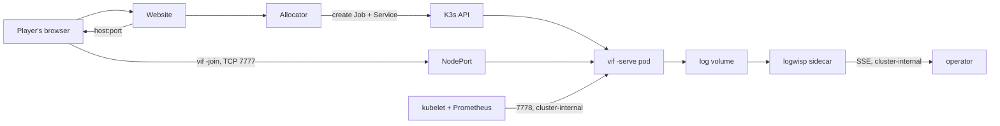

# K3s and container deployment on the Arch guest

This is the installation and operating procedure for the allocated-session
deployment: a website asks for a game, one container appears, and it ends itself
when nobody is in it. The host is an Arch Linux bhyve guest on FreeBSD 15.1;
FreeBSD's own routing and packet filtering are a separate task and are described
here only as the requirements this deployment places on them (§7).

The fleet plan, the gap register, and the acceptance gates are in
[K3s dedicated-server fleet plan](kubernetes-fleet.md). This document is the part
you type.

## 1. What is deployed

| Property | Value |
|---|---|
| Session unit | One `vif -serve` process, one pod, one Job, one Service. |
| Concurrency ceiling | 10 sessions, enforced by a namespace `ResourceQuota`. |
| First-guest window | 90 s. A session nobody reaches exits and is removed. |
| Empty grace | 90 s after the last guest leaves. Also the window a dropped player has to reclaim their own slot. |
| Drain | 20 s on `SIGTERM`, inside a 30 s termination grace period. |
| Trigger | The website's allocator, on a player's request. Nothing is running when nobody is playing. |
| Image | `scratch` + one static binary, about 13 MB, non-root, read-only root filesystem, no shell. |
| Logs and metrics | JSON lines to a shared in-memory volume; a LogWisp sidecar puts them on its stdout and serves them live as Server-Sent Events. The metrics travel in that stream. |
| Game transport | Raw framed TCP, one long-lived connection per player. Not HTTP, so not Ingress. |

A session is a thing that ends, which is why it is a `Job` and not a `Deployment`.
The world is in memory: when the process exits the match is over, and a replacement
pod would be an empty session holding a port players were told to dial.



## 2. Arch guest prerequisites

Record every version with the acceptance run; Arch is rolling and an unrecorded
upgrade must not silently change the baseline.

```sh
uname -a
systemd-detect-virt                      # expect: bhyve
findmnt -no FSTYPE /sys/fs/cgroup        # expect: cgroup2fs
timedatectl status                       # expect: synchronized
lscpu | grep -E 'Model name|^CPU\(s\)'
ip -br link; ip route
```

Then:

```sh
sudo pacman -Syu --needed curl iptables-nft conntrack-tools ethtool
sudo systemctl enable --now systemd-timesyncd
sudo swapoff -a && sudo sed -i '/\sswap\s/s/^/#/' /etc/fstab
```

Sizing, before anything is installed: reserve memory for FreeBSD, for the Arch
guest itself, and for the K3s control plane before counting sessions. Ten sessions
at the manifest's 192 MiB limit is 1.9 GiB of game, and the quota in
`deploy/k3s/10-quota.yaml` is what holds that number to it.

Confirm the guest's MTU end to end before blaming the game protocol for anything.
A bridged/tap VirtIO attachment with a stable address is the configuration to test
first.

## 3. Install K3s

Pin the version. `INSTALL_K3S_VERSION` is the one field that must not be left to
whatever the channel serves on the day.

```sh
curl -sfL https://get.k3s.io | INSTALL_K3S_VERSION=v1.34.6+k3s1 sh -s - \
    --write-kubeconfig-mode 0640 \
    --disable traefik \
    --disable servicelb \
    --secrets-encryption \
    --kube-apiserver-arg=service-node-port-range=31700-31709
```

- **`--disable traefik`** — the game protocol is raw TCP. An HTTP ingress
  controller has nothing to route here and is attack surface for a workload that
  does not use it.
- **`--disable servicelb`** — sessions are reached by NodePort. Klipper would bind
  host ports of its own and make the mapping harder to reason about, not easier.
- **`--secrets-encryption`** — nothing here stores a Secret yet; turning it on
  before there is one is cheaper than migrating later.
- **`service-node-port-range=31700-31709`** — exactly ten ports for exactly ten
  sessions. The pool becomes a fact the API server enforces, the firewall forwards
  a range instead of a class, and an allocator bug cannot place a session on a port
  nobody opened.
- **Network policy is left enabled.** K3s enforces `NetworkPolicy` through its
  bundled controller; the manifests in `deploy/k3s/20-networkpolicy.yaml` are load
  bearing, so do not install with `--disable-network-policy`.

Verify before continuing:

```sh
sudo k3s check-config
sudo kubectl get nodes -o wide
sudo kubectl -n kube-system get pods
sudo systemctl reboot        # then repeat the two commands above
```

A node that does not come back Ready after a reboot is an infrastructure blocker,
not a workload problem.

## 4. Build and load the image

```sh
make image IMAGE_TAG=$(git rev-parse --short HEAD)
make image-check IMAGE_TAG=$(git rev-parse --short HEAD)
```

`image-check` runs the image's own `-check` as UID 65532, read-only, with no
network and no capabilities. It is the only way to prove a `scratch` image starts:
there is no shell in it to ask.

With no registry, import straight into the node's containerd:

```sh
docker save vi-fighter:$(git rev-parse --short HEAD) \
  | sudo k3s ctr images import -
sudo k3s ctr images ls | grep vi-fighter
```

For anything past the lab, push to a registry and reference the image **by
digest**, not by tag. A tag can be moved; a session's logs then name a revision
that is no longer what ran.

## 5. Apply the fleet objects

```sh
sudo kubectl apply -f deploy/k3s/00-namespace.yaml
sudo kubectl apply -f deploy/k3s/10-quota.yaml
sudo kubectl apply -f deploy/k3s/20-networkpolicy.yaml
sudo kubectl apply -f deploy/k3s/40-allocator-rbac.yaml
sudo kubectl apply -f deploy/k3s/50-logwisp.yaml
```

These are the boundary. The namespace enforces `restricted` Pod Security, the
quota caps the fleet at ten, the policies deny everything not named, and the Role
is the whole of what the allocator may do. `30-session.yaml` is a **template**, not
an object to apply — it is rendered per session.

Verify the boundary holds before trusting it:

```sh
# Pod Security refuses a privileged pod in this namespace
sudo kubectl -n vif run pstest --image=busybox --restart=Never \
    --overrides='{"spec":{"containers":[{"name":"c","image":"busybox","securityContext":{"privileged":true}}]}}'
# expect: forbidden ... violates PodSecurity "restricted"

# NetworkPolicy is actually enforced by the CNI
sudo kubectl -n kube-system get pods | grep -i kube-router
```

## 6. Create a session by hand

Do this once before wiring the website, so "the allocator is broken" and "the
workload is broken" stay separable questions.

```sh
./deploy/k3s/render-session.sh 7f3c1a 31700 vi-fighter:$(git rev-parse --short HEAD) \
  | sudo kubectl apply -f -

sudo kubectl -n vif get pods,svc -l vif.lixenwraith.dev/session=7f3c1a
sudo kubectl -n vif logs -l vif.lixenwraith.dev/session=7f3c1a -f
```

From another machine, within 90 seconds:

```sh
./bin/vif -join <arch-guest-address>:31700
```

Then confirm each of these:

| Check | Expected |
|---|---|
| Nobody joins for 90 s | Pod exits 0; log says `session ended … no guest connected within 1m30s`; Job completes; the Service is removed with it. |
| A guest joins and quits | Log says `roster empty for 1m30s` 90 s later, and the pod exits 0. |
| A guest quits and rejoins within 90 s | The session continues, and the player is back in the slot their departure released. |
| `kubectl -n vif delete job …` while a guest plays | Log says `signal received … phase=draining`; `/health` stays 200 and its body reports `ready=false`; the pod exits when the roster empties or after 20 s. |
| Roster at `-players` | `/health` 200 with `ready=false reason=session at capacity`; the guests already in it keep playing. |

The operator ports answer from inside the cluster only:

```sh
sudo kubectl -n vif port-forward job/vif-session-7f3c1a 7778:7778 8080:8080 &
curl -s localhost:7778/health          # one path: code is liveness, body is the rest
curl -s localhost:7778/metrics | head
curl -sN localhost:8080/stream | head  # the live log, metrics included
```

There is one health path. Its status code answers one question — should this process
still be running — and everything else is in the body: `ready`, which is whether a
dial would be admitted, `phase`, and `expires_in`. That last pair is what an
allocator needs and a roster count cannot say: not how many are in the session, but
how long it has left before it ends itself.

## 7. What the network and firewall task must provide

This is the repository-side statement of the requirement; the FreeBSD routing and
`pf`/`ipfw` configuration is its own task.

| Requirement | Detail |
|---|---|
| Forward the session port pool | TCP 31700-31709 from the public address to the Arch guest. Ten ports, one per session, matching `service-node-port-range`. |
| Never forward the operator ports | 7778 (health, metrics) and 8080 (the log stream) are unauthenticated operational data — roster, tick, remaining lifetime, and every line the session writes. They stay inside the cluster. |
| Never forward the K3s API | TCP 6443 is reachable from the operator's network only. |
| Hold idle TCP open | A session holds one long-lived connection per player. Every stateful hop must keep an idle mapping alive for at least the 90 s empty grace, and preferably a whole match; test 30 minutes. |
| Preserve the client source address | The Services use `externalTrafficPolicy: Local`. A NAT hop that rewrites the source makes per-address admission limits meaningless. |
| Fix the MTU | Measure end to end with non-fragmenting payloads before attributing loss to the game protocol. |
| Restrict who may reach the pool | Until authenticated identity and transport security land (F1/F2 in [kubernetes-fleet.md](kubernetes-fleet.md)), the game port must be reachable only from a VPN or a trusted client network. Every connected peer can influence the shared simulation. |
| Allocator reachability | The website's allocator needs the K3s API; the player needs only the forwarded pool. These are different networks and should stay different. |

## 8. The allocator contract

The allocator belongs with the website, not with this repository. What it must do
against these objects:

1. **Hold the port pool.** Ten ports, one session each. Rebuild the map on start by
   listing Jobs in `vif` — the cluster is the state, the allocator's memory is a
   cache.
2. **Create the Job first, then the Service** with `ownerReferences` pointing at the
   Job's UID. That is what makes the endpoint disappear with the session instead of
   holding a port against a match that no longer exists.
3. **Wait for the health body, not for the pod to exist.** A pod that is `Running`
   may still be building its world. `live=true ready=true` is the moment a dial is
   admitted, and the player's 90-second window has already started.
4. **Give the player `host:port`.** The commissioned endpoint is the only thing
   joining the website to the container; there is no credential and none is planned
   (see the fleet plan's §3 and §4).
5. **Refuse at ten.** The quota also refuses, but an allocator that discovers the
   ceiling through an API error has already told a player they had a game.
6. **Do not resurrect.** A completed Job is a finished match. The player asks for a
   new session; they do not reconnect to that one.

The permissions this needs, and no more, are in `deploy/k3s/40-allocator-rbac.yaml`.

## 9. Operating

**Where the session says what it did.** Logs are JSON lines on a shared volume; the
LogWisp sidecar puts them on its own stdout (`kubectl logs -c logwisp`) and serves
them live on `/stream`. The session's metrics are in that same stream —
`internal/status` emits the whole registry as `sub="stat"` records on a tick cadence
— so watching the log is watching the gauges. One line ends every session and names
why:

```json
{"msg":"session ended","phase":"expired","reason":"roster empty for 1m30s","guests":0,"tick":240}
```

`reason` is one of: `no guest connected within …`, `roster empty for …`, `drained`,
`drain deadline … reached holding N guest(s)`, or an operator-supplied cause.

**What to watch.** Sessions expiring with `no guest connected` far more often than
players report failed joins is the signature of a broken path between the website
and the forwarded port range — nothing inside the cluster shows it. So is the fleet
sitting at the ten-session quota, which is a player being told there is no game.

**Upgrades.** Sessions are ephemeral, so a rollout is mostly a matter of not
starting new sessions on the old image. Point the allocator at the new digest;
existing sessions finish on their own within a match plus 90 seconds. Delete the
old Jobs only if you mean to drain them.

**Node maintenance.** Stop the allocator, wait for the running sessions to end
(they will, within a match plus the grace), then `kubectl drain`. A session that
must go now is drained by deleting its Job, which is a `SIGTERM` and therefore the
20-second drain, not a kill.

## 10. What this deployment does not yet have

The full list is the fleet plan's [work list](kubernetes-fleet.md#3-work-list). The
two that decide how this may be exposed:

- **The game port is open and unauthenticated, by decision.** Anyone who reaches it
  can join a session. That is accepted; what is not is a stranger doing worse than
  playing, and two windows still allow it — a peer that completes the handshake and
  goes silent holds a fresh session open, and a peer that connects and drops during
  the startup gate ends it. Both are confined to the moment before a session starts.
  Until they are closed (H1), the forwarded range must stay behind a VPN or a
  trusted client network, which is why §7 exists.
- **The resource envelope is unmeasured at a full roster.** The values in the
  manifest are a starting point from single-guest runs, not a result. Ten sessions
  per node is a claim until an hour of four-player play says otherwise.

Three more that the first container pass has to get right rather than discover:

- **A vacant session stops its clock on purpose.** With nobody in it a pod answers
  `live=true ready=true clock=paused phase=vacant` and its `tick` stops moving. A
  liveness probe written against a moving tick counter would restart a perfectly
  healthy session that is simply waiting; write it against `live`, and readiness
  against `ready`. The tick is a diagnostic in the body, not a heartbeat.
- **Losing the pod ends the session, and that is the intended behaviour.**
  `-serve` defaults to `-authority host`: no guest inherits the world, because a
  guest cannot be dialled and none of the others knows where it is. What replaces
  the pod is the orchestrator, at the same Service address, and the guests
  reconnect there. Do not set `-authority migrate` on a fleet session — it would
  leave each guest playing a private continuation that looks like the session.
- **`-empty` and the in-pod restart are two answers to one condition, and the
  manifest picks one.** With `-empty` the pod exits when the roster has been empty
  that long, which is what the fleet wants: one Job, one session, the allocator
  places the next. Without it the pod stays and restarts its own world after a
  minute, which suits a host somebody left running. The fleet objects set `-empty`,
  so the restart path does not run there; see fleet plan H7.
