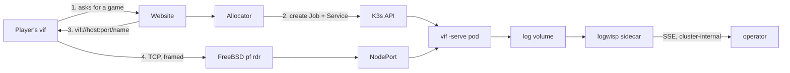

# Deploying the session fleet on a FreeBSD host

This is the blueprint for the proof-of-concept deployment: a website asks for a
game, one container appears on a K3s node, a player somewhere on the Internet dials
it, and it ends itself when nobody is in it. The node is an Arch Linux bhyve guest
on FreeBSD 15.1; the FreeBSD host owns routing and packet filtering with `pf`.

The plan, the gap register and the acceptance gates are in
[K3s dedicated-server fleet plan](kubernetes-fleet.md); the objects are in
[`deploy/`](../deploy/README.md). This document is the part you type, in the order
you type it.

## 0. What this assumes, and what you must decide

Read this section before step 1. Each entry names the step it becomes effective at,
because most of them change what that step should say.

| # | Assumption or decision | Effective at |
|---|---|---|
| A1 | **Every address here is an example** from RFC 5737 documentation ranges and is meant to be substituted: `203.0.113.7` for the host's public address, `192.0.2.20` for the Arch guest, `198.51.100.0/24` for the jails already on the host. Nothing in this repository holds a real address. | §3 |
| A2 | **`pf` owns the path and `ipfw` is not in it.** The rules below are FreeBSD's classic `rdr`/`nat` syntax. If the host's `pf.conf` is written in the newer `match … rdr-to` form, translate them rather than mixing the two — a ruleset with both is refused. | §3 |
| A3 | **The jails are already using `rdr` rules.** The fleet's port range must not collide with theirs, and the fleet's rules must be evaluated in the same pass. §3 puts them in a named anchor so the two rulesets stay separable. | §3 |
| A4 | **The Arch guest reaches the Internet and nothing reaches it unasked.** The only inbound path is the `rdr` in §3. There is no firewall on the guest, which means anything already on the guest's own network can reach a NodePort directly. | §4 |
| A5 | **Docker is a build tool here, not a runtime.** K3s runs containerd. Docker exists on the guest to build the image and is stopped afterwards, because its `iptables` rules and K3s's share one table. | §5 |
| A6 | **One node, no registry.** Images are imported straight into the node's containerd. A second node or a real registry changes §7 and nothing else. | §7 |
| A7 | **Sessions are reached on a port range, not on one port.** Ten NodePorts, one per session. §2 explains why a single fixed public port needs a front door and what it costs; §11 is that front door if you want it. | §2 |
| A8 | **There is no authentication and no transport encryption, by decision.** Anyone who has a link can play, and anyone who can reach the port can join any session whose *name* they can produce. Names must therefore be unguessable — 128 bits of randomness, not a counter. | §2 |
| A9 | **The allocator needs the K3s API and the player does not.** Where the allocator runs decides whether port 6443 has to leave the guest. §10 gives the two answers; pick one before wiring the website. | §10 |
| A10 | **The session's playout lead is chosen from its *first* guest's link** and holds for the life of the match. A session opened by a nearby player and joined by a distant one runs at the near player's lead. The late-crossing fence makes that cost freshness rather than correctness (fleet plan §5), but it is the reason a full-roster measurement (H3) is worth doing over real links rather than a LAN. | §9 |
| A11 | **The resource envelope is unmeasured at a full roster.** The requests and limits in the manifest come from single-guest runs. Ten sessions per node is a claim until an hour of four-player play says otherwise. | §8 |

## 1. The shape



What a session is, what bounds its life, and what it costs are in the fleet plan's
[§1](kubernetes-fleet.md#1-what-is-deployed) and [§6](kubernetes-fleet.md#6-resources);
they are not repeated here. The two facts this procedure turns on: the game
transport is **raw framed TCP, not HTTP**, so nothing here is an Ingress; and a
session is **a thing that ends**, so it is a Job and not a Deployment.

## 2. The link a player is given

A player receives one string and pastes it after `-join`:

```
vif://203.0.113.7:31703/4f8a1c2e9b7d4a3f8e6c5b0a29d7f134
```

`-join` accepts that whole form, `host:port/name`, and a bare `host:port`. The name
is sent as one frame before the handshake, and the session refuses a dial that named
another — which is what keeps a stale link out of the match that inherited its port.
The pod is started with `-name` set to the same value by
[`deploy/k3s/30-session.yaml`](../deploy/k3s/30-session.yaml).

**The name is the only thing standing between a stranger and a session** (A8), so
generate it the way you would generate a session cookie:

```sh
SESSION_ID=$(openssl rand -hex 16)     # 32 characters, 128 bits
```

**Why the port varies.** The coordinator speaks first: a dialer that has connected
receives `MsgJoinOffer` before it says anything. A router in front of ten sessions
therefore cannot learn which one a connection wants from the network alone — the
port is what tells it. That is why the fleet forwards a ten-port range, and it is
the whole content of A7.

The routing frame is what removes that constraint when you want it removed: it is
the first thing on the wire, it is fixed-offset, and its content is the session's
name. A front door that reads it can put every session behind one public port
(§11), at the cost of the client's source address — which is the key the per-address
admission limiter uses. For the proof of concept the port range is the recommended
answer: it needs no extra component, it preserves the source address, and the link a
player is given has the same shape either way.

## 3. FreeBSD: forward the range to the guest

The public address, the guest's address and the jail network below are examples
(A1). `pf` is the only filter in the path (A2).

```sh
# /etc/pf.conf, at the top with the other macros
ext_if      = "em0"
pub_ip      = "203.0.113.7"
vm_ip       = "192.0.2.20"          # the Arch guest
jail_net    = "198.51.100.0/24"     # bastille, already here
vif_ports   = "31700:31709"         # ten sessions, one port each
```

Redirection, in its own anchor so the fleet's rules and the jails' stay separable
(A3). The anchor is declared where the rest of the translation rules are, and its
body is loaded from a file:

```sh
# translation rules, before the filter rules
nat on $ext_if from $jail_net to any -> ($ext_if)
rdr-anchor "vif/*"
```

```sh
# /etc/pf.vif.conf
rdr pass on $ext_if inet proto tcp from any to $pub_ip port $vif_ports -> $vm_ip
```

```sh
sudo pfctl -a vif -f /etc/pf.vif.conf
sudo pfctl -s nat -a vif          # the rule is loaded
sudo pfctl -s state | grep 3170   # a state appears when a player connects
```

Four requirements this has to keep meeting, and one that is easy to get wrong:

| Requirement | Why |
|---|---|
| Forward **only** 31700-31709 | It is the whole player-facing surface. 7778 (health, metrics), 8080 (the log stream) and 6443 (the K3s API) are unauthenticated operational data and never leave the guest. |
| Do not rewrite the source address | The Services use `externalTrafficPolicy: Local` and the session's admission limiter is keyed on the dialing address. A `rdr` preserves it; a `nat` in the same direction would not. |
| Leave `tcp.established` alone | A session holds one long-lived connection per player. The default is hours and the protocol sends a heartbeat every ten seconds, so an idle mapping is not the failure mode — a *short* `set timeout tcp.established` is. |
| Do not collide with the jails | `pfctl -s nat` shows every anchor's rules; check the range is unclaimed before loading it. |
| Fix the MTU before blaming the game | Measure end to end with non-fragmenting payloads. A bridged/tap VirtIO attachment with a stable address is the configuration to test first. |

## 4. Arch guest prerequisites

Record every version with the acceptance run; Arch is rolling and an unrecorded
upgrade must not silently change the baseline.

```sh
uname -a                                 # kernel, recorded
systemd-detect-virt                      # expect: bhyve
findmnt -no FSTYPE /sys/fs/cgroup        # expect: cgroup2fs
timedatectl status                       # expect: synchronized
lscpu | grep -E 'Model name|^CPU\(s\)'
ip -br link; ip route
```

```sh
sudo pacman -Syu --needed curl iptables-nft conntrack-tools ethtool
sudo systemctl enable --now systemd-timesyncd
sudo swapoff -a && sudo sed -i '/\sswap\s/s/^/#/' /etc/fstab

# Pod networking needs both; neither is on by default on a fresh guest.
printf 'overlay\nbr_netfilter\n' | sudo tee /etc/modules-load.d/k3s.conf
sudo modprobe overlay br_netfilter
printf 'net.ipv4.ip_forward=1\nnet.bridge.bridge-nf-call-iptables=1\n' \
  | sudo tee /etc/sysctl.d/99-k3s.conf
sudo sysctl --system
```

**Sizing, before anything is installed.** Reserve memory for FreeBSD, for the guest
itself and for the K3s control plane before counting sessions. Ten sessions at the
manifest's 192 MiB limit is 1.9 GiB of game, and the quota in
[`10-quota.yaml`](../deploy/k3s/10-quota.yaml) is what holds the number to it.

## 5. Docker, for building the image

Docker is here to build (A5). It is not what runs the sessions.

```sh
sudo pacman -S --needed docker
sudo systemctl enable --now docker
sudo usermod -aG docker "$USER"     # log out and back in
docker info | grep -i 'storage driver'
```

**The one thing to check after installing it.** Docker sets the `FORWARD` chain's
default policy to `DROP`, and K3s relies on that chain for pod and NodePort traffic.
On this node the two coexist because K3s inserts its own `ACCEPT` rules, but verify
it rather than assuming it — after installing Docker, after every Docker upgrade,
and after a reboot:

```sh
sudo iptables -S FORWARD | head -1        # expect: -P FORWARD ACCEPT
```

If it reads `DROP`, `sudo iptables -P FORWARD ACCEPT` restores it, and a NodePort
that answered before and does not now is the symptom you are looking for.

Stop the daemon when you are not building. A build host that is also a running
container runtime is two things claiming one packet path:

```sh
sudo systemctl stop docker docker.socket
```

## 6. K3s

Pin the version. `INSTALL_K3S_VERSION` is the one field that must not be left to
whatever the channel serves on the day.

```sh
curl -sfL https://get.k3s.io | INSTALL_K3S_VERSION=v1.34.6+k3s1 sh -s - \
    --write-kubeconfig-mode 0640 \
    --disable traefik \
    --disable servicelb \
    --secrets-encryption \
    --kube-apiserver-arg=service-node-port-range=31700-31709
```

- **`--disable traefik`** — the game protocol is raw TCP. An HTTP ingress controller
  has nothing to route here and is attack surface for a workload that does not use
  it.
- **`--disable servicelb`** — sessions are reached by NodePort. Klipper would bind
  host ports of its own and make the mapping harder to reason about, not easier.
- **`--secrets-encryption`** — nothing here stores a Secret yet; turning it on
  before there is one is cheaper than migrating later.
- **`service-node-port-range=31700-31709`** — exactly ten ports for exactly ten
  sessions, matching the range `pf` forwards. The pool becomes a fact the API server
  enforces, and an allocator bug cannot place a session on a port nobody opened.
- **Network policy stays enabled.** K3s enforces `NetworkPolicy` through its bundled
  controller; the manifests in `20-networkpolicy.yaml` are load bearing, so do not
  install with `--disable-network-policy`.

Verify before continuing:

```sh
sudo k3s check-config
sudo kubectl get nodes -o wide
sudo kubectl -n kube-system get pods
sudo systemctl reboot        # then repeat the two commands above, and §5's iptables check
```

A node that does not come back Ready after a reboot is an infrastructure blocker,
not a workload problem.

## 7. Build and load the image

```sh
sudo systemctl start docker
make image IMAGE_TAG=$(git rev-parse --short HEAD)
make image-check IMAGE_TAG=$(git rev-parse --short HEAD)
```

`image-check` runs the image's own `-check` as UID 65532, read-only, with no network
and no capabilities. It is the only way to prove a `scratch` image starts: there is
no shell in it to ask.

With no registry (A6), import straight into the node's containerd:

```sh
docker save vi-fighter:$(git rev-parse --short HEAD) | sudo k3s ctr images import -
sudo k3s ctr images ls | grep vi-fighter
sudo systemctl stop docker docker.socket
```

For anything past the lab, push to a registry and reference the image **by digest**,
not by tag. A tag can be moved; a session's logs then name a revision that is no
longer what ran.

## 8. Apply the fleet objects

```sh
sudo kubectl apply -f deploy/k3s/00-namespace.yaml
sudo kubectl apply -f deploy/k3s/10-quota.yaml
sudo kubectl apply -f deploy/k3s/20-networkpolicy.yaml
sudo kubectl apply -f deploy/k3s/40-allocator-rbac.yaml
sudo kubectl apply -f deploy/k3s/50-logwisp.yaml
```

These are the boundary. The namespace enforces `restricted` Pod Security, the quota
caps the fleet at ten, the policies deny everything not named, and the Role is the
whole of what the allocator may do. `30-session.yaml` is a **template**, not an
object to apply — it is rendered per session. The requests it carries are a starting
point rather than a measurement (A11).

Verify the boundary holds before trusting it:

```sh
# Pod Security refuses a privileged pod in this namespace
sudo kubectl -n vif run pstest --image=busybox --restart=Never \
    --overrides='{"spec":{"containers":[{"name":"c","image":"busybox","securityContext":{"privileged":true}}]}}'
# expect: forbidden ... violates PodSecurity "restricted"

# NetworkPolicy is actually enforced by the CNI
sudo kubectl -n kube-system get pods | grep -i kube-router
```

## 9. Create one session by hand

Do this before wiring the website, so "the allocator is broken" and "the workload is
broken" stay separable questions.

```sh
SESSION_ID=$(openssl rand -hex 16)
./deploy/k3s/render-session.sh "$SESSION_ID" 31700 vi-fighter:$(git rev-parse --short HEAD) \
  | sudo kubectl apply -f -

sudo kubectl -n vif get pods,svc -l vif.lixenwraith.dev/session="$SESSION_ID"
sudo kubectl -n vif logs -l vif.lixenwraith.dev/session="$SESSION_ID" -f
echo "vif://203.0.113.7:31700/$SESSION_ID"
```

From another machine on the Internet, within 90 seconds:

```sh
./bin/vif -join vif://203.0.113.7:31700/<the session id>
```

Then confirm each of these:

| Check | Expected |
|---|---|
| The link, from outside | The player joins. The session's `playout lead chosen` log line names the lead this match will run at for its whole life (A10). |
| A link with the wrong name | `this address is not serving the session that was dialled`, in under a second, before an identity is allocated. |
| Nobody joins for 90 s | Pod exits 0; log says `session ended … no guest connected within 1m30s`; the Job completes and the Service goes with it. |
| A guest joins and quits | Log says `roster empty for 1m30s` 90 s later, and the pod exits 0. |
| A guest quits and rejoins within 90 s | The session continues, and the player is back in the slot their departure released. |
| `kubectl -n vif delete job …` while a guest plays | Log says `signal received … phase=draining`; `/health` stays 200 and its body reports `ready=false`; the pod exits when the roster empties or after 20 s. |
| Roster at `-players` | `/health` 200 with `ready=false reason=session at capacity`; the guests already in it keep playing. |

The operator ports answer from inside the cluster only:

```sh
sudo kubectl -n vif port-forward job/vif-session-$SESSION_ID 7778:7778 8080:8080 &
curl -s localhost:7778/health          # one path: code is liveness, body is the rest
curl -s localhost:7778/metrics | head
curl -sN localhost:8080/stream | head  # the live log, metrics included
```

There is one health path. Its status code answers one question — should this process
still be running — and everything else is in the body: `ready`, which is whether a
dial would be admitted, `phase`, and `expires_in`. That last pair is what an
allocator needs and a roster count cannot say: not how many are in the session, but
how long it has left before it ends itself.

A vacant pod answers `live=true ready=true clock=paused phase=vacant` and its `tick`
stops moving. That is correct and is exactly what a naive liveness rule reads as a
hang, which is why the manifest's probes are written against `/health` and not
against a moving counter.

## 10. The allocator contract

The allocator belongs with the website, not with this repository. **Where it runs is
A9 and you decide it here:** it needs the K3s API, the player needs only the
forwarded range, and those should stay different networks. For the proof of concept,
run the allocator *on the Arch guest* and let the website call it over whatever the
website already trusts. Exposing 6443 to the Internet to save that hop gives away
the cluster.

What it must do against these objects:

1. **Hold the port pool.** Ten ports, one session each. Rebuild the map on start by
   listing Jobs in `vif` — the cluster is the state, the allocator's memory is a
   cache.
2. **Name the session with 128 bits of randomness** and use that name for the
   Kubernetes object, the `-name` argument and the link. It is the only thing making
   a session hard to walk into (A8).
3. **Create the Job first, then the Service** with `ownerReferences` pointing at the
   Job's UID. That is what makes the endpoint disappear with the session instead of
   holding a port against a match that no longer exists.
4. **Wait for the health body, not for the pod to exist.** A pod that is `Running`
   may still be building its world. `live=true ready=true` is the moment a dial is
   admitted, and the player's 90-second window has already started.
5. **Give the player one link**, `vif://host:port/name`. There is no credential and
   none is planned (fleet plan §3 and §4).
6. **Refuse at ten.** The quota also refuses, but an allocator that discovers the
   ceiling through an API error has already told a player they had a game.
7. **Do not resurrect.** A completed Job is a finished match. The player asks for a
   new session; they do not reconnect to that one.

The permissions this needs, and no more, are in
[`40-allocator-rbac.yaml`](../deploy/k3s/40-allocator-rbac.yaml).

## 11. Optional: one fixed public port

Take this only if a single public port is worth more than the client's source
address; the port range in §3 is the recommended proof-of-concept answer (A7).

A front door on the guest binds 7777, reads the routing frame the dialer sends
before the handshake, and splices the connection to the session whose name it
carries. [`deploy/frontdoor/haproxy.cfg`](../deploy/frontdoor/haproxy.cfg) is that,
in HAProxy's TCP mode: ten pre-declared backends, one per NodePort, and a map from
name to backend that the allocator writes over the runtime socket. No reload, and no
per-session configuration file.

```sh
sudo pacman -S --needed haproxy socat
sudo install -m 0644 deploy/frontdoor/haproxy.cfg /etc/haproxy/haproxy.cfg
sudo install -m 0644 /dev/null /etc/haproxy/vif-sessions.map
sudo systemctl enable --now haproxy

# the allocator does this when it creates a session, and the reverse when it ends
printf 'set map /etc/haproxy/vif-sessions.map %s vif-0\n' "$SESSION_ID" \
  | sudo socat stdio /run/haproxy/admin.sock
```

`pf` then forwards one port instead of ten:

```sh
rdr pass on $ext_if inet proto tcp from any to $pub_ip port 7777 -> $vm_ip port 7777
```

and the link loses its port: `vif://203.0.113.7:7777/<name>`.

**What it costs.** The pod sees HAProxy's address rather than the player's, so the
per-address admission limiter (`NetworkAdmitBurst` in one `NetworkAdmitWindow`)
becomes one budget for every player instead of one each. Nothing else changes: the
session still refuses a name that is not its own, so a misrouted or stale connection
is a refusal rather than a wrong match.

## 12. Operating

**Where a session says what it did.** Logs are JSON lines on a shared volume; the
LogWisp sidecar puts them on its own stdout (`kubectl logs -c logwisp`) and serves
them live on `/stream`. The session's metrics are in that same stream —
`internal/status` emits the whole registry as `sub="stat"` records on a tick cadence
— so watching the log is watching the gauges. One line ends every session and names
why:

```json
{"msg":"session ended","phase":"expired","reason":"roster empty for 1m30s","guests":0,"tick":240}
```

`reason` is one of: `no guest connected within …`, `roster empty for …`, `drained`,
`drain deadline … reached holding N guest(s)`, or an operator-supplied cause.

**What to watch.** Sessions expiring with `no guest connected` far more often than
players report failed joins is the signature of a broken path between the website
and the forwarded range — the `pf` rule, the NodePort, or a name the allocator and
the pod disagree about. Nothing inside the cluster shows it; `pfctl -s state` and the
refusal line in the pod's log are where it is visible. So is the fleet sitting at the
ten-session quota, which is a player being told there is no game.

**Upgrades.** Sessions are ephemeral, so a rollout is mostly a matter of not starting
new sessions on the old image. Point the allocator at the new digest; existing
sessions finish on their own within a match plus 90 seconds. Delete the old Jobs only
if you mean to drain them.

**Node maintenance.** Stop the allocator, wait for the running sessions to end (they
will, within a match plus the grace), then `kubectl drain`. A session that must go
now is drained by deleting its Job, which is a `SIGTERM` and therefore the 20-second
drain, not a kill.

## 13. What this deployment does not yet have

The full list is the fleet plan's [work list](kubernetes-fleet.md#3-work-list). What
decides how this may be exposed:

- **The game port is open and unauthenticated, by decision** (A8). The session name
  is a routing key, not a credential: it keeps a stranger out of a session they
  cannot name, and it does nothing about one who was given a link. What is still
  unbounded is narrower than that and is H1 — a peer that completes the handshake and
  goes silent holds a fresh session open, and a peer that connects and drops during
  the startup gate ends it. Both are confined to the moment before a session starts,
  and both need a peer running this build with this session's identity.
- **The resource envelope is unmeasured at a full roster** (A11).
- **Losing the pod ends the session, and that is intended.** `-serve` defaults to
  `-authority host`: no guest inherits the world, because a guest cannot be dialled
  and none of the others knows where it is. What replaces the pod is the orchestrator,
  at the same Service address. Do not set `-authority migrate` on a fleet session — it
  would leave each guest playing a private continuation that looks like the session.
- **`-empty` and the in-pod restart are two answers to one condition, and the
  manifest picks one.** With `-empty` the pod exits when the roster has been empty
  that long, which is what the fleet wants: one Job, one session, the allocator places
  the next. Without it the pod stays and restarts its own world after a minute, which
  suits a host somebody left running. The fleet objects set `-empty`, so the restart
  path does not run there; see fleet plan H7.
