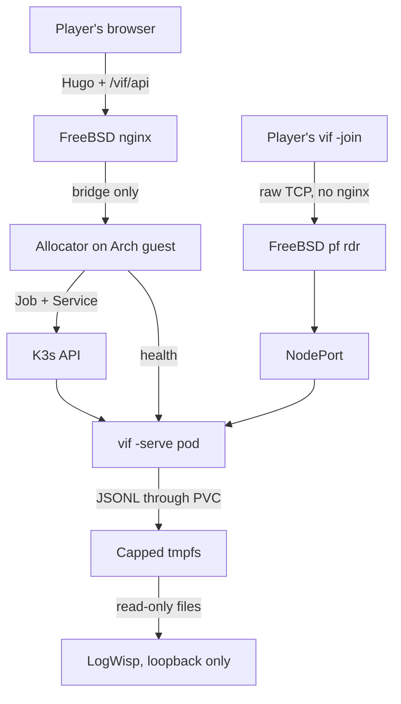

# Deploying the session fleet

This is the blueprint for the proof-of-concept deployment: a website asks for a
game, one container appears on a K3s node, a player somewhere on the Internet dials
it, and it ends itself when nobody is in it. The proven production node is an Arch
Linux bhyve guest on FreeBSD 15.1; the FreeBSD host owns routing and packet
filtering with `pf`.

A bare systemd-based Arch or Ubuntu development node can begin at §4 and use the
same Docker, K3s, systemd, Kubernetes, and allocator steps. Its operator supplies
the equivalent inbound routing/firewall boundary instead of copying the FreeBSD
`pf` sections. Distribution-specific package commands are explicit below and in
[`deploy/guest/README.md`](../deploy/guest/README.md).

The plan, the gap register and the acceptance gates are in
[K3s dedicated-server fleet plan](kubernetes-fleet.md); the objects are in
[`deploy/`](../deploy/README.md). This document is the part you type, in the order
you type it.

## 0. What this assumes, and what you must decide

Read this section before step 1. Each entry names the step it becomes effective at,
because most of them change what that step should say.

| # | Assumption or decision | Effective at |
|---|---|---|
| A1 | **Every address here is an example** from RFC 5737 documentation ranges and is meant to be substituted: `203.0.113.7` for the host's public address, `192.0.2.20` for the Arch guest, `198.51.100.0/24` for the jails already on the host. Nothing in this repository holds a real address. | §3 |
| A2 | **`pf` owns the path and `ipfw` is not in it.** The rules below are FreeBSD's classic `rdr`/`nat` syntax. If the host's `pf.conf` is written in the newer `match … rdr-to` form, translate them rather than mixing the two — a ruleset with both is refused. | §3 |
| A3 | **The jails are already using `rdr` rules.** The fleet's port range must not collide with theirs, and the fleet's rules must be evaluated in the same pass. §3 puts them in a named anchor so the two rulesets stay separable. | §3 |
| A4 | **The Arch guest is on a private /24 behind a bhyve bridge.** The FreeBSD host is that subnet's gateway; the guest reaches the Internet and nothing reaches it unasked. The only public inbound path is the `rdr` in §3. §6 adds an `nftables` ruleset on the guest so that stays true of the guest's own network too, and so it survives a `pf` mistake. | §4 |
| A5 | **Docker is a build tool here, not a runtime.** K3s runs containerd. Docker exists on the guest to build the image and is stopped afterwards, because its `iptables` rules and K3s's share one table. | §5 |
| A6 | **One node, no registry.** The vi-fighter image is imported straight into the node's containerd and every session container uses `imagePullPolicy: IfNotPresent`. A second node or a real registry changes §7 and nothing else. | §7 |
| A7 | **A session is reached on its own port.** Ten NodePorts, one per container, forwarded as one range. It is the whole of the routing, and it is why the deployed session manifest sets no `-name`. §2 says what a single fixed public port would cost instead; §11 is that alternative, worked but not pursued. | §2 |
| A8 | **The website path and the game connection are independent.** Hugo pages and the allocator API are HTTPS through the host's nginx; the game is raw TCP straight to a forwarded port and never passes through nginx. Page TLS therefore has no bearing on a join, and the allocator commissions the route without proxying it. | §2 |
| A9 | **There is no authentication and no transport encryption, by decision.** Anyone who can reach a forwarded port can join the session behind it, and the link is public. What bounds a stranger is the forwarded surface being ten ports and nothing else. | §2 |
| A10 | **The allocator runs on the Arch guest.** It needs the K3s API and node-local access to the pod probes; neither the player nor nginx does. Port 6443 does not leave the guest. The host's nginx reaches only the allocator's narrow HTTP API across the bridge. | §10 |
| A11 | **The session's playout lead is chosen from its *first* guest's link** and holds for the life of the match. A session opened by a nearby player and joined by a distant one runs at the near player's lead. The late-crossing fence makes that cost freshness rather than correctness (fleet plan §5), but it is the reason a full-roster measurement (H3) is worth doing over real links rather than a LAN. | §9 |
| A12 | **The resource envelope is unmeasured at a full roster.** The requests and limits in the manifest come from single-guest runs. Ten sessions per node is a claim until an hour of four-player play says otherwise. | §8 |
| A13 | **Cluster commands in this procedure run through `sudo kubectl`.** K3s is installed with kubeconfig mode `0640`; the install script self-escalates, but the resulting kubeconfig is not made readable to the ordinary login user. | §6 |
| A14 | **The fleet's public log stream uses node-local files.** The capped tmpfs, local PV/PVC, live file-writing workload, pod-log RBAC removal, and standalone LogWisp installation, isolation, fan-in, outage, and retained-replay gates are deployed and passed. Batch F's tested allocator byte proxy awaits its live cutover; Kubernetes and the allocator never tail pod logs. | §10 |
| A15 | **Source-address preservation is intended, not proved.** `externalTrafficPolicy: Local` and `pf rdr` should leave the off-box player's address visible to the pod, but the acceptance run did not record it. The per-address admission bound depends on this. | §9 |
| A16 | **The allocator control API is deployed; its tested stream proxy and the website are not.** §10 fixes the narrow `/vif/api/` contract. The service, rotating credential, create/list API, off-box join, file path, reduced Role, and isolated loopback LogWisp pipeline passed. Batch F deploys the proxy and a local bounded viewer before nginx/Hugo integration. | §10 |
| A17 | **The vi-fighter JSON line is the log contract.** The current file records originate in `internal/vlog`; every public hop must preserve those bytes. No allocator parsing, field insertion, or serialization is allowed. | §10 |

## 1. The shape



This is the live shape after Batch E. The tmpfs-backed local PV/PVC is empty
between sessions; LogWisp has no allocator or Kubernetes credential dependency;
two simultaneous sources streamed exact bytes without drops; and stopping it did
not stop allocation, state, or gameplay. Restart replay preserved an exact source
record while its bounded client queue dropped 86 of 1,841 processed records. The
Batch F allocator proxy is implemented and tested but not yet deployed. Its live
gate and the remaining order are in [`kube-todo.md`](kube-todo.md).

What a session is, what bounds its life, and what it costs are in the fleet plan's
[§1](kubernetes-fleet.md#1-what-is-deployed) and [§6](kubernetes-fleet.md#6-resources);
they are not repeated here. The three facts this procedure turns on: the game
transport is **raw framed TCP, not HTTP**, so nothing here is an Ingress and the
game connection never enters nginx (A8); a session is **a thing that ends**, so it
is a Job and not a Deployment; and there is **one node and one cluster**, so every
Service, port and rule below has exactly one place to be.

## 2. The link a player is given

Two strings, and keeping them apart is the whole of the design:

| String | What it is | Who reads it |
|---|---|---|
| `https://lixen.com/projects/vi-fighter/session/31703/` | The shareable link. A Hugo page over TLS, served by the host's nginx from the project's document root. | A browser. |
| `lixen.com:31703` | The join target. Raw framed TCP straight to a forwarded port. | `vif -join`. |

The page will be what a player clicks and forwards to a friend; its contract is to
show the join command, the roster the allocator read from `/health`, and how long
the session has left. The allocator now supplies that data; the page is not built
yet (A16). The game
connection they describe does not pass through nginx, is not TLS, and is not
affected by page rendering — which is why a certificate problem cannot break a
join, and why the game needs no HTTP anything (A8).

One nginx location will serve every session's page, because the only thing that
differs between them is the port:

```nginx
# The project page and one page per live session, from the same Hugo output.
location = /projects/vi-fighter/ { try_files $uri /projects/vi-fighter/index.html; }

# The port names the container; session.html reads it from its own URL and asks
# the allocator for that session's health-derived status.
location ~ "^/projects/vi-fighter/session/(?<vifport>3170[0-9])/$" {
    try_files /projects/vi-fighter/session.html =404;
}
```

**Why the port is the whole of the routing.** The coordinator speaks first: a dialer
that has connected receives `MsgJoinOffer` before it says anything. Nothing in a
plaintext game connection names a session — there is no HTTP path to route on and no
TLS SNI to read — so the destination port is the only signal a router or a firewall
has. Ten ports for ten containers makes that signal exact and needs no component to
interpret it. The route is intended to preserve the player's source address, which
the per-address admission limiter is keyed on; §9 keeps that as an A15 gate rather
than claiming the acceptance run proved it.

The consequence, and it is deliberate: **the deployed session sets no `-name`.** A
pod started with one refuses every dial that does not name it, and a player dialing
`lixen.com:31703` names nothing. The name mechanism exists, is tested, and belongs to
the single-port alternative in §11, which is not the path taken here.

## 3. FreeBSD: forward the range to the guest

The public address, the guest's address and the jail network below are examples
(A1). `pf` is the only filter in the path (A2).

```sh
# /etc/pf.conf, at the top with the other macros
ext_if      = "em0"
pub_ip      = "203.0.113.7"
vm_ip       = "192.0.2.20"          # the Arch guest
jail_net    = "198.51.100.0/24"     # bastille, already here
vif_ports   = "31700:31709"         # ten sessions, one port each
```

Redirection, in its own anchor so the fleet's rules and the jails' stay separable
(A3). The anchor is declared where the rest of the translation rules are, and its
body is loaded from a file:

```sh
# translation rules, before the filter rules
nat on $ext_if from $jail_net to any -> ($ext_if)
rdr-anchor "vif/*"
```

```sh
# /etc/pf.vif.conf
rdr pass on $ext_if inet proto tcp from any to $pub_ip port $vif_ports -> $vm_ip
```

```sh
sudo pfctl -a vif -f /etc/pf.vif.conf
sudo pfctl -s nat -a vif          # the rule is loaded
sudo pfctl -s state | grep 3170   # a state appears when a player connects
```

The public-address test is valid only from a machine off the FreeBSD host.
`rdr on $ext_if` matches packets arriving inbound on that interface; a connection
originated by the host to `203.0.113.7` bypasses translation and can return an
immediate RST that looks like a filter rejection. From the host, test the guest
directly instead: `nc -vz 192.0.2.20 31700`.

Four requirements this has to keep meeting, and one that is easy to get wrong:

| Requirement | Why |
|---|---|
| Forward **only** 31700-31709 | It is the whole player-facing surface. 7778 (health, metrics), 8080 (the log stream) and 6443 (the K3s API) are unauthenticated operational data and never leave the guest. |
| Do not rewrite the source address | The Services use `externalTrafficPolicy: Local` and the session's admission limiter is keyed on the dialing address. `rdr` rather than same-direction `nat` is the intended preserving path; the off-box address must still be verified at the pod (A15). |
| Leave `tcp.established` alone | A session holds one long-lived connection per player. The default is hours and the protocol sends a heartbeat every ten seconds, so an idle mapping is not the failure mode — a *short* `set timeout tcp.established` is. |
| Do not collide with the jails | `pfctl -s nat` shows every anchor's rules; check the range is unclaimed before loading it. |
| Fix the MTU before blaming the game | Measure end to end with non-fragmenting payloads. A bridged/tap VirtIO attachment with a stable address is the configuration to test first. |

**The host's nginx has no part in this.** It terminates TLS for the page and nothing
else (A8); the game ports are `rdr`ed past it in the kernel. If you would rather have
nginx carry them anyway — one `stream { server { listen 31703; proxy_pass … } }` per
port — it works, and it costs the second row of the table above: an nginx `stream`
proxy replaces the client's source address with the host's unless it is run
transparently. Prefer the `rdr`.

## 4. Linux node prerequisites

Record every version with the acceptance run. Arch is rolling, Ubuntu releases
change their kernel and package baseline, and neither may change silently.

```sh
uname -a                                 # kernel, recorded
systemd-detect-virt                      # bhyve, another VM type, or none
findmnt -no FSTYPE /sys/fs/cgroup        # expect: cgroup2fs
timedatectl status                       # expect: synchronized
lscpu | grep -E 'Model name|^CPU\(s\)'
ip -br link; ip route
```

```sh
. /etc/os-release
case "$ID" in
  arch)
    sudo pacman -Syu --needed \
      curl git go jq make python util-linux iptables-nft conntrack-tools \
      ethtool tcpdump
    ;;
  ubuntu)
    sudo apt-get update
    sudo apt-get install -y \
      ca-certificates curl git golang-go jq make python3 util-linux iptables conntrack \
      ethtool tcpdump
    ;;
  *)
    printf 'unsupported distribution: %s\n' "$ID" >&2
    false
    ;;
esac
sudo systemctl enable --now systemd-timesyncd

# A zram generator can recreate swap after fstab is clean. Mask every generated
# swap unit that exists before switching swap off.
systemctl list-units --all 'dev-zram*.swap'
systemctl list-unit-files --no-legend 'dev-zram*.swap' | \
  while read -r unit _; do
    test -z "$unit" || sudo systemctl mask --now "$unit"
  done
sudo swapoff -a && sudo sed -i '/\sswap\s/s/^/#/' /etc/fstab
free -m                                    # expect: Swap total 0

# Pod networking needs both; neither is on by default on a fresh guest.
printf 'overlay\nbr_netfilter\n' | sudo tee /etc/modules-load.d/k3s.conf
sudo modprobe overlay br_netfilter
printf 'net.ipv4.ip_forward=1\nnet.bridge.bridge-nf-call-iptables=1\n' \
  | sudo tee /etc/sysctl.d/99-k3s.conf
sudo sysctl --system
```

`swapoff -a` and an edited `fstab` are not sufficient when a zram generator
recreates its generated unit. If `free -m` still reports swap and
`k3s check-config` still warns, mask the actual `dev-zram*.swap` unit printed above,
switch it off, and recheck before installing K3s.

**Sizing, before anything is installed.** Reserve memory for the host or VM, the
node OS, and the K3s control plane before counting sessions. Ten sessions at the
manifest's 192 MiB limit is 1.9 GiB of game, and the quota in
[`10-quota.yaml`](../deploy/k3s/10-quota.yaml) is what holds the number to it.

## 5. Docker, for building the image

Docker is here to build (A5). It is not what runs the sessions.

```sh
. /etc/os-release
case "$ID" in
  arch) sudo pacman -S --needed docker ;;
  ubuntu) sudo apt-get install -y docker.io ;;
esac
sudo systemctl enable --now docker
sudo usermod -aG docker "$USER"     # log out and back in
docker info | grep -i 'storage driver'
```

**The one thing to check after installing it.** Docker sets the `FORWARD` chain's
default policy to `DROP`, and K3s relies on that chain for pod and NodePort traffic.
On this node the two coexist because K3s inserts its own `ACCEPT` rules, but verify
it rather than assuming it — after installing Docker, after every Docker upgrade,
after a reboot, and after every `docker start` or `docker restart`:

```sh
sudo iptables -S FORWARD | head -1        # expect: -P FORWARD ACCEPT
```

If it reads `DROP`, `sudo iptables -P FORWARD ACCEPT` restores it, and a NodePort
that answered before and does not now is the symptom you are looking for.
`systemctl stop docker` does not restore the policy Docker set; check it after the
stop as well instead of treating a stopped daemon as a rollback.

After the first build, keep Docker, its socket, and the system containerd disabled.
K3s runs its own embedded containerd, so this does not stop the node. Start Docker
explicitly for a build and stop it immediately afterwards:

```sh
sudo systemctl disable --now docker.service docker.socket containerd.service
sudo systemctl start docker
# build, save and import the image (§7)
sudo systemctl stop docker.service docker.socket containerd.service
```

## 6. K3s

Pin the version. `INSTALL_K3S_VERSION` is the one field that must not be left to
whatever the channel serves on the day.

The install script self-escalates. With `--write-kubeconfig-mode 0640`, every
cluster command below is nevertheless run as `sudo kubectl` (A13); do not copy the
node's root kubeconfig into an ordinary user's home to avoid writing `sudo`.

```sh
curl -sfL https://get.k3s.io | INSTALL_K3S_VERSION=v1.34.6+k3s1 sh -s - \
    --write-kubeconfig-mode 0640 \
    --disable traefik \
    --disable servicelb \
    --secrets-encryption \
    --kube-apiserver-arg=service-node-port-range=31700-31709
```

- **`--disable traefik`** — the game protocol is raw TCP. An HTTP ingress controller
  has nothing to route here and is attack surface for a workload that does not use
  it.
- **`--disable servicelb`** — sessions are reached by NodePort. Klipper would bind
  host ports of its own and make the mapping harder to reason about, not easier.
- **`--secrets-encryption`** — nothing here stores a Secret yet; turning it on
  before there is one is cheaper than migrating later.
- **`service-node-port-range=31700-31709`** — exactly ten ports for exactly ten
  sessions, matching the range `pf` forwards. The pool becomes a fact the API server
  enforces, and an allocator bug cannot place a session on a port nobody opened.
- **Network policy stays enabled.** K3s enforces `NetworkPolicy` through its bundled
  controller; the manifests in `20-networkpolicy.yaml` are load bearing, so do not
  install with `--disable-network-policy`.

Verify before continuing:

```sh
sudo k3s check-config
sudo kubectl get nodes -o wide
sudo kubectl -n kube-system get pods
```

Configure the guest filter below before rebooting. Its first-load audit and the
reboot that proves the loaded rules match the files are part of the same gate; the
NodePort half is completed in §9, once a session endpoint exists.

### The guest's own filter

`pf` on the FreeBSD host is what decides who reaches the guest from the Internet.
This is the second half: what reaches the guest from its own network, and what
survives a `pf` mistake (A4). It is written after K3s because it has to be written
around K3s.

**The rule that matters: never `flush ruleset`.** K3s and Docker both program
their rules through `iptables-nft`, which puts them in ordinary nftables tables
beside yours. `flush ruleset` — the first line of Arch's shipped
`/etc/nftables.conf` — destroys those too. Kube-proxy resyncs within a minute and
flannel's rules may not, so the failure looks like a cluster that half works. Own
one table and replace only that.

The corollary is just as important: owning one table preserves every table you did
not write, **including an unwanted one**. Stock Arch can already have an empty
`table inet filter` with a `forward` hook and `policy drop`. Every hook is evaluated
per table and one drop is final, so that surviving table blackholes NodePort traffic
while SSH, ICMP, guest egress, and every visible `iptables` accept continue to work.

Before writing the ruleset, derive the operator address and the guest's actual SSH
port from the live session. `$SSH_CONNECTION` is `client-address client-port
server-address server-port`; guessing either field can leave the current connection
alive under `ct state established` while every replacement login is locked out:

```sh
set -- $SSH_CONNECTION
[ "$#" -eq 4 ] || { echo 'SSH_CONNECTION is unavailable'; exit 1; }
operator_addr=$1
operator_port=$4
sudo install -d -m 0755 /etc/nftables.d
printf 'define operator_addr = %s\ndefine operator_ports = { %s }\n' \
  "$operator_addr" "$operator_port" | sudo tee /etc/nftables.d/vif-operator.nft
```

The file those values feed is the only place host-to-guest operator ports are
accepted. It starts with SSH; §10 adds the allocator's 9080. Port 6443 is
deliberately absent: the operator reaches `kubectl` through SSH, so the Kubernetes
API does not cross the bridge (A10).

```nft
#!/usr/bin/nft -f
# /etc/nftables.conf — NOT `flush ruleset`; see doc/kube_docker_deploy.md §6.
include "/etc/nftables.d/vif-operator.nft"

# The pair makes a first load safe and every later load a replacement.
table inet vif
delete table inet vif

table inet vif {
	chain input {
		# Run after kube-proxy so its endpoint-less NodePort REJECT is stable
		# across both boot and a manual nftables reload.
		type filter hook input priority filter + 10; policy drop;

		ct state { established, related } accept
		ct state invalid drop
		iif lo accept

		# The cluster and Docker build bridges talk to the node itself here.
		iifname { "cni0", "flannel.1", "docker0" } accept
		ip saddr { 10.42.0.0/16, 10.43.0.0/16 } accept

		ip protocol icmp accept

		# Operator ports from the host-derived address, nowhere else.
		ip saddr $operator_addr tcp dport $operator_ports accept
	}

	chain forward {
		# A NodePort is DNATed before routing, so player traffic uses this hook.
		# K3s needs accept here and Docker may replace the policy (§5).
		type filter hook forward priority filter; policy accept;
	}
}
```

```sh
. /etc/os-release
case "$ID" in
  arch) sudo pacman -S --needed nftables ;;
  ubuntu) sudo apt-get install -y nftables ;;
esac
sudo install -m 0644 /path/to/the/file /etc/nftables.conf

# Remove a distribution-shipped forward-policy table if one exists.
sudo nft delete table inet filter 2>/dev/null || true

# If the replacement locks out SSH, remove only this table in twenty minutes.
# pf still guards the public perimeter while it is absent.
sudo systemd-run --on-active=20m --unit=nft-rollback \
  /usr/bin/nft delete table inet vif
sudo nft -f /etc/nftables.conf
sudo systemctl enable nftables
sudo nft list table inet vif
```

Open a second SSH connection before cancelling the rollback. Once that connection,
the cluster checks below, and the table audit all pass:

```sh
sudo systemctl stop nft-rollback.timer
sudo nft list ruleset | grep '^table'
```

The expected set is `table inet vif` plus the named `ip`/`ip6` tables installed by
K3s through `iptables-nft`; `table inet filter` and any other unexplained table are
absent. Repeat this audit after the first load and after every reboot. During an
Arch upgrade, treat `/etc/nftables.conf.pacnew` as a fresh hostile default: never
merge back `flush ruleset` or the shipped `inet filter` table. A blind merge
restores the failure at the next service start.

Verify the cluster survived it, in this order — each answers a different failure:

```sh
sudo kubectl -n kube-system get pods        # CoreDNS still Ready: pod networking
sudo kubectl get --raw /readyz              # the API server is still reachable
sudo iptables -S FORWARD | head -1          # still -P FORWARD ACCEPT (§5)
sudo nft list ruleset | grep '^table'       # no surviving table inet filter
```

Now reboot and repeat those four checks, plus `free -m`. This is the only check that
proves the service-loaded ruleset matches the files rather than merely the manual
load above:

```sh
sudo systemctl reboot
# reconnect, then repeat node readiness, /readyz, FORWARD, the table audit and free -m
```

A node that does not come back Ready is an infrastructure blocker, not a workload
problem. §9 completes this gate with a live EndpointSlice and off-box NodePort join.

**If you prefer `iptables`:** the same shape is an `INPUT` policy of `DROP` with the
same accepts and `-P FORWARD ACCEPT`, and on Arch it lands in the same kernel tables
through `iptables-nft`. That is exactly why the two coexist, and exactly why
`flush ruleset` breaks them. Do not run both a hand-written `iptables` ruleset and a
hand-written `nftables` one — pick the one you will remember to read.

## 7. Build and load the session image

The container build does not use `bin/vif`. Do not run `make release` for this
deployment, and do not run both `make image` and the explicit `docker build`
below: `make image` is a wrapper around `docker build`. The command below is the
single image build and is written explicitly to retain the required
`--network host`, revision label, and commit-derived tag.

No earlier step creates a source tree. Clone vi-fighter once, then remain in its
root: every `make` and `kubectl apply` command in §7-§9 assumes that directory.

```sh
mkdir -p ~/git/lixenwraith && cd ~/git/lixenwraith
git clone https://github.com/lixenwraith/vi-fighter
cd vi-fighter
VIF_ROOT=$PWD
```

The vi-fighter builder pin and module directive are deliberately the same patch
release. Check them before Docker downloads the module graph; an older builder
otherwise reports the mismatch only after that download has consumed the build:

```sh
module_go=$(awk '$1 == "go" { print $2; exit }' go.mod)
image_go=$(sed -n 's/^ARG GO_VERSION=//p' deploy/docker/Dockerfile)
printf 'go.mod=%s Dockerfile=%s\n' "$module_go" "$image_go"
test "$module_go" = "$image_go"                 # expect: 1.27.1 = 1.27.1
```

Start Docker and immediately repeat the `FORWARD` check from §5. The verified build
path uses the host network because the build container could not resolve DNS under
the guest ruleset. Accepting `docker0` in §6 is the tidier path and lets `make image`
work normally; `--network host` is the reliable one. This is also an ordering
constraint: §6 describes a guest Docker has already changed, not a ruleset to load
before §5 without re-auditing its interfaces.

```sh
sudo systemctl start docker
sudo iptables -S FORWARD | head -1

VIF_TAG=$(git rev-parse --short=8 HEAD)
VIF_REVISION=$(git rev-parse HEAD)
docker build --network host \
  -f deploy/docker/Dockerfile \
  --build-arg VERSION="$VIF_TAG" \
  --build-arg REVISION="$VIF_REVISION" \
  -t "vi-fighter:$VIF_TAG" .
make image-check IMAGE_TAG="$VIF_TAG"
```

`image-check` runs vi-fighter's own `-check` as UID 65532, read-only, with no
network and no capabilities.

With no registry (A6), import the image into the node's containerd and verify the
name before stopping Docker. `IfNotPresent` in every session container is load
bearing: a floating `:latest` would default to `Always` and bypass this import.

```sh
docker save "vi-fighter:$VIF_TAG" | sudo k3s ctr images import -
sudo k3s ctr images ls | grep vi-fighter
sudo systemctl stop docker.service docker.socket containerd.service
sudo iptables -S FORWARD | head -1
```

For subsequent releases, the checked-in helper performs this sequence once rather
than asking an operator to repeat it piecemeal:

```sh
# Run only with a clean worktree and no session Jobs or pods (including TTL remnants).
./deploy/guest/update-vif-image.sh             # current commit's eight-character tag
./deploy/guest/update-vif-image.sh v1.2.3      # or an explicit release tag
```

It pauses an active allocator, starts Docker, restores `FORWARD ACCEPT`, builds and
checks one image, imports it into K3s, updates `VIF_ALLOCATOR_IMAGE` when the
allocator environment exists, removes older vi-fighter image references, disables
Docker and the distribution containerd, then restores the allocator. It deliberately
refuses an occupied fleet: changing the configured image does not require killing a
match, while deleting an image out from under one has no operational value. This is
the manual release boundary the future CI job should invoke or reproduce.

Do not install LogWisp during the image step. Batch E owns its binary, file-source
configuration, unprivileged user, hardened unit, and loopback verification as one
change after the writer and storage path pass. Its checked-in file source replaces
the superseded console-source and sidecar experiments; neither old design is a
fallback.

For anything past the lab, publish the vi-fighter image and reference it **by
digest**, not by tag. A tag can be moved; a session's logs then name a revision that
is no longer what ran.

## 8. Apply the fleet objects

This base block establishes the namespace, policy, quota, and current least-
privilege allocator identity. Immediately afterward, complete
[`deploy/guest/README.md`](../deploy/guest/README.md) §Batch B before creating a
manual session or installing the allocator: the current renderer and allocator
both require the Bound `vif-fleet-logs` claim. Batch B creates the locked
`vif-fleet` host identity at the containers' UID/GID 65532, installs the
fail-closed tmpfs dependency, and renders `05-log-volume.yaml`; never apply that
file with `${NODE_NAME}` intact.

```sh
sudo kubectl apply -f deploy/k3s/00-namespace.yaml
sudo kubectl apply -f deploy/k3s/10-quota.yaml
sudo kubectl apply -f deploy/k3s/20-networkpolicy.yaml
sudo kubectl apply -f deploy/k3s/40-allocator-rbac.yaml
```

There is no `50-logwisp.yaml`: the rejected per-session sidecar ConfigMap and
renderer branch were removed with Batch C's repository change. Batch E installs
one independent node service instead.

These are the boundary. The namespace enforces `restricted` Pod Security, the quota
caps the fleet at ten, the policies deny everything not named, and the Role is the
whole of what the allocator may do. `30-session.yaml` is a **template**, not an
object to apply — it is rendered per session. The requests it carries are a starting
point rather than a measurement (A12).

Verify the boundary holds before trusting it:

```sh
# Pod Security refuses a privileged pod in this namespace
sudo kubectl -n vif run pstest --image=busybox --restart=Never \
    --overrides='{"spec":{"containers":[{"name":"c","image":"busybox","securityContext":{"privileged":true}}]}}'
# expect: forbidden ... violates PodSecurity "restricted"

# After §9 creates a pod, kube-router's per-pod chains prove enforcement.
sudo iptables-save -c | grep 'KUBE-POD-FW-'
```

K3s embeds the kube-router controller in the `k3s` process; there is no
`kube-router` pod to find in `kube-system`. Once a session pod exists, its
`KUBE-POD-FW-*` chains appear in `iptables-save -c`. Take the counter view before
and after one connection attempt: the relevant chain's counter must move. That is
the enforcement proof; the existence of the `NetworkPolicy` API object is not.

## 9. Create one session by hand

Do this before wiring the website, so "the allocator is broken" and "the workload
is broken" stay separable questions. The template's 90-second first-join fuse is a
production bound, not a debugging allowance: it will delete the target while its
network is being investigated. `render-session.sh` therefore accepts `FIRST_JOIN`
and `EMPTY_GRACE` overrides. Use an extended value for the path and reboot gates,
then test the defaults separately.

The session ID names the Kubernetes objects; the player sees only the port (A7).
`session.sh` is the repeatable manual path: it creates the Job, reads its UID, then
creates the owned Service. It chooses a free port when none is supplied, cleans a
partial create, and refuses to overwrite an existing session. The renderer creates
one session container with the shared PVC and commissioned file arguments. It has
no LogWisp image or sidecar option.

```sh
SESSION_ID=s1
VIF_TAG=$(git rev-parse --short=8 HEAD)

FIRST_JOIN=20m EMPTY_GRACE=20m \
  ./deploy/k3s/session.sh create "$SESSION_ID" 31700 \
  "docker.io/library/vi-fighter:$VIF_TAG"

./deploy/k3s/session.sh list
# Before reusing the ID or port:
./deploy/k3s/session.sh delete "$SESSION_ID"
```

Inspect the pod first, then make the EndpointSlice the first network check:

```sh
SERVICE="vif-session-$SESSION_ID"
sudo kubectl -n vif get pods,svc -l vif.lixenwraith.dev/session="$SESSION_ID"
sudo kubectl -n vif get endpointslice \
  -l "kubernetes.io/service-name=$SERVICE" -o wide
```

A pod is Ready only when every container is, so a healthy session beside a second
container in `ImagePullBackOff` shows `0/2` and is not Ready. With the checked-in
guest filter, kube-proxy handles an endpoint-less NodePort first and returns
`connection refused`. An older equal-priority filter could instead time out after
a manual nftables reload; neither symptom proves a `pf` fault.

Once an endpoint exists, walk outward from the pod rather than inward from the
Internet. `bash -c "</dev/tcp/host/port"` is enough when `nc` is absent:

```sh
POD_IP=$(sudo kubectl -n vif get pod \
  -l vif.lixenwraith.dev/session="$SESSION_ID" \
  -o jsonpath='{.items[0].status.podIP}')
CLUSTER_IP=$(sudo kubectl -n vif get svc "$SERVICE" \
  -o jsonpath='{.spec.clusterIP}')

bash -c "</dev/tcp/$POD_IP/7777"          # pod route and policy
bash -c "</dev/tcp/$CLUSTER_IP/7777"      # Service DNAT
bash -c "</dev/tcp/127.0.0.1/31700"       # local NodePort
bash -c "</dev/tcp/192.0.2.20/31700"      # guest address and NodePort
```

From the FreeBSD host, test `192.0.2.20:31700` directly. Test
`203.0.113.7:31700` only from an off-box machine (§3). The acceptance run reached
the real game through that entire path and joined successfully:

```sh
./bin/vif -join 203.0.113.7:31700
```

Take counter snapshots immediately before and after one failed connection when a
step does not answer. A NodePort SYN is DNATed in `prerouting` and forwarded, so it
never visits the guest's `input` chain:

```sh
sudo iptables-save -c > /tmp/iptables.before
sudo nft list ruleset > /tmp/nft.before
# Make exactly one connection attempt here.
sudo iptables-save -c > /tmp/iptables.after
sudo nft list ruleset > /tmp/nft.after
diff -u /tmp/iptables.before /tmp/iptables.after
diff -u /tmp/nft.before /tmp/nft.after

sudo conntrack -L -p tcp | grep 31700
sudo tcpdump -ni cni0 'tcp port 7777'
```

The last rule whose counter moves names the component that handled the packet.
Traffic visible on `cni0` reached the pod side of routing; a moving
`KUBE-POD-FW-*` counter proves the policy path ran. A forward-path counter that
moves with no conntrack entry for the tuple means forwarding accepted the packet
and another hook dropped it before the routing decision completed. Compare
`nft list ruleset`, not only `iptables-save`: another table on the same hook can
drop a packet every visible iptables chain accepted.

NetworkPolicy enforcement is checked here because the per-pod chains do not exist
before a pod does:

```sh
sudo iptables-save -c | grep 'KUBE-POD-FW-'
# Make one game-port connection, then repeat and confirm a counter delta.
sudo iptables-save -c | grep 'KUBE-POD-FW-'
```

The operator ports stay off the player path. From Batch C onward the node file is
the JSON-line contract (A17); do not use Kubernetes logs as the public data path.
Check the commissioned file's envelope and self-tag:

```sh
sudo kubectl -n vif port-forward job/vif-session-$SESSION_ID 7778:7778 &
curl -s localhost:7778/health
curl -s localhost:7778/metrics | head

sudo test -s "/var/log/vif-fleet/$SESSION_ID.jsonl"
sudo jq -s -e --arg id "$SESSION_ID" '
  map(select(.sub != null)) as $records |
  ($records | length > 0) and
  all($records[]; .fields.session_id == $id)
' "/var/log/vif-fleet/$SESSION_ID.jsonl"
```

A `sub`, `tick`, or matching `fields.session_id` missing here means the writer
contract failed. No per-session sidecar endpoint exists.

There is one health path. Its code answers whether the process should live; the
body carries `ready`, `phase`, `guests`, `capacity`, and `expires_in`. A vacant pod
correctly reports `live=true ready=true clock=paused phase=vacant` while its tick
stops. With `-empty`, the parked world is preserved for that whole grace; the
one-minute fresh-world reset applies only when `-empty=0`. The allocator must read
the health words rather than treating a moving tick or `Running` as readiness.

Delete the manual session before the reboot gate. A reboot ends every in-memory
match; no Job replacement may be advertised as the same session. After reboot,
verify the node is Ready, the `vif` namespace is empty, Docker and the system
containerd are inactive, `inet vif` exists, and the imported image remains. Then
create and join a new session. This gate passed on 2026-09-11.

Source preservation remains a separate open gate (A15) and is the one place this
deployment needs a code change. The address is already carried —
`network.JoinerReport.Remote` holds `conn.RemoteAddr()` and reaches
`App.noteJoinerReport` — but only `reach.noteDeclared` reads it, so no record names
it and the run's journal cannot settle the question. Add the field to the admitted-
participant record in `internal/app/host.go`, then repeat the remote join. If the
address is rewritten, the per-address admission limiter becomes one shared budget
for the whole fleet.

Deployment status through the 2026-09-13 Batch E run:

| Check | Status | Expected evidence |
|---|---|---|
| Nobody joins for 90 s | **Passed** | Exit 0 at 90 s with `no guest connected`; Job Complete; its owned Service was garbage-collected after the 120 s Job TTL; quota returned to zero. |
| Allocator create, list, join and delete | **Passed** | The host service minted its restricted token, both probes answered, `POST` returned a ready EndpointSlice and pod-health state, an off-box client joined through the returned target, the API followed the occupied/vacant transition, and operator cleanup removed the test. |
| Batch B volatile storage | **Passed** | The locked `vif-fleet` UID/GID 65532 identity, capped tmpfs, fail-closed K3s dependency, Bound local PV/PVC, Restricted writer, direct-`hostPath` rejection, cleanup timer, remote join, unchanged stdout, and empty steady state passed. |
| Batch C file-writing Jobs | **Passed** | The live allocator created one tokenless Restricted session container with the PVC and no direct `hostPath` or `-log-stdout`. Off-box join, occupied/vacant state, complete application-record session tagging, Job/pod/Service deletion, file cleanup, and empty steady state passed. |
| Batch D least-privilege allocator | **Passed** | The live Role denied `pods/log` while retaining the allocator permissions required for create, list, readiness, state, and cleanup. |
| Batch E standalone LogWisp | **Passed** | The locked service, read-only tmpfs view, loopback listener, exact two-session fan-in, outage independence, exact retained replay, and common cleanup passed. Normal fan-in dropped nothing; restart replay recorded 86 bounded client-queue drops among 1,841 processed records. |
| A guest joins and quits | Partial | The allocator API reported the occupied then vacant transition; automatic exit after the 90-second empty grace remains to be observed without manual cleanup. |
| A guest quits and rejoins at about 75 s | Open | The same run and world continue in the released slot. |
| Delete the Job while a guest plays | Open | `phase=draining`, health 200 with `ready=false`, then exit on an empty roster or after 20 s. |
| Roster reaches `-players` | Open | Health 200 with `ready=false reason=session at capacity`; existing guests continue. |

`render-session.sh` omits the Service owner when `JOB_UID` is unset. Use it only to
inspect a render or supply the UID during a two-stage caller. `session.sh` is the
manual transaction and its delete command also clears leftovers from an older,
unowned render:

```sh
./deploy/k3s/session.sh delete "$SESSION_ID"
```

## 10. The allocator and website contract

[`tool/vif-allocator`](../tool/vif-allocator/README.md) implements the session API
and fixed Kubernetes transaction described here. The website is still Hugo output
served by the FreeBSD host's nginx. Static JavaScript cannot hold Kubernetes
credentials, so nginx reverse-proxies one same-origin API prefix to the allocator.
The allocator holds the restricted credential and creates or observes sessions.
Raw game traffic still bypasses nginx and the allocator completely (A8).

Kubernetes remains the scheduler and lifecycle owner. It deliberately has no
anonymous application endpoint that means "allocate one safe vi-fighter session";
exposing its API would instead let a caller choose arbitrary workload fields. The
allocator is only that narrow translation boundary: select one of ten ports, create
the fixed Job and owned Service, read health, and reconcile. A shell CGI would still
be an allocator with a cluster credential, only harder to constrain and recover.

### 10.1 Location and network boundary

The allocator runs on the Arch guest; this is not an interchangeable placement.
The run showed kube-router installing a node-local-source allowance before the pod
policy path. A process on the node can therefore read a session pod's `/health`
directly on the pod IP. A process on the FreeBSD host or another machine cannot:
`allow-operator-ports` admits 7778 and 8080 only from the monitoring namespace, and
moving the allocator there would require widening that policy. It also holds the
node aggregator's loopback stream (§10.3), which nothing off the guest can reach.

Port 6443 never leaves the Arch guest. The allocator connects to
`https://127.0.0.1:6443`; the FreeBSD host reaches only the allocator's HTTP port
across the bridge. There is no new `pf rdr`: the allocator is not public and the
host-to-guest bridge path already exists.

The guest's `input` policy is `drop`. At allocator installation, add 9080 to the
`operator_ports` set created in §6; the existing rule then admits it only from the
FreeBSD host. Confirm that address against the default route and use the same
rollback procedure before loading the change:

```sh
host_bridge_addr=$(ip route show default | awk 'NR == 1 { print $3 }')
printf 'host bridge: %s\n' "$host_bridge_addr"
```

```nft
# /etc/nftables.d/vif-operator.nft, using documentation values
define operator_addr = 192.0.2.1
define operator_ports = { 22, 9080 }
```

The example allocator address below uses the documentation guest and an example
port. Substitute the derived bridge values; do not add the port to the public
`vif_ports` range:

```nginx
location = /vif/api/logs {
    proxy_pass http://192.0.2.20:9080;
    proxy_http_version 1.1;
    proxy_set_header Connection "";
    proxy_buffering off;
    proxy_read_timeout 1h;
}

location /vif/api/ {
    proxy_pass http://192.0.2.20:9080;
    proxy_http_version 1.1;
    proxy_set_header Host $host;
    proxy_set_header X-Forwarded-Proto $scheme;
    proxy_read_timeout 120s;
    client_max_body_size 1k;
}
```

The browser calls `/vif/api/...` on the same origin as the Hugo page. That removes
CORS from the design; do not replace it with `Access-Control-Allow-Origin: *`.

### 10.2 Credential and API

[`40-allocator-rbac.yaml`](../deploy/k3s/40-allocator-rbac.yaml) defines the entire
permission surface: create/read/watch/delete Jobs and Services, read/watch pods and
events, in `vif` and nowhere else. The checked-in Role deliberately omits
`pods/log`; no allocator code calls it. That reduction passed on the upgraded
node after the file path, while a fresh node receives it here.
`pods/exec`, `pods/portforward` and every pod write verb stay absent. The allocator
must not use
`/etc/rancher/k3s/k3s.yaml` or a copy of the node's root kubeconfig. It reads the
cluster CA and a short-lived `vif-allocator` ServiceAccount token from separate
files. The token is re-read on every Kubernetes request, so a root timer can replace
it atomically without restarting the process.

Build and install the host service after §8 has applied its ServiceAccount and Role:

```sh
make allocator

getent group vif-allocator >/dev/null || sudo groupadd --system vif-allocator
id -u vif-allocator >/dev/null 2>&1 || sudo useradd --system \
  --gid vif-allocator --home-dir / --shell /usr/bin/nologin vif-allocator

sudo install -d -o root -g vif-allocator -m 0750 /etc/vif-allocator
sudo install -d -o root -g root -m 0755 /usr/local/libexec
sudo install -o root -g root -m 0755 bin/vif-allocator /usr/local/bin/vif-allocator
sudo install -o root -g vif-allocator -m 0640 \
  /var/lib/rancher/k3s/server/tls/server-ca.crt \
  /etc/vif-allocator/server-ca.crt
sudo install -o root -g vif-allocator -m 0640 \
  deploy/guest/vif-allocator.env.example /etc/vif-allocator/allocator.env
sudo install -o root -g root -m 0755 \
  deploy/guest/vif-allocator-refresh-token.sh \
  /usr/local/libexec/vif-allocator-refresh-token
sudo install -o root -g root -m 0644 \
  deploy/guest/vif-allocator.service \
  deploy/guest/vif-allocator-token.service \
  deploy/guest/vif-allocator-token.timer /etc/systemd/system/

# Set the imported image tag and the public hostname/page URL; there are no secrets
# in this file, but keep its write permission with root.
sudoedit /etc/vif-allocator/allocator.env

sudo systemctl daemon-reload
sudo systemctl enable --now vif-allocator-token.timer vif-allocator.service
```

The allocator is a host process. Starting it does not create a Kubernetes Job,
pod or Service; those appear only after `POST /vif/api/sessions`.
`vif-allocator.service` is `Type=notify`: the process answers `READY=1` once its
listener is bound, after its 20-second startup reconciliation, so `systemctl
start` returns when the allocator answers and nothing has to wait for it.

```sh
curl --connect-timeout 2 --max-time 5 -fsS http://127.0.0.1:9080/healthz
curl --connect-timeout 2 --max-time 5 -fsS http://127.0.0.1:9080/readyz
```

Both probes must print `ok`. On a fresh node, finish installation with the
common session check in `kube-todo.md`; that is the first allocator-created proof
that the current Role, PVC workload, remote join, self-tagged file, and cleanup all
work together. If the listener never appears, inspect `systemctl show` with
`SubState`, `MainPID` and `NRestarts`, `ss -ltnp`, and the allocator journal before
restarting or changing its configuration.

A TokenRequest token expires and the API server may shorten the requested 24-hour
duration. The service retries a boot-time mint for one minute; the timer refreshes
it every six hours with a randomized delay, leaving several attempts before the
requested expiry. A failed refresh leaves the previous file intact and is visible
in the unit status. A
permanent root credential is not an acceptable substitute.

The page-facing API is deliberately small:

| Method and path | Success | Contract |
|---|---:|---|
| `GET /healthz` | `200` | Process liveness only. |
| `GET /readyz` | `200` | The current token can list Services through the K3s API; otherwise `503`. |
| `POST /vif/api/sessions` | `201` | Accept only an empty body or `{}`. Refuse before creation when all ten ports are held; otherwise create the fixed Job, read its UID, create its owner-referenced Service, and return only after the pod, EndpointSlice and `live=true ready=true` agree. |
| `GET /vif/api/sessions` | `200` | Return `{ "sessions": [...] }` for live, non-completed Jobs. `guests`, `capacity`, `phase`, and `expires_in` come directly from each pod's text `/health` response. |
| `GET` or `HEAD /vif/api/logs` | `200` stream | The allocator proxies the configured loopback LogWisp SSE response without parsing records; unavailable LogWisp returns stable `503 log_stream_unavailable`, and an allocator built without the upstream returns `501 log_stream_not_configured`. |

Creation returns `503 fleet_full`, `504 session_not_ready`, or
`502 kubernetes_error` as appropriate. A failed or canceled readiness wait removes the
partial Service and Job. There is intentionally no public delete endpoint: an
anonymous website caller must not be able to terminate somebody else's session.
Operators use `deploy/k3s/session.sh delete <id>` when cleanup cannot wait for the
normal application and Job TTL lifecycle.

Malformed create bodies return `400`, bodies over 1 KiB return `413`, and a
non-empty body without `application/json` returns `415`. A canceled create returns
`408` when the connection still exists to receive it. The full-fleet response also
sets `Retry-After: 10`; website code should honor that instead of immediately
retrying and churning the API.

The deployed endpoint reverse-proxies the node aggregator's SSE stream without
exposing a pod IP, pod port, or aggregator address.
`deploy/website/vif-log-viewer.html` is the bounded same-origin EventSource
reference; the site must use the same API path, bound retained rows and reconnect
delay, and keep the allocator between the browser and every pod.

### 10.3 The log path

The session writes `<session-id>.jsonl` through a tmpfs-backed local PVC, one
independent LogWisp node service reads `*.jsonl` with `raw = true` and
`from = "start"`, and the allocator reverse-proxies its SSE bytes. The namespace
stays Restricted, the pod mounts a PVC rather than `hostPath`, and LogWisp
receives no Kubernetes token. No allocator pod-log follower, JSON splicer, or
LogWisp child exists. Do not build one. The migration order is
[`kube-todo.md`](kube-todo.md).

Deployed and passed: Batch A's commissioned writer, selected by Batch C's
workload over Batch B's tmpfs/PVC and node cleanup timer; Batch D's Role, which
denies the Pod log subresource without breaking allocation, join, state, tagging,
or cleanup; and Batch E's pinned LogWisp, whose identity, read-only tmpfs view,
hidden credential paths, listener, Docker cleanup, and allocator probes passed
before two-session fan-in preserved 606 sampled non-TRACE records byte-for-byte
with no sink drops or rejected clients. Its outage gate proved gameplay and
allocation independence; retained replay delivered an exact sentinel while the
bounded client queue recorded 86 drops among 1,841 processed records. LogWisp was
updated live to the pinned revision on 2026-09-14, and Batch F cut the allocator
over the same day: `/vif/api/logs` proxies the loopback stream byte-for-byte and
returns stable `503 log_stream_unavailable` when LogWisp is down, while
allocation, health, readiness and an occupied game continue.

Each application record carries `fields.session_id`, `fields.msg` stays first, the
file rotates at 8 MB, and per-process directory cleanup is disabled.

`deploy/guest/update-logwisp.sh` builds the pinned upstream revision, replaces
only the standalone binary/config/unit, restarts it, initializes its file sources,
verifies the listener, and retains one automatic rollback set; it never controls
or rebuilds K3s, the allocator, or vi-fighter. `deploy/logwisp/REVISION` pins a
commit reachable from upstream LogWisp `main`, never a pull-request head that a
squash merge discards; the builder proves that ancestry and fails before Docker
starts, leaving the running LogWisp in place. `deploy/guest/update-vif-allocator.sh`
is separate: it builds first, refuses a non-empty fleet, pauses only allocation for
the short replacement, checks health and readiness, and retains one rollback set.
The fleet procedure in `deploy/guest/README.md` stops allocation and proves the
fleet empty around both, and holds the exact preflight, update, viewer, live-gate,
and cleanup commands.

Only vi-fighter application records belong in the website feed. K3s, allocator,
LogWisp service, kernel, and host journal records remain operator-only. Every hop
after the writer preserves bytes and uses `fields.session_id`; the allocator never
parses or inserts fields.

The panel is a viewer of operational data. `fields.msg` is the record discriminator
on every line; `sub="stat"` marks the status snapshots that carry the metric values,
and a panel that does not want them filters on that key rather than on a group name.

### 10.4 Reconciliation and page obligations

| Obligation | Why it is required |
|---|---|
| Rebuild live sessions from Jobs, and reserve ports from every Service `nodePort`. | A finished Job's Service keeps its port until Job TTL and garbage collection finish; allocator memory is only a cache. |
| Create the Job first, then set the Service's `ownerReferences` to that Job UID. | The endpoint must disappear with the match rather than hold a NodePort after it. |
| Roll back the Job when Service creation fails. | A half-created transaction otherwise consumes quota without a reachable session. |
| Delete Jobs with background propagation. | A raw API delete without a propagation policy may orphan the pod and its Service. |
| Parse `/health` as `key=value` text and wait for `live=true ready=true`, not pod `Running`. | A running process may still be building its world; the probe is not JSON. |
| Refuse at ten before calling the API. | The quota is a backstop, not the player-facing capacity response. |
| Never resurrect a completed Job. | A completed Job is a finished in-memory match; its former port has returned to the pool. |

Hugo must emit the existing project page plus one `session.html` template served by
the nginx location in §2. The project page calls the GET and POST endpoints and
shows the bounded aggregate log panel. The session template reads port `31703` from
its own `/session/31703/` URL, queries the list endpoint for that row, and keeps the
two user-facing strings distinct: the HTTPS page URL and the raw `lixen.com:31703`
join target. Neither template speaks to Kubernetes or to a pod directly.

### 10.5 Publishing the two API routes (H15)

The allocator listens on `:9080` behind the node's own filter, which admits only
the operator address. Publishing it means letting the TLS front door reach that
port and mapping exactly two paths; `/healthz` and `/readyz` stay on the node.
`deploy/website/vif.nginx.example` is the reference location set, with
placeholders for the node address.

On the node, add the allocator port to the operator allowance in
`/etc/nftables.d/vif-operator.nft` and reload, then confirm the table carries it:

```sh
sudo systemctl restart nftables
sudo nft list table inet vif | grep -A2 'saddr'
```

On the front door, copy the reference upstream into the `http` context and the
two exact locations into the site's TLS server block, then reload after a syntax
check. Three properties decide whether the stream survives the hop:
`proxy_buffering off`, no cache, and a read timeout longer than a session. A finite read timeout truncates a live stream at exactly that
interval, which reads as a flaky game rather than a proxy setting. The site's
`Content-Security-Policy` needs `connect-src 'self'` for a same-origin
`EventSource`; nothing else is added.

Verify from a client, not from the node:

```sh
curl -fsS https://<site-host>/vif/api/sessions
curl -fsSI https://<site-host>/vif/api/logs |
  grep -Ei '^(content-type|cache-control|x-accel-buffering)'
curl --no-buffer -fsS --max-time 5 \
  https://<site-host>/vif/api/logs 2>/dev/null | head -n 1
```

Expect a session list, `text/event-stream` with `no-cache`, and
`event: connected`.

Then copy `vif-log-viewer.html` and `vif-log-viewer.js` together into the site's
document root, keeping them in one directory: the page loads the script by
relative name. Its stream field defaults to the relative `/vif/api/logs`, so it
reaches only its own origin. The script is external because a site whose
`Content-Security-Policy` omits `'unsafe-inline'` from `script-src` blocks an
inline one without rendering any error — the page appears, and its buttons do
nothing. Allocate one session, join it from a prepared client, and require live
rows carrying that session's id.

The probe endpoints must stay unreachable. `curl -o /dev/null -w '%{http_code}'`
against `https://<site-host>/healthz` and `/readyz` must not return `200`; a
site's own 404 page is the expected answer, since neither path is published.

This gate passed on 2026-09-14: the list route answered, the stream delivered
`event: connected` through TLS, both probe paths returned the site's 404, and the
viewer showed a joined session's rows live.

Publishing the session route makes creation reachable by anyone who can reach the
site, which is the website contract rather than a regression: the ten-session
quota, the 90-second first-join expiry, and the edge's own rate limit are what
bound it. Nothing else about the allocator becomes reachable.

## 11. The alternative that is not taken: one fixed public port

Recorded because it is built and tested and because the routing question is open
(fleet plan H8) — not because this deployment runs it. **Do not apply it piecemeal:
its two halves only work together.**

A player's link would become `203.0.113.7:7777/<name>`, and the name rather than the
port would say which container. `vif -join` accepts that form and sends the name as
one frame before the handshake, which is the only thing in a plaintext game
connection that a router could route on. A front door on the guest reads that frame
and splices: [`deploy/frontdoor/haproxy.cfg`](../deploy/frontdoor/haproxy.cfg) is
that, in HAProxy's TCP mode, with ten pre-declared backends and a name-to-backend map
the allocator writes over the runtime socket. `pf` would then forward one port
instead of ten, and the session manifest would need `-name ${SESSION_ID}` in its args
— without it a session answers to every dial, and with it a session refuses every
dial that names nothing, which is every dial the current deployment makes.

**What it would cost, and why the port range wins for now:**

| | Port range (taken) | Front door |
|---|---|---|
| Components | none | HAProxy, plus map upkeep in the allocator |
| `pf` | one range | one port |
| Client source address | intended to be preserved; still an A15 gate | replaced by the proxy's, so the per-address admission limiter becomes one budget for the whole fleet |
| Stale link | reaches whatever session inherited the port | refused, by the map and again by the session |
| Ceiling | the ten ports you forwarded | the ten backends you declared |

Neither buys more than a name in a URL, and the second costs a component and the
address the rate limiter is keyed on. The exploration that revisits this is where a
third answer would come from — TLS with SNI routing is the one Kubernetes already
has an answer for, and it needs transport security this deployment has decided
against.

## 12. Operating

**Where a session says what it did.** The current source is
`/var/log/vif-fleet/<session-id>.jsonl` on capped tmpfs, with metric values emitted
as `sub="stat"` records and `fields.session_id` naming the writer. Kubernetes logs
are not a fallback public path. LogWisp has read-only access; browsers receive it
only through the allocator after Batch F is deployed.

One LogWisp behaviour is worth keeping in mind before anyone moves the source: a
file watcher seeks to end-of-file when it first discovers an existing file, so lines
written before it attaches are skipped unless the source sets `from = "start"`. One
line is intended to end every session and name why:

```json
{"msg":"session ended","phase":"expired","reason":"roster empty for 1m30s","guests":0,"tick":240}
```

`reason` is one of: `no guest connected within …`, `roster empty for …`, `drained`,
`drain deadline … reached holding N guest(s)`, or an operator-supplied cause.

### Debugging a refused NodePort

The counter-delta commands and outward walk are in §9. Keep these interpretations
beside them; each was a dead end in the proof-of-concept run when omitted:

| Observation | What it means |
|---|---|
| Nothing appears in the guest `input` drop log. | Expected for a NodePort SYN: kube-proxy DNATs it in `prerouting`, then routing sends it through `forward`, not `input`. |
| Every rule in `iptables-save -c` accepts, but the connection still fails. | Another nftables table can drop on the same hook. Only `nft list ruleset` shows every table. |
| One before/after connection changes a counter. | The last moving rule identifies the component that handled the packet; take both `iptables-save -c` and `nft list ruleset` immediately around one attempt. |
| Forward counters move but the tuple has no conntrack entry. | The packet was accepted for forwarding and dropped by another hook before the routing decision completed. |
| A finished session first refuses and later times out. | While its Service exists with no endpoint, kube-proxy rejects; after Job TTL garbage-collects the Service, the guest filter drops an unassigned port. |
| Pod IP works, then ClusterIP, loopback NodePort, guest NodePort, host-to-guest, and finally off-box. | Each boundary names one component. Walking inward from the Internet combines all of them and names none. |

**What to watch.** Sessions expiring with `no guest connected` far more often than
players report failed joins is the signature of a broken path between the page and
the forwarded range — the `pf` rule, the guest's `nftables` ruleset, the NodePort, or
a port the page and the allocator disagree about. Start with the EndpointSlice; use
`pfctl -s state` on the host, all of `nft list ruleset` on the guest, the per-pod
chain counters, conntrack, and `cni0` to find the boundary. So is the fleet sitting
at the ten-session quota, which is a player being told there is no game.

**Upgrades.** Sessions are ephemeral, so a rollout is mostly a matter of not starting
new sessions on the old image. The §7 helper points the allocator at the new image;
existing sessions finish 90 seconds after their last player leaves. Delete old Jobs
only if you mean to drain them.

**Node maintenance.** Stop allocation, then wait for players to leave or explicitly
drain the remaining Jobs before `sudo kubectl drain`; an occupied match has no time
limit. Deleting a Job sends `SIGTERM`, so vi-fighter gets its 20-second drain before
the kubelet's 30-second termination grace ends.

## 13. What this deployment does not yet have

The acceptance runs proved the Internet path, reboot-safe node baseline, current
image, unclaimed-session cleanup, and the deployed allocator path. A real client
crossed the FreeBSD `pf rdr`, the Arch guest, NodePort and kube-proxy DNAT into a
pod first created manually and then through the allocator. The allocator's
restricted credential, enabled rotation timer, liveness/readiness probes,
create/list API, health-state transitions and operator cleanup all passed. A
production 90-second unclaimed session also exited 0, and Job TTL plus ownership
removed every object.
The remaining gap register is the fleet plan's
[work list](kubernetes-fleet.md#3-work-list):

- **The game port is open and unauthenticated, by decision** (A9). A forwarded port
  is a session anyone who scans for it can join, and the link is public. What is
  still *unbounded* is narrower and is H1 — a peer that completes the handshake and
  goes silent holds a fresh session open, and a peer that connects and drops during
  the startup gate ends it. Both are confined to the moment before a session starts,
  and both need a peer running this build with this session's identity.
- **The resource envelope is unmeasured at a full roster** (A12).
- **Source-address preservation is unverified** (A15). The host does not yet log the
  successful accepted connection's remote address, so the run could not prove the
  admission limiter sees each player rather than one rewritten address for the
  whole fleet.
- **The node-local log path is deployed through the allocator** (A14). Batches A-F passed,
  including the capped tmpfs/PVC, Restricted file-writing workload, cleanup timer,
  remote join, record self-tags, empty steady state, and denial of allocator Pod
  log reads. The standalone LogWisp service also passed installation, isolation,
  exact two-session fan-in, outage independence, retained replay, and its
  pinned-revision update, and byte preservation through the deployed proxy.
  Publishing the route (A16) and Batch G's reconciliation remain. The old
  console-source aggregator and in-pod sidecar are superseded, not fallbacks.
- **The website integration is not built** (A16). The allocator, its restricted
  rotating credential and the deployed byte proxy serve the session and log APIs
  on the node, and the file-source service stays isolated on loopback. Publishing
  the two routes through the TLS front door and building the Hugo session page
  remain; §10.5 is that gate and `deploy/website/` holds its artifacts.
- **The occupied lifecycle gates remain partly open.** An allocator-created remote
  join reached `occupied` and then `vacant`; automatic empty-grace expiry, rejoin
  inside the grace, drain while joined, and the one-player capacity case still
  need the production-timer run in §9. First-join expiry and owned-Service cleanup
  passed.
- **Losing the pod ends the session, and that is intended.** The manifest pins
  `-authority host`: no guest inherits the world, because a guest cannot be dialled
  and none of the others knows where it is. `backoffLimit: 0` means no replacement
  pod is advertised as that match. Do not set `-authority migrate` on a fleet
  session; it would leave guests in private continuations with no public endpoint.
- **CI image delivery is not built.** The repeatable manual helper in §7 now builds
  once, checks and imports the image, updates the allocator, removes old images,
  and restores the build-daemon baseline. CI still needs to trigger that boundary
  from a verified release artifact.

## 14. Quick status and verification handbook

Run the guest checks from the vi-fighter repository root. They are read-only unless
the block explicitly says it creates a verification session.

### Node, runtimes, image and firewall

```sh
sudo systemctl is-active k3s
sudo kubectl get nodes -o wide
sudo kubectl get --raw /readyz; echo
sudo kubectl -n kube-system get pods

sudo k3s crictl images | awk 'NR == 1 || /vi-fighter/'
sudo systemctl show docker.service docker.socket containerd.service \
  -p Id -p ActiveState -p UnitFileState
sudo iptables -S FORWARD | sed -n '1p'

sudo nft list chain inet vif input | sed -n '/type filter hook input/p'
sudo nft list chain inet vif forward | sed -n '/type filter hook forward/p'
sudo awk '/^[[:space:]]*define / {print $2}' /etc/nftables.d/vif-operator.nft
sudo systemctl show nftables -p Type -p RemainAfterExit -p ActiveState -p UnitFileState
```

Expected: K3s and the node are ready; Docker, its socket and the distribution
containerd are inactive/disabled; `FORWARD` is `ACCEPT`; the vif input hook is
`priority filter + 10` with `policy drop`. Arch's nftables unit is intentionally a
non-remaining oneshot, so `enabled` plus `inactive` is normal after a successful
load. Investigate any extra base chain with a drop policy using `sudo nft list
ruleset`; nftables verdicts from separate tables are cumulative.

### Fleet boundary and current sessions

```sh
sudo kubectl -n vif get resourcequota,limitrange,networkpolicy
sudo kubectl -n vif get job,pod,service,endpointslice \
  -l app.kubernetes.io/part-of=vi-fighter-fleet -o wide
sudo kubectl -n vif describe resourcequota vif-fleet-ceiling

sudo kubectl auth can-i create jobs.batch \
  --as=system:serviceaccount:vif:vif-allocator -n vif
sudo kubectl auth can-i get secrets \
  --as=system:serviceaccount:vif:vif-allocator -n vif
```

The two authorization answers must be `yes` and `no`. A session with a ready route
has one active Job, one Running pod, one NodePort Service, and an EndpointSlice
whose endpoint is the pod IP. For one session's process view:

```sh
SESSION_ID=replace-with-session-id
POD_IP=$(sudo kubectl -n vif get pod \
  -l "vif.lixenwraith.dev/session=$SESSION_ID" \
  -o jsonpath='{.items[0].status.podIP}')
curl --connect-timeout 2 --max-time 5 -fsS "http://$POD_IP:7778/health"
sudo tail -n 20 -- "/var/log/vif-fleet/$SESSION_ID.jsonl"
```

The commissioned tmpfs file is the process log. Do not restore or use the
Kubernetes Pod-log subresource as an operator or public fallback.

### Allocator and token rotation

```sh
sudo systemctl show vif-allocator.service vif-allocator-token.timer \
  -p Id -p ActiveState -p UnitFileState -p Result
sudo systemctl status vif-allocator-token.service --no-pager
sudo grep '^VIF_ALLOCATOR_IMAGE=' /etc/vif-allocator/allocator.env

curl --connect-timeout 2 --max-time 5 -fsS http://127.0.0.1:9080/healthz
curl --connect-timeout 2 --max-time 5 -fsS http://127.0.0.1:9080/readyz
curl --connect-timeout 2 --max-time 10 -fsS http://127.0.0.1:9080/vif/api/sessions
sudo journalctl -u vif-allocator.service -u vif-allocator-token.service -n 50 --no-pager
```

Liveness only says the HTTP process exists; readiness additionally proves the
current token reaches K3s. The session list is the final joined view of Jobs,
Services, EndpointSlices and pod health. The token service is a non-remaining
oneshot, so `inactive (dead)` after `status=0/SUCCESS` is normal; the timer must be
active and enabled.

### Create and connect to one allocator session

Have the remote client terminal ready before running this block: `POST` can wait up
to 75 seconds for readiness, and after it returns the default first-join window is
90 seconds. No simultaneous guest-side command is needed while `POST` waits.

On the guest:

```sh
allocation=$(curl --connect-timeout 2 --max-time 120 -fsS \
  -X POST -H 'Content-Type: application/json' -d '{}' \
  http://127.0.0.1:9080/vif/api/sessions)
printf '%s\n' "$allocation"
session_id=$(printf '%s' "$allocation" | python3 -c \
  'import json,sys; print(json.load(sys.stdin)["id"])')
join_target=$(printf '%s' "$allocation" | python3 -c \
  'import json,sys; print(json.load(sys.stdin)["join_target"])')
printf 'session=%s join=%s\n' "$session_id" "$join_target"
```

Immediately on the remote development machine, use the printed target:

```sh
./bin/vif -join '<join_target>'
```

After leaving the client, verify the session is vacant and then remove the temporary
test rather than waiting for its empty grace and TTL:

```sh
curl --connect-timeout 2 --max-time 5 -fsS \
  http://127.0.0.1:9080/vif/api/sessions
./deploy/k3s/session.sh delete "$session_id"
sudo kubectl -n vif wait --for=delete "job/vif-session-$session_id" --timeout=60s
```

### FreeBSD edge

Run these on the host, not in the guest:

```sh
sudo pfctl -sr | grep '31700:31709'
sudo pfctl -sn | grep '31700:31709'
sudo pfctl -si
```

The rules must show only the ten game ports forwarded to the guest. Neither K3s
6443 nor allocator 9080 receives a public `rdr`; nginx reaches 9080 only over the
private bridge.
