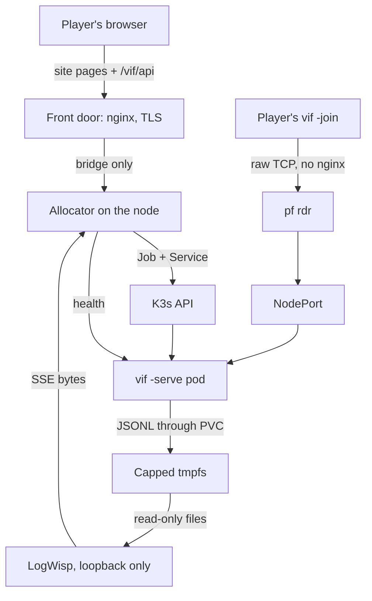

# Deploying the session fleet

A website asks for a game, one container appears on a K3s node, a player anywhere
on the Internet dials it, and it ends itself when nobody is in it. This document is
the whole of what you type to build that, in the order you type it. **It is the
entry point for a new deployment.**

Three other files carry what this one deliberately does not repeat:
[the fleet plan](kubernetes-fleet.md) holds the design, the measured cost and the
open work; [`deploy/README.md`](../deploy/README.md) indexes the objects and
helpers; [`deploy/runbook.md`](../deploy/runbook.md) is what you run once the node
is up. [`deploy/guest/README.md`](../deploy/guest/README.md) says where each
host-side artifact installs and how to back one out.

The production node is an Arch Linux bhyve guest on FreeBSD 15.1, whose host owns
routing and packet filtering with `pf`. A bare systemd Arch or Ubuntu node runs the
same procedure from §3 and supplies its own inbound boundary in place of §2.
Distribution differences are explicit in every step that has one.

## 0. Decisions you make before step 1

Each entry names the step it becomes effective at, because most of them change
what that step should say.

| # | Decision | Effective at |
|---|---|---|
| D1 | **Every address here is an example** from the RFC 5737 documentation ranges and is meant to be substituted: `203.0.113.7` for the host's public address, `192.0.2.20` for the node, `192.0.2.1` for the host end of the bridge, `198.51.100.0/24` for jails already on the host. Nothing in this repository holds a real address. | §2 |
| D2 | **`pf` owns the path and `ipfw` is not in it.** The rules below are FreeBSD's classic `rdr`/`nat` syntax. If the host's `pf.conf` is written in the newer `match … rdr-to` form, translate them rather than mixing the two — a ruleset with both is refused. | §2 |
| D3 | **Existing jails already use `rdr` rules.** The fleet's port range must not collide with theirs and must be evaluated in the same pass, so §2 puts it in a named anchor. | §2 |
| D4 | **A session is reached on its own port.** Ten NodePorts, one per container, forwarded as one range. It is the whole of the routing, and it is why the deployed session manifest sets no `-name`. The single-port alternative is worked but not taken; see the fleet plan §9. | §2 |
| D5 | **The website path and the game connection are independent.** Pages and the allocator API are HTTPS through the site's nginx; the game is raw TCP straight to a forwarded port and never passes through nginx. Page TLS has no bearing on a join. | §2 |
| D6 | **There is no authentication and no transport encryption, by decision.** Anyone who can reach a forwarded port can join the session behind it, and the link is public. What bounds a stranger is the forwarded surface being ten ports and nothing else (fleet plan §4). | §2 |
| D7 | **Docker is a build tool here, not a runtime.** K3s runs its own containerd. Docker exists on the node to build the image and is stopped afterwards, because its `iptables` rules and K3s's share one table. | §4 |
| D8 | **Cluster commands run through `sudo kubectl`.** K3s is installed with kubeconfig mode `0640`; do not copy the node's root kubeconfig into a login user's home to avoid typing `sudo`. | §5 |
| D9 | **The vi-fighter JSON line is the log contract.** Records originate in `internal/vlog` and every public hop preserves those bytes. No component parses, splices, or reserializes them, and nothing reads a Kubernetes pod log. | §7 |
| D10 | **One node, no registry.** The image is imported straight into the node's containerd and every session container uses `imagePullPolicy: IfNotPresent`. A second node or a real registry changes §8 and nothing else. | §8 |
| D11 | **The allocator runs on the node.** It needs the K3s API and node-local access to the pod probes; neither the player nor nginx does. Port 6443 never leaves the node. | §11 |
| D12 | **A session's playout lead is chosen from its *first* guest's link** and holds for the life of the match. A session opened by a nearby player and joined by a distant one runs at the near player's lead; the late-crossing fence makes that cost freshness rather than correctness (fleet plan §5). | §13 |

## 1. The shape



Three facts this procedure turns on. The game transport is **raw framed TCP, not
HTTP**, so nothing here is an Ingress and the game connection never enters nginx.
A session is **a thing that ends**, so it is a Job and not a Deployment. There is
**one node and one cluster**, so every Service, port and rule below has exactly one
place to be.

A player is given two strings, and keeping them apart is the whole of the design:

| String | What it is | Who reads it |
|---|---|---|
| `https://<site-host>/projects/vi-fighter/session/<id>/` | The shareable link: a page over TLS, served by the site's nginx. | A browser. |
| `<site-host>:31703` | The join target: raw framed TCP straight to a forwarded port. | `vif -join`. |

The allocator produces both and they are opaque: `id` is a session's public
identifier, and nothing else may rebuild `page_url` or `join_target` from a port,
because path-routed sessions would key both on the identifier instead.

**Why the port is the whole of the routing.** The coordinator speaks first: a
dialer that has connected receives `MsgJoinOffer` before it says anything. Nothing
in a plaintext game connection names a session — no HTTP path to route on, no TLS
SNI to read — so the destination port is the only signal a router or firewall has.
Ten ports for ten containers makes that signal exact and needs no component to
interpret it. The consequence is deliberate: **the deployed session sets no
`-name`**, because a pod started with one refuses every dial that does not name it,
and a player dialling `<site-host>:31703` names nothing.

## 2. The public edge: forward the range

On a bare node with no FreeBSD host in front of it, supply the equivalent inbound
boundary — ten ports forwarded to the node without source rewriting — and continue
at §3.

The addresses below are examples (D1); `pf` is the only filter in the path (D2).

```sh
# /etc/pf.conf, at the top with the other macros
ext_if      = "em0"
pub_ip      = "203.0.113.7"
vm_ip       = "192.0.2.20"          # the node
jail_net    = "198.51.100.0/24"     # already here
vif_ports   = "31700:31709"         # ten sessions, one port each
```

Redirection goes in its own anchor so the fleet's rules and the jails' stay
separable (D3). Declare the anchor where the rest of the translation rules are and
load its body from a file:

```sh
# translation rules, before the filter rules
nat on $ext_if from $jail_net to any -> ($ext_if)
rdr-anchor "vif/*"
```

```sh
# /etc/pf.vif.conf
rdr pass on $ext_if inet proto tcp from any to $pub_ip port $vif_ports -> $vm_ip
```

```sh
sudo pfctl -a vif -f /etc/pf.vif.conf
sudo pfctl -s nat -a vif          # the rule is loaded
sudo pfctl -s state | grep 3170   # a state appears when a player connects
```

**Test the public address only from a machine off the host.** `rdr on $ext_if`
matches packets arriving inbound on that interface; a connection the host
originates to `203.0.113.7` bypasses translation and can return an immediate RST
that looks like a filter rejection. From the host, test the node directly:
`nc -vz 192.0.2.20 31700`.

Four requirements this has to keep meeting:

| Requirement | Why |
|---|---|
| Forward **only** 31700-31709 | It is the whole player-facing surface. 7778 (health, metrics), 8081 (the log stream) and 6443 (the K3s API) are unauthenticated operational data and never leave the node. |
| Do not rewrite the source address | The Services use `externalTrafficPolicy: Local` and the session's admission limiter is keyed on the dialling address. `rdr` rather than same-direction `nat` is what preserves it; an off-box join is confirmed to reach the pod with the player's own public address. |
| Leave `tcp.established` alone | A session holds one long-lived connection per player. The default is hours and the protocol heartbeats every ten seconds, so an idle mapping is not the failure mode — a *short* `set timeout tcp.established` is. |
| Do not collide with the jails | `pfctl -s nat` shows every anchor's rules; check the range is unclaimed before loading it. |

**The site's nginx has no part in this.** It terminates TLS for the pages and the
two API routes (§12); the game ports are `rdr`ed past it in the kernel. Carrying
them in nginx instead — one `stream { server { listen 31703; proxy_pass … } }` per
port — works and costs the second row above: a `stream` proxy replaces the client's
source address with the host's unless it is run transparently. Prefer the `rdr`.

## 3. Node prerequisites

Record every version with the deployment. Arch is rolling, Ubuntu releases change
their kernel and package baseline, and neither may change silently.

```sh
uname -a; lscpu | grep -E 'Model name|^CPU\(s\)'   # recorded with the deployment
findmnt -no FSTYPE /sys/fs/cgroup                  # expect: cgroup2fs
timedatectl status                                 # expect: synchronized
```

One package set covers this whole procedure, including the Docker of §4 and the
`nftables` of §6:

```sh
. /etc/os-release
case "$ID" in
  arch)
    sudo pacman -Syu --needed \
      curl git go jq make python util-linux iptables-nft conntrack-tools \
      ethtool tcpdump nftables docker
    ;;
  ubuntu)
    sudo apt-get update
    sudo apt-get install -y \
      ca-certificates curl git golang-go jq make python3 util-linux iptables \
      conntrack ethtool tcpdump nftables docker.io
    ;;
  *)
    printf 'unsupported distribution: %s\n' "$ID" >&2
    false
    ;;
esac
sudo systemctl enable --now systemd-timesyncd
```

Ubuntu's `python3` and Arch's `python` both install `/usr/bin/python3`, which is
what the cleanup timer runs.

Swap off, and it has to stay off. `swapoff -a` with an edited `fstab` is not
enough when a zram generator recreates its unit; mask the generated unit first:

```sh
systemctl list-units --all 'dev-zram*.swap'
systemctl list-unit-files --no-legend 'dev-zram*.swap' | \
  while read -r unit _; do
    test -z "$unit" || sudo systemctl mask --now "$unit"
  done
sudo swapoff -a && sudo sed -i '/\sswap\s/s/^/#/' /etc/fstab
free -m                                    # expect: Swap total 0
```

Pod networking needs both modules and both sysctls; neither is on by default on a
fresh node:

```sh
printf 'overlay\nbr_netfilter\n' | sudo tee /etc/modules-load.d/k3s.conf
sudo modprobe overlay br_netfilter
printf 'net.ipv4.ip_forward=1\nnet.bridge.bridge-nf-call-iptables=1\n' \
  | sudo tee /etc/sysctl.d/99-k3s.conf
sudo sysctl --system
```

Clone the repository once and stay in its root: every `make`, `install` and
`kubectl apply` from §7 onward assumes that directory.

```sh
mkdir -p ~/git/lixenwraith && cd ~/git/lixenwraith
git clone https://github.com/lixenwraith/vi-fighter
cd vi-fighter
```

**Sizing, before anything is installed.** Reserve memory for the host or VM, the
node OS and the K3s control plane before counting sessions. Ten sessions at the
manifest's 192 MiB limit is 1.9 GiB of game, and the quota in
[`10-quota.yaml`](../deploy/k3s/10-quota.yaml) is what holds the number to it. The
node also gives up 256 MiB to the log tmpfs in §7.

## 4. Docker, for building the image

Docker is here to build (D7). It is not what runs the sessions.

```sh
sudo systemctl enable --now docker
sudo usermod -aG docker "$USER"     # log out and back in
docker info | grep -i 'storage driver'
```

**The one thing to check after installing it.** Docker sets the `FORWARD` chain's
default policy to `DROP`, and K3s relies on that chain for pod and NodePort
traffic. The two coexist because K3s inserts its own `ACCEPT` rules, but verify it
rather than assuming it — after installing Docker, after every Docker upgrade,
after a reboot, and after every `docker start` or `docker restart`:

```sh
sudo iptables -S FORWARD | head -1        # expect: -P FORWARD ACCEPT
```

If it reads `DROP`, `sudo iptables -P FORWARD ACCEPT` restores it, and a NodePort
that answered before and does not now is the symptom. `systemctl stop docker` does
not restore the policy Docker set; check it after the stop as well instead of
treating a stopped daemon as a rollback.

Keep Docker, its socket and the system containerd disabled between builds. K3s
runs its own embedded containerd, so this does not stop the node:

```sh
sudo systemctl disable --now docker.service docker.socket containerd.service
```

Every helper that needs a build (`update-vif-image.sh`, `install-logwisp.sh`,
`update-logwisp.sh`) starts Docker itself and restores this baseline before
returning.

## 5. K3s

Pin the version. `INSTALL_K3S_VERSION` is the one field that must not be left to
whatever the channel serves on the day. The install script self-escalates; the
kubeconfig it writes stays root-readable (D8).

```sh
curl -sfL https://get.k3s.io | INSTALL_K3S_VERSION=v1.34.6+k3s1 sh -s - \
    --write-kubeconfig-mode 0640 \
    --disable traefik \
    --disable servicelb \
    --secrets-encryption \
    --kube-apiserver-arg=service-node-port-range=31700-31709
```

- **`--disable traefik`** — the game protocol is raw TCP. An HTTP ingress
  controller has nothing to route here and is attack surface for a workload that
  does not use it.
- **`--disable servicelb`** — sessions are reached by NodePort. Klipper would bind
  host ports of its own and make the mapping harder to reason about.
- **`--secrets-encryption`** — nothing here stores a Secret yet; turning it on
  before there is one is cheaper than migrating later.
- **`service-node-port-range=31700-31709`** — exactly ten ports for exactly ten
  sessions, matching the range §2 forwards. The pool becomes a fact the API server
  enforces, so an allocator bug cannot place a session on a port nobody opened.
- **Network policy stays enabled.** K3s enforces `NetworkPolicy` through its
  bundled controller and `20-networkpolicy.yaml` is load bearing, so do not install
  with `--disable-network-policy`.

```sh
sudo k3s check-config
sudo kubectl get nodes -o wide
sudo kubectl -n kube-system get pods
```

If `k3s check-config` still warns about swap, return to §3 and mask the generated
`dev-zram*.swap` unit it found.

## 6. The node's own filter

`pf` decides who reaches the node from the Internet. This is the second half: what
reaches the node from its own network, and what survives a `pf` mistake. It is
written after K3s because it has to be written around K3s.

**The rule that matters: never `flush ruleset`.** K3s and Docker both program their
rules through `iptables-nft`, which puts them in ordinary nftables tables beside
yours. `flush ruleset` — the first line of Arch's shipped `/etc/nftables.conf` —
destroys those too. Kube-proxy resyncs within a minute and flannel's rules may not,
so the failure looks like a cluster that half works. Own one table and replace only
that: [`deploy/guest/nftables.conf`](../deploy/guest/nftables.conf) is that file.

Derive the operator address and the node's actual SSH port from the live session
rather than guessing either. `$SSH_CONNECTION` is `client-address client-port
server-address server-port`; a wrong field leaves the current connection alive
under `ct state established` while every replacement login is locked out:

```sh
set -- $SSH_CONNECTION
[ "$#" -eq 4 ] || { echo 'SSH_CONNECTION is unavailable'; exit 1; }
sudo install -d -m 0755 /etc/nftables.d
printf 'define operator_addr = %s\ndefine operator_ports = { %s }\n' \
  "$1" "$4" | sudo tee /etc/nftables.d/vif-operator.nft
```

That include file is the only place host-to-node operator ports are accepted. It
starts with SSH; §11 adds the allocator's 9080. Port 6443 is deliberately absent —
the operator reaches `kubectl` over SSH, so the Kubernetes API does not cross the
bridge (D11). [`vif-operator.nft.example`](../deploy/guest/vif-operator.nft.example)
is its documented form.

Install the ruleset behind a timed rollback, and open a second SSH connection
before cancelling it:

```sh
sudo install -m 0644 deploy/guest/nftables.conf /etc/nftables.conf

# Remove a distribution-shipped forward-policy table if one exists.
sudo nft delete table inet filter 2>/dev/null || true

# If the replacement locks out SSH, remove only this table in twenty minutes.
# pf still guards the public perimeter while it is absent.
sudo systemd-run --on-active=20m --unit=nft-rollback \
  /usr/bin/nft delete table inet vif
sudo nft -f /etc/nftables.conf
sudo systemctl enable nftables
sudo nft list table inet vif

sudo systemctl stop nft-rollback.timer
```

Then audit which tables exist, in this order — each answers a different failure:

```sh
sudo nft list ruleset | grep '^table'       # no surviving table inet filter
sudo kubectl -n kube-system get pods        # CoreDNS still Ready: pod networking
sudo kubectl get --raw /readyz              # the API server is still reachable
sudo iptables -S FORWARD | head -1          # still -P FORWARD ACCEPT (§4)
```

The expected set is `table inet vif` plus the named `ip`/`ip6` tables K3s installs
through `iptables-nft`. `table inet filter` and any other unexplained table are
absent: owning one table preserves every table you did not write, **including an
unwanted one**, and stock Arch can ship an empty `table inet filter` with a
`forward` hook and `policy drop`. Every hook is evaluated per table and one drop is
final, so that surviving table blackholes NodePort traffic while SSH, ICMP, egress
and every visible `iptables` accept keep working. Repeat this audit after every
reboot. During an Arch upgrade treat `/etc/nftables.conf.pacnew` as a hostile
default: never merge back `flush ruleset` or the shipped `inet filter` table.

**If you prefer `iptables`:** the same shape is an `INPUT` policy of `DROP` with
the same accepts and `-P FORWARD ACCEPT`, and it lands in the same kernel tables
through `iptables-nft`. Do not run both a hand-written `iptables` ruleset and a
hand-written `nftables` one — pick the one you will remember to read.

## 7. The node's log tmpfs

Sessions write `<session-id>.jsonl` to a capped tmpfs through a node-affine local
PV. The host side is installed here; the Kubernetes objects that expose it follow
in §9. K3s is made to *require* the mount, so a failed mount cannot fall through to
root storage and fill it.

Run this from the repository root at the revision being deployed. Capture the node
name here; §9 renders it into the volume template and it never enters the
repository:

```sh
NODE_NAME=$(sudo kubectl get nodes -o jsonpath='{.items[0].metadata.name}')
test -n "$NODE_NAME"
MOUNT_UNIT='var-log-vif\x2dfleet.mount'
```

Install the locked identity, the mount, the K3s dependency and the cleanup timer.
The identity is the host's only writer besides the containers, and it is pinned to
the same numeric UID/GID the containers run as:

```sh
sudo install -D -m 0644 \
  deploy/guest/vif-fleet.sysusers /etc/sysusers.d/vif-fleet.conf
sudo systemd-sysusers /etc/sysusers.d/vif-fleet.conf
test "$(id -u vif-fleet)" = 65532
test "$(id -g vif-fleet)" = 65532

sudo install -D -m 0644 \
  "deploy/guest/$MOUNT_UNIT" "/etc/systemd/system/$MOUNT_UNIT"
sudo install -D -m 0644 \
  deploy/guest/k3s.service.d/10-vif-fleet-logs.conf \
  /etc/systemd/system/k3s.service.d/10-vif-fleet-logs.conf
sudo install -D -m 0644 \
  deploy/guest/vif-fleet-log-cleanup.py \
  /usr/local/libexec/vif-fleet-log-cleanup.py
sudo install -D -m 0644 \
  deploy/guest/vif-fleet-log-cleanup.service \
  /etc/systemd/system/vif-fleet-log-cleanup.service
sudo install -D -m 0644 \
  deploy/guest/vif-fleet-log-cleanup.timer \
  /etc/systemd/system/vif-fleet-log-cleanup.timer
sudo systemctl daemon-reload
sudo systemctl enable "$MOUNT_UNIT" vif-fleet-log-cleanup.timer
```

Restarting K3s pulls the mount in. On a node that already runs sessions this is a
maintenance window: stop allocation and prove the fleet empty first
([`deploy/runbook.md`](../deploy/runbook.md)). On a fresh node nothing is running
yet.

```sh
sudo systemctl restart k3s.service
sudo kubectl wait --for=condition=Ready "node/$NODE_NAME" --timeout=180s
sudo systemctl start vif-fleet-log-cleanup.timer
```

Verify the mount and the dependency before creating anything that writes to it:

```sh
systemctl is-active "$MOUNT_UNIT" k3s.service vif-fleet-log-cleanup.timer
systemctl show k3s.service -p Requires -p After
findmnt -no TARGET,FSTYPE,SIZE,OPTIONS /var/log/vif-fleet
sudo stat -c 'mode=%a uid=%u gid=%g path=%n' /var/log/vif-fleet
```

Expected: `tmpfs`, about `256M`, `nodev,nosuid,noexec`, mode `770`, numeric
owner/group `65532`, and `k3s.service` naming the mount in both `Requires` and
`After`.

Each session's file rotates at 8 MB and per-process directory cleanup is disabled,
so the node timer owns retention: it refuses a non-tmpfs path, keeps two recent
rotations per session after a reader grace, and removes files stale beyond the
match ceiling plus margin.

## 8. The session image

The container build does not use `bin/vif`, and `make release` is not part of this
deployment. Do not run both `make image` and the explicit `docker build` below —
`make image` is a wrapper around it. The explicit form is written out because it
carries the `--network host`, the revision label and the commit-derived tag.

The builder pin and the module directive are deliberately the same patch release.
Check them before Docker downloads the module graph; an older builder otherwise
reports the mismatch only after that download has consumed the build:

```sh
module_go=$(awk '$1 == "go" { print $2; exit }' go.mod)
image_go=$(sed -n 's/^ARG GO_VERSION=//p' deploy/docker/Dockerfile)
printf 'go.mod=%s Dockerfile=%s\n' "$module_go" "$image_go"
test "$module_go" = "$image_go"
```

Start Docker and immediately repeat the `FORWARD` check from §4. The build uses the
host network because the build container cannot resolve DNS under the node ruleset;
accepting `docker0` in §6 is the tidier path and lets `make image` work normally,
but `--network host` is the reliable one:

```sh
sudo systemctl start docker
sudo iptables -S FORWARD | head -1

VIF_TAG=$(git rev-parse --short=8 HEAD)
VIF_REVISION=$(git rev-parse HEAD)
docker build --network host \
  -f deploy/docker/Dockerfile \
  --build-arg VERSION="$VIF_TAG" \
  --build-arg REVISION="$VIF_REVISION" \
  -t "vi-fighter:$VIF_TAG" .
make image-check IMAGE_TAG="$VIF_TAG"
```

`image-check` runs vi-fighter's own `-check` as UID 65532, read-only, with no
network and no capabilities.

With no registry (D10), import into the node's containerd and verify the name
before stopping Docker. `IfNotPresent` in every session container is load bearing:
a floating `:latest` would default to `Always` and bypass this import.

```sh
docker save "vi-fighter:$VIF_TAG" | sudo k3s ctr images import -
sudo k3s ctr images ls | grep vi-fighter
sudo systemctl stop docker.service docker.socket containerd.service
sudo iptables -S FORWARD | head -1
```

For every later release, the checked-in helper performs that whole sequence rather
than asking an operator to repeat it piecemeal:

```sh
# Clean worktree, and an empty fleet: `./deploy/k3s/session.sh blockers` first.
./deploy/guest/update-vif-image.sh             # current commit's eight-character tag
./deploy/guest/update-vif-image.sh v1.2.3      # or an explicit release tag
```

It pauses an active allocator, starts Docker, restores `FORWARD ACCEPT`, builds and
checks one image, imports it into K3s, updates `VIF_ALLOCATOR_IMAGE`, removes older
vi-fighter image references, disables Docker and the distribution containerd, then
restores the allocator. It refuses an occupied fleet deliberately: changing the
configured image does not require killing a match, while deleting an image out from
under one has no operational value.

For anything past the lab, publish the image and reference it **by digest**, not by
tag. A tag can be moved; a session's logs then name a revision that is no longer
what ran.

## 9. The fleet objects, and the log volume

This block establishes the namespace, the ceiling, the network boundary, the
allocator's identity and the volume the sessions write through. The quota is
applied before the claim, because the claim counts against it:

```sh
NODE_NAME=$(sudo kubectl get nodes -o jsonpath='{.items[0].metadata.name}')
VIF_TAG=$(git rev-parse --short=8 HEAD)

sudo kubectl apply -f deploy/k3s/00-namespace.yaml
sudo kubectl apply -f deploy/k3s/10-quota.yaml
sudo kubectl apply -f deploy/k3s/20-networkpolicy.yaml
sudo kubectl apply -f deploy/k3s/40-allocator-rbac.yaml

sed "s|\${NODE_NAME}|$NODE_NAME|g" deploy/k3s/05-log-volume.yaml \
  | sudo kubectl apply -f -
```

Never apply `05-log-volume.yaml` with `${NODE_NAME}` intact. `30-session.yaml` is a
**template**, not an object to apply: the allocator renders it per session.

`WaitForFirstConsumer` leaves the claim `Pending` until something mounts it, so
bind it with the checked-in probe rather than waiting for a real player:

```sh
sed "s|\${IMAGE}|docker.io/library/vi-fighter:$VIF_TAG|g" \
  deploy/k3s/06-log-volume-check.yaml | sudo kubectl apply -f -
sudo kubectl -n vif wait --for=jsonpath='{.status.phase}'=Succeeded \
  pod/vif-log-volume-check --timeout=90s

sudo kubectl get persistentvolume vif-fleet-logs
sudo kubectl -n vif get persistentvolumeclaim vif-fleet-logs
sudo test -s /var/log/vif-fleet/volume-check.jsonl
sudo jq -s -e 'map(select(.sub != null)) as $records |
    ($records | length > 0) and
    all($records[]; .fields.session_id == "volume-check")' \
  /var/log/vif-fleet/volume-check.jsonl
```

Both volume objects must read `Bound`. Remove the probe and leave the volume:

```sh
sudo kubectl -n vif delete pod vif-log-volume-check --wait=true
sudo find /var/log/vif-fleet -maxdepth 1 -type f \
  \( -name 'volume-check.jsonl' -o -name 'volume-check_*.jsonl' \) -delete
sudo find /var/log/vif-fleet -mindepth 1 -maxdepth 1 -print
```

The last command must print nothing.

Restricted admission, the ten-session ceiling, the default-deny policy and the
allocator's permission surface are properties of the four files you just applied,
not of this node. §13 exercises all of them with a real session. If one ever looks
wrong, §16 has the assertions that name which file drifted.

## 10. LogWisp, the node log reader

One independent node service reads `/var/log/vif-fleet/*.jsonl` with `raw = true`
and `from = "start"`, and binds its SSE endpoint to loopback. It has no Kubernetes
credential, is not an allocator child, and is not a per-session sidecar. It is
pinned to an exact upstream revision:

```sh
LOGWISP_REVISION=$(tr -d '[:space:]' < deploy/logwisp/REVISION)
printf 'LogWisp revision: %s\n' "$LOGWISP_REVISION"
test ! -e /usr/local/bin/logwisp
test ! -e /etc/logwisp/vif-fleet.toml
test ! -e /etc/systemd/system/logwisp.service
getent group vif-fleet

./deploy/guest/install-logwisp.sh
```

The installer resolves the repository root from its own path, verifies the
40-character revision before making host changes, and fails before starting Docker
unless the pin is an ancestor of upstream `main` — a pull-request head does not
survive a squash merge, so **pin only a commit reachable from `main`**. It clones
into a temporary directory, installs the binary, the dedicated locked `logwisp`
identity, the root-owned configuration and the hardened unit, starts the service,
then removes its container, image and source and restores the disabled Docker and
`FORWARD ACCEPT` baseline. An existing checkout is an optional download
optimisation, never a working directory:

```sh
./deploy/guest/install-logwisp.sh '<existing-logwisp-checkout>'
```

The service reads the tmpfs through the `vif-fleet` supplementary group only; its
unit gives it a read-only mount view and hides the K3s and allocator credential
paths. Three answers say the install took:

```sh
systemctl is-active logwisp.service
/usr/local/bin/logwisp --version | grep -F "$LOGWISP_REVISION"
test "$(sudo ss -ltnH 'sport = :8081' | awk 'NR == 1 {print $4}')" = 127.0.0.1:8081
unset LOGWISP_REVISION
```

The pinned Dockerfile sets no build timestamp, so `built: unknown` is expected; the
embedded commit is what must match. A listener on anything but `127.0.0.1:8081`
means the published configuration was not the one installed — §16 has the
isolation assertions that say which.

When reading its journal, read only the invocation running the pinned binary;
earlier entries belong to whatever it replaced:

```sh
sudo journalctl \
  "_SYSTEMD_INVOCATION_ID=$(systemctl show logwisp.service -p InvocationID --value)" \
  --no-pager
```

Later revisions go through [`update-logwisp.sh`](../deploy/guest/update-logwisp.sh),
which replaces only the binary, configuration and unit and retains one automatic
rollback set; the runbook holds the empty-fleet gate it runs inside.

## 11. The allocator

[`tool/vif-allocator`](../tool/vif-allocator/README.md) is the narrow HTTP boundary
between the website and the `vif` namespace. Kubernetes still schedules, isolates,
limits, terminates and garbage-collects every session; the allocator performs only
the fixed transaction Kubernetes has no anonymous endpoint for — reserve a free
NodePort, create one non-retryable Job, read its UID, create the owner-referenced
Service, wait for a ready EndpointSlice and `live=true ready=true` from `/health`,
and return the page URL, join target and state. Raw game traffic bypasses it
entirely.

It runs on the node, and that is not an interchangeable placement (D11). K3s
installs a node-local-source allowance before the pod policy path, so a process on
the node can read a session pod's `/health` on the pod IP; a process on the site's
host cannot, because `allow-operator-ports` admits 7778 and 8081 only from the
monitoring namespace. It also reads LogWisp's loopback stream, which nothing off
the node can reach.

Build and install it after §9 has applied its ServiceAccount and Role:

```sh
make allocator

getent group vif-allocator >/dev/null || sudo groupadd --system vif-allocator
id -u vif-allocator >/dev/null 2>&1 || sudo useradd --system \
  --gid vif-allocator --home-dir / --shell /usr/bin/nologin vif-allocator

sudo install -d -o root -g vif-allocator -m 0750 /etc/vif-allocator
sudo install -d -o root -g root -m 0755 /usr/local/libexec
sudo install -o root -g root -m 0755 bin/vif-allocator /usr/local/bin/vif-allocator
sudo install -o root -g vif-allocator -m 0640 \
  /var/lib/rancher/k3s/server/tls/server-ca.crt \
  /etc/vif-allocator/server-ca.crt
sudo install -o root -g vif-allocator -m 0640 \
  deploy/guest/vif-allocator.env.example /etc/vif-allocator/allocator.env
sudo install -o root -g root -m 0755 \
  deploy/guest/vif-allocator-refresh-token.sh \
  /usr/local/libexec/vif-allocator-refresh-token
sudo install -o root -g root -m 0644 \
  deploy/guest/vif-allocator.service \
  deploy/guest/vif-allocator-token.service \
  deploy/guest/vif-allocator-token.timer /etc/systemd/system/

# Set the imported image tag, the public join host and the session page base.
# There are no secrets in this file; keep its write permission with root.
sudoedit /etc/vif-allocator/allocator.env

sudo systemctl daemon-reload
sudo systemctl enable --now vif-allocator-token.timer vif-allocator.service
```

The credential is a short-lived `vif-allocator` ServiceAccount token in a file,
re-read on every Kubernetes request, so the root timer can replace it atomically
without restarting the process. The service retries a boot-time mint for one
minute and the timer refreshes every six hours with a randomized delay, leaving
several attempts before the requested 24-hour expiry; a failed refresh leaves the
previous file intact and shows in the unit status. The allocator must not use
`/etc/rancher/k3s/k3s.yaml` or a copy of the node's root kubeconfig, and a
permanent root credential is not an acceptable substitute.

Open the allocator port to the site's host and nowhere else. Confirm the bridge
address against the default route, then add `9080` to the set §6 created and reload
behind the same rollback:

```sh
ip route show default | awk 'NR == 1 { print $3 }'   # the host end of the bridge
```

```nft
# /etc/nftables.d/vif-operator.nft, using documentation values
define operator_addr = 192.0.2.1
define operator_ports = { 22, 9080 }
```

```sh
sudo systemctl restart nftables
sudo nft list table inet vif | grep -A2 'saddr'
```

There is no new `pf rdr`: the allocator is not public, and the host-to-node bridge
path already exists. Do not add 9080 to the public `vif_ports` range.

`vif-allocator.service` is `Type=notify` — it answers `READY=1` once its listener
is bound, after a 20-second startup reconciliation — so `systemctl start` returns
when the allocator answers and a probe straight after one is not a race:

```sh
curl --connect-timeout 2 --max-time 5 -fsS http://127.0.0.1:9080/healthz
curl --connect-timeout 2 --max-time 5 -fsS http://127.0.0.1:9080/readyz
```

Both must print `ok`. Liveness says only that the process exists; readiness
additionally proves the current token reaches K3s. If the listener never appears,
read `systemctl show` for `SubState`, `MainPID` and `NRestarts`, then `ss -ltnp`
and the journal, before restarting or changing configuration.

The page-facing API is deliberately small:

| Method and path | Success | Contract |
|---|---:|---|
| `GET /healthz` | `200` | Process liveness only. |
| `GET /readyz` | `200` | The current token can list Services through the K3s API; otherwise `503`. |
| `POST /vif/api/sessions` | `201` | Accepts an empty body, `{}`, or `{"players":N,"log_level":"L"}` within the advertised `limits`. Refuses before creation when all ten ports are held; otherwise creates the fixed Job, reads its UID, creates its owner-referenced Service, and returns only after pod, EndpointSlice and `live=true ready=true` agree. |
| `GET /vif/api/sessions` | `200` | `{ "sessions": [...], "limits": {...} }` for live, non-completed Jobs. `guests`, `capacity`, `phase` and `expires_in` come from each pod's text `/health`. |
| `GET` or `HEAD /vif/api/logs` | `200` stream | Proxies the loopback LogWisp SSE response without parsing records. An unavailable LogWisp is a stable `503 log_stream_unavailable`; a build without the upstream configured is `501 log_stream_not_configured`. |

Creation answers `503 fleet_full` (with `Retry-After: 10`), `504
session_not_ready`, `502 kubernetes_error`, `400` for a malformed body or an
out-of-bounds choice, `413` over 1 KiB, `415` for a non-empty body without
`application/json`, and `408` for a cancellation the connection survives. A failed
or cancelled readiness wait removes the partial Service and Job.

There is deliberately **no public delete endpoint**: the API is anonymous behind
the site, and one player must not be able to end another's match. Operators use
`./deploy/k3s/session.sh delete <id>`.

`-players-max` defaults to `-players` and `-log-level-min` defaults to `debug`, so
publishing the API hands an anonymous caller neither a sixteen-player world nor the
fleet's shared log rate. `limits` in the list response advertises what this
deployment will accept, so a caller offers only choices that would be granted.

The allocator holds no database. Jobs and Services are the durable state, and these
obligations are what keep that true:

| Obligation | Why it is required |
|---|---|
| Rebuild live sessions from Jobs, and reserve ports from every Service `nodePort`. | A finished Job's Service keeps its port until Job TTL and garbage collection finish; allocator memory is only a cache. |
| Create the Job first, then own the Service by that Job UID. | The endpoint must disappear with the match rather than hold a NodePort after it. |
| Roll back the Job when Service creation fails. | A half-created transaction otherwise consumes quota without a reachable session. |
| Delete Jobs with background propagation. | A raw API delete without a propagation policy may orphan the pod and its Service. |
| Parse `/health` as `key=value` text and wait for `live=true ready=true`, not pod `Running`. | A running process may still be building its world; the probe is not JSON. |
| Refuse at ten before calling the API. | The quota is a backstop, not the player-facing capacity response. |
| Never resurrect a completed Job. | A completed Job is a finished in-memory match; its former port has returned to the pool. |

## 12. The site's front door

The allocator listens on `:9080` behind the node filter, which admits only the
site's host. Publishing it means letting the TLS front door reach that port and
mapping exactly two paths; `/healthz` and `/readyz` stay on the node.
[`deploy/website/vif.nginx.example`](../deploy/website/vif.nginx.example) is the
reference location set, with placeholders for the node address.

```nginx
location = /vif/api/logs {
    proxy_pass http://192.0.2.20:9080;
    proxy_http_version 1.1;
    proxy_set_header Connection "";
    proxy_buffering off;
    proxy_read_timeout 1h;
}

location /vif/api/ {
    proxy_pass http://192.0.2.20:9080;
    proxy_http_version 1.1;
    proxy_set_header Host $host;
    proxy_set_header X-Forwarded-Proto $scheme;
    proxy_read_timeout 120s;
    client_max_body_size 1k;
}
```

Three properties decide whether the stream survives the hop: `proxy_buffering off`,
no cache, and a read timeout longer than a session. A finite read timeout truncates
a live stream at exactly that interval, which reads as a flaky game rather than a
proxy setting.

The browser calls `/vif/api/...` on the same origin as the page, which removes CORS
from the design; do not replace it with `Access-Control-Allow-Origin: *`. The
site's `Content-Security-Policy` needs `connect-src 'self'` for a same-origin
`EventSource`, and nothing else is added.

One page location serves every session, because the only thing that differs between
them is the identifier in the path:

```nginx
location = /projects/vi-fighter/ { try_files $uri /projects/vi-fighter/index.html; }
location ~ "^/projects/vi-fighter/session/(?<vifsession>[a-z0-9]+)/$" {
    try_files /projects/vi-fighter/session.html =404;
}
```

The page reads its own identifier from its URL, asks the list endpoint for that
row, and keeps the two user-facing strings distinct: the HTTPS page URL and the raw
`<site-host>:31703` join target. It builds its session controls from the `limits`
the allocator advertises, and it speaks to neither Kubernetes nor a pod.

Verify from a client, not from the node:

```sh
curl -fsS https://<site-host>/vif/api/sessions
curl -fsSI https://<site-host>/vif/api/logs |
  grep -Ei '^(content-type|cache-control|x-accel-buffering)'
curl --no-buffer -fsS --max-time 5 \
  https://<site-host>/vif/api/logs 2>/dev/null | head -n 1
```

Expect a session list, `text/event-stream` with `no-cache`, and `event: connected`.
The probe endpoints must stay unreachable: `curl -o /dev/null -w '%{http_code}'`
against `https://<site-host>/healthz` and `/readyz` must not return `200`; the
site's own 404 is the expected answer.

Then copy `vif-log-viewer.html` and `vif-log-viewer.js` together into the document
root, keeping them in one directory — the page loads the script by relative name.
Its stream field defaults to the relative `/vif/api/logs`, so it reaches only its
own origin. The script is a separate file because a site whose `script-src` omits
`'unsafe-inline'` blocks an inline one without rendering any error: the page
appears and its buttons do nothing.

Publishing the session route makes creation reachable by anyone who can reach the
site. That is the website contract rather than a regression — the ten-session
quota, the 90-second first-join expiry and the edge's own rate limit are what bound
it — and nothing else about the allocator becomes reachable.

## 13. First session

This is the acceptance check for the whole node, and it is the same check to run
after any change to a live workload, allocator binary, Role, mount, or logging
service. Have a terminal on a second machine ready with `bin/vif` built before you
start: **the 90-second first-join clock starts when `POST` returns.**

On the node:

```sh
curl -fsS http://127.0.0.1:9080/readyz &&
./deploy/k3s/session.sh blockers &&
SESSION_ID=$(./deploy/k3s/session.sh allocate)
```

`blockers` must print `the fleet is empty` first. `allocate` prints the identity on
stdout and the join target beside it. Join immediately from the second machine:

```sh
bin/vif -join '<join target>'
```

While it stays connected:

```sh
./deploy/k3s/session.sh state "$SESSION_ID"
```

Expect `phase=occupied` with at least one guest. Quit the remote client and
immediately verify vacancy and the file the session wrote:

```sh
./deploy/k3s/session.sh state "$SESSION_ID"

sudo test -s "/var/log/vif-fleet/$SESSION_ID.jsonl"
sudo jq -s -e --arg id "$SESSION_ID" '
  map(select(.sub != null)) as $records |
  ($records | length > 0) and
  all($records[]; .fields.session_id == $id)
' "/var/log/vif-fleet/$SESSION_ID.jsonl"
```

Read the JSONL before deleting, not after, and delete before the empty grace or the
Job TTL removes the evidence. `delete` waits for the background-cascaded pod,
removes only that session's files, and prints its own verdict:

```sh
./deploy/k3s/session.sh delete "$SESSION_ID"
./deploy/k3s/session.sh status
```

`delete` must print `session <id> removed: no objects, no log files`, and `status`
`the fleet is empty` with five active units. That is the node accepted.

**If this fails, separate the two questions before debugging either.**
`session.sh create` renders the same template by hand and bypasses the allocator
entirely, so a session that works this way and not through `allocate` is an
allocator problem, and one that fails both is a workload problem. The 90-second
fuse deletes the target while its network is being investigated, so override the
timers for that run:

```sh
FIRST_JOIN=20m EMPTY_GRACE=20m ./deploy/k3s/session.sh create s1 31700 \
  "docker.io/library/vi-fighter:$(git rev-parse --short=8 HEAD)"
./deploy/k3s/session.sh list
./deploy/k3s/session.sh delete s1
```

There is one health path. Its code answers whether the process should live; the
body carries `ready`, `phase`, `guests`, `capacity`, `tick` and `expires_in`. A
vacant pod correctly reports `live=true ready=true clock=paused phase=vacant` while
its tick stops, so read the health words rather than treating a moving tick or
`Running` as readiness. Reaching a live session's probe needs no Service, which is
also how to read one whose Service has already gone with its Job:

```sh
POD_IP=$(sudo kubectl -n vif get pod \
  -l 'vif.lixenwraith.dev/session=<session-id>' \
  -o jsonpath='{.items[0].status.podIP}')
curl -fsS --max-time 3 "http://$POD_IP:7778/health"
curl -fsS --max-time 3 "http://$POD_IP:7778/metrics" | head
```

## 14. The reboot gate

A reboot ends every in-memory match, so no Job replacement may be advertised as the
same session. Delete every session first, then reboot and prove the node came back
to the state the files describe rather than to the state the last manual load left:

```sh
./deploy/k3s/session.sh drain
sudo systemctl reboot
```

After reconnecting:

```sh
sudo kubectl get nodes -o wide                  # Ready
free -m                                         # Swap total 0
sudo nft list ruleset | grep '^table'           # inet vif, no inet filter
sudo iptables -S FORWARD | head -1              # -P FORWARD ACCEPT
findmnt -no TARGET,FSTYPE,SIZE,OPTIONS /var/log/vif-fleet
sudo k3s crictl images | awk 'NR == 1 || /vi-fighter/'
./deploy/k3s/session.sh status
```

These are the six things a reboot can undo: the node, swap, the filter the service
loaded from files rather than the one you loaded by hand, Docker's forwarding
policy, the mount, and the imported image. `status` covers the rest — an empty
fleet, an empty tmpfs, five active units. Then run §13 again. A node that does not
come back Ready is an infrastructure blocker, not a workload problem.

## 15. Operating, and what is not built yet

Day-to-day operation is [`deploy/runbook.md`](../deploy/runbook.md): where things
stand, emptying the fleet before an update helper, the three updaters, what each
refusal means, watching the stream, and who dialled a session. Recovery for one
component is [`deploy/guest/README.md`](../deploy/guest/README.md).

Two rules that are procedure rather than day-two habit. **Stop allocation and prove
the fleet empty before changing a live workload, allocator binary, Role, mount or
logging service**, and finish that change with §13. And **keep the previous
allocator binary and configuration** — the updaters' `.previous` set — until the
next live §13 passes.

One line is intended to end every session and name why:

```json
{"msg":"session ended","phase":"expired","reason":"roster empty for 1m30s","guests":0,"tick":240}
```

`reason` is one of `no guest connected within …`, `roster empty for …`, `drained`,
`drain deadline … reached holding N guest(s)`, or an operator-supplied cause.
Sessions expiring with `no guest connected` far more often than players report
failed joins is the signature of a broken path between the page and the forwarded
range; start at the EndpointSlice and walk outward with §16.

What this deployment does not yet have is the fleet plan's
[work list](kubernetes-fleet.md#3-work-list): handshake fuzz coverage (H1), a
measured full-roster envelope (H3), the routing decision between the port range and
a single front door (H8), and CI image delivery (H16).

## 16. Troubleshooting

### When the boundary looks wrong

The namespace, quota, policy and Role are whatever the four files in §9 say, and
the session pod is whatever `30-session.yaml` says. These assertions name which one
drifted; none of them belongs in a deployment that is going well.

Restricted admission must refuse a privileged pod and a direct `hostPath`:

```sh
sudo kubectl -n vif run pstest --image=busybox --restart=Never \
    --overrides='{"spec":{"containers":[{"name":"c","image":"busybox","securityContext":{"privileged":true}}]}}'
# expect: forbidden ... violates PodSecurity "restricted"

sudo kubectl create --dry-run=server -f - <<'YAML'
apiVersion: v1
kind: Pod
metadata: {name: vif-hostpath-must-fail, namespace: vif}
spec:
  restartPolicy: Never
  automountServiceAccountToken: false
  securityContext: {runAsNonRoot: true, seccompProfile: {type: RuntimeDefault}}
  containers:
    - name: check
      image: registry.k8s.io/pause:3.10
      securityContext:
        allowPrivilegeEscalation: false
        readOnlyRootFilesystem: true
        runAsNonRoot: true
        capabilities: {drop: ["ALL"]}
      volumeMounts: [{name: forbidden, mountPath: /forbidden, readOnly: true}]
  volumes:
    - name: forbidden
      hostPath: {path: /var/log/vif-fleet, type: Directory}
YAML
# expect: a refusal naming restricted / hostPath
sudo kubectl -n vif delete pod pstest --ignore-not-found
```

The allocator must be able to allocate without being able to read a Secret or a pod
log:

```sh
for check in \
  'create jobs.batch:yes' 'delete jobs.batch:yes' 'create services:yes' \
  'list services:yes' 'get pods:yes' 'list endpointslices.discovery.k8s.io:yes' \
  'get secrets:no'
do
  verb=${check%:*}; want=${check#*:}
  got=$(sudo kubectl auth can-i $verb \
    --as=system:serviceaccount:vif:vif-allocator -n vif)
  test "$got" = "$want" || printf 'RBAC DRIFT: %s = %s, want %s\n' "$verb" "$got" "$want"
done
test "$(sudo kubectl auth can-i get pods --subresource=log \
  --as=system:serviceaccount:vif:vif-allocator -n vif)" = no
```

A live session's Job must carry exactly the shape the template describes — one
container, no token, no `hostPath`, no `-log-stdout`, the PVC mounted only in the
game container, and its own session id on the command line:

```sh
sudo kubectl -n vif get job "vif-session-$SESSION_ID" -o json |
  jq -e --arg id "$SESSION_ID" '
    .spec.template.spec as $pod |
    ($pod.automountServiceAccountToken == false) and
    ($pod.containers | length == 1) and
    ($pod.containers[0].name == "session") and
    ($pod.containers[0].args | index("-l=/var/log/vif-fleet") != null) and
    ($pod.containers[0].args | index("-log-session-id=" + $id) != null) and
    ($pod.containers[0].args | index("-log-stdout") == null) and
    any($pod.containers[0].volumeMounts[]?;
      .name == "fleet-logs" and .mountPath == "/var/log/vif-fleet") and
    any($pod.volumes[]?;
      .name == "fleet-logs" and
      .persistentVolumeClaim.claimName == "vif-fleet-logs") and
    all($pod.volumes[]?; has("hostPath") | not) and
    all($pod.initContainers[]?; ((.volumeMounts // []) | length) == 0) and
    ($pod.containers[0].securityContext.allowPrivilegeEscalation == false) and
    ($pod.containers[0].securityContext.readOnlyRootFilesystem == true) and
    ($pod.containers[0].securityContext.runAsNonRoot == true) and
    ($pod.containers[0].securityContext.capabilities.drop | index("ALL") != null)'
```

LogWisp must hold the tmpfs read-only through the group alone, run the files the
repository holds, and depend on neither K3s nor the allocator:

```sh
LOGWISP_PID=$(systemctl show logwisp.service -p MainPID --value)
sudo grep '^Groups:' "/proc/$LOGWISP_PID/status" |
  grep -Eq '(^|[[:space:]])65532([[:space:]]|$)'
sudo nsenter -t "$LOGWISP_PID" -m -- \
  findmnt -no TARGET,FSTYPE,OPTIONS /var/log/vif-fleet
sudo cmp -s deploy/logwisp/aggregator.toml /etc/logwisp/vif-fleet.toml
sudo cmp -s deploy/guest/logwisp.service /etc/systemd/system/logwisp.service
systemctl show logwisp.service -p Requires -p Wants -p After
unset LOGWISP_PID
```

The host `findmnt` stays `rw`; inside LogWisp's mount namespace the final entry for
that target must contain `ro`. `RequiresMountsFor=` may add a mount requirement,
but `Requires`, `Wants` and `After` must not name `k3s.service` or
`vif-allocator.service`.

NetworkPolicy enforcement is per-pod and cannot be seen before a pod exists. K3s
embeds the kube-router controller in the `k3s` process, so there is no
`kube-router` pod to find; the proof is a counter delta across one connection, not
the existence of the API object:

```sh
sudo iptables-save -c | grep 'KUBE-POD-FW-'
# Make one game-port connection, then repeat and confirm a counter moved.
```

### When a join does not arrive

**Walk outward from the pod, never inward from the Internet.** Each boundary names
one component; a single test from a browser combines all of them and names none.
These commands read a session that is live, so allocate one with an extended
`FIRST_JOIN` first (§13) and set `SESSION_ID` to its identity.
`bash -c "</dev/tcp/host/port"` is enough when `nc` is absent:

```sh
SERVICE="vif-session-$SESSION_ID"
sudo kubectl -n vif get endpointslice \
  -l "kubernetes.io/service-name=$SERVICE" -o wide
POD_IP=$(sudo kubectl -n vif get pod \
  -l "vif.lixenwraith.dev/session=$SESSION_ID" \
  -o jsonpath='{.items[0].status.podIP}')
CLUSTER_IP=$(sudo kubectl -n vif get svc "$SERVICE" -o jsonpath='{.spec.clusterIP}')

bash -c "</dev/tcp/$POD_IP/7777"          # pod route and policy
bash -c "</dev/tcp/$CLUSTER_IP/7777"      # Service DNAT
bash -c "</dev/tcp/127.0.0.1/31700"       # local NodePort
bash -c "</dev/tcp/192.0.2.20/31700"      # node address and NodePort
```

From the FreeBSD host, test `192.0.2.20:31700`. Test the public address only from
an off-box machine (§2).

When a step does not answer, take counter snapshots immediately before and after
**exactly one** connection attempt. The last rule whose counter moves names the
component that handled the packet:

```sh
sudo iptables-save -c > /tmp/iptables.before
sudo nft list ruleset > /tmp/nft.before
# Make exactly one connection attempt here.
sudo iptables-save -c > /tmp/iptables.after
sudo nft list ruleset > /tmp/nft.after
diff -u /tmp/iptables.before /tmp/iptables.after
diff -u /tmp/nft.before /tmp/nft.after

sudo conntrack -L -p tcp | grep 31700
sudo tcpdump -ni cni0 'tcp port 7777'
```

Each row below was a dead end in the proof-of-concept run when it was not known:

| Observation | What it means |
|---|---|
| Nothing appears in the node's `input` drop log. | Expected for a NodePort SYN: kube-proxy DNATs it in `prerouting`, then routing sends it through `forward`, not `input`. |
| Every rule in `iptables-save -c` accepts, but the connection still fails. | Another nftables table can drop on the same hook. Only `nft list ruleset` shows every table — usually a surviving `table inet filter` with `policy drop` (§6). |
| One before/after attempt changes a counter. | The last moving rule identifies the component that handled the packet; take both `iptables-save -c` and `nft list ruleset` around one attempt. |
| Forward counters move but the tuple has no conntrack entry. | The packet was accepted for forwarding and dropped by another hook before the routing decision completed. |
| Traffic is visible on `cni0`. | It reached the pod side of routing. A moving `KUBE-POD-FW-*` counter proves the NetworkPolicy path ran. |
| A finished session first refuses and later times out. | While its Service exists with no endpoint, kube-proxy rejects; after Job TTL garbage-collects the Service, the node filter drops an unassigned port. |
| A pod shows `0/2` and never becomes Ready. | A pod is Ready only when every container is. A healthy session beside a second container in `ImagePullBackOff` reads as not Ready. |
| A NodePort that answered before does not now. | `FORWARD` policy is `DROP`. Docker sets it and a stop does not restore it (§4). |
| The Docker build cannot resolve DNS. | The node ruleset does not accept `docker0`. Build with `--network host` (§8). |
| `kubectl auth can-i get pods/log` answers `yes`. | Positional `pods/log` parses as `TYPE/NAME`. Use `--subresource=log` (§9). |
| LogWisp shows no lines written before it started. | A watcher seeks to end-of-file on discovery. The source needs `from = "start"` (§10). |
| `Watcher failed … watcher stopped` in LogWisp's journal. | Read only the invocation running the pinned binary (§10); earlier entries belong to whatever it replaced. |
| A build stops with `pinned revision is not an ancestor of LogWisp main`. | `deploy/logwisp/REVISION` names a pull-request head a squash merge discarded. Repin to the merged commit. |
| `curl` to `:9080` is refused right after `systemctl start`. | Only on an allocator that predates `Type=notify`; otherwise the bind has already happened and the refusal is real. |
| Testing the public address from the FreeBSD host returns an immediate RST. | Host-originated traffic bypasses `rdr`. Test from off-box, or test the node address directly (§2). |
