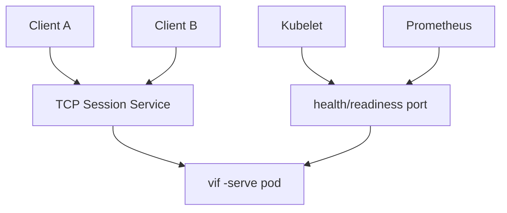
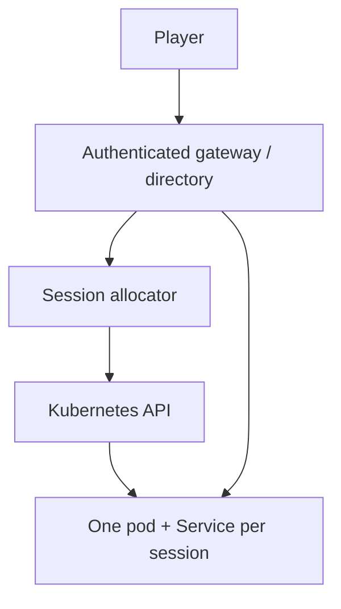
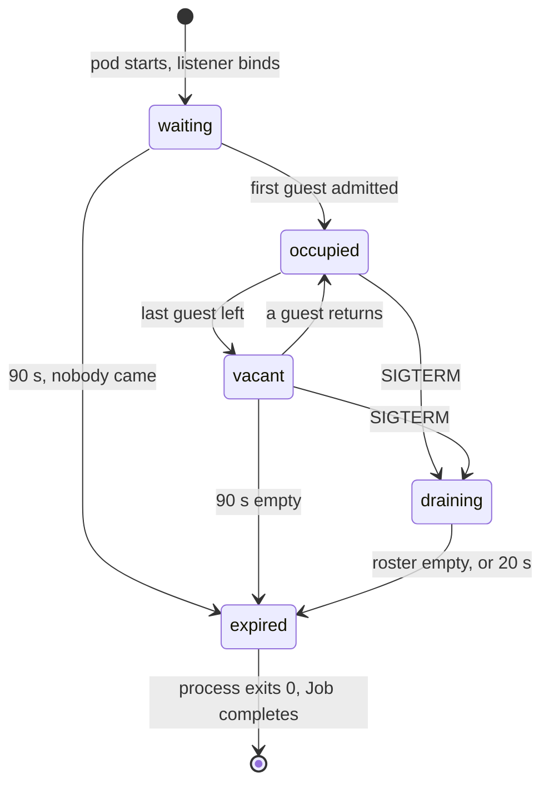

# K3s dedicated-server fleet plan

This is the implementation and acceptance plan for running Vi-Fighter dedicated
servers on K3s. The first target is a single Arch Linux node running as a bhyve
guest on FreeBSD; the later target is a multi-session fleet reached by remote
terminal clients over the existing framed TCP protocol.

The document is current with snapshot schema 4, the local FSM lifecycle
reconciliation work, and the allocated-session lifetime in `internal/lifecycle`. It
replaces the earlier audit diary and preserves only the measurements, decisions,
gaps, and tests that remain actionable.

The procedure for installing and running this on the Arch guest is a separate,
shorter document: [K3s and container deployment](kube_docker_deploy.md). This one
is the plan; that one is what you type.

## 1. Outcome and current readiness

The application already has the right process shape:

```sh
vif -serve :7777 -probe :7778 -log-stdout -l -lv info -ls all+dispatch \
    -players 4 -size 120x40 \
    -first-join 90s -empty 90s -drain 20s
```

`-serve` owns the Shared simulation and network session but no terminal, renderer,
audio device, input source, or player cursor. It starts on its first guest and
treats `-players` as a guest ceiling. `/healthz`, `/readyz`, and `/metrics` are
available on the separate probe listener.

The three lifetime flags are what make it an *allocated* session rather than a
long-lived one. A session created on a player's behalf has nobody watching it, so
it watches itself: it ends if no guest arrives inside the first window, it ends
after the roster has been empty for the second, and a termination signal opens a
drain that stops admitting and waits out the third for the guests it still holds.
Omitting all three restores the long-lived host an operator starts by hand.

The process is suitable for a **trusted-network K3s prototype now**. It is not
suitable for direct Internet exposure: game links are plaintext and peer identity
is not authenticated. A VPN or authenticated TCP gateway plus restrictive
firewalling is required until application identity and transport security land.

This removes the gameplay blocker for fleet testing, and the deployment shape is
now decided: **one session per container, created when a player asks for one,
capped at ten concurrent, ending itself when it is empty.** What remains is the
security and allocation work below.

## 2. Runtime contract the fleet must preserve

| Property | Required behavior |
|---|---|
| Session unit | One `vif -serve` process owns one match/session timeline. |
| Authority | The dedicated host's Shared world is canonical; guests predict and accept corrections. |
| Port | Game traffic is raw TCP, one long-lived connection per peer; it is not HTTP ingress traffic. |
| Probe port | HTTP probe/metrics traffic is separate from the game listener and should remain cluster-internal. |
| Capacity | `-players` is a ceiling. `/readyz` returns unavailable at capacity while `/healthz` remains healthy. |
| Empty roster | Inside the `-empty` grace a server stays alive and accepts a later join or reconnect; past it, the session ends. With no `-empty`, empty still does not mean completed. |
| Allocated lifetime | `-first-join`, `-empty` and `-drain` are enforced by `internal/lifecycle` over roster observations. The phase and the remaining time are published on `/readyz`. |
| Storage | Simulation state is in memory. A replacement pod does not inherit the match unless an explicit migration feature is added. |
| Correction | Snapshot schema, build/config/content identity, and ordering fences must match before install. |
| Local state | Captures exclude Player-domain state; config-marked local FSM lifecycle is re-derived during live install. |
| Shutdown | `SIGTERM` opens a drain: readiness goes false, new dials are refused with `ErrSessionEnding`, and the process exits when the roster empties or `-drain` elapses. A second signal exits at once. Connected guests still observe host loss rather than a negotiated match end. |

Kubernetes restart and replication do not create game-level high availability.
Authority succession helps already-connected participants after a host disappears;
it does not transfer an in-memory server session into an unrelated replacement pod.

## 3. Readiness and gap register

### Closed application prerequisites

| ID | Status | Result |
|---|---|---|
| R1 | closed | Dedicated `ModeServer` has no cursor, terminal, renderer, or audio runtime. |
| R2 | closed | Server lobby starts with one guest; `-players` is a ceiling and later guests use mid-run admission. |
| R3 | closed | JSON logs can go to stdout; requested logging fails early rather than silently disappearing. |
| R4 | closed | Separate liveness, readiness, and Prometheus endpoints exist. |
| R5 | closed | Map dimensions, snapshot assembly, scheduled frames, and handshakes have explicit bounds. |
| R6 | closed | First-guest geometry is adopted when `-size` is omitted; an explicit server size wins. |
| R7 | closed | Remote cursors render independently of their transient effects. |
| R8 | closed | A correction cannot strand config-declared persistent drain/grayout holds. |
| R9 | closed | Delayed transition work survives snapshot transfer by compiled action identity. |
| R10 | closed | Quasar zap range cannot draw into centered viewport cells outside the map. |
| R11 | closed | An allocated session bounds its own life: `-first-join`, `-empty` and `-drain` in `internal/lifecycle`, folded in by the serve loop and published on `/readyz`. |
| R12 | closed | A termination signal drains rather than exits: readiness false, dials refused with `ErrSessionEnding`, exit on an empty roster or the drain deadline. |
| R13 | closed | Container image, fleet manifests, quota, network policy, and allocator RBAC exist under `deploy/`. |

### Work still required

| ID | Priority | Gap | Completion signal |
|---|---|---|---|
| F1 | critical before public exposure | No authenticated participant identity or confidentiality. | Token or certificate identity is bound to the handshake; links are encrypted end-to-end or terminate at a trusted gateway; hostile-peer tests pass. |
| F2 | critical before mixed releases | Join identity does not fully bind protocol/build/config semantics. | Handshake rejects different protocol, snapshot schema, simulation build, config hash, or content pin with a named reason. |
| F3 | required for more than one session | No allocator or match directory maps players to one session pod/service. The allocator itself belongs to the website, and its contract and RBAC are now written down (`deploy/k3s/40-allocator-rbac.yaml`, [deployment §8](kube_docker_deploy.md)); the missing repository-side half is a **session credential** the handshake can check, so that reaching a port is not the same as being the player who was allocated it. | Create/join returns a stable endpoint and a session credential the host verifies; multiple sessions cannot cross-connect. |
| F4 | mostly closed; see R12 | Signal-driven drain is implemented. What remains is a drain the *control plane* can request without terminating the process — an operator wanting "stop admitting, keep playing" has only `SIGTERM`, which also starts the clock. | A probe-writable or config-reloadable drain switch makes readiness false and refuses admission with no deadline attached. |
| F5 | required for production sizing | Four-player `config/main` and `config/td` CPU/RSS/GC high water is unmeasured. | Reproducible report establishes requests, limits, `GOMEMLIMIT`, and tick-slip threshold. |
| F6 | partly closed; see R13 | Manifests and a reproducible image exist and are hand-verified. No CI builds or publishes them, no SBOM or scan runs, nothing is signed, and no manifest is validated against a live API server. | CI publishes a digest-pinned, scanned, signed image and server-side-dry-run manifests; canary/rollback are exercised. |
| F7 | required for observability | Metrics exist, but dashboards and alerts do not. | Alerts cover liveness, restarts/OOM, tick slips, correction growth, queue refusal, capacity, and leaked local holds. |
| F8 | desirable | Server binary still links terminal/render/audio packages it never initializes. | A server-only target reduces artifact and image size without changing simulation identity. |
| F9 | desirable after sizing | Spatial grid reserves about 30.5 MiB per world at the current maximum. | Right-sizing is proven not to reintroduce resize churn and materially raises pod density. |
| F10 | follow-up ordering | Guest-authored late crossing membership still uses apply tick rather than a per-source applied sequence fence. | A delayed guest frame cannot be absent from an overtaking correction. |
| F11 | policy decision | `SIGHUP` currently terminates; no reload contract exists. | Reserve it for reload or explicitly document termination and test it. |
| F12 | decided; narrowed | The deployment question is settled: an allocated session ends on emptiness, not on a game-defined victory, and runs as a Job (see §4.3). The remaining item is a gameplay one — whether a scenario should be able to declare a match over, which would let a session end at the right moment rather than 90 s later. | A scenario-declared terminal state ends the session through the same lifecycle path, or the question is closed as out of scope. |

### Next steps, in order

Each of these is the smallest thing that unblocks the next one. Everything above
Phase 3 in §7 is now either done or a lab task; the ordering below is what remains
inside this repository and immediately around it.

1. **Run the lab** ([deployment procedure](kube_docker_deploy.md) §2-§6). Install
   the pinned K3s, import the image, apply the boundary objects, and create one
   session by hand. Nothing below is worth doing against an unproven node.
2. **Measure the envelope (F5).** Four guests on `config/main` through a tower and
   a storm, and on `config/td`, for sixty minutes. Record CPU, RSS, GC, tick slips,
   and correction magnitude, then rewrite the requests/limits in
   `deploy/k3s/30-session.yaml` from the measurement rather than from §6.4's
   single-guest history. Ten sessions per node is a claim until this exists.
3. **Bind a session credential to the handshake (F3, and the usable half of F1).**
   An allocator can mint a per-session secret trivially; the host has nothing to
   check one against. Until it does, an open port in the range is an open game.
   This is the single highest-value repository change remaining.
4. **Bind build and config identity to the join (F2).** One digest across the fleet
   is a rule nothing enforces. The handshake should refuse a peer whose protocol,
   snapshot schema, config hash, or content pin differs, with a named reason.
5. **Put the image and manifests in CI (F6).** Build for `linux/amd64`, run
   `-check` inside the final image as its numeric user, generate an SBOM, scan,
   sign, and server-side dry-run the manifests against the pinned cluster version.
6. **Encrypt the link or terminate it at a gateway (the rest of F1).** Until then
   the port range stays behind a VPN or a trusted client network, which is stated
   as a requirement to the firewall task rather than assumed.
7. **Dashboards and alerts (F7).** The signals in §9 exist and nothing watches
   them. Add the allocated-lifetime ones: sessions ending as `no guest connected`
   at a rate that does not match reported join failures is the signature of a
   broken path between the website and the forwarded port pool.

### Blockers in this repository

What a person working on the deployment will hit, and where it lives. These are
repository changes; the node, firewall and website tasks are elsewhere.

| Blocker | Where | Consequence today |
|---|---|---|
| No session credential on the handshake | `internal/network` (handshake), `internal/app/session.go` (`assignParticipant`) | Reaching a port is the whole of joining. A scanner that finds a session in the NodePort range takes a roster slot in somebody else's allocated game. |
| No transport authentication or encryption | `internal/network` transport and framing | Every connected peer can influence the Shared simulation, and the link is readable. The deployment is confined to a trusted network because of this line alone. |
| Join does not bind build/config/content identity | `internal/network` handshake, `internal/app/config.go` anchor | Two different images can complete a join and then diverge. Mixed-revision rollout is unsafe, so a rollout must be all-or-nothing. |
| Drain cannot be requested without terminating | `internal/lifecycle`, `internal/app/serve.go` | "Stop admitting, let the match finish" is only reachable through `SIGTERM`, which also starts the drain deadline. An operator draining a node has no gentler verb. |
| Full-roster resource envelope unmeasured | measurement, then `deploy/k3s/30-session.yaml` | The limits are extrapolated from single-guest runs. The first four-player storm is where an OOM kill would be discovered. |
| Server binary links terminal, render and audio | `internal/app` construction, build tags | The 12.8 MB binary carries packages `ModeServer` never initializes; how much of it they account for is unmeasured. Not a blocker at ten sessions; it is one for density. |
| Startup ready gate has no bound | `internal/app/session.go` (`startHostSessionOn`, second `waitForStartup`) | A guest that completes the handshake and then never confirms it installed the world holds the gate open indefinitely. The first-guest window does not cover it — that window is satisfied the moment the lobby closes — so only the Job's `activeDeadlineSeconds` ends such a pod. |
| `SIGHUP` terminates | `internal/app/signal_unix.go` | Anything that sends `SIGHUP` ends a session. Either reserve it for a reload contract or document and test the termination. |
| No match-complete state | gameplay/FSM | A finished game ends 90 seconds later, as an empty one. Correct, but it holds a port and a slot for that time. |

## 4. Target topology

### 4.1 First milestone: one manually addressed session



Use one replica and one Service. No persistent pod identity or disk is part of the
session contract, and a StatefulSet adds no match recovery by itself. Use a
distinct ClusterIP or direct pod scrape for probes; do not expose port 7778 outside
the cluster.

For an allocated session the workload is a **Job**, not a Deployment, for the
reason in §4.3: the process is meant to exit, and a Deployment would restart it
into a session nobody is in.

For the initial single-node lab, expose the game port with one of:

1. `NodePort`, with the bhyve/FreeBSD firewall forwarding the chosen TCP port;
2. K3s ServiceLB `type: LoadBalancer`, after verifying which node address and host
   port it publishes; or
3. `kubectl port-forward` only for a local smoke test, never as the fleet design.

K3s documents its bundled networking services and ServiceLB behavior in
[Networking Services](https://docs.k3s.io/networking/networking-services).
HTTP Ingress is not the default answer for the framed TCP game protocol; a chosen
gateway must explicitly support TCP streams.

### 4.2 Fleet milestone: allocator-owned session endpoints



Do not put several independent session pods behind one ordinary load-balanced
Service and expect players joining the same match to reach the same pod. The
allocator must select the session and return or proxy a session-specific endpoint.
The endpoint can be a per-session Service, a gateway route keyed by a signed
session token, or another explicit mapping. Pick one before horizontal scaling.

The shipped choice is a per-session `NodePort` Service out of a ten-port range the
API server is configured to hold (`service-node-port-range=31700-31709`). It makes
the port pool a fact the cluster enforces rather than a number the allocator
believes, and it gives the firewall one contiguous range to forward. It is not a
substitute for a session credential: a scanner that finds an open port in that
range joins the game somebody else was allocated, which is F1/F3 and the reason
the range stays behind a trusted network.

### 4.3 The allocated session: created on request, ended by emptiness

The deployed shape is neither a long-lived host nor a match with a scoreboard. A
player asks the website for a game; the allocator creates one container; that
container is that match. Three properties follow, and they are the whole of the
model:

**It ends itself.** Nothing else can. There is no operator watching a session that
a website created, and the roster — the only thing that knows whether anybody is
in there — is inside the process. So the process holds the policy:
`internal/lifecycle` turns roster observations into a phase, and the serve loop
acts on it. A session nobody reaches costs the fleet one 90-second window rather
than one pod; a session everybody left costs it one more.

**Ninety seconds, twice, for two different reasons.** The first window is the
player's trip from the website to a connected client. The second is the grace after
the last guest leaves, and it is also the window in which a player who dropped
dials back into the slot their departure released — which is why it is a grace at
all and not an immediate exit. They happen to be the same number; they are not the
same bound, and the flags are separate so a deployment can move one without moving
the other.

**Ten, enforced twice.** The allocator holds a pool of ten ports and a namespace
`ResourceQuota` holds a ceiling of ten pods. The second is not redundant: an
allocator holds its ceiling as a number it believes, and a quota holds it as a
number the API server refuses to exceed — which is what survives an allocator that
crashed mid-loop or a website nobody rate-limited.



`draining` and `expired` both answer a dial with `ErrSessionEnding`, which is
deliberately distinguishable from `ErrSessionStarting`: one means retry, the other
means this session is leaving and the player belongs somewhere else. `/readyz`
carries the phase and the remaining time, so an allocator can read how long a
session has left rather than inferring it from a roster count.

What the model does **not** do: it does not decide that a match is over. Emptiness
is not victory, and a scenario that wanted to end a session at the right moment
rather than 90 seconds later would need to say so itself (F12).

## 5. Arch Linux on FreeBSD/bhyve preparation

The guest is a normal Linux K3s node; the extra failure surfaces are the bhyve
network, clock, storage, and—if FreeBSD itself is virtualized—nested virtualization
needed by bhyve. Containers do not themselves require hardware virtualization.

### 5.1 Record the platform

Capture this with the test report:

```sh
uname -a
systemd-detect-virt
lscpu
findmnt -no FSTYPE,OPTIONS /sys/fs/cgroup
timedatectl status
ip -br link
ip route
```

Pin the Arch kernel, K3s channel/version, CNI mode, container runtime, and image
digest used for an acceptance run. Arch is rolling; an unrecorded host upgrade
must not silently change the test baseline.

### 5.2 Kernel and node checks

- Run the K3s configuration check supplied by the installed release when
  available, and verify cgroups, namespaces, overlayfs, bridge/netfilter, conntrack,
  and required iptables/nftables compatibility.
- Confirm the node has stable hostname/IP identity, DNS, and synchronized time.
- Confirm `/var/lib/rancher/k3s` has enough durable space for K3s/containerd images
  and logs; game pods themselves require no persistent volume by default.
- Reserve CPU and memory for the FreeBSD host, Arch guest, and K3s system pods
  before calculating session density.
- If FreeBSD is itself a VM, prove VMX/SVM exposure and bhyve stability under load;
  treat failure to start or retain the Arch guest as an infrastructure blocker.

The current K3s node/network prerequisites—including API port 6443 and CNI ports
such as UDP 8472 for Flannel VXLAN—are maintained in the official
[K3s requirements](https://docs.k3s.io/installation/requirements). Open only the
ports used by the selected single- or multi-node topology.

### 5.3 bhyve and CNI network validation

- Prefer a bridged/tap attachment with a stable Arch address for the first test.
- Record the physical/FreeBSD bridge, tap, VirtIO interface, Linux interface, CNI,
  Service, and any NAT/firewall hop.
- Measure end-to-end MTU. VXLAN adds encapsulation; test non-fragmenting payloads
  from client to node and between nodes before blaming the game protocol for loss.
- Verify TCP 7777 survives at least a 30-minute idle/active session through every
  NAT or stateful firewall on the path.
- Verify API/CNI ports are reachable only where needed. Kubernetes NetworkPolicy
  controls pod traffic only when the installed network plugin enforces it; see
  [Network Policies](https://kubernetes.io/docs/concepts/services-networking/network-policies/).
- Reboot the Arch guest and then the FreeBSD host; confirm K3s, networking, and the
  workload recover in the documented order.

## 6. Image and workload contract

### 6.1 Image

`deploy/docker/Dockerfile` implements this: a pinned Go builder, a `scratch` final
layer holding one static binary and nothing else, about 13 MB. `make image` builds
it and `make image-check` runs its own `-check` as UID 65532 with a read-only root,
no network and no capabilities — which on a shell-less image is also the only way
to prove the binary starts.

Still outstanding: SBOM, vulnerability scan, signature, and a digest-pinned
reference produced by CI rather than by hand (F6).

The production artifact must:

- use `CGO_ENABLED=0`;
- run as a numeric non-root UID/GID;
- contain the same `vif` binary for init validation and serving;
- retain Go/VCS build metadata and carry OCI source/revision/version labels;
- be referenced by digest in the workload;
- publish an SBOM and vulnerability scan result; sign/prove the artifact once the
  registry and policy mechanism are selected;
- include no shell in the final image unless an operational requirement justifies
  it — the shipped image has none, which is why `-check` is the health test.

Keep `config/` external only when operators truly need scenario changes. Embedded
configuration is the lowest-drift starting point. An external config should be an
immutable ConfigMap or image layer whose content digest participates in session
identity.

### 6.2 Pod security

Required pod/container settings:

| Setting | Requirement |
|---|---|
| User | `runAsNonRoot: true` with a numeric `runAsUser`/`runAsGroup`. |
| Privilege | `allowPrivilegeEscalation: false`; drop all capabilities. |
| Filesystem | `readOnlyRootFilesystem: true`; no writable mount unless journaling is enabled. |
| Seccomp | `RuntimeDefault`. |
| Service account | `automountServiceAccountToken: false`; the game pod does not call Kubernetes. |
| Host access | No host network, PID, IPC, devices, or privileged mode. |
| Config | Read-only mount; Secrets only for identity credentials, never baked into the image. |

Kubernetes documents the fields and their pod/container scope in
[Configure a Security Context](https://kubernetes.io/docs/tasks/configure-pod-container/security-context/).

Every row above is set in `deploy/k3s/30-session.yaml`, and the namespace enforces
`restricted` Pod Security so a workload that drifts from the shape is refused
rather than reported. The session mounts nothing writable at all: logs go to
stdout, no journal is enabled, and the process writes no file, so
`readOnlyRootFilesystem: true` costs it nothing.

If `-j` is enabled, mount a bounded `emptyDir` or persistent volume under a
dedicated `XDG_STATE_HOME`, define rotation/export, and test disk exhaustion.
`-log-stdout` should remain the fleet log path; do not also create file logs unless
the retention requirement is explicit.

### 6.3 Probes and ports

| Probe | Endpoint | Meaning | Initial policy |
|---|---|---|---|
| Startup | `/healthz` on 7778 | Probe listener and process initialized; lobby is allowed. | Generous failure window for image pull/start only. |
| Liveness | `/healthz` on 7778 | Simulation clock is making progress when it should be. | Do not make transient load a restart loop. |
| Readiness | `/readyz` on 7778 | A new guest can currently be admitted: live, not at capacity, not draining, not expired. | Remove capacity/draining pods from new-session routing. |
| Metrics | `/metrics` on 7778 | Internal Prometheus exposition. | Cluster-only; scrape with labels for session/pod/revision. |

Startup probes suppress liveness/readiness until startup succeeds, while liveness
and readiness have different restart/routing effects; use the current upstream
[probe guidance](https://kubernetes.io/docs/tasks/configure-pod-container/configure-liveness-readiness-startup-probes/).

`/readyz` also carries `phase` and, when a countdown is running, `expires_in`. An
allocator reads those instead of guessing: a roster count says who is in a session,
and only the phase says whether it is about to end. Note that readiness is false at
capacity as well as while draining — the two are distinguishable in the body, and
must be, because a Service that read a draining session as merely full would put it
back into rotation the moment a guest left.

### 6.4 Resources

Start the lab—not the final production policy—with:

| Resource | Initial value | Rationale |
|---|---:|---|
| memory request | 96 MiB | Historical live server measurements and scheduling headroom. |
| memory limit | 192 MiB | Includes active world, bounded transport, GC headroom, and a possible staging world after authority change. |
| `GOMEMLIMIT` | 160 MiB canary value | Gives Go an earlier collection target; accept only after GC/tick tests. |
| CPU request | 100m | Historical one-guest load was about 0.05 core. |
| CPU limit | 500m canary value | Wide initial ceiling; tune against storm/tower tick slips. |
| termination grace | 30 s | Above the 20 s `-drain` deadline, so the process decides when the match ends and the kubelet's `SIGKILL` is a backstop it never reaches. |

Kubernetes schedules from requests and enforces limits differently; memory limit
breaches can produce OOM termination and CPU limits can throttle. Revisit these
values only from measured pod data, following
[Resource Management for Pods and Containers](https://kubernetes.io/docs/concepts/configuration/manage-resources-containers/).

Historical evidence to retain as the baseline:

| Case | Observation |
|---|---:|
| Server waiting in lobby | 12.0 MB RSS |
| Embedded game, one guest, long run | 61.75 MB peak RSS |
| Server after guest left/scavenging | 40.1 MB RSS |
| Headless joining participant with staging world | 95.5 MB peak RSS |
| Remediated server with two staggered guests | 63.5 MB plateau |
| Spatial grid per world | about 30.5 MiB |
| CPU lobby / one embedded guest | about 0.2% / 4.9% of one core |

Repeated reset experiments plateaued rather than growing, so the observed RSS
lag was runtime scavenging/capacity retention, not a per-match leak. Confidence in
the 192 MiB limit remains medium until a full roster runs `config/main` tower/storm
and `config/td` at the fleet's largest supported map.

## 7. Sequenced implementation plan

Each phase has a deliverable and an exit gate. Do not advance a public endpoint
past Phase 3 until Phase 4's trust boundary is complete. Status is tracked per
phase; §3's "next steps" is the same sequence read as a to-do list.

### Phase 0 — merge and baseline the gameplay fix — **done**

Deliverables:

- snapshot schema 4 local-lifecycle and delayed-action fixes;
- parent-state lifecycle refactor in every shipped scenario;
- quasar map clipping;
- updated authoring, architecture, multiplayer, and operations documentation.

Automated gate:

```sh
go test ./internal/fsm ./internal/render/renderer ./internal/app ./internal/snapshot
go run ./cmd/vif -check
go run ./cmd/vif -check -g config/main
go run ./cmd/vif -check -g config/td
make verify
```

Manual gate: replay the supplied quasar→storm sequence with host and guest logs.
After a correction retires the region, `drain.paused` and grayout must clear and
drains must resume from cursor heat. Confirm the storm circles disappear only from
combat/death events. Resize a small map into a larger terminal and confirm the
quasar ellipse never colors cells outside the map.

### Phase 1 — establish the Arch/K3s lab — **procedure written, not yet run**

The commands are in [K3s and container deployment](kube_docker_deploy.md) §2-§3,
including the pinned install and the `service-node-port-range` that fixes the
session port pool at ten. What remains is running them on the guest and recording
the result.

Deliverables:

- recorded bhyve/Arch/K3s/CNI versions and topology;
- stable node address, time sync, storage, firewall, and MTU baseline;
- K3s installed from a pinned release/config rather than an unrecorded latest;
- namespace with restricted Pod Security admission where compatible;
- internal image registry access or a documented image import path.

Exit gate:

- node survives reboot and returns Ready;
- CoreDNS and CNI checks pass;
- a non-root read-only test pod runs;
- external test client reaches a temporary raw TCP Service;
- K3s API/CNI ports are not exposed beyond their intended network.

### Phase 2 — build and run one session pod — **artifacts delivered, gate not run**

Delivered: `deploy/docker/Dockerfile` (multi-stage, `scratch`, static, non-root),
`deploy/k3s/` (namespace with enforced `restricted` Pod Security, quota, network
policy, per-session Job/Service template, allocator RBAC), `make image` and
`make image-check`. Plain manifests plus a `sed` renderer were chosen over Kustomize
or Helm: one template with five substitutions is what an allocator renders through
an API client anyway, and a chart would be a second description of the same object.

Outstanding: everything that needs a cluster — the exit gate below — plus CI, SBOM,
scan, signature and digest pinning (F6).

Deliverables:

- multi-stage image and digest-pinned workload;
- init validation using `vif -check` with exactly the config mounted for serving;
- one session Job, one game Service, internal probe scrape;
- security context, resource request/limit, stdout logs, and config identity labels;
- allocated lifetime bounds and drain behaviour exercised against a real kubelet.

Exit gate:

- pod starts with a read-only root filesystem and no service-account token;
- lobby is healthy/ready; first guest starts the session; capacity makes readiness
  false without killing existing gameplay;
- logs are valid JSON with pod, session, revision, run, and tick correlation;
- metrics scrape succeeds without exposing 7778 externally;
- a session nobody joins exits 0 within its first-guest window and its Job completes;
- a session whose last guest leaves exits 0 one empty grace later, and a guest that
  returns inside that grace reclaims the slot instead of ending it;
- `SIGTERM` drains — readiness false, dials refused, existing gameplay untouched —
  and exits within the configured grace period with no terminal escape bytes.

### Phase 3 — validate real multiplayer through bhyve networking — **next**

This is the phase that produces the numbers §6.4 currently extrapolates. Nothing
below Phase 3 should be sized from anything else.

Deliverables:

- repeatable two- and four-client test procedure from outside the Arch guest;
- captured latency/loss/MTU, CPU, RSS, GC, correction, and tick-slip results;
- journal/log bundle retention procedure for failed sessions;
- confirmed resource envelope for embedded, `config/main`, and `config/td`.

Exit gate:

- 60-minute full-roster runs complete without OOM, liveness restart, stalled FSM,
  sustained tick slips, unbounded queues, or growing correction magnitude;
- disconnect/reconnect and mid-run join converge;
- `tc netem` latency, jitter, reordering, and loss recover at the next bounded
  correction/keyframe;
- host loss behavior is understood and recorded for connected clients;
- resource values are revised from measurements and checked into the manifests.

### Phase 4 — close identity and transport security — **blocked on repository work**

The session credential (F3) and the build/config identity binding (F2) are listed
as repository blockers in §3; the gateway and firewall halves belong to the server
task. The port pool stays behind a trusted network until this phase closes.

Deliverables:

- protocol/build/config/content identity in the handshake;
- authenticated participant/session claims and replay-resistant admission;
- encrypted transport, either native or through a gateway whose trust boundary is
  explicit;
- Secrets rotation, expiry, revocation, and log-redaction rules;
- default-deny network policy and firewall rules for the selected CNI/gateway;
- fuzz/abuse coverage for unauthenticated, malformed, replayed, and rate-limited
  handshakes.

Exit gate: an untrusted network can reach only the gateway, cannot read an anchor
or capture without authorization, cannot claim another participant/session, and
cannot inject a replicated event. Mixed builds/configs fail before roster
admission with a clear reason.

### Phase 5 — add allocator and graceful drain — **drain done, allocator contracted**

The application half of the drain is implemented (R12) and so is expiry (R11). The
allocator itself belongs to the website; its contract and its exact permissions are
written down in [deployment §8](kube_docker_deploy.md) and
`deploy/k3s/40-allocator-rbac.yaml`. What is still missing on this side is a
credential it can issue and the host can check, and a drain an operator can request
without also terminating the process (F4's remainder).

Deliverables:

- session directory/allocator with create, join, capacity, expiry, and cleanup;
- per-session endpoint routing and credentials;
- application drain control: readiness false, admissions rejected, roster watched,
  final logs/journal flushed, then termination — **done for the signal path**;
- rollout policy that never assumes a replacement pod owns the old in-memory match;
- explicit choice between wait-until-empty, participant migration, and a maximum
  drain deadline — **decided: wait-until-empty with a maximum deadline (`-drain`);
  no migration**;
- quota and garbage collection for abandoned session objects.

Exit gate: two simultaneous sessions route correctly under repeated joins; a
canary rollout drains old sessions without new admissions; voluntary node drain
does not silently split matches. A PodDisruptionBudget may protect against
voluntary eviction, but it is not session migration. Kubernetes eviction honors
PDBs and graceful termination for voluntary disruptions as described in
[Disruptions](https://kubernetes.io/docs/concepts/workloads/pods/disruptions/).

### Phase 6 — scale, harden, and automate recovery — **not started**

Deliverables:

- load/soak job covering expected concurrent sessions per node;
- dashboards, alerts, SLOs, and an on-call runbook;
- image signature/admission policy and upgrade/rollback rehearsal;
- node failure, network partition, disk pressure, and registry outage exercises;
- decision on server-only binary, grid right-sizing, and `SIGHUP`;
- capacity model that reserves K3s/system/FreeBSD headroom and uses measured—not
  theoretical—per-session high water.

Exit gate: the fleet meets its availability and density target through a full
node maintenance/reboot cycle, and every alert has a tested operator action.

## 8. Test matrix

### 8.1 Pre-merge automated tests

| Surface | Required tests |
|---|---|
| FSM import | Region removal, region insertion, quasar→storm exit-before-entry ordering, unchanged path, and changed cursor scope. |
| Side effects | Staging emits none; live import emits only marked local lifecycle; rewards/strobes/spawns do not replay. |
| Delayed work | Delayed entry/update/external/internal-transition action round trips by compiled ID; invalid ID is rejected atomically. |
| Capture | Invalid region/state/variable/action fails before machine mutation; schema mismatch is rejected. |
| Gameplay | Correction enters and retires a quasar while receiver skips the exit; drains/grayout end and progression can continue. |
| Renderer | Zap ellipse clipped at left/right/top/bottom for centered and camera-cropped maps. |
| Configuration | Embedded, main, td, and blank trees load; every reconcile marker passes class/lifecycle validation. |
| Network | Join/reconnect, authority fence, suffix replay, selective repair, keyframe fallback, bounds, and half-open handshake shutdown. |
| Session lifetime | First-guest expiry, empty grace, reconnect inside the grace restarting it, drain refusing admission and ending on an empty roster, drain deadline, terminal expiry, a signal reading the roster it arrives with, and bounds refused outside `-serve`. |

### 8.2 Image and manifest CI

- build for `linux/amd64` and any intended second architecture;
- prove the final ELF is static and starts without libc/shell;
- run `vif -check` inside the final image as its numeric user;
- run with read-only rootfs, dropped capabilities, seccomp, and no token mount;
- generate SBOM, scan image and dependencies, and enforce an agreed severity policy;
- validate YAML schema and server-side dry-run against the pinned cluster version;
- policy-test probe ports, resource fields, digest pinning, labels, and security
  context;
- start an ephemeral K3s test cluster, join a scripted client, scrape probes, and
  terminate the pod.

### 8.3 Manual gameplay acceptance

Use the exact release image and external client path:

1. Start the server with trace logging and a bounded journal volume.
2. Join two clients with different terminal sizes; verify the configured/first
   guest map rule and peer cursor display.
3. Play through three quasars and the storm. Correlate FSM transition, species
   death, correction, `drain.paused`, and grayout records by tick.
4. Introduce link delay/loss around quasar death so a guest correction skips the
   release transition. The guest must clear its local holds after install.
5. Disconnect and reconnect each client; repeat while a correction is in flight.
6. Fill capacity and confirm readiness 503 while health remains 200; existing
   clients must keep playing.
7. Resize a small map/terminal combination larger and move a quasar to every edge;
   no zap cell may appear outside the playable rectangle.
8. Send `SIGTERM` during lobby, active quasar, active storm, and half-open handshake;
   record server exit time and client behavior.

### 8.4 Fault and load tests

| Fault | Expected result |
|---|---|
| 100–500 ms latency/jitter | Cadence adapts; correction remains bounded; no permanent FSM/local-effect stall. |
| Loss/reordering | Later correction/keyframe converges; queues stay within count/byte windows. |
| Slow receiver | Send refusals/backpressure are visible; memory remains below limit. |
| Malformed/oversized frame | Connection refused/dropped without panic, large reservation, or relay amplification. |
| Half-open handshake | Budget limits work; accept loop serves another client; shutdown closes promptly. |
| Guest connects and never confirms readiness | Currently holds the startup gate open; the session ends only on the Job's `activeDeadlineSeconds`. Recorded as a blocker in §3. |
| Allocated session nobody joins | Exits 0 inside the first-guest window; Job completes, Service is garbage collected with it, and the node port returns to the pool. |
| Allocated session emptied mid-match | Exits 0 one empty grace later; a guest returning inside the grace resumes into the slot its departure released. |
| Pod OOM canary | Restart/OOM alert fires and session-loss behavior is explicit; production limit is then raised or leak fixed. |
| Pod delete/node failure | Connected-client succession/failure is recorded; allocator does not advertise replacement as the same match. |
| Voluntary node drain | Draining sessions reject new joins and follow the selected empty/migrate/deadline policy. |
| Disk full with journal | Gameplay/log policy degrades as designed and never fills the node silently. |

## 9. Observability and acceptance signals

Every pod must be attributable by image revision, session ID, authority term, run,
tick, and peer count. Retain these application signals:

- `engine.ticks`, `engine.tick_slips`, event settle exhaustion, and queue drops;
- `network.peers`, admission/refusal, stale/invalid frames, scheduled count/bytes,
  authority/fork/migration records, and correction cadence;
- snapshot capture/stage/commit time, sent bytes, keyframes, correction entries,
  entities, and cells;
- per-region FSM state/elapsed/paused values and transition/region logs;
- `drain.paused` and `effects.grayout_active`, correlated with a lifecycle-holding
  FSM path;
- the allocated session's phase and remaining time from `/readyz`, and the one
  `session ended` log line that names why a pod exited — `no guest connected
  within …`, `roster empty for …`, `drained`, or `drain deadline … reached holding
  N guest(s)`;
- process RSS/working set, CPU throttling, GC pause/heap, goroutines, restarts,
  OOMKilled, and probe results;
- node disk, conntrack, packet drop, CNI error, and clock-sync health.

Initial alerts should cover:

1. liveness failure or CrashLoop/OOM;
2. readiness false without capacity or declared drain;
3. sustained tick slips/settle exhaustion;
4. correction magnitude or keyframe rate rising continuously;
5. queue/assembly/admission bounds being hit;
6. drain/grayout active after no configured hold region remains;
7. session pod terminating with connected peers outside an approved drain;
8. sessions ending as `no guest connected` at a rate that does not match reported
   join failures — the signature of a broken path between the website and the
   forwarded port range, which no in-cluster signal shows;
9. the fleet sitting at the ten-session quota, or an allocator receiving quota
   refusals, which is a player being told there is no game.

Prometheus series are gauges because game reset can rebase counters. Alert rules
must account for resets and pod identity rather than assuming process-lifetime
monotonic counters.

## 10. Security and exposure policy

Before F1/F2 are complete:

- bind public access only through a trusted VPN/private network;
- restrict the game Service to known client/gateway sources at the FreeBSD, Arch,
  Kubernetes, and upstream firewall layers; the forwarded surface is exactly the
  ten-port NodePort range, and an open port in it is an open game until F3 lands;
- never expose the probe port;
- treat every connected game peer as able to influence the Shared simulation;
- do not log credentials, full Secrets, or externally meaningful session tokens;
- retain admission and malformed-frame logs for abuse diagnosis.

After native/gateway security lands, document exactly where TLS terminates, which
component authenticates the participant, how identity binds to a roster slot and
session, and whether traffic inside the cluster remains protected. “Behind a
gateway” is not itself an authentication design.

K3s production hardening choices should be reconciled with its current
[CIS Hardening Guide](https://docs.k3s.io/security/hardening-guide), not copied
blindly from a different Kubernetes distribution or old release.

## 11. Operational runbooks to write before production

### Deploy/canary

Allocated sessions make a rollout mostly a matter of not starting new ones on the
old image: existing sessions finish by themselves within a match plus the empty
grace.

1. Validate config with the release image (`make image-check`).
2. Apply digest-pinned canary objects.
3. Verify startup/liveness/readiness/metrics and one scripted session.
4. Run the quasar/storm correction check.
5. Point the allocator at the new digest. Do not move live sessions implicitly.
6. Let the old revision's sessions end on their own; delete their Jobs only if you
   mean to drain them, which is a `SIGTERM` and therefore the `-drain` deadline.

### Diagnose a stuck session

1. Record pod/image/session/authority/run/tick, roster, and the `/readyz` phase and
   `expires_in` — a session in `vacant` is counting down, and one in `draining` was
   asked to go.
2. Save recent stdout logs, journal if enabled, metrics, and pod/node events.
3. Compare host/guest FSM region transitions and correction install ticks.
4. Correlate quasar/storm entity deaths with region termination.
5. If `drain.paused` or grayout remains active, identify the holding parent state
   and `import reconciled local lifecycle` record; absence is actionable.
6. Preserve the bundle before restart so a correction race remains reproducible.

### Node maintenance

1. Stop allocator placement on the node.
2. Wait for the running sessions to end by themselves — a match plus the empty
   grace. This is the whole difference the allocated model makes here.
3. For any session that must go sooner, delete its Job: that is a `SIGTERM`, which
   opens the drain rather than killing the match.
4. Use `kubectl drain`; verify termination times.
5. Reboot/upgrade, validate K3s/CNI/MTU/time, then return the node to allocation.

## 12. Decisions retained from the feasibility review

- **Allocated session, not a long-lived one — *supersedes the earlier decision*.**
  The feasibility review kept a reusable server because gameplay defines no terminal
  match state, and warned that Kubernetes must not invent one. It has not: the
  session still ends on *emptiness*, which is a fact about the roster rather than a
  verdict about the game. What changed is who notices — a website creates the
  container, so the container has to end itself. The long-lived shape remains
  available and is what the flags select when they are omitted.
- **Ninety seconds, twice.** The first-guest window and the empty grace are the same
  number and different bounds. The second doubles as the window a dropped player has
  to reclaim their slot, which is why it is a grace rather than an exit.
- **Ten sessions, enforced by quota as well as by the allocator.** A ceiling only
  the allocator believes is one an allocator bug removes.
- **A Job per session.** The process is meant to exit; a Deployment would restart it
  into a session nobody is in.
- **A NodePort per session out of a fixed ten-port range.** The pool becomes a fact
  the API server enforces and the firewall forwards as one contiguous range. It is
  not a session credential and does not pretend to be.
- **Dedicated lobby:** quorum is one; `-players` is capacity.
- **Map bounds:** an explicit server `-size` wins; otherwise the first guest sets
  a mutable/default scenario's shared map.
- **Memory:** keep the current bounded maximum grid until full-roster measurement;
  right-size only with resize/play regression coverage.
- **Correction:** Shared capture is authoritative; Player-domain state is excluded
  and only explicit persistent local FSM lifecycle is re-derived.
- **Workload identity:** one process is one session. Multiple replicas require an
  allocator/session route, not a blind Service.
- **Trust:** current protocol is trusted-peer only. Public exposure waits for F1/F2.
- **Drain policy:** wait until the roster empties, with a maximum deadline. No
  participant migration — there is nowhere to migrate a match that lives in one
  process's memory.

## 13. Production completion checklist

- [x] Phase 0 repository gates and manual incident reproduction pass.
- [x] An allocated session bounds its own life and drains on a termination signal.
- [x] Fleet manifests exist: enforced Pod Security, ten-session quota, default-deny
      network policy, per-session Job/Service, allocator RBAC.
- [ ] Arch/bhyve/K3s platform and network baseline is recorded and reboot-tested.
- [ ] Image is minimal, non-root, read-only, scanned, signed, and digest-pinned.
      *(minimal, non-root and read-only are done; scanning, signing and digest
      pinning need CI.)*
- [ ] Config validation runs against the exact mounted config before serving.
- [ ] Game/probe Services, probes, logs, metrics, security context, and resources are validated.
- [ ] Full-roster embedded/main/td soak establishes CPU/memory/GC limits.
- [ ] Authentication, encryption, build/config/content identity, and abuse tests pass.
- [ ] Allocator routes players to a unique session, holds the port pool, and cleans
      abandoned objects.
- [ ] A session credential binds the player who was allocated a session to the
      connection that arrives on its port.
- [ ] Drain/upgrade/node-maintenance behavior is exercised with connected clients.
- [ ] Dashboards, alerts, retention, incident bundle, rollback, and on-call runbooks are tested.
- [ ] No direct public path reaches unauthenticated game TCP or probe HTTP.
