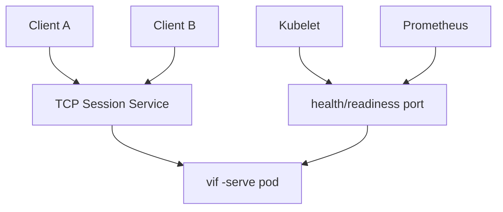
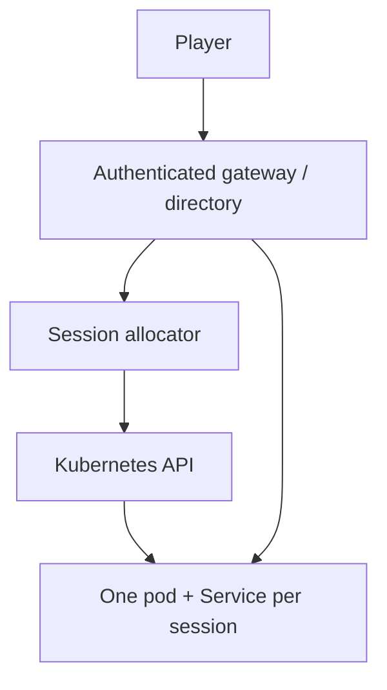

# K3s dedicated-server fleet plan

This is the implementation and acceptance plan for running Vi-Fighter dedicated
servers on K3s. The first target is a single Arch Linux node running as a bhyve
guest on FreeBSD; the later target is a multi-session fleet reached by remote
terminal clients over the existing framed TCP protocol.

The document is current with snapshot schema 4 and the local FSM lifecycle
reconciliation work. It replaces the earlier audit diary and preserves only the
measurements, decisions, gaps, and tests that remain actionable.

## 1. Outcome and current readiness

The application already has the right process shape:

```sh
vif -serve :7777 -probe :7778 -log-stdout -l -lv info -ls all+dispatch \
    -players 4 -size 120x40
```

`-serve` owns the Shared simulation and network session but no terminal, renderer,
audio device, input source, or player cursor. It starts on its first guest,
continues while the roster is empty, and treats `-players` as a guest ceiling.
`/healthz`, `/readyz`, and `/metrics` are available on the separate probe listener.

The process is suitable for a **trusted-network K3s prototype now**. It is not
suitable for direct Internet exposure: game links are plaintext and peer identity
is not authenticated. A VPN or authenticated TCP gateway plus restrictive
firewalling is required until application identity and transport security land.

The reported FSM stall is closed in the application layer:

- the supplied host trace advances quasar to storm at tick 1829;
- the storm circles are removed through combat over about 30 seconds, with the
  last circle and storm root ending at tick 2434;
- the main region resumes at tick 2435;
- the stuck guest was therefore not waiting on a host FSM transition—it retained
  Player-domain drain/grayout state after a correction skipped the release path;
- live FSM imports now reconcile only explicitly marked persistent `ClassLocal`
  lifecycle events; staging remains side-effect free;
- quasar, storm, tower, placeholder, and tower-defense holds use paired parent
  lifecycle states, so whole-region retirement is an exit;
- delayed actions now restore by deterministic compiled identity rather than by
  an unrelated queue index;
- quasar zap rendering intersects its ellipse with visible map bounds on both axes.

This removes the gameplay blocker for fleet testing. It does not remove the
security, allocation, and graceful-drain work below.

## 2. Runtime contract the fleet must preserve

| Property | Required behavior |
|---|---|
| Session unit | One `vif -serve` process owns one match/session timeline. |
| Authority | The dedicated host's Shared world is canonical; guests predict and accept corrections. |
| Port | Game traffic is raw TCP, one long-lived connection per peer; it is not HTTP ingress traffic. |
| Probe port | HTTP probe/metrics traffic is separate from the game listener and should remain cluster-internal. |
| Capacity | `-players` is a ceiling. `/readyz` returns unavailable at capacity while `/healthz` remains healthy. |
| Empty roster | A server stays alive and can accept a later join or reconnect. Empty does not mean completed. |
| Storage | Simulation state is in memory. A replacement pod does not inherit the match unless an explicit migration feature is added. |
| Correction | Snapshot schema, build/config/content identity, and ordering fences must match before install. |
| Local state | Captures exclude Player-domain state; config-marked local FSM lifecycle is re-derived during live install. |
| Shutdown | `SIGTERM` closes the process cleanly, but connected guests currently observe host loss/succession rather than an orchestrated match drain. |

Kubernetes restart and replication do not create game-level high availability.
Authority succession helps already-connected participants after a host disappears;
it does not transfer an in-memory server session into an unrelated replacement pod.

## 3. Readiness and gap register

### Closed application prerequisites

| ID | Status | Result |
|---|---|---|
| R1 | closed | Dedicated `ModeServer` has no cursor, terminal, renderer, or audio runtime. |
| R2 | closed | Server lobby starts with one guest; `-players` is a ceiling and later guests use mid-run admission. |
| R3 | closed | JSON logs can go to stdout; requested logging fails early rather than silently disappearing. |
| R4 | closed | Separate liveness, readiness, and Prometheus endpoints exist. |
| R5 | closed | Map dimensions, snapshot assembly, scheduled frames, and handshakes have explicit bounds. |
| R6 | closed | First-guest geometry is adopted when `-size` is omitted; an explicit server size wins. |
| R7 | closed | Remote cursors render independently of their transient effects. |
| R8 | closed | A correction cannot strand config-declared persistent drain/grayout holds. |
| R9 | closed | Delayed transition work survives snapshot transfer by compiled action identity. |
| R10 | closed | Quasar zap range cannot draw into centered viewport cells outside the map. |

### Work still required

| ID | Priority | Gap | Completion signal |
|---|---|---|---|
| F1 | critical before public exposure | No authenticated participant identity or confidentiality. | Token or certificate identity is bound to the handshake; links are encrypted end-to-end or terminate at a trusted gateway; hostile-peer tests pass. |
| F2 | critical before mixed releases | Join identity does not fully bind protocol/build/config semantics. | Handshake rejects different protocol, snapshot schema, simulation build, config hash, or content pin with a named reason. |
| F3 | required for more than one session | No allocator or match directory maps players to one session pod/service. | Create/join returns a stable endpoint and session credential; multiple sessions cannot cross-connect. |
| F4 | required for safe upgrades | No drain state rejects new joins and waits for an empty roster before termination. | Control-plane drain makes readiness false, rejects admission, reports roster zero, then exits within the grace period. |
| F5 | required for production sizing | Four-player `config/main` and `config/td` CPU/RSS/GC high water is unmeasured. | Reproducible report establishes requests, limits, `GOMEMLIMIT`, and tick-slip threshold. |
| F6 | required for operations | No fleet manifests, immutable image pipeline, SBOM/signature policy, or rollout runbook. | CI publishes a digest-pinned image and validated manifests; canary/rollback are exercised. |
| F7 | required for observability | Metrics exist, but dashboards and alerts do not. | Alerts cover liveness, restarts/OOM, tick slips, correction growth, queue refusal, capacity, and leaked local holds. |
| F8 | desirable | Server binary still links terminal/render/audio packages it never initializes. | A server-only target reduces artifact and image size without changing simulation identity. |
| F9 | desirable after sizing | Spatial grid reserves about 30.5 MiB per world at the current maximum. | Right-sizing is proven not to reintroduce resize churn and materially raises pod density. |
| F10 | follow-up ordering | Guest-authored late crossing membership still uses apply tick rather than a per-source applied sequence fence. | A delayed guest frame cannot be absent from an overtaking correction. |
| F11 | policy decision | `SIGHUP` currently terminates; no reload contract exists. | Reserve it for reload or explicitly document termination and test it. |
| F12 | gameplay/product decision | There is no match-complete process exit. | Keep long-lived reusable sessions, or define a game-owned terminal state before adding ephemeral Jobs. |

## 4. Target topology

### 4.1 First milestone: one manually addressed session



Use one replica and one Service. A Deployment is sufficient because no persistent
pod identity or disk is part of the session contract. A StatefulSet adds no match
recovery by itself. Use a distinct ClusterIP or direct pod scrape for probes; do
not expose port 7778 outside the cluster.

For the initial single-node lab, expose the game port with one of:

1. `NodePort`, with the bhyve/FreeBSD firewall forwarding the chosen TCP port;
2. K3s ServiceLB `type: LoadBalancer`, after verifying which node address and host
   port it publishes; or
3. `kubectl port-forward` only for a local smoke test, never as the fleet design.

K3s documents its bundled networking services and ServiceLB behavior in
[Networking Services](https://docs.k3s.io/networking/networking-services).
HTTP Ingress is not the default answer for the framed TCP game protocol; a chosen
gateway must explicitly support TCP streams.

### 4.2 Fleet milestone: allocator-owned session endpoints



Do not put several independent session pods behind one ordinary load-balanced
Service and expect players joining the same match to reach the same pod. The
allocator must select the session and return or proxy a session-specific endpoint.
The endpoint can be a per-session Service, a gateway route keyed by a signed
session token, or another explicit mapping. Pick one before horizontal scaling.

## 5. Arch Linux on FreeBSD/bhyve preparation

The guest is a normal Linux K3s node; the extra failure surfaces are the bhyve
network, clock, storage, and—if FreeBSD itself is virtualized—nested virtualization
needed by bhyve. Containers do not themselves require hardware virtualization.

### 5.1 Record the platform

Capture this with the test report:

```sh
uname -a
systemd-detect-virt
lscpu
findmnt -no FSTYPE,OPTIONS /sys/fs/cgroup
timedatectl status
ip -br link
ip route
```

Pin the Arch kernel, K3s channel/version, CNI mode, container runtime, and image
digest used for an acceptance run. Arch is rolling; an unrecorded host upgrade
must not silently change the test baseline.

### 5.2 Kernel and node checks

- Run the K3s configuration check supplied by the installed release when
  available, and verify cgroups, namespaces, overlayfs, bridge/netfilter, conntrack,
  and required iptables/nftables compatibility.
- Confirm the node has stable hostname/IP identity, DNS, and synchronized time.
- Confirm `/var/lib/rancher/k3s` has enough durable space for K3s/containerd images
  and logs; game pods themselves require no persistent volume by default.
- Reserve CPU and memory for the FreeBSD host, Arch guest, and K3s system pods
  before calculating session density.
- If FreeBSD is itself a VM, prove VMX/SVM exposure and bhyve stability under load;
  treat failure to start or retain the Arch guest as an infrastructure blocker.

The current K3s node/network prerequisites—including API port 6443 and CNI ports
such as UDP 8472 for Flannel VXLAN—are maintained in the official
[K3s requirements](https://docs.k3s.io/installation/requirements). Open only the
ports used by the selected single- or multi-node topology.

### 5.3 bhyve and CNI network validation

- Prefer a bridged/tap attachment with a stable Arch address for the first test.
- Record the physical/FreeBSD bridge, tap, VirtIO interface, Linux interface, CNI,
  Service, and any NAT/firewall hop.
- Measure end-to-end MTU. VXLAN adds encapsulation; test non-fragmenting payloads
  from client to node and between nodes before blaming the game protocol for loss.
- Verify TCP 7777 survives at least a 30-minute idle/active session through every
  NAT or stateful firewall on the path.
- Verify API/CNI ports are reachable only where needed. Kubernetes NetworkPolicy
  controls pod traffic only when the installed network plugin enforces it; see
  [Network Policies](https://kubernetes.io/docs/concepts/services-networking/network-policies/).
- Reboot the Arch guest and then the FreeBSD host; confirm K3s, networking, and the
  workload recover in the documented order.

## 6. Image and workload contract

### 6.1 Image

Build a static Linux binary in a pinned builder and copy it into a minimal final
image. The production artifact must:

- use `CGO_ENABLED=0`;
- run as a numeric non-root UID/GID;
- contain the same `vif` binary for init validation and serving;
- retain Go/VCS build metadata and carry OCI source/revision/version labels;
- be referenced by digest in the workload;
- publish an SBOM and vulnerability scan result; sign/prove the artifact once the
  registry and policy mechanism are selected;
- include no shell in the final image unless an operational requirement justifies
  it.

Keep `config/` external only when operators truly need scenario changes. Embedded
configuration is the lowest-drift starting point. An external config should be an
immutable ConfigMap or image layer whose content digest participates in session
identity.

### 6.2 Pod security

Required pod/container settings:

| Setting | Requirement |
|---|---|
| User | `runAsNonRoot: true` with a numeric `runAsUser`/`runAsGroup`. |
| Privilege | `allowPrivilegeEscalation: false`; drop all capabilities. |
| Filesystem | `readOnlyRootFilesystem: true`; no writable mount unless journaling is enabled. |
| Seccomp | `RuntimeDefault`. |
| Service account | `automountServiceAccountToken: false`; the game pod does not call Kubernetes. |
| Host access | No host network, PID, IPC, devices, or privileged mode. |
| Config | Read-only mount; Secrets only for identity credentials, never baked into the image. |

Kubernetes documents the fields and their pod/container scope in
[Configure a Security Context](https://kubernetes.io/docs/tasks/configure-pod-container/security-context/).

If `-j` is enabled, mount a bounded `emptyDir` or persistent volume under a
dedicated `XDG_STATE_HOME`, define rotation/export, and test disk exhaustion.
`-log-stdout` should remain the fleet log path; do not also create file logs unless
the retention requirement is explicit.

### 6.3 Probes and ports

| Probe | Endpoint | Meaning | Initial policy |
|---|---|---|---|
| Startup | `/healthz` on 7778 | Probe listener and process initialized; lobby is allowed. | Generous failure window for image pull/start only. |
| Liveness | `/healthz` on 7778 | Simulation clock is making progress when it should be. | Do not make transient load a restart loop. |
| Readiness | `/readyz` on 7778 | A new guest can currently be admitted. | Remove capacity/draining pods from new-session routing. |
| Metrics | `/metrics` on 7778 | Internal Prometheus exposition. | Cluster-only; scrape with labels for session/pod/revision. |

Startup probes suppress liveness/readiness until startup succeeds, while liveness
and readiness have different restart/routing effects; use the current upstream
[probe guidance](https://kubernetes.io/docs/tasks/configure-pod-container/configure-liveness-readiness-startup-probes/).

### 6.4 Resources

Start the lab—not the final production policy—with:

| Resource | Initial value | Rationale |
|---|---:|---|
| memory request | 96 MiB | Historical live server measurements and scheduling headroom. |
| memory limit | 192 MiB | Includes active world, bounded transport, GC headroom, and a possible staging world after authority change. |
| `GOMEMLIMIT` | 160 MiB canary value | Gives Go an earlier collection target; accept only after GC/tick tests. |
| CPU request | 100m | Historical one-guest load was about 0.05 core. |
| CPU limit | 500m canary value | Wide initial ceiling; tune against storm/tower tick slips. |
| termination grace | 30 s | Above the observed/read-derived close path; re-measure under load. |

Kubernetes schedules from requests and enforces limits differently; memory limit
breaches can produce OOM termination and CPU limits can throttle. Revisit these
values only from measured pod data, following
[Resource Management for Pods and Containers](https://kubernetes.io/docs/concepts/configuration/manage-resources-containers/).

Historical evidence to retain as the baseline:

| Case | Observation |
|---|---:|
| Server waiting in lobby | 12.0 MB RSS |
| Embedded game, one guest, long run | 61.75 MB peak RSS |
| Server after guest left/scavenging | 40.1 MB RSS |
| Headless joining participant with staging world | 95.5 MB peak RSS |
| Remediated server with two staggered guests | 63.5 MB plateau |
| Spatial grid per world | about 30.5 MiB |
| CPU lobby / one embedded guest | about 0.2% / 4.9% of one core |

Repeated reset experiments plateaued rather than growing, so the observed RSS
lag was runtime scavenging/capacity retention, not a per-match leak. Confidence in
the 192 MiB limit remains medium until a full roster runs `config/main` tower/storm
and `config/td` at the fleet's largest supported map.

## 7. Sequenced implementation plan

Each phase has a deliverable and an exit gate. Do not advance a public endpoint
past Phase 3 until Phase 4's trust boundary is complete.

### Phase 0 — merge and baseline the gameplay fix

Deliverables:

- snapshot schema 4 local-lifecycle and delayed-action fixes;
- parent-state lifecycle refactor in every shipped scenario;
- quasar map clipping;
- updated authoring, architecture, multiplayer, and operations documentation.

Automated gate:

```sh
go test ./internal/fsm ./internal/render/renderer ./internal/app ./internal/snapshot
go run ./cmd/vif -check
go run ./cmd/vif -check -g config/main
go run ./cmd/vif -check -g config/td
make verify
```

Manual gate: replay the supplied quasar→storm sequence with host and guest logs.
After a correction retires the region, `drain.paused` and grayout must clear and
drains must resume from cursor heat. Confirm the storm circles disappear only from
combat/death events. Resize a small map into a larger terminal and confirm the
quasar ellipse never colors cells outside the map.

### Phase 1 — establish the Arch/K3s lab

Deliverables:

- recorded bhyve/Arch/K3s/CNI versions and topology;
- stable node address, time sync, storage, firewall, and MTU baseline;
- K3s installed from a pinned release/config rather than an unrecorded latest;
- namespace with restricted Pod Security admission where compatible;
- internal image registry access or a documented image import path.

Exit gate:

- node survives reboot and returns Ready;
- CoreDNS and CNI checks pass;
- a non-root read-only test pod runs;
- external test client reaches a temporary raw TCP Service;
- K3s API/CNI ports are not exposed beyond their intended network.

### Phase 2 — build and run one session pod

Deliverables:

- multi-stage image and digest-pinned workload;
- init validation using `vif -check` with exactly the config mounted for serving;
- one-replica Deployment, one game Service, internal probe scrape;
- security context, resource request/limit, stdout logs, and config identity labels;
- Kustomize/Helm/plain-manifest choice documented and validated in CI.

Exit gate:

- pod starts with a read-only root filesystem and no service-account token;
- lobby is healthy/ready; first guest starts the session; capacity makes readiness
  false without killing existing gameplay;
- logs are valid JSON with pod, session, revision, run, and tick correlation;
- metrics scrape succeeds without exposing 7778 externally;
- `SIGTERM` exits within the configured grace period with no terminal escape bytes.

### Phase 3 — validate real multiplayer through bhyve networking

Deliverables:

- repeatable two- and four-client test procedure from outside the Arch guest;
- captured latency/loss/MTU, CPU, RSS, GC, correction, and tick-slip results;
- journal/log bundle retention procedure for failed sessions;
- confirmed resource envelope for embedded, `config/main`, and `config/td`.

Exit gate:

- 60-minute full-roster runs complete without OOM, liveness restart, stalled FSM,
  sustained tick slips, unbounded queues, or growing correction magnitude;
- disconnect/reconnect and mid-run join converge;
- `tc netem` latency, jitter, reordering, and loss recover at the next bounded
  correction/keyframe;
- host loss behavior is understood and recorded for connected clients;
- resource values are revised from measurements and checked into the manifests.

### Phase 4 — close identity and transport security

Deliverables:

- protocol/build/config/content identity in the handshake;
- authenticated participant/session claims and replay-resistant admission;
- encrypted transport, either native or through a gateway whose trust boundary is
  explicit;
- Secrets rotation, expiry, revocation, and log-redaction rules;
- default-deny network policy and firewall rules for the selected CNI/gateway;
- fuzz/abuse coverage for unauthenticated, malformed, replayed, and rate-limited
  handshakes.

Exit gate: an untrusted network can reach only the gateway, cannot read an anchor
or capture without authorization, cannot claim another participant/session, and
cannot inject a replicated event. Mixed builds/configs fail before roster
admission with a clear reason.

### Phase 5 — add allocator and graceful drain

Deliverables:

- session directory/allocator with create, join, capacity, expiry, and cleanup;
- per-session endpoint routing and credentials;
- application drain control: readiness false, admissions rejected, roster watched,
  final logs/journal flushed, then termination;
- rollout policy that never assumes a replacement pod owns the old in-memory match;
- explicit choice between wait-until-empty, participant migration, and a maximum
  drain deadline;
- quota and garbage collection for abandoned session objects.

Exit gate: two simultaneous sessions route correctly under repeated joins; a
canary rollout drains old sessions without new admissions; voluntary node drain
does not silently split matches. A PodDisruptionBudget may protect against
voluntary eviction, but it is not session migration. Kubernetes eviction honors
PDBs and graceful termination for voluntary disruptions as described in
[Disruptions](https://kubernetes.io/docs/concepts/workloads/pods/disruptions/).

### Phase 6 — scale, harden, and automate recovery

Deliverables:

- load/soak job covering expected concurrent sessions per node;
- dashboards, alerts, SLOs, and an on-call runbook;
- image signature/admission policy and upgrade/rollback rehearsal;
- node failure, network partition, disk pressure, and registry outage exercises;
- decision on server-only binary, grid right-sizing, and `SIGHUP`;
- capacity model that reserves K3s/system/FreeBSD headroom and uses measured—not
  theoretical—per-session high water.

Exit gate: the fleet meets its availability and density target through a full
node maintenance/reboot cycle, and every alert has a tested operator action.

## 8. Test matrix

### 8.1 Pre-merge automated tests

| Surface | Required tests |
|---|---|
| FSM import | Region removal, region insertion, quasar→storm exit-before-entry ordering, unchanged path, and changed cursor scope. |
| Side effects | Staging emits none; live import emits only marked local lifecycle; rewards/strobes/spawns do not replay. |
| Delayed work | Delayed entry/update/external/internal-transition action round trips by compiled ID; invalid ID is rejected atomically. |
| Capture | Invalid region/state/variable/action fails before machine mutation; schema mismatch is rejected. |
| Gameplay | Correction enters and retires a quasar while receiver skips the exit; drains/grayout end and progression can continue. |
| Renderer | Zap ellipse clipped at left/right/top/bottom for centered and camera-cropped maps. |
| Configuration | Embedded, main, td, and blank trees load; every reconcile marker passes class/lifecycle validation. |
| Network | Join/reconnect, authority fence, suffix replay, selective repair, keyframe fallback, bounds, and half-open handshake shutdown. |

### 8.2 Image and manifest CI

- build for `linux/amd64` and any intended second architecture;
- prove the final ELF is static and starts without libc/shell;
- run `vif -check` inside the final image as its numeric user;
- run with read-only rootfs, dropped capabilities, seccomp, and no token mount;
- generate SBOM, scan image and dependencies, and enforce an agreed severity policy;
- validate YAML schema and server-side dry-run against the pinned cluster version;
- policy-test probe ports, resource fields, digest pinning, labels, and security
  context;
- start an ephemeral K3s test cluster, join a scripted client, scrape probes, and
  terminate the pod.

### 8.3 Manual gameplay acceptance

Use the exact release image and external client path:

1. Start the server with trace logging and a bounded journal volume.
2. Join two clients with different terminal sizes; verify the configured/first
   guest map rule and peer cursor display.
3. Play through three quasars and the storm. Correlate FSM transition, species
   death, correction, `drain.paused`, and grayout records by tick.
4. Introduce link delay/loss around quasar death so a guest correction skips the
   release transition. The guest must clear its local holds after install.
5. Disconnect and reconnect each client; repeat while a correction is in flight.
6. Fill capacity and confirm readiness 503 while health remains 200; existing
   clients must keep playing.
7. Resize a small map/terminal combination larger and move a quasar to every edge;
   no zap cell may appear outside the playable rectangle.
8. Send `SIGTERM` during lobby, active quasar, active storm, and half-open handshake;
   record server exit time and client behavior.

### 8.4 Fault and load tests

| Fault | Expected result |
|---|---|
| 100–500 ms latency/jitter | Cadence adapts; correction remains bounded; no permanent FSM/local-effect stall. |
| Loss/reordering | Later correction/keyframe converges; queues stay within count/byte windows. |
| Slow receiver | Send refusals/backpressure are visible; memory remains below limit. |
| Malformed/oversized frame | Connection refused/dropped without panic, large reservation, or relay amplification. |
| Half-open handshake | Budget limits work; accept loop serves another client; shutdown closes promptly. |
| Pod OOM canary | Restart/OOM alert fires and session-loss behavior is explicit; production limit is then raised or leak fixed. |
| Pod delete/node failure | Connected-client succession/failure is recorded; allocator does not advertise replacement as the same match. |
| Voluntary node drain | Draining sessions reject new joins and follow the selected empty/migrate/deadline policy. |
| Disk full with journal | Gameplay/log policy degrades as designed and never fills the node silently. |

## 9. Observability and acceptance signals

Every pod must be attributable by image revision, session ID, authority term, run,
tick, and peer count. Retain these application signals:

- `engine.ticks`, `engine.tick_slips`, event settle exhaustion, and queue drops;
- `network.peers`, admission/refusal, stale/invalid frames, scheduled count/bytes,
  authority/fork/migration records, and correction cadence;
- snapshot capture/stage/commit time, sent bytes, keyframes, correction entries,
  entities, and cells;
- per-region FSM state/elapsed/paused values and transition/region logs;
- `drain.paused` and `effects.grayout_active`, correlated with a lifecycle-holding
  FSM path;
- process RSS/working set, CPU throttling, GC pause/heap, goroutines, restarts,
  OOMKilled, and probe results;
- node disk, conntrack, packet drop, CNI error, and clock-sync health.

Initial alerts should cover:

1. liveness failure or CrashLoop/OOM;
2. readiness false without capacity or declared drain;
3. sustained tick slips/settle exhaustion;
4. correction magnitude or keyframe rate rising continuously;
5. queue/assembly/admission bounds being hit;
6. drain/grayout active after no configured hold region remains;
7. session pod terminating with connected peers outside an approved drain.

Prometheus series are gauges because game reset can rebase counters. Alert rules
must account for resets and pod identity rather than assuming process-lifetime
monotonic counters.

## 10. Security and exposure policy

Before F1/F2 are complete:

- bind public access only through a trusted VPN/private network;
- restrict the game Service to known client/gateway sources at the FreeBSD, Arch,
  Kubernetes, and upstream firewall layers;
- never expose the probe port;
- treat every connected game peer as able to influence the Shared simulation;
- do not log credentials, full Secrets, or externally meaningful session tokens;
- retain admission and malformed-frame logs for abuse diagnosis.

After native/gateway security lands, document exactly where TLS terminates, which
component authenticates the participant, how identity binds to a roster slot and
session, and whether traffic inside the cluster remains protected. “Behind a
gateway” is not itself an authentication design.

K3s production hardening choices should be reconciled with its current
[CIS Hardening Guide](https://docs.k3s.io/security/hardening-guide), not copied
blindly from a different Kubernetes distribution or old release.

## 11. Operational runbooks to write before production

### Deploy/canary

1. Validate config with the release image.
2. Apply digest-pinned canary objects.
3. Verify startup/liveness/readiness/metrics and one scripted session.
4. Run the quasar/storm correction check.
5. Admit new sessions to the canary; do not move live sessions implicitly.
6. Drain the old revision under the Phase 5 policy.

### Diagnose a stuck session

1. Record pod/image/session/authority/run/tick and roster.
2. Save recent stdout logs, journal if enabled, metrics, and pod/node events.
3. Compare host/guest FSM region transitions and correction install ticks.
4. Correlate quasar/storm entity deaths with region termination.
5. If `drain.paused` or grayout remains active, identify the holding parent state
   and `import reconciled local lifecycle` record; absence is actionable.
6. Preserve the bundle before restart so a correction race remains reproducible.

### Node maintenance

1. Stop allocator placement on the node.
2. Put every session into application drain.
3. Wait for empty rosters or the approved deadline/migration outcome.
4. Use `kubectl drain`; verify PDB behavior and termination times.
5. Reboot/upgrade, validate K3s/CNI/MTU/time, then return the node to allocation.

## 12. Decisions retained from the feasibility review

- **Long-lived reusable server:** accepted until gameplay defines a real terminal
  match state. Kubernetes must not invent one.
- **Dedicated lobby:** quorum is one; `-players` is capacity.
- **Map bounds:** an explicit server `-size` wins; otherwise the first guest sets
  a mutable/default scenario's shared map.
- **Memory:** keep the current bounded maximum grid until full-roster measurement;
  right-size only with resize/play regression coverage.
- **Correction:** Shared capture is authoritative; Player-domain state is excluded
  and only explicit persistent local FSM lifecycle is re-derived.
- **Workload identity:** one process is one session. Multiple replicas require an
  allocator/session route, not a blind Service.
- **Trust:** current protocol is trusted-peer only. Public exposure waits for F1/F2.

## 13. Production completion checklist

- [ ] Phase 0 repository gates and manual incident reproduction pass.
- [ ] Arch/bhyve/K3s platform and network baseline is recorded and reboot-tested.
- [ ] Image is minimal, non-root, read-only, scanned, signed, and digest-pinned.
- [ ] Config validation runs against the exact mounted config before serving.
- [ ] Game/probe Services, probes, logs, metrics, security context, and resources are validated.
- [ ] Full-roster embedded/main/td soak establishes CPU/memory/GC limits.
- [ ] Authentication, encryption, build/config/content identity, and abuse tests pass.
- [ ] Allocator routes players to a unique session and cleans abandoned objects.
- [ ] Drain/upgrade/node-maintenance behavior is exercised with connected clients.
- [ ] Dashboards, alerts, retention, incident bundle, rollback, and on-call runbooks are tested.
- [ ] No direct public path reaches unauthenticated game TCP or probe HTTP.
