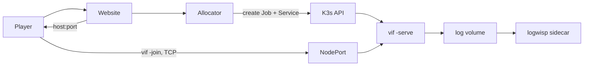

# The session fleet: plan and work list

Vi-Fighter dedicated servers run one session per container on K3s. A website asks
for a game, one container appears, and it ends itself when nobody is in it.

This is the plan and the outstanding work. The procedure for installing and running
it is [K3s and container deployment](kube_docker_deploy.md); the objects themselves
are in [`deploy/`](../deploy/README.md); the scenarios that verify it by hand are in
[`test/`](../test/README.md).

## 1. What is deployed

| Property | Value |
|---|---|
| Session unit | One `vif -serve` process, one pod, one Job, one Service. |
| Concurrency ceiling | 10, enforced by a namespace `ResourceQuota` as well as by the allocator. |
| First-guest window | 90 s. A session nobody reaches exits 0 and is removed. |
| Empty grace | 90 s after the last guest leaves; also the window a dropped player has to reclaim their slot. |
| Drain | 20 s on `SIGTERM`, inside a 30 s termination grace period. A second signal exits at once. |
| Trigger | The website's allocator, on a player's request. Nothing runs when nobody is playing. |
| Image | `scratch` + one static binary, ~13 MB, non-root, read-only root filesystem, no shell. |
| Transport | Raw framed TCP, one long-lived connection per player. Unauthenticated by decision (§4). |
| Logs and metrics | JSON lines to a shared volume; a LogWisp sidecar puts them on stdout and serves them as Server-Sent Events. |



## 2. Runtime contract

| Property | Required behaviour |
|---|---|
| Session unit | One process owns one match timeline. The world is in memory; no replacement pod inherits it. |
| Authority | The dedicated host's Shared world is canonical; guests predict and accept corrections. |
| Capacity | `-players` is a ceiling on guests. At capacity the health body reports `ready=false`; the process stays healthy. |
| Allocated lifetime | `-first-join`, `-empty` and `-drain` are enforced by `internal/lifecycle` over roster observations, and published on `/health`. |
| Join identity | The coordinator refuses a peer whose protocol, simulation fingerprint, capture schema, journal schema, tick interval, seed, config or corpus differs from the offer it made. |
| Shutdown | `SIGTERM` drains: readiness false, dials refused with `ErrSessionEnding`, exit when the roster empties or `-drain` elapses. |
| Health | One `/health` path. Its code is liveness; the body carries `ready`, `phase`, `expires_in`, roster and tick. |
| Storage | None. Nothing is persisted and no volume outlives the pod. |

Kubernetes restart and replication do not create game-level high availability.
Authority succession helps already-connected participants after a host disappears;
it does not move an in-memory session into an unrelated pod.

## 3. Work list

### Done

| Item | Result |
|---|---|
| Dedicated host shape | `ModeServer` has no cursor, terminal, renderer or audio. Its lobby starts on one guest; `-players` is a ceiling. |
| Supervised endpoint | One `/health` (liveness code, everything else in the body) and `/metrics`. |
| Allocated lifetime | First-guest window, empty grace and drain, in `internal/lifecycle`; one `session ended` log line names the reason. |
| Graceful termination | A signal drains rather than cutting a match; a second one exits. An abandoned startup gate ends cleanly rather than failing the Job. |
| Join identity (was F2) | The **host** verifies. A joiner reports what it turned out to be and the coordinator refuses it; a peer that skipped its own check is refused anyway. Covers the wire protocol, the manifest's simulation fingerprint, both schemas, the tick interval, and the whole session identity. |
| Fleet objects | Namespace with enforced `restricted` Pod Security, ten-session quota, default-deny network policy, per-session Job/Service, allocator RBAC. |
| Live log and metric stream (was F7) | The metrics were already in the log — `internal/status` emits the whole registry as `sub="stat"` records on a tick cadence. A LogWisp sidecar tails that log and serves it live. |
| Correction correctness | Snapshot schema 4 local-lifecycle reconciliation, delayed-action identity, quasar map clipping. |

### Open

| ID | Priority | Item | Done when |
|---|---|---|---|
| H1 | **next** | **Harden the open port.** The game port is unauthenticated by decision (§4) and reachable from the Internet, so everything a stranger can do to a session has to be bounded. Two known holes: the startup ready gate has no timeout, and an abandoned startup gate ends the session — so a peer that reaches a fresh session first can hang it or end it. | A peer that connects and never confirms is dropped on a deadline; an abandoned lobby returns to waiting instead of ending the session; fuzz coverage for malformed, oversized, replayed and half-open handshakes passes. |
| H2 | next | **Run the lab.** Install the pinned K3s, import the image, apply the boundary objects, create one session by hand. | [Deployment §2-§6](kube_docker_deploy.md) is executed and its versions recorded. |
| H3 | after H2 | **Measure a full roster.** Four guests through a tower and a storm, and on `config/td`, for an hour. | Requests and limits in `deploy/k3s/30-session.yaml` come from the measurement rather than from single-guest history. Not a blocker: the current values are a starting point, not a claim. |
| H4 | later | **Server-only build.** The binary links terminal, render and audio packages `ModeServer` never initialises. | A server target drops them without changing simulation identity. Matters for pod density, not for ten sessions. |
| H5 | decision | **Exact late-guest acknowledgement.** See §5 for the worked example. Currently deferred. | Either a per-source applied-sequence fence lands, or the item is closed as accepted behaviour. |
| H6 | later | **Spatial grid right-sizing.** ~30.5 MiB reserved per world at the current maximum. | Deferred until density matters; needs resize/play regression coverage. |

### Dropped, with the reason

| Was | Reason |
|---|---|
| F1 authentication | Deferred by decision. The website triggers a container and the player connects to it; neither hop is authenticated. Hardening (H1) is the requirement in its place, and it comes *before* any auth work, not after. |
| F3 session credentials | The website and the container are joined by one commissioned endpoint. There is nothing for a credential to add that the endpoint's obscurity and H1's bounds do not, and building one now would be work spent away from a fleet that runs. |
| F6 CI/CD, SBOM, signing | No value to the application until one instance runs under orchestration. Revisit when the fleet exists. |
| F11 `SIGHUP` reload | No reload contract is planned. `SIGHUP` terminates like any other signal, which is the documented behaviour. |
| F12 match-complete exit | There is no gameplay terminal state and none is planned. A session ends on emptiness. If one ever exists, it attaches to `lifecycle.Controller.Expire` and nothing else changes. |

## 4. Security posture

The game port is **open and unauthenticated, by decision**. Anyone who can reach it
can join a session and influence its Shared world. That is accepted for now; what is
not accepted is a stranger being able to do anything *worse* than play.

What already bounds a stranger:

- one admission per address per `NetworkAdmitBurst` (6) in `NetworkAdmitWindow`
  (1 minute), tracked for at most 1024 addresses so the defence cannot become the
  exhaustion;
- at most `MaxHandshakes` (8) handshakes in flight, each on its own goroutine with a
  `ConnectTimeout` (5 s) and a `ReadTimeout` (30 s);
- a 16-bit frame length, bounded receive queues, and a bounded repair size, so no
  peer can make the host reserve memory by asking;
- `admissibleFromSource`, which refuses roster-creating crossings from anyone but
  the coordinator;
- the join identity check, which refuses a peer that is not running this session
  before it is given a roster slot;
- the network policy: one game port reachable, everything else denied, no egress.

What does not, and is H1:

- the startup ready gate waits without a deadline, so a peer that completes the
  handshake and then goes silent holds a fresh session open until the Job's
  `activeDeadlineSeconds`;
- an abandoned startup gate ends the session, so a peer that reaches a fresh session
  before its intended player can end it by connecting and dropping.

Both are confined to the window between a session's first guest connecting and the
session starting. Neither is reachable once a session is running.

Until H1 lands, the firewall requirements in
[Deployment §7](kube_docker_deploy.md#7-what-the-network-and-firewall-task-must-provide)
are what stands in front of this: the forwarded surface is the ten-port NodePort
range and nothing else, and the probe, log-stream and API ports never leave the node.

## 5. H5: the late-guest ordering decision

The one open correctness question, with the example it needs.

A guest produces a crossing whose agreed apply tick is T+3 and retains it. Its link
misses the playout lead, so the host's capture at tick T+5 does not contain it. The
guest installs that correction and classifies its own retained frame by apply tick:
T+3 ≤ T+5, so it is treated as already represented and is **not** replayed. The
guest's own action disappears from its world.

It comes back. The host applies the late frame when it arrives — a late crossing is
counted (`network.barrier_late`) and applied, not discarded — so the next capture
contains it and the guest converges at the following correction. The cost is one
cadence, about 200 ms at 5 Hz, during which the player sees their own action undone
and then redone.

So this is **not** a divergence and **not** a lost action. It is a visible rollback
on a link that is already failing to hold the playout lead, and the metrics that
report that link (`network.lag_ticks`, `network.barrier_late`) are the same ones
that predict it.

The exact fix is a per-source applied-sequence fence: the capture header carries,
per participant, the sequence the authority has completed, and the guest replays
anything beyond its own — the rule the authority's own crossings already use
(`CaptureHeader.AuthorityCrossingSeq`). It is a snapshot schema change and per-source
completion accounting.

**Deferred.** Revisit if players on ordinary links report their actions flickering;
close it as accepted behaviour if they do not.

## 6. Resources

Starting values, not measured ones (H3):

| Resource | Value | Rationale |
|---|---:|---|
| memory request / limit | 96 / 192 MiB | Historical single-guest measurements plus headroom for a staging world after an authority change. |
| `GOMEMLIMIT` | 160 MiB | An earlier collection target than the limit, so the runtime collects instead of the kernel killing. |
| CPU request / limit | 100m / 500m | One guest was about 0.05 core; the ceiling is wide until a storm is measured. |
| termination grace | 30 s | Above the 20 s drain, so the process decides when the match ends. |

Historical baseline worth keeping: server in lobby 12.0 MB RSS; embedded game with
one guest 61.75 MB peak; server after a guest left 40.1 MB; headless joiner with a
staging world 95.5 MB peak; two staggered guests 63.5 MB plateau; spatial grid about
30.5 MiB per world; CPU about 0.2% of a core in lobby and 4.9% with one guest.
Repeated resets plateaued rather than growing, so the RSS lag was runtime
scavenging, not a per-match leak.

## 7. Verification

Automated, in the repository:

```sh
go test ./...        # includes lifecycle, identity refusal, probe and fingerprint
make verify          # plus vet and the build-tag matrix
```

By hand, on a dev machine — see [`test/README.md`](../test/README.md):

```sh
./test/scenario.sh all          # check, lifetime, drain, identity
./test/scenario.sh serve-fleet  # the flag set the containers run
./test/scenario.sh probe        # /health and /metrics
```

Against a cluster, the checks that need one:

| Check | Expected |
|---|---|
| Nobody joins for 90 s | Pod exits 0; log names `no guest connected`; the Job completes and the Service goes with it. |
| A guest joins and quits | Exits 0 ninety seconds later, naming `roster empty for`. |
| A guest quits and rejoins inside the grace | The session continues, into the slot the departure released. |
| `kubectl delete job` while a guest plays | `phase=draining`, `/health` still 200, exit when the roster empties or after 20 s. |
| Roster at `-players` | `ready=false` with `session at capacity`; the guests already in it keep playing. |
| 60-minute full roster | No OOM, no liveness restart, no sustained tick slips, no growing correction magnitude. |
| `tc netem` latency, loss, reordering | Recovers at the next bounded correction or keyframe. |
| Pod delete / node failure | Connected-client behaviour is recorded; the allocator does not advertise a replacement as the same match. |

## 8. Decisions

- **Allocated session, not a long-lived one.** A website creates the container, so
  the container ends itself. The long-lived shape remains available and is what the
  lifetime flags select when omitted.
- **Ninety seconds, twice.** The first-guest window and the empty grace are the same
  number and different bounds; the second doubles as the reconnect window.
- **Ten sessions, enforced by quota as well as by the allocator.** A ceiling only the
  allocator believes is one an allocator bug removes.
- **A Job per session.** The process is meant to exit; a Deployment would restart it
  into a session nobody is in.
- **A NodePort per session from a fixed ten-port range.** The pool becomes a fact the
  API server enforces and the firewall forwards as one range.
- **One health path.** The code answers "should this process still be running";
  everything else is in the body, where the allocator reads it.
- **The host is the authority over identity.** A joiner reports; the coordinator
  decides.
- **No authentication, and hardening first.** See §4.
- **Drain waits for the roster with a deadline.** No participant migration: there is
  nowhere to migrate a match that lives in one process's memory.
- **Dedicated lobby:** quorum is one, `-players` is capacity.
- **Map bounds:** an explicit `-size` wins; otherwise the first guest sets a mutable
  scenario's shared map.
- **Correction:** Shared capture is authoritative; Player-domain state is excluded
  and only explicit persistent local FSM lifecycle is re-derived.
