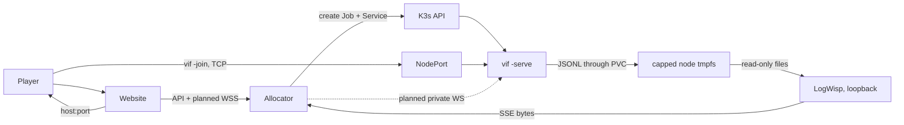

# The session fleet: design and work list

Vi-Fighter dedicated servers run one session per container on K3s. A website asks
for a game, one container appears, and it ends itself when nobody is in it.

This is what the design is, what it cost when it was measured, and what is left.
The procedure for installing it is
[Deploying the session fleet](kube-docker-deploy.md); the objects are in
[`deploy/`](../deploy/README.md); the scenarios that verify the process by hand are
in [`script/`](../script/README.md).

## 1. What is deployed

| Property | Value |
|---|---|
| Session unit | One `vif -serve` process, one pod, one Job, one Service. |
| Concurrency ceiling | 10, enforced by namespace `ResourceQuota`; the allocator also refuses before attempting an eleventh. |
| First-guest window | 90 s. A session nobody reaches exits 0 and is removed. |
| Empty grace | 90 s after the last guest leaves; also the window a dropped player has to reclaim their slot. |
| Drain | 20 s on `SIGTERM`, inside a 30 s termination grace period. A second signal exits at once. |
| Trigger | `tool/vif-allocator`, a hardened node service, is the website-facing control-plane boundary. A caller selects roster size, log level and scenario from what it advertises in `limits`; everything else in the workload is the deployment's. `deploy/k3s/session.sh` drives it from a shell and can also render the template directly. No session pod runs between requests. |
| Image | `scratch` plus the static `vif_headless` binary (about 12 MiB in the reference build), non-root, read-only root filesystem, no shell. It carries no scenarios: those come off a node volume, so what the fleet serves changes without a rebuild. |
| Scenario | Chosen per session from the allocator's advertised list, served from a read-only node directory (`/var/db/vif/wad`) mounted `scenario/` and `image/` only. The corpus and keymap stay embedded, so a native guest running `-d` can still join. |
| Transport | Raw framed TCP today; the chosen browser path adds a native binary WebSocket listener without removing TCP (§9). Unauthenticated initially (§4). |
| Reached by | Native clients use the forwarded ten-port range. Browser clients will use `wss://lixen.com/vif/ws/<session>` through the site and allocator to the selected pod (§9). |
| Logs and metrics | Each Job writes `<session-id>.jsonl` through a Bound local PVC onto a 256 MiB node tmpfs. One standalone LogWisp node service, pinned by `deploy/logwisp/REVISION`, has a read-only view and a loopback-only listener; the allocator reverse-proxies its SSE bytes at `/vif/api/logs` without parsing a record. |
| Public API | Exactly `/vif/api/sessions` and `/vif/api/logs`, over TLS through the site's front door. `/healthz`, `/readyz` and every other node port stay unreachable from outside. |



## 2. Runtime contract

| Property | Required behaviour |
|---|---|
| Session unit | One process owns one match timeline. The world is in memory; no replacement pod inherits it. |
| Authority | The dedicated host's Shared world is canonical; guests predict and accept corrections. |
| Capacity | `-players` is a ceiling on guests. At capacity the health body reports `ready=false`; the process stays healthy. |
| Allocated lifetime | `-first-join`, `-empty` and `-drain` are enforced by `internal/lifecycle` over roster observations, and published on `/health`. |
| Join identity | The coordinator refuses a peer whose protocol, simulation fingerprint, capture schema, journal schema, tick interval, seed or config differs from the offer it made. The corpus is not among them: glyphs are player domain, so each participant reads its own and a peer with different text still joins. |
| Session name | Optional. `-name` makes one address able to serve several sessions: the dialer sends it before the handshake, so a front door can route on it, and the session refuses a name that is not its own. A routing key, not a credential. Built and tested; the deployed manifest does not set one (§9). |
| Crossing ordering | Ordinary crossings are judged by the capture's per-source sequence fence, not by their apply tick, so a link that misses the playout lead costs freshness rather than the player's action (§5). |
| Shutdown | `SIGTERM` drains: readiness false, dials refused with `ErrSessionEnding`, exit when the roster empties or `-drain` elapses. |
| Health | One `/health` path. Its code is liveness; the body carries `ready`, `phase`, `expires_in`, roster and tick. |
| Storage | Match state is never persisted. A 256 MiB node tmpfs backs one Retain local PV/PVC for ephemeral public game logs, and an 8 MiB node directory backs a second, read-only one for scenarios. A session Job mounts those two claims and nothing else. Replacing the scenario tree is an atomic rename: a running match keeps the inode its pod mounted, and the next pod gets the new one. |

Kubernetes restart and replication do not create game-level high availability.
Authority succession helps already-connected participants after a host disappears;
it does not move an in-memory session into an unrelated pod.

## 3. Work list

### Open

| ID | Priority | Item | Done when |
|---|---|---|---|
| G | next | **Hand off a deployment a stranger can install.** The documentation reduction is done: the procedure, this plan, the artifact indexes and the runbook describe the deployed design rather than the batches that produced it. | Both rehearsals below reach a first session with no undocumented step, and every resource value in `deploy/k3s/30-session.yaml` cites a number from H3. |
| G1 | next | **Rehearse from bare Arch Linux and from bare Ubuntu.** Record package and service differences, and fix every command that assumes the production node. | A second node reaches [§13 of the procedure](kube-docker-deploy.md#13-first-session) without a step its operator had to invent. |
| H3 | next | **Measure a full roster.** Nine sessions driven by headless joiners for the fleet-level readings — CPU, memory, tmpfs, log rate, rotations — plus one real four-player session over real links, through a tower and a storm and on `wad/scenario/td`, for the hour that tick slips and correction magnitude need. | Requests and limits in `30-session.yaml` come from the four-player measurement rather than from single-guest history. |
| H1 | partly done | **Harden the open port.** The game port is unauthenticated by decision (§4) and reachable from the Internet, so everything a stranger can do has to be bounded. The two startup holes are closed: the tick-zero gate is bounded by one world install, a peer that leaves or goes silent costs the lobby rather than the session, and a confirmation is keyed to the link it arrived on. | Remaining: a handshake fuzz target for malformed, oversized, replayed and half-open cases, which `internal/network` has no equivalent of. |
| H16 | partly done | **Automate image delivery.** Nightly CI publishes the final headless Dockerfile to GHCR under moving and commit-addressed tags; `deploy/guest/update-vif-image.sh` still provides the checked local build/import boundary. | Choose the node's registry/promotion policy, authenticate pulls without a long-lived off-node deployment credential, and move new sessions to a verified digest while existing matches finish. |
| H4 | partly done | **Server-only and renderer-neutral builds.** `vif_headless` removes renderer and audio packages and is used by the image. Terminal-shaped key, color, cell, and image values remain in common simulation/configuration packages. | Extract renderer-neutral values for a minimally polished Android host within one month of development time; keep the simulation fingerprint shared with clients. |
| H5 | later | **Spatial grid right-sizing.** ~30.5 MiB reserved per world at the current maximum. | Deferred until density matters; needs resize/play regression coverage. |

### What the deployment batches established

Each of these is now a property of the deployed node, verified by
[§13 of the procedure](kube-docker-deploy.md#13-first-session) rather than by
repeating its original gate.

| Was | What it left behind |
|---|---|
| H2, the proof-of-concept Internet path | An off-box client crosses `pf rdr`, the node, NodePort and kube-proxy DNAT into a real game. Reboot returns the node Ready with no swap, the filter loaded from files, the build daemons inactive and the imported image retained. |
| H10, the thin allocator | The fixed create/list transaction, port reservation from Services, refusal before an eleventh, Service ownership by Job UID, readiness waiting, partial-create rollback and startup reconciliation, under a hardened unit with a rotating ServiceAccount token. |
| A-C, the node-local log path | Sessions write self-tagged `<session-id>.jsonl` through a tmpfs-backed local PVC. The node carries a locked UID/GID 65532 cleanup identity, a 256 MiB fail-closed tmpfs, a Bound Retain PV/PVC and a per-minute cleanup timer. Restricted admission refuses a direct `hostPath`. |
| D, least privilege | The allocator Role cannot read `pods/log`, and allocation, join, state, tagging and cleanup do not need it. |
| E, standalone LogWisp | A credential-free loopback reader with a read-only tmpfs view. Two-session fan-in preserved 606 sampled non-TRACE records byte-for-byte; stopping it left allocation, state and gameplay untouched; restart replayed an exact retained sentinel from the files it had kept. |
| F, the allocator byte proxy | `/vif/api/logs` carries LogWisp's SSE bytes unchanged and answers a stable `503 log_stream_unavailable` when LogWisp is down, while allocation, probes and an occupied game continue. |
| H15, the public API edge | The site publishes exactly the two routes over TLS; a browser reads a joined session's rows live over a same-origin `EventSource`; the probe paths return the site's 404. The site's fleet page builds its session controls from the allocator's advertised `limits`. |
| H11, source-address preservation | An off-box join names the client's own public address, so `externalTrafficPolicy: Local` plus `pf rdr` reaches the pod with it and the per-address admission limiter is per player rather than one budget for the fleet. The record is emitted under an `admit` sub that LogWisp excludes from the published stream; it was absent from both the loopback stream (212 records carried) and the published route (111 carried). |
| H12, the occupied lifecycle | The empty grace ends a session nobody returned to on `roster empty for 1m30s`; a guest returning inside that grace is readmitted into the slot its departure released, on the same match clock; a termination holds the match for `drain deadline 20s reached holding 1 guest(s)` with the tick still advancing; a full session answers the next dial `session is full at N participant(s)`. |

### Dropped, with the reason

| Was | Reason |
|---|---|
| F11 `SIGHUP` reload | No reload contract is planned. `SIGHUP` terminates like any other signal, which is the documented behaviour. |
| F12 match-complete exit | There is no gameplay terminal state and none is planned. A session ends on emptiness. If one ever exists it attaches to `lifecycle.Controller.Expire` and nothing else changes. |
| H9 per-session LogWisp | The ten-session fan-in uses one standalone node service. The sidecar template, renderer branch and ConfigMap are removed; so are the pod-log follower, the allocator JSON splicer and the allocator-owned LogWisp. None of them is a fallback. |

## 4. Security posture

The game port is **open and initially unauthenticated**. Anyone who can reach it
can join a session and influence its Shared world. Browser admission authentication
is planned after the bounded WebSocket path; until then, what is not accepted is a
stranger being able to do anything *worse* than play.

What already bounds a stranger:

- one admission per address per `NetworkAdmitBurst` (6) in `NetworkAdmitWindow`
  (1 minute), tracked for at most 1024 addresses so the defence cannot become the
  exhaustion, and keyed on the player's own address because the route preserves it;
- at most `MaxHandshakes` (8) handshakes in flight, each on its own goroutine with a
  `ConnectTimeout` (5 s) and a `ReadTimeout` (30 s);
- a 16-bit frame length, bounded receive queues, and a bounded repair size, so no
  peer can make the host reserve memory by asking;
- `admissibleFromSource`, which refuses roster-creating crossings from anyone but
  the coordinator;
- the join identity check, which refuses a peer that is not running this session
  before it is given a roster slot;
- the start gate, which waits on whoever is still on the link for one world install.
  A participant that goes silent is dropped at that bound and one that drops is
  excused rather than fatal, so neither holding a fresh session open nor ending
  somebody's match is reachable from that window, and a confirmation is keyed to the
  link it arrived on so no peer passes the gate on another's behalf;
- the session name, where a deployment sets one: a stranger that cannot produce it
  never reaches Assign. It is a routing key rather than a credential — it is in
  every player's link and travels in clear — so what it bounds is a session being
  walked into, not one whose link leaked;
- the network policy: one game port reachable, everything else denied, no egress;
- the allocator's published surface: exactly the create/list and log-stream routes,
  bounded by the ten-session quota, the 90-second first-join expiry, the advertised
  `limits` on what a caller may select, and the edge's own rate limit. Its probe
  endpoints and every other node port stay behind the node filter, which admits only
  the front door;
- `-authority host`, which is the fleet's default and what keeps that one port the
  only one. A migrate session gives every participant a listening port and publishes
  the addresses inside the session; a fleet session is its address, so it has no
  reason to want the other shape.

What remains unbounded is fuzz coverage for a malformed, oversized, replayed or
half-open handshake (H1). The firewall requirements in
[Deployment §2](kube-docker-deploy.md#2-the-public-edge-forward-the-range) are what
stand in front of the rest: the forwarded surface is the ten-port NodePort range and
nothing else, and the probe, log-stream and API ports never leave the node.

## 5. Late-crossing ordering, and the trade-offs in its fix

The symptom, in a real game: a player presses a key, their cursor moves, and a fifth
of a second later it jumps back — then moves again. On one machine it almost never
happens; add Internet delay and it is the ordinary case for every action a
correction straddles.

The cause was a boundary that asked the wrong question. A guest produced a crossing
for tick T+3 and applied it at once. Its link missed the playout lead, so the host
had not received it when it read its world at T+9 and the capture could not contain
it — but its apply tick was six ticks in the past. Judging membership by tick, the
guest concluded the correction already held the action and dropped it. The host
applied the late frame when it finally arrived and the next capture put it back,
which is the second half of the flicker.

The fix is `CaptureHeader.Crossings` (snapshot schema 5): one `{source, seq}` fence
per participant, naming the sequence through which that world contains that
participant's ordinary crossings. Membership for every ordinary frame is now its
source's sequence rather than its apply tick, everywhere the question is asked — the
replay suffix, the scheduled queue, and frames arriving after the install.

It also generalises the fix that already existed. The authority's own crossings had
carried a fence since schema 4, for the mirror-image reason: the host applies its
frame first, so a capture could contain one whose receive-side apply tick was still
in the future, and a guest that installed the correction would then let the queued
older copy walk the host's cursor backward. One vector closes both directions.

**Trade-offs, for review after live testing:**

| Decision | Alternative | Why |
|---|---|---|
| Remote entries are the **highest applied** sequence, not a contiguous prefix. | A contiguous prefix, exact in every topology. | Within one link a source's frames arrive in order, so the two are the same number in every topology the CLI builds. Where they differ — a frame overtaking a lower one across a relay — the maximum costs one cadence of a frame looking contained when it is not. A contiguous prefix would instead stall on a frame the receiver refused for a full queue and will never see, making that producer replay a growing suffix at every correction for the rest of the session. Bounded and self-healing beats exact and unbounded. |
| The **local** entry stays a contiguous prefix. | The same maximum. | Local dispatch can complete out of order, so a capture racing an input that was encoded but not yet dispatched must not claim it. This half was already right. |
| A source the header does not name is **claimed for nothing**. | Fall back to the tick. | The fallback is the misjudgement the fence exists to prevent. Keeping an artifact costs a duplicate the next correction repairs; discarding one costs the player their action. |
| The replay suffix is **cleared on reset**. | Leave it, as before. | A reset restarts the sequence counter, so a record retained across one carries a number a post-reset fence would compare against and get wrong in both directions. The old tick boundary pruned these by age; a sequence boundary has no such accident to rely on. |
| Schema **5**, not a compatible addition. | Keep the old field and add the vector. | Two fences answering one question is how they drift apart. Mixed builds are refused at the join by the capture-schema field in the identity check, so a bump costs nothing a mixed fleet was allowed to do anyway. |

**What this does not change.** The lead is chosen once, from the links the lobby
closed on, and floors at three ticks — so a fleet session, whose lobby closes on its
first guest before a probe has usually completed, runs the whole match at that floor
whatever a later guest's link turns out to be. A link that misses it still produces
late frames; the fence makes them harmless rather than rare. A late crossing still
applies on the host at whatever tick it arrives, so the two instances still order it
differently and the correction after it is still what reconciles them; what no
longer happens is the producer discarding its own action in between.

**How to reproduce it.** In a real game, any action that crosses a correction on a
link over roughly 150 ms: type into a gold run, fire a shot, or hold a motion key,
on a guest joined across the Internet rather than on `127.0.0.1`. It is most visible
with rapid `h`/`l` sequences, where each undone-and-redone cell is a separate visual
jump. Deterministically, `TestALateGuestActionIsNotUndoneByTheCorrectionThatMissedIt`
in `internal/app` shapes the host's receive side with twice the playout lead and
asserts the cursor does not move back; reverting either half of the membership rule
fails it with `cursor at {20 10}, want {23 10}`.

## 6. Resources

What the manifest asks for:

| Resource | Value | Rationale |
|---|---:|---|
| memory request / limit | 96 / 192 MiB | Single-guest measurement plus headroom for a staging world after an authority change. |
| `GOMEMLIMIT` | 160 MiB | An earlier collection target than the limit, so the runtime collects instead of the kernel killing. |
| CPU request / limit | 100m / 500m | One guest was about 0.05 core in early measurement; the ceiling is wide until a storm is measured. |
| termination grace | 30 s | Above the 20 s drain, so the process decides when the match ends. |

What one session actually cost, measured on the node with one guest on `wad`
defaults:

| Reading | One session |
|---|---|
| CPU | 144m |
| Memory | 59 MiB against a 96 MiB request and a 192 MiB limit |
| tmpfs | 12 MiB of 256 MiB |
| Log rate | 89 KiB in 30 s, about 3 KiB/s |

Ten of these is roughly 30 KiB/s into the 256 MiB tmpfs, which the 8 MB rotation and
the cleanup timer carry. Do not scale the CPU and memory figures from here; H3
measures a four-player world, which is the shape the manifest's values are for.

Historical baseline worth keeping: server in lobby 12.0 MB RSS; embedded game with
one guest 61.75 MB peak; server after a guest left 40.1 MB; headless joiner with a
staging world 95.5 MB peak; two staggered guests 63.5 MB plateau; spatial grid about
30.5 MiB per world. Repeated resets plateaued rather than growing, so the RSS lag
was runtime scavenging, not a per-match leak.

## 7. Verification

Automated, in the repository:

```sh
go test ./...        # includes lifecycle, identity refusal, probe and fingerprint
make verify          # plus vet and the build-tag matrix
```

By hand, on a dev machine — see [`script/README.md`](../script/README.md):

```sh
./script/test.sh all          # check, lifetime, drain, identity
./script/test.sh serve-fleet  # the flag set the containers run
./script/test.sh probe        # /health and /metrics
```

Against a cluster, [§13 of the procedure](kube-docker-deploy.md#13-first-session) is
the standing check: it proves the Job shape, Restricted admission, the tokenless
single container, the PVC without a direct `hostPath`, an off-box join, the
occupied/vacant transition, the self-tagged file, deletion and the empty steady
state in one pass. Run it after every change to a live workload, allocator binary,
Role, mount or logging service, and after
[its reboot gate](kube-docker-deploy.md#14-the-reboot-gate).

What a cluster has not yet been asked:

| Check | Expected |
|---|---|
| 60-minute full roster (H3) | No OOM, liveness restart, sustained tick slips, or growing correction magnitude. |
| `tc netem` latency, loss, reordering | Recovers at the next bounded correction or keyframe. |
| Pod delete / node failure | Connected-client behaviour is recorded; no replacement is advertised as the same match. |
| A full tmpfs | Bounded log loss without ending a game. |

## 8. Decisions

- **Allocated session, not a long-lived one.** A website creates the container, so
  the container ends itself. The long-lived shape remains available and is what the
  lifetime flags select when omitted.
- **`-empty` owns a bounded vacancy.** It preserves the parked world until expiry;
  the one-minute fresh-world reset is only for an unbounded hand-started server.
- **Ninety seconds, twice.** The first-guest window and the empty grace are the same
  number and different bounds; the second doubles as the reconnect window.
- **Ten sessions, enforced by quota as well as by the allocator.** A ceiling only the
  allocator believes is one an allocator bug removes.
- **A Job per session.** The process is meant to exit; a Deployment would restart it
  into a session nobody is in.
- **A NodePort per session from a fixed ten-port range.** The pool becomes a fact the
  API server enforces and the firewall forwards as one range.
- **A thin allocator, not a second scheduler.** It exposes only the fixed session
  transaction on `/vif/api/`; K3s still schedules, admits, limits, terminates and
  garbage-collects every workload.
- **No public delete endpoint.** The API is anonymous behind the site, so one player
  must not be able to end another's match.
- **Docker builds; K3s runs.** Docker and its system containerd stay disabled except
  during an on-demand build. The image is imported into K3s's embedded containerd.
- **One health path.** The code answers "should this process still be running";
  everything else is in the body, where the allocator reads it.
- **The vi-fighter JSON line is the log contract.** The workload writes it to the
  node-local PVC, and LogWisp and the allocator carry those same bytes without
  parsing or reshaping them.
- **The public stream is session output only.** K3s, kernel, host journal and the
  `admit` sub that names a player's address remain operator-only.
- **The host is the authority over identity.** A joiner reports; the coordinator
  decides.
- **No authentication, and hardening first.** See §4.
- **Drain waits for the roster with a deadline.** No participant migration: there is
  nowhere to migrate a match that lives in one process's memory.
- **Dedicated lobby:** quorum is one, `-players` is capacity.
- **Map bounds:** an explicit `-size` wins; otherwise the first guest sets a mutable
  scenario's shared map.
- **Correction:** Shared capture is authoritative; Player-domain state is excluded
  and only explicit persistent local FSM lifecycle is re-derived.

## 9. Planned browser session path

The final public browser route is `wss://lixen.com/vif/ws/<session>`. This does not
replace the raw NodePort/PF path used by native clients. Browser traffic follows
the existing HTTPS route into the host's Nginx, which terminates TLS and forwards
the HTTP Upgrade to `vif-allocator`; Nginx does not translate game frames. The
allocator validates the session and origin, resolves its ready pod, and proxies to
a native WebSocket listener in that pod.

The game must implement WebSocket as another `engine.NetworkPort`, with the same
bounded handshake, frames, queues, closure, and backpressure as TCP. The allocator
must never accept a caller-supplied upstream address: the session identifier is
looked up from reconciled Kubernetes state. Add a private named container port and
a narrow ingress allowance for the node allocator, not another public NodePort.

The site's current `connect-src 'self'` permits the same-origin WSS route. Its
Nginx configuration still has to preserve `Upgrade` and `Connection`, disable
buffering, and use session-length timeouts; the prepared block lives in
[`deploy/website/vif.nginx.example`](../deploy/website/vif.nginx.example). The
ordered implementation plan, including later admission authentication, is in
[`doc/todo.md`](todo.md).

## 10. Acceptance and rollback boundary

The deployment is complete when all of these hold, and the open items in §3 are what
stands between here and there:

- ten concurrent files have distinct names and matching self-tags;
- session pods remain Restricted, tokenless, and free of direct `hostPath`;
- allocator RBAC cannot read `pods/log`;
- tmpfs is hard-capped, K3s fails closed without it, and reboot clears it;
- a full tmpfs causes bounded log loss without ending a game;
- standalone LogWisp holds no Kubernetes credential and binds only loopback;
- stopping LogWisp does not stop allocation, state, or gameplay;
- SSE preserves source bytes and stays bounded under slow and reconnecting clients;
- public logs exclude host, K3s, credential, and exact client-address data;
- every resource value in `30-session.yaml` cites a full-roster measurement; and
- [§13 of the procedure](kube-docker-deploy.md#13-first-session) passes after reboot.

These constraints hold for every change until then:

- keep the `vif` namespace at Pod Security `restricted`;
- session pods mount only the `vif-fleet-logs` PVC — never a direct `hostPath`;
- the game writes complete JSONL records, and no component tails Kubernetes pod
  logs, splices allocator JSON, or inserts a field after serialization;
- LogWisp stays one independent node service with no Kubernetes credential, never an
  allocator child or a per-session container, and the allocator may proxy its bytes
  but must not parse, normalize, buffer, or own the stream processor;
- stop allocation and prove the fleet empty before changing a live workload,
  allocator binary, Role, mount, or logging service;
- pin LogWisp to a commit reachable from upstream `main`, never a pull-request head,
  and judge its journal only by the invocation running the pinned binary;
- announce restarts, simultaneous clients, and deadline-sensitive joins first;
- put placeholders in repository commands; never commit a real machine address;
- remove rendered files, probe pods and verification JSONL after each change, and
  preserve the mounted tmpfs and the Bound PV/PVC;
- keep the previous allocator binary and configuration until the next live
  [§13](kube-docker-deploy.md#13-first-session) passes.

Rollback selects the preceding allocator or workload from the updaters' `.previous`
set, restores or disables the site's nginx routes, and stops LogWisp. It never
lowers Pod Security, mounts a direct `hostPath`, deletes a Bound PV/PVC in use, or
unmounts the tmpfs while K3s is running. The per-component commands are in
[`deploy/guest/README.md`](../deploy/guest/README.md).
