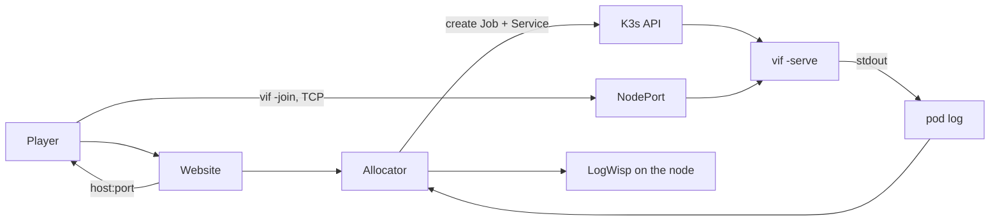

# The session fleet: plan and work list

Vi-Fighter dedicated servers run one session per container on K3s. A website asks
for a game, one container appears, and it ends itself when nobody is in it.

This is the plan and the outstanding work. The procedure for installing and running
it is [Deploying the session fleet](kube_docker_deploy.md); the objects themselves
are in [`deploy/`](../deploy/README.md); the scenarios that verify it by hand are in
[`test/`](../test/README.md).

## 1. Current deployment

| Property | Value |
|---|---|
| Session unit | One `vif -serve` process, one pod, one Job, one Service. |
| Concurrency ceiling | 10, enforced by namespace `ResourceQuota`; the allocator also refuses before attempting an eleventh. |
| First-guest window | 90 s. A session nobody reaches exits 0 and is removed. |
| Empty grace | 90 s after the last guest leaves; also the window a dropped player has to reclaim their slot. |
| Drain | 20 s on `SIGTERM`, inside a 30 s termination grace period. A second signal exits at once. |
| Trigger | `tool/vif-allocator` is deployed as a hardened Arch-guest service and implements the website-facing control-plane boundary. `deploy/k3s/session.sh` is the manual fallback; no session pod runs between requests. |
| Image | `scratch` + one static binary, ~13 MB, non-root, read-only root filesystem, no shell. |
| Transport | Raw framed TCP, one long-lived connection per player. Unauthenticated by decision (§4). |
| Reached by | Its own port, from a forwarded ten-port range. The port is the whole of the routing: nothing in a plaintext game connection names a session, so a firewall's destination port is the only signal there is. |
| Logs and metrics | JSON lines on pod stdout, verified through `kubectl logs`. The allocator-to-LogWisp fan-in is configured but not deployed. |

The allocator-to-Kubernetes path is implemented, deployed and verified through an
off-box join. The website/nginx and LogWisp edges remain to be integrated.



## 2. Runtime contract

| Property | Required behaviour |
|---|---|
| Session unit | One process owns one match timeline. The world is in memory; no replacement pod inherits it. |
| Authority | The dedicated host's Shared world is canonical; guests predict and accept corrections. |
| Capacity | `-players` is a ceiling on guests. At capacity the health body reports `ready=false`; the process stays healthy. |
| Allocated lifetime | `-first-join`, `-empty` and `-drain` are enforced by `internal/lifecycle` over roster observations, and published on `/health`. |
| Join identity | The coordinator refuses a peer whose protocol, simulation fingerprint, capture schema, journal schema, tick interval, seed, config or corpus differs from the offer it made. |
| Session name | Optional. `-name` makes one address able to serve several sessions: the dialer sends it before the handshake, so a front door can route on it, and the session refuses a name that is not its own. A routing key, not a credential. Built and tested; the deployed manifest does not set one (H8). |
| Crossing ordering | Ordinary crossings are judged by the capture's per-source sequence fence, not by their apply tick, so a link that misses the playout lead costs freshness rather than the player's action (§5). |
| Shutdown | `SIGTERM` drains: readiness false, dials refused with `ErrSessionEnding`, exit when the roster empties or `-drain` elapses. |
| Health | One `/health` path. Its code is liveness; the body carries `ready`, `phase`, `expires_in`, roster and tick. |
| Storage | None. Nothing is persisted and no volume outlives the pod. |

Kubernetes restart and replication do not create game-level high availability.
Authority succession helps already-connected participants after a host disappears;
it does not move an in-memory session into an unrelated pod.

## 3. Work list

### Done

| Item | Result |
|---|---|
| Dedicated host shape | `ModeServer` has no cursor, terminal, renderer or audio. Its lobby starts on one guest; `-players` is a ceiling, unset meaning the whole roster. |
| Supervised endpoint | One `/health` (liveness code, everything else in the body) and `/metrics`. |
| Allocated lifetime | First-guest window, empty grace and drain, in `internal/lifecycle`; one `session ended` log line names the reason. |
| Graceful termination | A signal drains rather than cutting a match; a second one exits. An abandoned startup gate ends cleanly rather than failing the Job. |
| Join identity (was F2) | The **host** verifies. A joiner reports what it turned out to be and the coordinator refuses it; a peer that skipped its own check is refused anyway. Covers the wire protocol, the manifest's simulation fingerprint, both schemas, the tick interval, and the whole session identity. |
| Fleet objects | Namespace with enforced `restricted` Pod Security, ten-session quota, default-deny network policy, per-session Job/Service, allocator RBAC. |
| Proof-of-concept Internet path (H2) | An off-box client crossed FreeBSD 15.1 `pf rdr`, the Arch bhyve guest, NodePort and kube-proxy DNAT, then joined a real game. Source-address preservation remains H11. |
| Reboot-safe node baseline | K3s v1.34.6+k3s1 returned Ready with no swap, `inet vif` loaded from files, Docker and the system containerd inactive and disabled, no stale `vif` objects, and both imported images retained. |
| Unclaimed-session lifecycle | With production timers, the listener opened, exited 0 at 90 s with `no guest connected`, completed its Job, then Job TTL and garbage collection removed the owned Service and returned quota to zero. |
| Correction correctness | Snapshot schema 5 local-lifecycle reconciliation, delayed-action identity, quasar map clipping. |
| Late-crossing ordering (was F10/H5) | A capture carries one applied-sequence fence per participant, so a correction keeps an action it had not received instead of undoing it for a cadence. See §5. |
| Reconnect on every host shape | The mid-run gate is installed on every host and armed once its clock runs, so a dropped guest dials back into the slot its departure released whatever opened the session. A departure clears the identity's crossing fence, so the next holder of that identity is not read as already-applied. |
| Roster ceiling | `-players` is a ceiling and only a ceiling, unset meaning the whole roster. A pod no longer serves the number somebody guessed at start-up. |
| Empty-session cost | A roster that empties parks immediately. With `-empty`, the same world is retained until the grace expires so a reconnect reclaims the match. An unbounded host (`-empty=0`) alone starts a fresh run after `SessionVacantReset`. |
| Parked-session probe | `/health` remains live with `clock=paused phase=vacant`; liveness is the response code, not a moving tick. |
| Named sessions | `-name` on a host, `vif://host:port/name` in a player's link. One frame before the handshake, so a front door can put ten sessions behind one public port ([`deploy/frontdoor`](../deploy/frontdoor/haproxy.cfg)) and a stale link is refused rather than misrouted. Held in reserve for H8: the deployment reaches a session by port. |
| Authority policy | `-authority host|migrate`, defaulting to `host` on `-serve`. A dedicated host's address *is* the session, so losing the pod is an orchestrator's job to fix rather than a guest's to inherit. See [Multiplayer](multi-player-enhancement.md) §5.0. |
| Thin allocator (H10) | `tool/vif-allocator` exposes only the fixed session create/list API. It reserves ports from Services, refuses a full fleet before creation, owns each Service by its Job UID, waits for pod/EndpointSlice/application readiness, rolls back partial creates, and reconciles Kubernetes state at startup. Its hardened Arch-guest unit and rotating ServiceAccount token are deployed; create, list, off-box join, occupied/vacant state observation and operator cleanup passed on 2026-09-12. |

### Open

| ID | Priority | Item | Done when |
|---|---|---|---|
| H8 | later | **Revisit how a player reaches a session.** The port range is what the proof of concept runs: no component, ten firewall entries, and source preservation intended but not yet verified (H11). `-name` and [`deploy/frontdoor`](../deploy/frontdoor/haproxy.cfg) are the worked single-port alternative and replace the address the admission limiter is keyed on. Neither gives a link a name without something reading the wire. | A third option is found or the two known ones are chosen between on measurement rather than preference. TLS with SNI routing is the one Kubernetes answers natively and needs transport security this deployment has decided against. |
| H1 | **next** | **Harden the open port.** The game port is unauthenticated by decision (§4) and reachable from the Internet, so everything a stranger can do to a session has to be bounded. Two known holes: the startup ready gate has no timeout, and an abandoned startup gate ends the session — so a peer that reaches a fresh session first can hang it or end it. | A peer that connects and never confirms is dropped on a deadline; an abandoned lobby returns to waiting instead of ending the session; fuzz coverage for malformed, oversized, replayed and half-open handshakes passes. |
| H3 | next | **Measure a full roster.** Four guests through a tower and a storm, and on `wad/game/td`, for an hour. | Requests and limits in `deploy/k3s/30-session.yaml` come from the measurement rather than from single-guest history. Not a blocker: the current values are a starting point, not a claim. |
| H4 | later | **Server-only build.** The binary links terminal, render and audio packages `ModeServer` never initialises. | A server target drops them without changing simulation identity. Matters for pod density, not for ten sessions. |
| H5 | later | **Spatial grid right-sizing.** ~30.5 MiB reserved per world at the current maximum. | Deferred until density matters; needs resize/play regression coverage. |
| H9 | later | **Move the log stream into each pod.** Not needed by the selected fleet design. LogWisp's file source supports `raw = true` and `from = "start"`, and `50-logwisp.yaml` prepares the experiment if per-session direct readers ever justify its cost. | The two-container pod is Ready under read-only UID 65532; `/stream` and `kubectl logs -c logwisp` retain the first record and the full envelope; no write is attempted. |
| H11 | **next** | **Verify the player's source address at the pod.** `externalTrafficPolicy: Local` plus `pf rdr` should preserve it, and the address is already carried — `network.JoinerReport.Remote` holds `conn.RemoteAddr()` and reaches `App.noteJoinerReport` — but only `reach.noteDeclared` consumes it, so no record names it and the run could not inspect one. | The admitted-participant record in `internal/app/host.go` carries the accepted socket's remote address, and a remote join names the off-box client. If it names the node or gateway, the routing is corrected before relying on admission limits; otherwise the limiter is one budget for the whole fleet. |
| H12 | **next** | **Finish the occupied lifecycle gates.** First-join expiry and owned-Service cleanup passed. An allocator-created off-box join reached `occupied` then `vacant`; automatic empty-grace expiry, rejoin near 75 s, drain on Job deletion, and `PLAYERS=1` capacity remain. | Each open case in [Deployment §9](kube_docker_deploy.md#9-create-one-session-by-hand) produces its specified transition and preserves the same run throughout the reconnect grace. |
| H14 | next | **Run the node LogWisp fan-in.** The binary and `aggregator.toml` exist, but no live pod log has been piped through it. The public feed contains vi-fighter session stdout only, never K3s or host journal records. | A bounded `kubectl logs -f` test reaches loopback SSE intact; then the allocator enriches each line with session and port, owns the child process, and serves `/vif/api/logs` without replay or backpressure. Its long-lived SSE response gets a timeout separate from the bounded session-create API. |
| H15 | after H14 | **Integrate nginx and Hugo.** The website implementation now has the allocator's real response fields and status codes; it still waits for the log endpoint. | `https://lixen.com/vif/api/sessions` creates/lists sessions, the session page keeps its HTTPS URL distinct from the raw join target, and the bounded log panel degrades cleanly when the API is absent. |
| H16 | later | **Automate image delivery.** `deploy/guest/update-vif-image.sh` is the repeatable manual boundary: one build/check/import, allocator image update, old-image removal, and build-daemon cleanup. | CI resolves and verifies a tagged release artifact, invokes or reproduces the same boundary without an inbound cluster credential, and new sessions use it while existing matches finish. |

### Dropped, with the reason

| Was | Reason |
|---|---|
| F1 authentication | Deferred by decision. The website triggers a container and the player connects to it; neither hop is authenticated. Hardening (H1) is the requirement in its place, and it comes *before* any auth work, not after. |
| F3 session credentials | The website and the container are joined by one commissioned endpoint. There is nothing for a credential to add that the endpoint's obscurity and H1's bounds do not, and building one now would be work spent away from a fleet that runs. |
| F11 `SIGHUP` reload | No reload contract is planned. `SIGHUP` terminates like any other signal, which is the documented behaviour. |
| F12 match-complete exit | There is no gameplay terminal state and none is planned. A session ends on emptiness. If one ever exists, it attaches to `lifecycle.Controller.Expire` and nothing else changes. |

## 4. Security posture

The game port is **open and unauthenticated, by decision**. Anyone who can reach it
can join a session and influence its Shared world. That is accepted for now; what is
not accepted is a stranger being able to do anything *worse* than play.

What already bounds a stranger:

- one admission per address per `NetworkAdmitBurst` (6) in `NetworkAdmitWindow`
  (1 minute), tracked for at most 1024 addresses so the defence cannot become the
  exhaustion;
- at most `MaxHandshakes` (8) handshakes in flight, each on its own goroutine with a
  `ConnectTimeout` (5 s) and a `ReadTimeout` (30 s);
- a 16-bit frame length, bounded receive queues, and a bounded repair size, so no
  peer can make the host reserve memory by asking;
- `admissibleFromSource`, which refuses roster-creating crossings from anyone but
  the coordinator;
- the join identity check, which refuses a peer that is not running this session
  before it is given a roster slot;
- the session name, where the deployment sets one: a stranger that cannot produce
  it never reaches Assign. It is a routing key rather than a credential — it is in
  every player's link and travels in clear — so what it bounds is a session being
  walked into, not one whose link leaked;
- the network policy: one game port reachable, everything else denied, no egress;
- `-authority host`, which is the fleet's default and what keeps that one port the
  only one. A migrate session gives every participant a listening port and
  publishes the addresses inside the session; a guest's peer link is refused unless
  it names a participant the receiver's roster holds under a term not behind its
  own, but that is the same structural check the rest of the protocol makes and the
  same non-answer to a peer that can claim another's identity. A fleet session is
  its address, so it has no reason to want the other shape.

What does not, and is H1:

- the startup ready gate waits without a deadline, so a peer that completes the
  handshake and then goes silent holds a fresh session open until the Job's
  `activeDeadlineSeconds`;
- an abandoned startup gate ends the session, so a peer that reaches a fresh session
  before its intended player can end it by connecting and dropping.

Both are confined to the window between a session's first guest connecting and the
session starting. Neither is reachable once a session is running.

Until H1 lands, the firewall requirements in
[Deployment §3](kube_docker_deploy.md#3-freebsd-forward-the-range-to-the-guest)
are what stands in front of this: the forwarded surface is the ten-port NodePort
range and nothing else, and the probe, log-stream and API ports never leave the node.

## 5. Late-crossing ordering, and the trade-offs in its fix

The symptom, in a real game: a player presses a key, their cursor moves, and a fifth
of a second later it jumps back — then moves again. On one machine it almost never
happens; add Internet delay and it is the ordinary case for every action a
correction straddles.

The cause was a boundary that asked the wrong question. A guest produced a crossing
for tick T+3 and applied it at once. Its link missed the playout lead, so the host
had not received it when it read its world at T+9 and the capture could not contain
it — but its apply tick was six ticks in the past. Judging membership by tick, the
guest concluded the correction already held the action and dropped it. The host
applied the late frame when it finally arrived and the next capture put it back,
which is the second half of the flicker.

The fix is `CaptureHeader.Crossings` (snapshot schema 5): one `{source, seq}` fence
per participant, naming the sequence through which that world contains that
participant's ordinary crossings. Membership for every ordinary frame is now its
source's sequence rather than its apply tick, everywhere the question is asked — the
replay suffix, the scheduled queue, and frames arriving after the install.

It also generalises the fix that already existed. The authority's own crossings had
carried a fence since schema 4, for the mirror-image reason: the host applies its
frame first, so a capture could contain one whose receive-side apply tick was still
in the future, and a guest that installed the correction would then let the queued
older copy walk the host's cursor backward. One vector closes both directions.

**Trade-offs, for review after live testing:**

| Decision | Alternative | Why |
|---|---|---|
| Remote entries are the **highest applied** sequence, not a contiguous prefix. | A contiguous prefix, exact in every topology. | Within one link a source's frames arrive in order, so the two are the same number in every topology the CLI builds. Where they differ — a frame overtaking a lower one across a relay — the maximum costs one cadence of a frame looking contained when it is not. A contiguous prefix would instead stall on a frame the receiver refused for a full queue and will never see, making that producer replay a growing suffix at every correction for the rest of the session. Bounded and self-healing beats exact and unbounded. |
| The **local** entry stays a contiguous prefix. | The same maximum. | Local dispatch can complete out of order, so a capture racing an input that was encoded but not yet dispatched must not claim it. This half was already right. |
| A source the header does not name is **claimed for nothing**. | Fall back to the tick. | The fallback is the misjudgement the fence exists to prevent. Keeping an artifact costs a duplicate the next correction repairs; discarding one costs the player their action. |
| The replay suffix is **cleared on reset**. | Leave it, as before. | A reset restarts the sequence counter, so a record retained across one carries a number a post-reset fence would compare against and get wrong in both directions. The old tick boundary pruned these by age; a sequence boundary has no such accident to rely on. |
| Schema **5**, not a compatible addition. | Keep the old field and add the vector. | Two fences answering one question is how they drift apart. Mixed builds are refused at the join by the capture-schema field in the identity check, so a bump costs nothing a mixed fleet was allowed to do anyway. |

**What this does not change.** The lead is chosen once, from the links the lobby
closed on, and floors at three ticks — so a fleet session, whose lobby closes on its
first guest before a probe has usually completed, runs the whole match at that floor
whatever a later guest's link turns out to be. A link that misses it still produces
late frames; the fence makes them harmless rather than rare. A late crossing still applies on the host at
whatever tick it arrives, so the two instances still order it differently and the
correction after it is still what reconciles them; what no longer happens is the
producer discarding its own action in between.

**How to reproduce it.** In a real game, any action that crosses a correction on a
link over roughly 150 ms: type into a gold run, fire a shot, or hold a motion key,
on a guest joined across the Internet rather than on `127.0.0.1`. It is most visible
with rapid `h`/`l` sequences, where each undone-and-redone cell is a separate visual
jump. Deterministically, `TestALateGuestActionIsNotUndoneByTheCorrectionThatMissedIt`
in `internal/app` shapes the host's receive side with twice the playout lead and
asserts the cursor does not move back; reverting either half of the membership rule
fails it with `cursor at {20 10}, want {23 10}`.

## 6. Resources

Starting values, not measured ones (H3):

| Resource | Value | Rationale |
|---|---:|---|
| memory request / limit | 96 / 192 MiB | Historical single-guest measurements plus headroom for a staging world after an authority change. |
| `GOMEMLIMIT` | 160 MiB | An earlier collection target than the limit, so the runtime collects instead of the kernel killing. |
| CPU request / limit | 100m / 500m | One guest was about 0.05 core; the ceiling is wide until a storm is measured. |
| termination grace | 30 s | Above the 20 s drain, so the process decides when the match ends. |

Historical baseline worth keeping: server in lobby 12.0 MB RSS; embedded game with
one guest 61.75 MB peak; server after a guest left 40.1 MB; headless joiner with a
staging world 95.5 MB peak; two staggered guests 63.5 MB plateau; spatial grid about
30.5 MiB per world; CPU about 0.2% of a core in lobby and 4.9% with one guest.
Repeated resets plateaued rather than growing, so the RSS lag was runtime
scavenging, not a per-match leak.

## 7. Verification

Automated, in the repository:

```sh
go test ./...        # includes lifecycle, identity refusal, probe and fingerprint
make verify          # plus vet and the build-tag matrix
```

By hand, on a dev machine — see [`test/README.md`](../test/README.md):

```sh
./test/scenario.sh all          # check, lifetime, drain, identity
./test/scenario.sh serve-fleet  # the flag set the containers run
./test/scenario.sh probe        # /health and /metrics
```

Against a cluster, the checks that need one:

| Check | Status | Expected |
|---|---|---|
| Reboot with no session | Passed | Node Ready, no swap, filter present, build daemons inactive, imported image retained, namespace empty. |
| Nobody joins for 90 s | Passed | Exit 0 at 90 s; Job Complete; owned Service removed after the 120 s TTL. |
| Allocator create/list and off-box join | Passed | Restricted token and probes succeeded; `POST` returned a ready session; API state followed the join and quit; operator deletion cleared the test. |
| A guest joins and quits | Partial | Occupied and vacant states passed; automatic exit ninety seconds later must still name `roster empty for`. |
| A guest quits and rejoins near 75 s | Open | The same run continues in the released slot; no one-minute reset occurs. |
| `kubectl delete job` while a guest plays | Open | `phase=draining`, `/health` 200, exit when the roster empties or after 20 s. |
| Roster at `-players` | Open | `ready=false` with `session at capacity`; existing guests keep playing. |
| 60-minute full roster | Open | No OOM, liveness restart, sustained tick slips, or growing correction magnitude. |
| `tc netem` latency, loss, reordering | Open | Recovers at the next bounded correction or keyframe. |
| Pod delete / node failure | Open | Connected-client behaviour is recorded; no replacement is advertised as the same match. |

## 8. Decisions

- **Allocated session, not a long-lived one.** A website creates the container, so
  the container ends itself. The long-lived shape remains available and is what the
  lifetime flags select when omitted.
- **`-empty` owns a bounded vacancy.** It preserves the parked world until expiry;
  the one-minute fresh-world reset is only for an unbounded hand-started server.
- **Ninety seconds, twice.** The first-guest window and the empty grace are the same
  number and different bounds; the second doubles as the reconnect window.
- **Ten sessions, enforced by quota as well as by the allocator.** A ceiling only the
  allocator believes is one an allocator bug removes.
- **A Job per session.** The process is meant to exit; a Deployment would restart it
  into a session nobody is in.
- **A NodePort per session from a fixed ten-port range.** The pool becomes a fact the
  API server enforces and the firewall forwards as one range.
- **A thin allocator, not a second scheduler.** It exposes only the fixed session
  transaction on `/vif/api/`; K3s still schedules, admits, limits, terminates and
  garbage-collects every workload.
- **Docker builds; K3s runs.** Docker and its system containerd stay disabled except
  during an on-demand build. The image is imported into K3s's embedded containerd.
- **One health path.** The code answers "should this process still be running";
  everything else is in the body, where the allocator reads it.
- **The pod log is the log contract.** The session writes its own JSON envelope to
  stdout and every reader downstream forwards bytes rather than parsing them. A
  component that reinterprets a line is a component that can drop a field, which is
  what took the log stream out of the pod and put it on the node.
- **The public stream is session output only.** K3s, kernel and host journal records
  remain operator-only.
- **The host is the authority over identity.** A joiner reports; the coordinator
  decides.
- **No authentication, and hardening first.** See §4.
- **Drain waits for the roster with a deadline.** No participant migration: there is
  nowhere to migrate a match that lives in one process's memory.
- **Dedicated lobby:** quorum is one, `-players` is capacity.
- **Map bounds:** an explicit `-size` wins; otherwise the first guest sets a mutable
  scenario's shared map.
- **Correction:** Shared capture is authoritative; Player-domain state is excluded
  and only explicit persistent local FSM lifecycle is re-derived.
