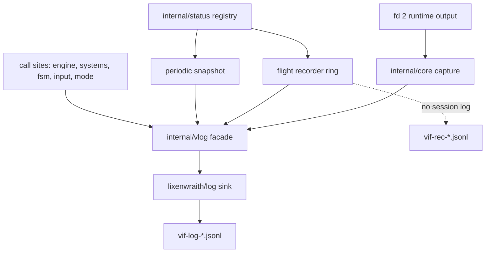

# Logging, Telemetry, and Diagnostics

Vi-Fighter's diagnostic surface has four cooperating layers: a structured
JSON Lines session log, a status metric registry with periodic snapshots, an
in-memory flight recorder that flushes only on a trigger, and a runtime stderr
capture that folds Go runtime output back into the log. All four share one
correlation stamp so records from different layers join on `run`, `tick`, and
`frame`.

This document is the authoritative reference for what is emitted, how to
control it, and what each record means. For the process lifecycle that
produces these records, see [Runtime and concurrency](runtime.md).

## 1. Layer map



| Layer | Package | Cost when idle | Written when |
|---|---|---|---|
| Session log | `internal/vlog` | one atomic load per guarded call site | continuously, level and scope permitting |
| Status registry | `internal/status` | one atomic store per metric update | never; values are read by snapshot and recorder |
| Periodic snapshot | `internal/status` | one modulo per tick | every `StatSnapshotTicks` ticks |
| Flight recorder | `internal/status` | ~145 atomic loads + stores per tick | on a trigger only |
| Runtime capture | `internal/core` | one `Stat` per drain interval | when the Go runtime writes to fd 2 |

## 2. Record shape

Every record is one JSON object on one line. The envelope is fixed; the
payload is an open key-value map.

```json
{"time":"2026-08-06T02:48:31.124075906-04:00","level":"INFO","sub":"stat",
 "run":0,"tick":100,"frame":355,
 "fields":{"msg":"fsm","state":"MainDecayWait","state_index":1}}
```

| Envelope key | Meaning |
|---|---|
| `time` | RFC3339 nanosecond wall clock, assigned at emission |
| `level` | `TRACE`, `DEBUG`, `INFO`, `WARN`, `ERROR`, or `PROC` for logger heartbeats |
| `sub` | Subsystem tag; resolves to a scope (§4) |
| `run` | Session counter; incremented by FSM reset, so `:new` starts run 1 |
| `tick` | Simulation tick at emission |
| `frame` | Render frame at emission |
| `fields` | Record payload; `msg` is the discriminator by convention |
| `trace` | Present only on `vlog.Trace` records: a `->` joined call chain |

`fields.msg` is the first payload key on every record the game emits. Viewers
index it as a column and filter on it directly. The second string field is
conventionally the record's *follow key* — `region` on FSM records, `ev` on
per-event dispatch records — so a viewer's follow-value navigation walks one
region or one event type.

### Correlation stamps

`run`, `tick`, and `frame` are process-global atomics published by three
owners:

| Stamp | Owner | Advances |
|---|---|---|
| `run` | `ClockScheduler.executeReset` via `vlog.NextRun` | once per FSM reset |
| `tick` | `ClockScheduler.processTick` via `vlog.SetTick` | once per simulation tick, before the tick body |
| `frame` | `GameContext.IncrementFrameNumber` via `vlog.SetFrame` | once per render frame |

`tick` is stamped with the tick *about to execute*, so records emitted inside
`processTick` carry the tick they describe rather than the previous one.

Because `frame` advances on a different goroutine, a multi-record emission can
straddle a frame boundary. Emitters that must be atomic in the stamp —
snapshots and recorder flushes — use `vlog.EmitSet`, which binds one explicit
stamp for the whole set.

## 3. Levels

| Level | Constant | Used for |
|---|---|---|
| `TRACE` | `vlog.LevelTrace` | per-item taps: individual event dispatch, event push |
| `DEBUG` | `vlog.LevelDebug` | per-pass and per-intent detail: dispatch summaries, input intents, FSM internal transitions, lock holds |
| `INFO` | `vlog.LevelInfo` | lifecycle and state change: startup, service transitions, FSM transitions and region ops, status snapshots, recorder flushes |
| `WARN` | `vlog.LevelWarn` | recoverable anomalies: event queue overflow, long lock holds |
| `ERROR` | `vlog.LevelError` | failures and runtime reports: service init/start failure, panic records, race and fatal reports |

The threshold is a single process-wide value. `ERROR` and above **bypass the
scope mask** — a scope can silence noise but never a failure. Level still
applies to errors.

Set with `-lv <level>` at startup or `:log level <level>` at runtime. The
default when logging is enabled without an explicit level is `debug`.

## 4. Scopes

Scopes are a category mask orthogonal to level, resolved from the record's
`sub` tag. They exist so one noisy subsystem can be silenced without lowering
the level for everything else.

| Scope | Letter | `sub` tags mapped to it |
|---|---|---|
| `app` | `a` | `app`, `service`, `race`, `crash` |
| `fsm` | `f` | `fsm` |
| `event` | `e` | `event` |
| `dispatch` | `d` | `dispatch` |
| `push` | `p` | `push` |
| `input` | `i` | `input` |
| `stat` | `s` | `stat` |
| `rec` | `r` | `rec` |
| `lock` | `l` | `lock` |
| `tap` | `t` | any unmapped `sub` |

An unrecognized `sub` falls into `tap`, so an ad-hoc debugging tap is visible
by default and is silenced as a group with `-ls -t`.

### Scope grammar

A spec is parsed against the current mask. A leading `+` adds, a leading `-`
removes, and no prefix replaces. Tokens split on `+`, `,` or space; each token
is a long name, `all`, `none`/`off`, or a run of short letters.

| Spec | Result |
|---|---|
| `all` | every scope |
| `none` | no scope; errors still emit |
| `app+fsm+stat` | exactly those three |
| `afs` | same, short form |
| `+dispatch` | add per-event dispatch to the current mask |
| `-event,push` | remove both from the current mask |
| `-event+push` | remove both from the current mask |

Set with `-ls <spec>` at startup or `:log scope <spec>` at runtime.

### Recommended masks

| Goal | Mask |
|---|---|
| Follow the FSM path | `-ls afs` |
| Diagnose an event that never arrives | `-ls +d -lv trace` |
| Watch input translation | `-ls ai` |
| Quiet run with snapshots and recorder only | `-ls asr` |
| Lock contention | `-ls al -lv debug` |

## 5. Subsystem catalog

Every record the game emits, by `sub` and `msg`.

### `sub="app"`

| `msg` | Level | Fields | Emitted by |
|---|---|---|---|
| `init begin` / `init complete` | INFO | `width`, `height`, `systems` | `app.init` |
| `shutdown begin` / `shutdown complete` | INFO | — | `app.Close` |
| `signal received` | INFO | `signal` | main loop |
| `runtime capture` | INFO | `path`, `reason`, `race` | `setupDiagnostics` |
| `logging started` / `logging stopped by command` | INFO | `path`, `level` | `:log on`/`off` |
| `log level changed` / `log scope changed` | INFO | `level` / `scope` | `:log` |
| `stat interval changed` | INFO | `ticks` | `:log stat` |
| `recorder depth changed` | INFO | `ticks` | `:log rec N` |
| `recorder flush` | INFO | `reason`, `t0`, `ticks`, `records`, `us` | recorder, when the session log absorbed the flush |
| `recorder flush failed` | ERROR | `reason`, `error` | recorder |
| `snapshot saved` | INFO | `path` | `:d save` |

### `sub="service"`

| `msg` | Level | Fields |
|---|---|---|
| `init` / `start` / `stop` | INFO | `service`, `ms` |
| `init failed` / `start failed` / `stop failed` | ERROR | `service`, `error` |

### `sub="fsm"`

The FSM path is reported by observation hooks on `fsm.Machine`, not by
sampling state once per tick. Sampling collapses intra-tick transition chains
and cannot see background regions; hooks report every committed change in
order, for every region.

| `msg` | Level | Fields |
|---|---|---|
| `transition` | INFO | `region`, `from`, `to`, `via`, `index`, `max_ms` |
| `internal` | DEBUG | `region`, `state`, `via` |
| `region` | INFO | `region`, `op`, `state` |
| `session reset` | INFO | — |

`via` is the triggering event name, or `Tick` for an automatic transition.
`op` is one of `init`, `spawn`, `terminate`, `pause`, `resume`. `index` is the
state's deterministic index within the loaded config, and `max_ms` is the
`StateTimeExceeds` bound on the target state when one exists.

An `internal` record covers two distinct cases, both reporting `from == to`:

- a transition declared `internal = true`, which consumes the event and runs its
  actions with no exit or enter phase and no effect on `TimeInState`;
- a transition whose `target` resolves to the state already active. A
  self-transition **degrades to internal**: exit and enter actions do not run,
  `TimeInState` is not reset, and only the transition's own `actions` execute.
  A config author expecting re-entry semantics gets a silent no-op, and this
  record is the only evidence of it.

`region` is deliberately the first string field: a viewer's follow-value
navigation walks one region's path with it.

Hooks fire **before** the exit phase, so a `transition` record precedes every
record its actions produce. A chain of transitions completing inside one tick
appears as several records sharing a `tick`.

### `sub="event"`

| `msg` | Level | Fields |
|---|---|---|
| `pass` | DEBUG | `src`, `n`, `fsm`, `sys`, `dead` |
| `queue overflow` | WARN | `dropped`, `delta` |

One `pass` record summarizes one `dispatchOnePass` call. `src` names the
caller:

| `src` | Call site |
|---|---|
| `pre` | `processTick` initial settling |
| `post` | `processTick` settling after the FSM update |
| `loop` | inter-tick event loop |
| `input` | `DispatchEventsImmediately`, from an intent or macro |
| `reset` | `executeReset` settling |

`n` is the batch size. `fsm` counts events some active region consumed, `sys`
counts events with at least one registered system handler, and `dead` counts
events neither consumed — the diagnostic for a config referencing an event
nothing emits, or a system that stopped registering.

`queue overflow` reports real state loss: producers outran the single
consumer and the ring evicted unread events. It also triggers a recorder flush.

### `sub="dispatch"`

| `msg` | Level | Fields |
|---|---|---|
| `ev` | TRACE | `ev`, `sys`, `fsm` |

One record per dispatched event, gated by the `dispatch` scope *and* the trace
level. This is the highest-volume record in the system — roughly 80/s in normal
play — and is off in every default configuration. `ev` is the first string
field, so follow-value walks one event type.

`sys` is the count of registered system handlers; `fsm` is whether any active
region consumed it. `sys:0 fsm:false` means the event reached nothing.

### `sub="push"`

| `msg` | Level | Fields |
|---|---|---|
| `push` | TRACE | `ev` |

Emitted by `World.PushEvent` with a four-frame stack trace, so the record
identifies the producing system. Separate from `dispatch` so the producer side
can be traced without the consumer flood.

### `sub="input"`

| `msg` | Level | Fields |
|---|---|---|
| `intent` | DEBUG | `type`, `motion`, `count`, `char`, `cmd`, `macro` |

One record per semantic intent produced by the input machine. `macro`
distinguishes replayed intents from physical input.

### `sub="stat"`

| `msg` | Level | Fields |
|---|---|---|
| `<group>` | INFO | one key per metric in the group |
| `context` / `player` / `world` | INFO | on-demand snapshot only (§7) |

One record per metric group per snapshot. All records of one snapshot share
`run`/`tick`/`frame` by construction. See §6.

### `sub="rec"`

| `msg` | Level | Fields |
|---|---|---|
| `window` | INFO | `reason`, `t0`, `t1`, `n`, `groups` |
| `<group>` | INFO | `t0`, `n`, then one key per metric |

One flush is a `window` header followed by one record per group. See §8.

### `sub="lock"`

| `msg` | Level | Fields |
|---|---|---|
| `long hold` | WARN | `us`, plus a `trace` call chain |

Emitted when a world-lock hold exceeds `LockHoldWarn` (20 ms). The trace
identifies the holder. Also triggers a recorder flush.

Hold sampling is a per-tick decision, refreshed in `processTick`: it is active
when the `lock` scope is enabled at debug level **or** a flight recorder is
installed. The world lock is the hottest lock in the process, so it is not
probed per acquisition.

### `sub="race"`

| `msg` | Level | Fields |
|---|---|---|
| `runtime report` | ERROR | `kind`, `path`, `offset`, `bytes`, `lines`, `head`, `at` |

A pointer to a block of captured runtime output. See §9.

### `sub="crash"`

| `msg` | Level | Fields |
|---|---|---|
| `panic` | ERROR | `panic`, `stack` |

Written by the crash hook before terminal restoration, followed by a bounded
flush. A recorder flush precedes it.

## 6. Status registry and periodic snapshots

`status.Registry` holds four typed metric maps — `Bools`, `Ints`, `Floats`,
`Strings` — keyed by dotted strings. Systems call `Get(key)` once during
construction and cache the returned pointer; hot paths then perform one atomic
store with no map lookup.

### Key convention

`SplitKey` splits `group.name` on the first dot. Keys without a dot land in the
`misc` group. The group becomes the record's `msg`, and the remainder becomes
the field name:

```
engine.ticks   → msg="engine"  ticks=<v>
fsm.td_main.state → msg="fsm"  td_main.state=<v>
```

A multi-segment key therefore drills down inside one record rather than
creating a new group. This is how per-region FSM telemetry stays in the single
`fsm` record regardless of how many regions a config declares.

### Integer units

Integer metrics carry their unit in the key suffix; no metadata is stored and
the log emits raw values. `status.IntUnit` and `status.FormatInt` are the sole
owners of the convention:

| Suffix | Scale |
|---|---|
| `.timer`, `.duration`, `.max_duration`, `.elapsed`, `.remaining` | nanoseconds |
| `_ns` | nanoseconds |
| `_us` | microseconds |
| `_ms` | milliseconds |
| anything else | plain count |

Display consumers — the debug overlay, the status bar, log viewers — resolve
through `FormatInt`. The log stores the raw integer.

### Freeze

`Registry.Freeze` is called once from `ClockScheduler.Start`, immediately after
`World.Seal` and before the first tick. Every system and renderer has
registered by then. Freezing:

- closes all four maps to new keys;
- builds the group index once and caches it lock-free, so the per-tick path
  performs no generation probe;
- publishes `stat.groups` and `stat.metrics`;
- lays out the flight recorder's ring.

A `Get` on an unknown key after freeze returns a **detached cell** and
increments `stat.late`. The value is usable, so the caller does not crash, but
it appears in no snapshot and no recorder window. **A non-zero `stat.late` is a
regression**, not a supported pattern: it means something registers a metric
after the first tick.

### Periodic emission

`Registry.Tick(n)` is called once per simulation tick from `processTick`,
after the world lock is released and after every tick-owned write has
committed. It:

1. samples the flight recorder;
2. mirrors `stat.late`;
3. emits the periodic snapshot when `n % StatSnapshotTicks == 0` and the `stat`
   scope is enabled at info level;
4. drains a pending recorder flush request.

The snapshot emits through `vlog.EmitSet` with one explicit stamp, so all
records of one snapshot share `run`/`tick`/`frame` even if the render goroutine
advances the frame counter mid-emission.

A snapshot is stamped with tick *n*, but it is not a barrier. The world lock is
released before `Registry.Tick` runs, so the event loop, the input path and the
render goroutine can commit between the end of the locked tick body and the
read. A value written inside the locked body is exact for tick *n*; everything
else reads "at or after tick *n*" — `event.dispatches`, `event.queue_len` and
`engine.fps` in particular, which is why they move at points that do not line up
with tick boundaries. The recorder sample shares this call and the same
guarantee.

Default period is `parameter.StatSnapshotTicks` = 200 ticks (10 s at a 50 ms
tick). The flight recorder holds fine-grained history, so the periodic
snapshot is a coarse heartbeat rather than the primary time series.

Override with `-lt <ticks>` at startup or `:log stat <ticks>` at runtime; `0`
disables periodic emission entirely without affecting the recorder.

## 7. On-demand snapshot

`:d save` writes a standalone file `vif-snap-<timestamp>.jsonl` through a
second logger instance, independent of the session logger's state, level, and
scopes. Command mode holds the world lock and the pause, so the values are a
single coherent tick.

The file contains the full registry snapshot plus three records that have no
registry mirror, emitted by `GameContext.SnapshotContext`:

| `msg` | Contents |
|---|---|
| `context` | frame, pause, mode, screen/game/map/viewport/camera geometry, crop flag, color mode |
| `player` | cursor entity, position, ping bounds |
| `world` | entity created/destroyed counts, system count, macro/mouse/auto-fire flags |

The call is blocking: it opens, fills, drains, and closes before returning.
This is an operator cost, acceptable at a command prompt and nowhere else.

## 8. Flight recorder

Per-tick snapshots at 20 Hz are affordable to *record* but not to *write*. The
recorder holds the last N ticks of the full registry in memory and writes only
when something goes wrong.

### Storage

Slot-major: one tick's values are contiguous across four kind-partitioned
planes — `[]int64`, `[]float64`, a `[]uint64` bitset for bools, `[]string` for
strings — plus a parallel tick-stamp array. The per-tick write is a linear
walk of ~145 atomic loads and stores with no allocation and no lock.
`AtomicString.Load` returns an existing header, so storing a string retains
rather than copies.

A `head` counter is stored **after** the slot's writes, so a reader never
observes a torn slot.

Depth 200 with the current metric set is roughly 250 KB.

### Sampling

Sampling happens inside `Registry.Tick`, on the tick goroutine, after the world
lock is released. The recorder and the periodic snapshot share the same frozen
group index — one index build serves both.

### Triggers

`status.Trigger(reason)` is callable from any goroutine. It sets an atomic flag
and a reason; the tick goroutine performs the flush at the end of
`Registry.Tick`, off the world lock and off the caller's stack.

No other path may call `Recorder.Flush` directly. The ring is written by
`sample` on the tick goroutine with no lock, so a flush from the input or
command path would race it — and the string plane tears a header, not just a
value. `:log rec flush` therefore *requests* a flush and returns; the window
appears on the next tick.

| Reason | Source |
|---|---|
| `event.dropped` | queue overflow detected in `processTick` |
| `lock.hold` | world-lock hold exceeding `LockHoldWarn` |
| `race` | a `sub="race"` runtime report was drained |
| `crash` | the panic path, via `vlog.SetCrashFlush` |
| `manual` | `:log rec flush`, and the fallback when no reason was set |
| `fsm:<region>` | an FSM transition, **disabled by default** |

Only the newest reason survives: repeated triggers before the tick goroutine
drains collapse into one flush carrying the last reason set.

Flushes are throttled to one per `depth/4` ticks; suppressed requests increment
`rec.skipped`. A repeating fault therefore cannot flood the log. The throttle
applies to `manual` as well — a `:log rec flush` issued within `depth/4` ticks of
the previous flush is counted and writes nothing. `rec.skipped` also counts a
flush discarded because the `rec` scope or the level suppressed it, so a rising
`rec.skipped` with `rec.flushes` flat means windows are being requested and
thrown away: check the scope mask before the throttle.
 
The FSM trigger is off by default because transitions are frequent enough to
flush continuously, which defeats the purpose. Enable per session with
`:log rec fsm on`.

The crash path is the one exception to the tick-goroutine rule.
`Recorder.CrashFlush` writes from the panicking goroutine and may race a
concurrent `sample`; that is deliberate, since the process is ending and the
alternative is losing the window. It is still bounded by the `flushing` flag, so
it cannot interleave with a normal flush. It is a no-op without a running
session log — opening files during a panic is worse than losing the window.

### Flush encoding

One `window` header record plus one record per metric group. Within a group,
a metric whose value never changed over the window is emitted as a **scalar of
its native type**; a metric that varied is emitted as a compact string:

| Kind | Varying form |
|---|---|
| int | comma-separated decimals |
| float | comma-separated shortest round-trip |
| bool | a run of `0`/`1` digits, one per sample |
| string | comma-separated |

`,` is the series separator and is reserved: an embedded comma becomes `;` in
**both** forms, so a constant string that happens to carry one is not
indistinguishable from a two-sample series. A decoder separates constant from
series by JSON type for int, float and bool; for string both forms are JSON
strings, so it splits on `,` and compares the element count against `n` — one
element means the column was constant.
 
`t0` names the first tick and `n` the sample count, so position *k* in a series
belongs to tick `t0+k`.

`msg`, `t0` and `n` are reserved field names in a group record, as are `reason`,
`t1` and `groups` in the `window` header. A metric key of the form `<group>.t0`
or `<group>.n`, or a group named `window`, collides with the envelope and
silently overwrites it. The same reservation applies to the `stat` records of an
on-demand snapshot, where `context`, `player` and `world` are taken (§7).

```json
{"fields":{"msg":"window","reason":"event.dropped","t0":180,"t1":379,"n":200,"groups":41}}
{"fields":{"msg":"drain","t0":180,"n":200,"count":"10,10,9,9,...","pending":0}}
{"fields":{"msg":"storm","t0":180,"n":200,"active":false,"circle_count":0}}
```

Constant collapse typically reduces well over half the groups to one-line
scalars. A 200-tick window is ~40 records, comfortably inside the sink's 8,192
record buffer.

### Destination

The flush targets the session log when one is running. With logging disabled it
opens a standalone `vif-rec-<timestamp>.jsonl`, drains, and closes — the
recorder is useful precisely when logging is off.

Both files carry the same envelope and open together in one viewer instance,
correlated by `run` and `tick`.

## 9. Runtime output capture

Go runtime diagnostics — race reports, `fatal error:`, unrecovered panics from
goroutines outside `core.Go` — write directly to file descriptor 2. Inside the
alternate screen that output is unreadable and usually lost.

`-dev` redirects fd 2 to `vif-stderr-<timestamp>.log` **before** the terminal
enters the alternate screen, then polls the file every
`parameter.DevDrainInterval` (500 ms). Each complete block becomes one
`sub="race"` pointer record at ERROR level:

| Field | Meaning |
|---|---|
| `kind` | `data race`, `fatal`, `panic`, `summary`, or `output`, classified from the first line |
| `path` | the capture file |
| `offset`, `bytes`, `lines` | block location and size within it |
| `head` | first line, truncated to 200 characters |
| `at` | innermost vi-fighter stack frame, empty when absent |

The text stays in the capture file; the log holds a pointer. Blocks are split
on the race delimiter and an incomplete trailing line is held back, so a block
is never split across two records.

At shutdown the drain runs once more, fd 2 is restored, and an empty capture is
removed. `-dev` defaults **on** for race builds and is disabled with
`-dev=false`.

## 10. Control surface

### Startup flags

| Flag | Effect |
|---|---|
| `-l`, `-log` | Enable logging in `parameter.LogDir` |
| `-l=DIR` | Enable logging in `DIR`; the space form is not supported |
| `-lv <level>` | `trace`, `debug`, `info`, `warn`, `error`; implies `-l` |
| `-ls <spec>` | Scope spec (§4); implies `-l` |
| `-lt <ticks>` | Status snapshot period, `0` disables; implies `-l` |
| `-lr <ticks>` | Flight recorder depth, `0` disables; implies `-l` |
| `-dev[=bool]` | Runtime stderr capture; defaults on for race builds |

Log setup failure is non-fatal: the game runs unlogged and the process exits
with `73` (`EX_CANTCREAT`) so a script can detect it.

The recorder resolves its directory from the log configuration but does not
require a running session — `-lr 200` alone gives a recorder that writes
sidecar files on a trigger.

### Runtime commands

| Command | Effect |
|---|---|
| `:log` | Report current state |
| `:log on` / `off` | Start or stop a session; stop drains asynchronously |
| `:log <level>` | Shorthand for `:log level <level>` |
| `:log level <level>` | Set the threshold |
| `:log scope <spec>` | Apply a scope spec |
| `:log stat <ticks>` | Set the snapshot period, `0` disables |
| `:log rec` | Report state |
| `:log rec <ticks>` | Set the recorder depth; discards history |
| `:log rec flush` | Flush the window now |
| `:log rec fsm [on\|off]` | Toggle the FSM transition trigger |
| `:d save` | Write a standalone snapshot (§7) |
| `:content` | Corpus telemetry in the status bar |

`:log` reports `log <path> | level <L> | scope <S> | stat <N> | rec <M>`.

Starting a session opens a file under the world lock — a deliberate operator
cost. Stopping detaches the sink immediately and drains on another goroutine,
so a command handler never waits on disk while holding the lock.

## 11. Sink policy

| Policy | Value |
|---|---|
| Queue | 8,192 records |
| Flush interval | 50 ms (one simulation tick) |
| File rotation | 64 MiB |
| Total budget | 512 MiB |
| Minimum free disk | 100 MiB |
| Retention | 24 hours |
| Heartbeat | 60 s, level 1 (drop and rotation counters) |
| Process-exit drain | 2 s |
| Panic flush | 200 ms |
| Snapshot/recorder drain | 3 s |

The sink **drops** records when the queue is full rather than blocking a game
goroutine. Drops are counted and reported in the periodic `PROC` heartbeat and
on the next successful write. A dropped record is lost; there is no retry.

The 50 ms flush interval matches the simulation tick, so a crash loses at most
one tick of buffered records.

Each logger instance is independent: the session log, an on-demand snapshot,
and a recorder sidecar can be open simultaneously without contending for one
buffer.

## 12. Call-site rules

**Argument lifetime.** Records are formatted asynchronously on the logger
goroutine, up to `BufferSize` records after the call. Pass primitives and value
copies only — never `Store.GetPtr` pointers, pooled event payloads, dense
entity slices, or reused scratch buffers. Their contents may change before
formatting.

**Gate hot call sites.** The variadic slice is built before the call and
escapes to the heap. Guard with `vlog.On(sub, level)` and hoist the gate out of
loops:

```go
trace := vlog.On("dispatch", vlog.LevelTrace)
for _, ev := range events {
    if trace {
        vlog.Detail("dispatch", "msg", "ev", "ev", event.GetEventName(ev.Type))
    }
}
```

**Choose the right entry point.**

| Function | Use |
|---|---|
| `Debug`, `Info`, `Warn`, `Error` | ordinary records |
| `Detail` | trace level without a stack trace; per-item taps |
| `Trace(sub, level, depth, ...)` | records that need a call chain; depth is raised by one to skip the wrapper |
| `EmitSet(sub, run, tick, frame, fill)` | a correlated set that must share one stamp |
| `Dump(fill)` | a standalone file, blocking |

**Never log inside the world lock at volume.** A guarded call is a channel send
and is cheap, but a per-entity record inside a system update extends the
critical section. Prefer a status metric and let the snapshot or recorder carry
it.

**Status over logging for state.** A value that has a current reading belongs
in the registry. A value that describes a *transition* belongs in the log.

## 13. Build variants

`internal/vlog` is build-tagged. On `wasm` or with the `novlog` tag, every
entry point is a no-op, `lixenwraith/log` is not linked, and the scope
constants exist only so CLI parsing behaves identically. `status` still
functions: metrics are registered and updated, snapshots and recorder flushes
resolve to no-ops.

`make nolog` produces a release build with the tag.

## 14. Diagnostic playbooks

**"The FSM is in the wrong state."** `-ls afs`. Filter `sub=fsm`. The
`transition` records give the complete ordered path including intra-tick
chains, background regions, and region lifecycle. `via` identifies the cause of
each step; a step with `via=Tick` means a guard passed.

**"My event does nothing."** `-ls +d -lv trace`. Filter `sub=dispatch` and the
event name. `sys:0 fsm:false` means nothing consumed it — check the router
registration and the active region's triggers. Absent entirely means it was
never pushed: add `-ls +p` to see the producer side.

**"The game stutters."** `-ls al -lv debug`. `sub=lock msg="long hold"` records
carry the holder's call chain. Each one also triggers a recorder flush, so the
20 Hz state history around the stall is in the same file.

**"State was lost."** `sub=event msg="queue overflow"` reports the count. The
recorder flushes automatically with `reason=event.dropped`; the window shows
what the producers were doing in the 200 ticks before.

**"It crashed."** `sub=crash` carries the panic and stack. The recorder window
immediately precedes it. On a race build, `sub=race` records point into the
stderr capture file.

**"A metric is missing from snapshots."** Check `stat.late` in any snapshot. A
non-zero value means a metric was registered after `Freeze` and is invisible to
both the snapshot and the recorder.

## 15. Source map

| Concern | Primary source |
|---|---|
| Facade, levels, stamps, sink lifecycle | `internal/vlog/vlog.go` |
| Scopes and spec parsing | `internal/vlog/scope.go` |
| Standalone files, correlated sets | `internal/vlog/dump.go` |
| WASM/`novlog` stub | `internal/vlog/stub.go` |
| Metric maps, freeze, late counting | `internal/status/metric_map.go`, `registry.go` |
| Group index, periodic emission | `internal/status/snapshot.go` |
| Key convention, integer units | `internal/status/key.go`, `format.go` |
| Atomic float and string cells | `internal/status/atomic_float.go`, `atomic_string.go` |
| Flight recorder | `internal/status/recorder.go` |
| Tick stamping, FSM taps, dispatch tap, triggers | `internal/engine/clock_scheduler.go` |
| Lock hold sampling | `internal/engine/sync_std.go` |
| Frame stamping | `internal/engine/game_context.go` |
| On-demand context snapshot | `internal/engine/snapshot.go` |
| FSM observation hooks | `internal/fsm/machine.go`, `types.go` |
| Runtime stderr capture | `internal/core/dev.go`, `crash_handler*.go` |
| Flags and diagnostics setup | `cmd/vif/main.go` |
| Runtime commands | `internal/mode/commands.go` |
| Periods and intervals | `internal/parameter/engine.go` |
