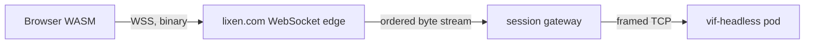

# Build Profiles and Platform Boundaries

Vi-Fighter has two independent kinds of variation:

- a **runtime mode** chooses how one process runs: interactive play, replay,
  authored script, caller-driven headless simulation, or dedicated server;
- a **build profile** chooses which host capabilities exist in the binary at all.

Keeping those choices separate matters. `ModeServer` avoids initializing a
terminal, renderer, or audio service at runtime, while the `vif_headless` build
also removes their constructors and implementations from the dependency graph.
The same simulation can therefore run in a full client and a dedicated server
without presentation becoming part of multiplayer identity.

This document records the current profile contract, what each supported platform
can actually do, and the extension seams for browser networking, downloadable
content, a non-text renderer, and Android.

## 1. Current build profiles

| Profile | Tags or target | Presentation | Audio | Raw socket sessions | Logging | Intended use |
|---|---|---|---|---|---|---|
| Full native | `make release` | Terminal renderer | Included | Yes | Included | Linux/FreeBSD client or manually run host |
| Audio-free native | `vif_noaudio` | Terminal renderer | Omitted | Yes | Included unless `novlog` | Platforms or packages that do not ship audio |
| Dedicated server | `make headless` / `vif_headless` | Omitted | Omitted | Yes | Included unless `novlog` | `-serve`, headless scripts, containers |
| Browser | `make wasm` / `GOOS=js GOARCH=wasm` | Browser terminal | Omitted | No | Stub | Solo browser client today |
| Windows cross-build | `make windows` | Terminal renderer | Omitted | Yes | Stub | Experimental `windows/amd64` artifact |

`novlog` is orthogonal to the other profiles. `vif_headless` implies no audio;
`vif_noaudio` removes audio while retaining terminal presentation. The Go-provided
`wasm` build constraint also selects the audio-free files, so a direct
`GOOS=js GOARCH=wasm go build` remains safe; the Makefile supplies
`vif_noaudio` as an explicit statement of the artifact contract.

The useful commands are:

```bash
make release                 # bin/vif
make headless                # bin/vif-headless
make wasm                    # web/vif.wasm
make windows                 # bin/vif.exe

go build -tags=vif_noaudio ./cmd/vif
go build -tags='vif_headless novlog' ./cmd/vif
```

The dedicated binary deliberately refuses presenting modes. Its normal entry is
`vif-headless -serve <address>`; an unpresented `-script` is also valid. This turns
an accidental attempt to run interactive play from a server artifact into an
early configuration error rather than a nil terminal failure.

## 2. Composition boundary

The build split follows capabilities rather than operating-system names:

| Capability | Build-specific seam | What stays common |
|---|---|---|
| Presentation | `internal/app/presentation_*`, generated `manifest/render_gen.go`, terminal service | World, systems, semantic input, scheduler |
| Audio | `internal/app/audio*`, `engine/resource_audio*`, audio service/systems, generated audio builder | Event payload identifiers in `pkg/audio/model` |
| Socket network | `internal/app/network_*` | Network protocol and simulation-facing `engine.NetworkPort` |
| Logging | existing `internal/vlog` build variants | Call sites and status collection |
| Resources | `engine.FileProvider` and `ContentProvider` | Parsed config/content models |

`App` embeds a build-specific presentation state. The terminal variant owns the
terminal service and render orchestrator; the headless variant is empty. Renderer
construction is generated into its own `!vif_headless` file, so the dedicated
build does not compile `internal/render` or `internal/render/renderer` merely to
leave their values unused.

Audio follows the same shape. Mixer, synthesis, backend, service, configuration,
and full audio systems compile only when audio is available. Protocol and event
payloads use `pkg/audio/model`, a small package containing stable identifiers but
no mixer, backend, filesystem, or synthesis dependency. The audio-free generated
builder installs tiny event sinks under the same `audio` and `music` system names.
They consume local audio events and publish the unavailable status without linking
the engine, preserving event telemetry and runtime system controls.

The authoritative manifest still declares the two local audio systems. They have
no simulation writes, and the manifest fingerprint deliberately ignores the
local build capability just as it ignores renderers. A full terminal guest and a
headless host therefore retain the same simulation identity. A future optional
system that changes shared or player simulation state must **not** use this local
capability mechanism; it must remain in every session participant or become part
of the negotiated simulation identity.

### What headless still carries

The dedicated build removes renderer and audio packages, but it does not yet
remove every terminal-shaped value. Terminal types still appear in semantic input
bindings, color configuration, wall/image cells, crash recovery, and some
simulation resources. `internal/pattern` also reads terminal-cell image data.
Removing the external terminal module altogether would require a renderer-neutral
cell/color and key model, not more build constraints around individual files.

That extraction is useful before a graphical or Android renderer, but it is not
required to prevent renderer initialization or rendering work in server pods.
Build constraints should continue to guard adapters and constructors, not fork
gameplay code by platform.

## 3. Reference artifact measurements

These are reference measurements from this change using Go 1.27.1,
`linux/amd64`, `-trimpath`, and `-ldflags='-s -w'`. They are not release budgets;
toolchain and source changes will move them.

| Artifact | Bytes | MiB | Comparison |
|---|---:|---:|---:|
| Full native | 13,496,583 | 12.87 | baseline for native profiles |
| `vif_noaudio` native | 13,127,943 | 12.52 | 2.73% smaller than full |
| `vif_headless` native | 12,484,871 | 11.91 | 7.50% smaller than full |
| WASM before the audio split | 23,081,208 | 22.01 | previous artifact |
| WASM after the audio split | 22,459,370 | 21.42 | 2.69% smaller than previous |

Size is the visible result, not the primary invariant. The stronger checks are
that these commands print no renderer or audio-engine package:

```bash
go list -deps -tags=vif_headless ./cmd/vif \
  | grep -E 'internal/render|render/renderer|/pkg/audio$'

GOOS=js GOARCH=wasm go list -deps ./cmd/vif \
  | grep '/pkg/audio$'
```

Both commands should produce no output. The container continues to be one static
binary in `scratch`; its exact layer size should be measured for each release.

## 4. Platform matrix

| Target | Current support | Important constraints |
|---|---|---|
| Linux | Developed and tested | Full audio backend discovery, Unix terminal/crash handling, TCP sessions, dedicated image |
| FreeBSD | Tested native target | Unix behavior and optional OSS `/dev/dsp`; the deployed node may itself be a VM on FreeBSD without changing the guest build |
| Windows amd64 | Cross-compiles, not runtime-tested | `CGO_ENABLED=0`; audio and logging omitted by the Makefile; terminal and socket behavior still need a real Windows smoke test |
| `js/wasm` | Tested solo browser target | xterm.js presentation; no audio, filesystem discovery, process execution, logging sink, or raw sockets |
| Other native Go targets | No support claim | May compile through generic files, but are not in the verification matrix |

The simulation uses `float64` and live sessions include concurrent scheduling.
Different targets are not promised bit-exact lockstep even when their manifest
fingerprints agree. The fingerprint rejects known simulation-shape differences;
authoritative correction remains the live convergence mechanism.

## 5. Browser networking

### Current answer

The browser build cannot join the existing game host directly. The existing
transport is a framed, long-lived TCP byte stream. Browser JavaScript exposes no
arbitrary TCP socket, and Go's `js/wasm` `net` implementation is a fake networking
surface rather than a path around the browser sandbox. `net/http` can use browser
fetch, but fetch cannot be converted into the bidirectional TCP stream the game
protocol expects.

Accordingly, the WASM build rejects `-host`, `-serve`, and `-join` configuration
before application initialization and reports that a WebSocket adapter is needed.
This is preferable to accepting the flags and failing later inside a fake socket.
Security headers on `lixen.com` do not grant raw network access.

This guard removes socket activity, not yet the whole native-network dependency.
Protocol/session values and parts of application session orchestration still refer
to `network.Config` and `SocketPort`, so `internal/network` remains in the WASM
compile graph. A complete byte-level split should move `PeerID`, messages, offers,
snapshots, and other browser-neutral wire values away from the TLS/`net.Conn`
listener/dialer files, then make startup orchestration consume a transport factory.
That refactor is also the prerequisite for a direct WebSocket transport; simply
hiding the package would duplicate the protocol or block browser sessions later.

### Viable transports

| Option | Shape | Advantages | Costs and limits |
|---|---|---|---|
| WebSocket `NetworkPort` | Browser and host both speak binary WebSocket | One protocol end to end; reliable ordered delivery matches the current stream assumptions | Requires an HTTP Upgrade listener and a browser-specific client adapter |
| WebSocket-to-TCP gateway | Browser uses WSS; gateway forwards bytes to the existing TCP pod | Smallest initial change to game servers and fleet pods | Another stateful service owns backpressure, connection lifetime, routing, and security checks |
| WebTransport | Browser and host use HTTP/3 streams/datagrams | Multiple streams and explicit transport features | More server and ingress complexity; no present protocol need justifies it |
| WebRTC data channel | Browser peers through an ICE/TURN path | Useful for peer-to-peer topologies | Signaling, NAT traversal, TURN, and topology complexity do not fit the current authoritative host |

The recommended incremental path is a same-origin binary WebSocket endpoint, for
example `wss://lixen.com/vif/ws/<session>`, backed initially by a gateway that
translates its ordered byte stream to the pod's existing TCP connection. A native
WebSocket implementation of `engine.NetworkPort` can later remove the translation
without changing systems, convergence, or the wire messages.



The adapter or gateway must preserve the properties the current transport relies
on: reliable ordered bytes, bounded frames and inbound queues, connection-close
notification, admission timeouts, and backpressure. WebSocket message boundaries
need not become protocol boundaries; the existing frame decoder can consume a
concatenated byte stream.

The ECS already sees the narrow `engine.NetworkPort` interface, but lobby,
admission, and mid-run join code still takes a concrete `network.SocketPort`.
Generalizing that composition-time surface is required for a native WebSocket
adapter. Systems, convergence, capture, and the wire message definitions need not
change.

For a page delivered over HTTPS, the endpoint must use `wss://`; browsers block
active mixed content such as `ws://`. The site's Content Security Policy must allow
the endpoint in `connect-src`. A gateway should validate the WebSocket `Origin`,
retain the existing frame/handshake bounds, and decide whether the current
unauthenticated public-session policy is also acceptable at the browser edge.
Cross-origin deployments additionally need an explicit origin policy; ordinary
CORS headers are not a substitute for WebSocket origin validation.

The allocator currently commissions a raw host/port. Browser play needs it to
return or derive a WebSocket route that identifies the selected session. That
routing value can remain distinct from authentication, as the current session
name is; whether to introduce a short-lived admission credential is a deployment
decision rather than a transport requirement.

## 6. Browser launch arguments

Go's browser support already accepts an argument vector through `Go.argv` in
`wasm_exec.js`. `web/terminal.js` now fills it from two page-controlled sources:

1. `window.VIF_ARGS`, set before the terminal script loads;
2. repeated `arg` query parameters.

Examples:

```html
<script src="vif-config.js"></script>
<script src="terminal.js"></script>
```

```javascript
// vif-config.js
window.VIF_ARGS = ['-d', '-seed=42'];
```

```text
https://lixen.com/vif/?arg=-d&arg=-seed%3D42
```

The launcher accepts at most 64 arguments of at most 1,024 characters each.
Arguments are configuration, not a content transport. Query values appear in
browser history, logs, and sometimes referrers, so secrets and substantial payloads
do not belong there. A path supplied through `-g`, `-f`, or another file flag also
does not make that file exist in the browser filesystem.

Once a WebSocket adapter exists, a page can pass a `-join=<websocket-route>` style
argument or provide the route through a browser-specific configuration bridge.
The current `-join` parser expects the native address form and the WASM build
rejects it; choosing the browser address syntax belongs with the transport choice.

## 7. External maps and assets

Today the browser uses embedded fallback assets. Native builds can additionally
resolve the editable `wad/` tree and categorized user/system config roots. CLI
arguments alone cannot bridge that difference.

A shared native/browser content path should use a resource provider rather than
make systems fetch URLs. A practical sequence is:

1. resolve a small, versioned manifest over HTTPS;
2. validate schema, declared byte limits, content hashes, and allowed media types;
3. fetch a content-addressed bundle or its named blobs;
4. cache by digest where the platform permits it;
5. expose the verified files through the existing resource/provider boundary;
6. construct a new `App` with the resolved config, content, keymap, image, and
   optional audio resources.

Reconstructing the `App` is safer than mutating a running world's configuration:
the FSM, corpus identity, map bounds, system toggles, and session fingerprint are
established during initialization. It can look like a restart to the page without
reloading the WASM module.

For future custom multiplayer maps, the host should negotiate a bundle identity
and an HTTPS location during admission. A guest downloads and verifies it before
accepting the session anchor. Large content should not travel on the tick/correction
channel: doing so would couple simulation latency, frame bounds, and content size.
The same manifest and hash policy can be implemented by a native HTTP provider so
custom maps have one trust and identity model on every platform.

The content policy still needs explicit decisions about maximum compressed and
expanded size, allowed origins, cache lifetime, signature or publisher trust, and
whether executable-like FSM actions from an untrusted host are acceptable. Hashing
proves identity and integrity; it does not establish trust.

## 8. Adding another renderer or Android host

The current default presentation adapter is terminal-specific and selected by
`!vif_headless`. Adding a graphical renderer should be a small composition change,
not a simulation fork:

1. introduce a positive tag such as `vif_gui` for the new adapter;
2. change the terminal adapter and generated terminal renderer constraints to
   `!vif_headless && !vif_gui`;
3. implement the same presentation lifecycle and geometry/input bridge in
   `presentation_gui.go`;
4. keep graphical assets and renderer construction out of the common manifest
   builder;
5. leave components, systems, events, scheduler, and manifest fingerprint common.

Android should use the same pattern through a library entry point rather than the
terminal CLI. Its renderer, lifecycle, input, audio, networking, and packaged asset
providers are host adapters. The remaining terminal-shaped cell/color and key types
described in §2 are the main architectural work before that port; extracting those
into renderer-neutral values will benefit both a desktop GUI and Android.

Build tags should remain orthogonal capabilities. Avoid an accumulating
`linux`/`windows`/`android` switch in gameplay code: use a platform tag only where
the host API forces it, and a capability tag where multiple platforms can share
the same omission or adapter.

## 9. Verification and release concerns

`make verify` compiles the full, `novlog`, audio-free, dedicated, browser, and
Windows command variants in addition to the normal test and vet gates. A release
should also run:

```bash
go generate ./internal/event ./internal/manifest
go build ./...
go test ./...
go vet ./...
./test/scenario.sh all
node --check web/terminal.js
```

Compilation is not runtime certification. Before advertising Windows support,
exercise input, resize, shutdown, TCP host/join, and the selected terminal on a
real Windows system. Before browser networking is advertised, test through the
production TLS proxy and CSP with slow links, partial frames, reconnects, large
captures, tab suspension, and allocator/session expiry. Linux and FreeBSD release
checks should continue to include a real terminal; audio-capable artifacts also
need at least one real or `null`/WAV backend smoke test.

The decisions still open are deliberately separate:

- native WebSocket endpoint versus an initial WebSocket-to-TCP gateway;
- browser route syntax and whether browser admission gains a credential;
- downloadable bundle format, limits, trust, and cache policy;
- timing of the renderer-neutral visual/input model extraction;
- whether Windows becomes a supported target after its runtime smoke matrix.
