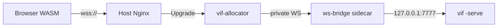

# Build Profiles and Platform Boundaries

Vi-Fighter has two independent kinds of variation:

- a **runtime mode** chooses how one process runs: interactive play, replay,
  authored script, caller-driven headless simulation, or dedicated server;
- a **build profile** chooses which host capabilities exist in the binary at all.

Keeping those choices separate matters. `ModeServer` avoids initializing a
terminal, renderer, or audio service at runtime, while the `vif_headless` build
also removes their constructors and implementations from the dependency graph.
The same simulation can therefore run in a full client and a dedicated server
without presentation becoming part of multiplayer identity.

This document records the current profile contract, what each supported platform
can actually do, and the extension seams for browser networking, downloadable
content, a non-text renderer, and Android.

## 1. Current build profiles

| Profile | Tags or target | Presentation | Audio | Raw socket sessions | Logging | Intended use |
|---|---|---|---|---|---|---|
| Full native | `make release` | Terminal renderer | Included | Yes | Included | Linux/FreeBSD client or manually run host |
| Audio-free native | `vif_noaudio` | Terminal renderer | Omitted | Yes | Included unless `novlog` | Platforms or packages that do not ship audio |
| Dedicated server | `make headless` / `vif_headless` | Omitted | Omitted | Yes | Included unless `novlog` | `-serve`, headless scripts, containers |
| Browser | `make wasm` / `GOOS=js GOARCH=wasm` | Browser terminal | Omitted | No | Stub | Solo play, or a session joined over its `wss://` route |
| Windows cross-build | `make windows` | Terminal renderer | Omitted | Yes | Stub | Experimental `windows/amd64` artifact |

`novlog` is orthogonal to the other profiles. `vif_headless` implies no audio;
`vif_noaudio` removes audio while retaining terminal presentation. The Go-provided
`wasm` build constraint also selects the audio-free files, so a direct
`GOOS=js GOARCH=wasm go build` remains safe; the Makefile supplies
`vif_noaudio` as an explicit statement of the artifact contract.

The useful commands are:

```bash
make release                 # bin/vif
make headless                # bin/vif-headless
make wasm                    # web/vif.wasm
make windows                 # bin/vif.exe

go build -tags=vif_noaudio ./cmd/vif
go build -tags='vif_headless novlog' ./cmd/vif
```

The dedicated binary deliberately refuses presenting modes. Its normal entry is
`vif-headless -serve <address>`; an unpresented `-script` is also valid. This turns
an accidental attempt to run interactive play from a server artifact into an
early configuration error rather than a nil terminal failure.

## 2. Composition boundary

The build split follows capabilities rather than operating-system names:

| Capability | Build-specific seam | What stays common |
|---|---|---|
| Presentation | `internal/app/presentation_*`, generated `manifest/render_gen.go`, terminal service | World, systems, semantic input, scheduler |
| Audio | `internal/app/audio*`, `engine/resource_audio*`, audio service/systems, generated audio builder | Event payload identifiers in `pkg/audio/model` |
| Socket network | `internal/app/network_*` | Network protocol and simulation-facing `engine.NetworkPort` |
| Logging | existing `internal/vlog` build variants | Call sites and status collection |
| Resources | `engine.FileProvider` and `ContentProvider` | Parsed config/content models |

`App` embeds a build-specific presentation state. The terminal variant owns the
terminal service and render orchestrator; the headless variant is empty. Renderer
construction is generated into its own `!vif_headless` file, so the dedicated
build does not compile `internal/render` or `internal/render/renderer` merely to
leave their values unused.

Audio follows the same shape. Mixer, synthesis, backend, service, configuration,
and full audio systems compile only when audio is available. Protocol and event
payloads use `pkg/audio/model`, a small package containing stable identifiers but
no mixer, backend, filesystem, or synthesis dependency. The audio-free generated
builder installs tiny event sinks under the same `audio` and `music` system names.
They consume local audio events and publish the unavailable status without linking
the engine, preserving event telemetry and runtime system controls.

The authoritative manifest still declares the two local audio systems. They have
no simulation writes, and the manifest fingerprint deliberately ignores the
local build capability just as it ignores renderers. A full terminal guest and a
headless host therefore retain the same simulation identity. A future optional
system that changes shared or player simulation state must **not** use this local
capability mechanism; it must remain in every session participant or become part
of the negotiated simulation identity.

### What headless still carries

The dedicated build removes renderer and audio packages, but it does not yet
remove every terminal-shaped value. Terminal types still appear in semantic input
bindings, color configuration, wall/image cells, crash recovery, and some
simulation resources. `internal/pattern` also reads terminal-cell image data.
Removing the external terminal module altogether would require a renderer-neutral
cell/color and key model, not more build constraints around individual files.

That extraction is useful before a graphical or Android renderer, but it is not
required to prevent renderer initialization or rendering work in server pods.
Build constraints should continue to guard adapters and constructors, not fork
gameplay code by platform.

## 3. Reference artifact measurements

These are reference measurements from this change using Go 1.27.1,
`linux/amd64`, `-trimpath`, and `-ldflags='-s -w'`. They are not release budgets;
toolchain and source changes will move them.

| Artifact | Bytes | MiB | Comparison |
|---|---:|---:|---:|
| Full native | 13,496,583 | 12.87 | baseline for native profiles |
| `vif_noaudio` native | 13,127,943 | 12.52 | 2.73% smaller than full |
| `vif_headless` native | 12,484,871 | 11.91 | 7.50% smaller than full |
| WASM before the audio split | 23,081,208 | 22.01 | previous artifact |
| WASM after the audio split | 22,459,370 | 21.42 | 2.69% smaller than previous |

Size is the visible result, not the primary invariant. The stronger checks are
that these commands print no renderer or audio-engine package:

```bash
go list -deps -tags=vif_headless ./cmd/vif \
  | grep -E 'internal/render|render/renderer|/pkg/audio$'

GOOS=js GOARCH=wasm go list -deps ./cmd/vif \
  | grep '/pkg/audio$'
```

Both commands should produce no output. The container continues to be one static
binary in `scratch`; its exact layer size should be measured for each release.

## 4. Platform matrix

| Target | Current support | Important constraints |
|---|---|---|
| Linux | Developed and tested | Full audio backend discovery, Unix terminal/crash handling, TCP sessions, dedicated image |
| FreeBSD | Tested native target | Unix behavior and optional OSS `/dev/dsp`; the deployed node may itself be a VM on FreeBSD without changing the guest build |
| Windows amd64 | Experimental cross-build only | `CGO_ENABLED=0`; audio and logging omitted; not a release artifact or development focus, and may be removed if field reports show it is broken |
| `js/wasm` | Solo play tested; session join built, not yet commissioned | xterm.js presentation; no audio, filesystem discovery, process execution, logging sink, or raw sockets. A session is joined over the page's own WebSocket (§5), never a socket |
| Other native Go targets | No support claim | May compile through generic files, but are not in the verification matrix |

The simulation uses `float64` and live sessions include concurrent scheduling.
Different targets are not promised bit-exact lockstep even when their manifest
fingerprints agree. The fingerprint rejects known simulation-shape differences;
authoritative correction remains the live convergence mechanism.

## 5. Browser networking

### What a browser joins with

The game protocol is a framed byte stream, and a browser has exactly one
bidirectional byte stream: a WebSocket. It has no arbitrary socket, and `js/wasm`'s
`net` package is a fake networking surface rather than a way around that. So the
browser build dials the session's WebSocket route and wraps the page's own
`WebSocket` object as a `net.Conn` — reads block on arriving binary messages,
writes send one encoded frame each, and deadlines and closure behave as the
transport already expects. `network.dial` is the only seam; everything above it,
including `SocketPort`, the handshake, the fences and the snapshot assembly, is the
code a native client runs.

That is why message boundaries need not be frame boundaries. `Decode` reads with
`io.ReadFull` from a stream, so a receiver reassembles whatever chunking the path
produced, exactly as it does from TCP. The inbound queue is bounded at
`wsQueueMessages`: a browser offers a receiver no backpressure, so the link is
closed rather than left growing the tab's heap.

The browser is refused `-host` and `-serve` before initialization, because it can
bind nothing. A `-join` naming a `host:port` is refused for the same reason.

### Where WebSocket is spoken

Not here. The pod keeps its framed TCP listener, and the WebSocket half of the path
is a bridge sidecar in the session pod that turns one upgraded connection into one
loopback TCP connection to the game. Ordered delivery, frame bounds, queue bounds,
closure and backpressure are unchanged, because the transport they belong to is
unchanged.

| Option | Why not |
|---|---|
| **Chosen — a bridge sidecar in the session pod.** | Kubernetes already has the pieces: a restartable init container is a sidecar whose fault is not the pod's, and it dies with the session. The loopback hop never leaves the pod's network namespace, and the repository gains no WebSocket implementation. |
| A WebSocket listener in `vif`, on a third-party package. | `net/http` has no WebSocket handler; `golang.org/x/net/websocket` is deprecated and says so. What is left is a third-party, network-facing dependency on the path every player takes, for something an off-the-shelf process already does. |
| The same, hand-written. | RFC 6455 framing in this repository is the dependency objection restated as maintenance, plus new parsing surface reachable by anyone who can open the public route. |
| Terminating WebSocket in `vif-allocator`. | Same library problem, and it would put per-player byte translation inside the one process the whole fleet depends on. |
| The API server's `pods/portforward`, which is genuinely Kubernetes-native. | It needs a WebSocket *client* in the allocator — the same missing library — and `pods/portforward` is a shell-equivalent grant. |
| An ingress controller. | None translates WebSocket to a raw TCP backend. Traefik and Nginx forward an upgrade to a backend that already speaks it. |
| WebTransport. | Its advantages do not yet justify an HTTP/3 server and ingress. |
| A WebRTC data channel. | ICE, signalling and TURN solve a peer-to-peer problem an authoritative host does not have. |

The price is stated rather than hidden: the translation the earlier plan refused
between the allocator and the game now happens inside the pod, and the game sees
every browser participant arriving from `127.0.0.1`. `network.AdmissionLimiter` is
per-address, so the browser population shares one budget; the allocator's
per-session ceiling and the edge's rate limits are what replace it, and
[`doc/todo.md`](todo.md) carries the decision about whether that is enough.

### The public route



`wss://<site>/vif/ws/<session>`. The session identifier is a routing key, not a
secret. Nginx terminates TLS and forwards `Upgrade` without interpreting a frame.
The allocator checks the method, the identifier's syntax, the `Origin`, the
session's liveness and readiness in reconciled Kubernetes state, and its own
per-session ceiling; only then does it proxy, and it never accepts an upstream a
caller named. `net/http/httputil.ReverseProxy` carries the upgrade, so that hop
needs no library either.

For a page served over HTTPS the endpoint must be `wss://`: browsers block
`ws://` as active mixed content. The site's `connect-src 'self'` permits the
same-origin socket. Ordinary CORS headers are not a substitute for the `Origin`
check. Browser admission credentials are a later control-plane feature and should
be short-lived and session-scoped when introduced.

The raw TCP NodePort path is unchanged and is what native clients use. The
allocator has outgrown pure allocation now that it owns routing and admission; keep
those duties behind explicit interfaces so the process can be renamed or split
without moving Kubernetes lifecycle code into the game.

## 6. Browser launch arguments

Go's browser support already accepts an argument vector through `Go.argv` in
`wasm_exec.js`. `web/terminal.js` fills it from two page-controlled sources:

1. `window.VIF_ARGS`, set before the terminal script loads;
2. repeated `arg` query parameters.

`web/` is the launcher, and it is copied to a deployment as it stands: the same
page, the same script, the same vendor tree at `/vendor/xterm-5.5/`, the same
`vif.wasm` the Makefile writes. A deployment that edits any of them has
forked the launcher, and the fork is only visible the next time one side changes.

```html
<script src="vif-config.js"></script>
<script src="terminal.js"></script>
```

```javascript
// vif-config.js
window.VIF_ARGS = ['-d', '-seed=42'];
```

```text
https://<site>/projects/vi-fighter/wasm/?arg=-d&arg=-seed%3D42
```

The launcher accepts at most 64 arguments of at most 1,024 characters each.
Arguments are configuration, not a content transport. Query values appear in
browser history, logs, and sometimes referrers, so secrets and substantial payloads
do not belong there. A path supplied through `-s`, `-f`, or another file flag also
does not make that file exist in the browser filesystem.

The page passes `-join=wss://<site>/vif/ws/<session>` through this bridge. A
target with a `ws://` or `wss://` scheme is dialled whole; the `host:port` and
`[vif://]host:port/name` forms are parsed as they were, so a link a native player
was handed still means what it meant.

## 7. External maps and assets

Today the browser uses embedded fallback assets. Native builds can additionally
resolve the editable `wad/` tree and categorized user/system config roots. CLI
arguments alone cannot bridge that difference.

A shared native/browser content path should use a resource provider rather than
make systems fetch URLs. A practical sequence is:

1. resolve a small, versioned manifest over HTTPS;
2. validate schema, declared byte limits, content hashes, and allowed media types;
3. fetch a content-addressed bundle or its named blobs;
4. cache by digest where the platform permits it;
5. expose the verified files through the existing resource/provider boundary;
6. construct a new `App` with the resolved config, content, keymap, image, and
   optional audio resources.

Reconstructing the `App` is safer than mutating a running world's configuration:
the FSM, corpus identity, map bounds, system toggles, and session fingerprint are
established during initialization. It can look like a restart to the page without
reloading the WASM module.

For future custom multiplayer maps, the host should negotiate a bundle identity
and an HTTPS location during admission. A guest downloads and verifies it before
accepting the session anchor. Large content should not travel on the tick/correction
channel: doing so would couple simulation latency, frame bounds, and content size.
The same manifest and hash policy can be implemented by a native HTTP provider so
custom maps have one trust and identity model on every platform.

The content policy still needs explicit decisions about maximum compressed and
expanded size, allowed origins, cache lifetime, signature or publisher trust, and
whether executable-like FSM actions from an untrusted host are acceptable. Hashing
proves identity and integrity; it does not establish trust.

## 8. Adding another renderer or Android host

The current default presentation adapter is terminal-specific and selected by
`!vif_headless`. Adding a graphical renderer should be a small composition change,
not a simulation fork:

1. introduce a positive tag such as `vif_gui` for the new adapter;
2. change the terminal adapter and generated terminal renderer constraints to
   `!vif_headless && !vif_gui`;
3. implement the same presentation lifecycle and geometry/input bridge in
   `presentation_gui.go`;
4. keep graphical assets and renderer construction out of the common manifest
   builder;
5. leave components, systems, events, scheduler, and manifest fingerprint common.

Android should use the same pattern through a library entry point rather than the
terminal CLI. Its renderer, lifecycle, input, audio, networking, and packaged asset
providers are host adapters. The remaining terminal-shaped cell/color and key types
described in §2 are the main architectural work before that port; the development
target is a minimally polished Android app within one month, so renderer-neutral
visual and input extraction belongs on that launch path rather than after it.

Build tags should remain orthogonal capabilities. Avoid an accumulating
`linux`/`windows`/`android` switch in gameplay code: use a platform tag only where
the host API forces it, and a capability tag where multiple platforms can share
the same omission or adapter.

## 9. Verification and release concerns

`make verify` compiles the full, `novlog`, audio-free, dedicated, browser, and
Windows command variants in addition to the normal test and vet gates. A release
should also run:

```bash
go generate ./internal/event ./internal/manifest
go build ./...
go test ./...
go vet ./...
./script/test.sh all
node --check web/terminal.js
```

Compilation is not runtime certification. Before browser networking is advertised,
test through the production TLS proxy and CSP with slow links, partial frames,
reconnects, large captures, tab suspension, and allocator/session expiry. Linux
and FreeBSD release checks should continue to include a real terminal;
audio-capable artifacts also need at least one real or `null`/WAV backend smoke
test. Windows remains an unpromised cross-build and has no runtime certification
work on the release path.

The remaining policy decisions are deliberately separate from transport:

- browser authentication and whether the expanded allocator is renamed or split;
- downloadable bundle format, compressed and expanded limits, trust, and cache policy;
- exact renderer-neutral model boundaries needed for the one-month Android target.
