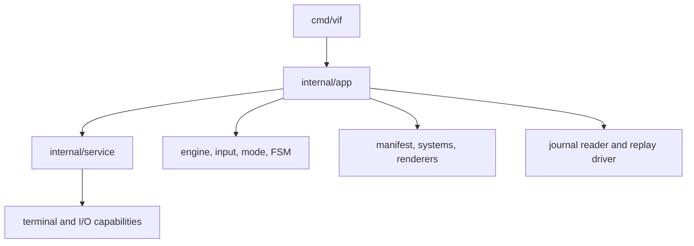
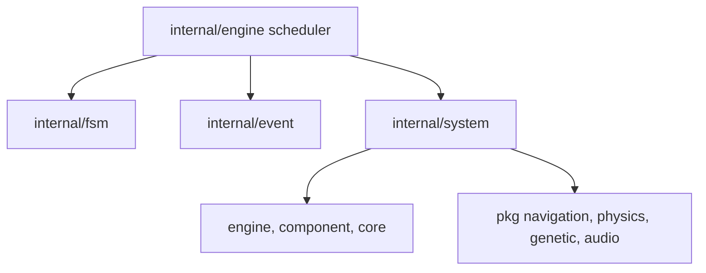
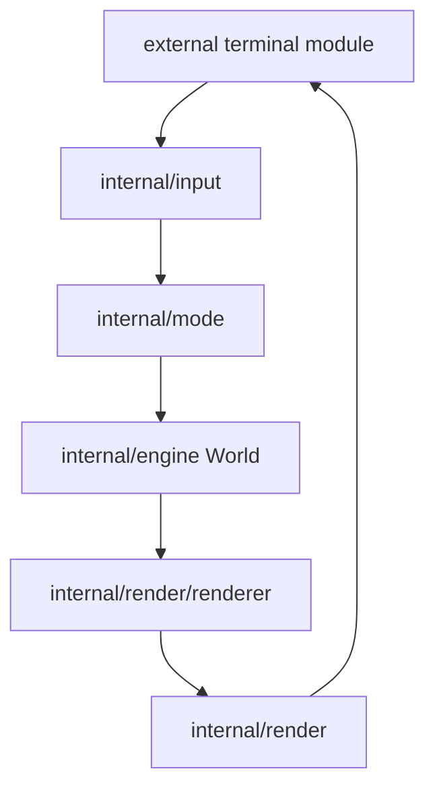
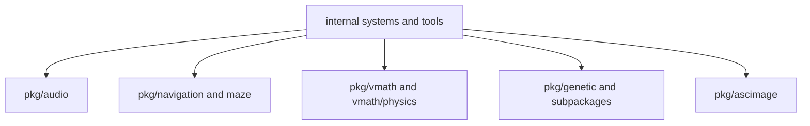

# Package Map

This document is the medium-level map between the high-level containers in
[Architecture overview](architecture.md) and individual implementation files.
It focuses on production packages first, then reusable libraries and tools.

## 1. Application package topology

`internal/app` is the composition root. Other packages should not construct an
entire game runtime or depend back upward on it.

## 2. Simulation package topology

The system package is intentionally broad: each file is a gameplay system, and
the generated manifest supplies domain profiles plus dependency-ordered
construction. Shared mechanics should move downward into focused packages
rather than creating system-to-system object references; systems communicate
through ECS data and events.

## 3. Presentation and interaction topology

Input parsing is engine-independent; mode routing is engine-aware. Rendering
reverses that direction: renderers read engine state and write only to the
render abstraction, while the orchestrator owns the terminal capability.

## 4. Production package responsibilities

| Package | Responsibility and boundary |
|---|---|
| `cmd/vif` | CLI flags, logging/journal/runtime-capture setup, replay/check/schema selection, process exit policy. |
| `content` | Immutable corpus model; root-directory load; plain-text sanitization and authored TOML blocks; corpus cursor. |
| `internal/app` | Resolve paths, validate runtime mode, compose play/headless/replay Apps, drive frame/input/playback loops, verify/replay journals, and expose check/schema tools. |
| `internal/asset` | Embedded default FSM files, embedded tutorial corpus, built-in splash bitmap font. |
| `internal/component` | Pure ECS component data and related enums/masks. Position is declared here but stored specially by `engine`. |
| `internal/core` | Small shared value types, entity ID, modes, code blocks, crash and stderr-capture support. |
| `internal/engine` | World, typed stores, positions/spatial grid, resources, game context/state, pausable/manual clocks, time control, scheduler, locking. |
| `internal/event` | Event catalog/payload registry, producer origins, replay record/anchor schema, MPSC queue, handler router, pooled/batched payload support. |
| `internal/fsm` | Generic hierarchical, parallel-region machine; TOML graph loader; transitions, delayed actions, variables, per-region trigger masks, and optional transition/region observation hooks. |
| `internal/fsm/std` | Reusable HFSM actions/guards and host capability interface. It does not import the game engine. |
| `internal/input` | Terminal-event parser, semantic intents, default key table, keymap decoding/merging. It does not import the ECS. |
| `internal/journal` | Leaf JSONL reader that reassembles rotated replay files by dense journal sequence. |
| `internal/manifest` | Authoritative component/system/renderer lists, generated builders, game binding for the generic FSM. |
| `internal/mode` | Mode ownership, intent execution, motions/operators/search, mouse handling, macros, command mode, undo/history. |
| `internal/network` | Experimental TCP/TLS transport, framed protocol, peers, sequence/ack fields, inbound notifications. |
| `internal/parameter` | Gameplay constants, timing, priorities, effect/audio tuning, paths, navigation/genetics settings. |
| `internal/parameter/visual` | Renderer-facing characters, masks, palettes, gradients, shapes, and post-process settings. |
| `internal/pattern` | Convert ascimage/dual-image assets into wall/pattern spawn data; translate, mask, tile, and merge patterns. |
| `internal/render` | Render context, coordinate transforms, compositor buffer, blend modes, finalizers, renderer interface/orchestrator. |
| `internal/render/renderer` | Concrete visual projections of components/resources, UI, post-process passes, and flow/graph debug overlay. |
| `internal/service` | Dependency-ordered lifecycle hub and mode-selected adapters for terminal, content, audio, and experimental network transport. |
| `internal/status` | Registered atomic metrics closed by `Freeze`, sorted/grouped snapshots, duration formatting, and the tick-sampled flight recorder. |
| `internal/system` | Gameplay mechanics and event handlers. Systems are constructed from the manifest and run in priority order. |
| `internal/vlog` | Build-tagged logger facade: levels, scopes, correlation stamps, correlated sets, standalone files, crash flush, and the ungated journal sink; no-op on WASM/`novlog`. |

## 5. Reusable `pkg` libraries

| Package | Public purpose | Important coupling |
|---|---|---|
| `pkg/ascimage` | Convert images to terminal cells/dual assets and provide a viewer. | Viewer uses the in-repo render buffer; conversion uses external terminal/color types. |
| `pkg/audio` | Synthesis, sound registry/cache, PCM mixer, patterns, harmony, voices, sequencer, backend detection, WAV sink. | Game policy is injected; the package does not import `internal/system` or APM state. |
| `pkg/genetic` | Generic generational and caller-driven streaming genetic engines plus operators. | Core package uses the standard library only. |
| `pkg/genetic/fitness` | Convert lifetime metric bundles to scalar fitness. | Depends on tracking types. |
| `pkg/genetic/tracking` | Pooled lifetime metric collectors for simple and composite subjects. | No game-specific component dependency. |
| `pkg/genetic/registry` | Up to 256 species/populations, sampling, probes, tracking, stats, optional persistence. | Composes core genetic, fitness, tracking, and persistence. |
| `pkg/genetic/persistence` | Atomic file saves and TOML/JSON codecs for population DTOs. | TOML codec imports the external TOML module. |
| `pkg/maze` | Recursive-backtracker maze generation, rooms, braiding, and solution data. | Uses shared point/value types and is surfaced through wall/maze events. |
| `pkg/navigation` | Flow fields, recompute caches, composite passability, multi-route graphs. | Uses shared points and tuning constants; wall access is callback-based. |
| `pkg/vmath/physics` | `float64` kinetic state, integration, bounce, homing/arrival, collisions, orbital and 3D operations. | Owns `physics.Kinetic`; depends only on the standard library and `pkg/vmath`. |
| `pkg/vmath` | `float64` scalar/vector math, LUTs, shapes, arcs, grid traversal, cell topology, and seeded randomness. | Standard-library-only foundation; integer `Point`/`Area` values are grid indices, not fixed-point numbers. |

Although these packages are under `pkg`, not all of them are guaranteed to be
drop-in libraries outside this module: for example, `pkg/ascimage` imports the
in-repository renderer and `pkg/navigation` imports game tuning. The numeric
stack is cleanly one-way: `pkg/vmath` imports only the standard library,
`pkg/vmath/physics` imports `pkg/vmath`, and neither exposes the removed
fixed-point types or conversion API. `pkg/audio`, the core `pkg/genetic`
package, and the numeric stack have the clearest game-independent boundaries.

## 6. Generated assembly

`internal/manifest/definition.go` is the human-edited declaration for three
registries:

- component field/type pairs;
- system registry keys, constructors, domains and dependencies;
- renderer registry keys, constructors, and layer priorities.

`go generate ./internal/manifest/...` invokes `internal/gen-manifest` and
updates builders, system profiles, typed component stores/removal masks, the
event reflection registry, and input enum strings. Stable tick tie-breaking
comes from manifest order when two systems share a priority.

Important exceptions:

- `MetaSystem` is event-only and is registered directly by `internal/app`; it
  is intentionally absent from the per-tick system manifest.
- `NetworkSystem` exists but is absent from the manifest and is not active in
  the normal application.
- runtime system control uses each system's `Name()` value, which generation
  verifies against the manifest construction key.

## 7. Dependency direction rules

The practical dependency rules are:

1. `cmd` may depend on `internal/app`; lower packages must not depend on `cmd`.
2. `app` may compose all runtime layers; domain packages should not import it.
3. `engine` owns data/lifecycle infrastructure but should not import concrete
   gameplay systems or renderers.
4. `input` produces pure intents and must remain free of engine dependencies.
5. `mode`, systems, and renderers may depend on engine data, but communicate
   laterally through resources/events rather than concrete peer references.
6. Generic FSM core/std stays independent of the game through `std.Host`; the
   manifest bridge is the adapter.
7. Blocking I/O stays behind services, render flush, audio backends, tools, or
   diagnostics—not inside a simulation update.
8. Reusable algorithms accept callbacks/data structures instead of reaching
   into global world state where practical.

## 8. External module boundary

| External module | Used by | What remains in Vi-Fighter |
|---|---|---|
| `lixenwraith/terminal` | app, service, input, render, ascimage/tools | Game-specific input semantics, compositor, renderers, and layout. |
| `lixenwraith/toml` | content, FSM, keymaps, audio specs, commands, genetic persistence | Schemas, validation policy, semantic models, and application resolution. |
| `lixenwraith/color` | renderers, visual parameters, ascimage | Layering, masks, game palettes, effects, and render scheduling. |
| `lixenwraith/log` | `internal/vlog` only in normal builds | Scopes, game correlation fields, crash/runtime capture integration, status snapshots. |

The pinned revisions are in `go.mod`; this document intentionally avoids
duplicating version strings that would become stale.

## 9. Commands, tools, sandboxes, and benchmarks

| Area | Contents |
|---|---|
| `cmd/ascimage` | Supported image converter/viewer command. |
| `cmd/soundlab` | Supported audio document editor, REPL/TUI, sequencer audition environment, and script runner. |
| `tool/blend-tester` | Inspect blend behavior and palette/effect combinations. |
| `tool/font-editor` | Edit the bitmap splash font. |
| `tool/hierarchy-map` | Analyze and visualize Go package/import hierarchy. |
| `tool/http-server` | Minimal static server used by `make serve` for the WASM bundle. |
| `sandbox/*` | Isolated prototypes and visual/interaction experiments; not part of application assembly. |
| `benchmark/*` | Standalone math, random, and render experiments; not Go benchmark test packages. |
