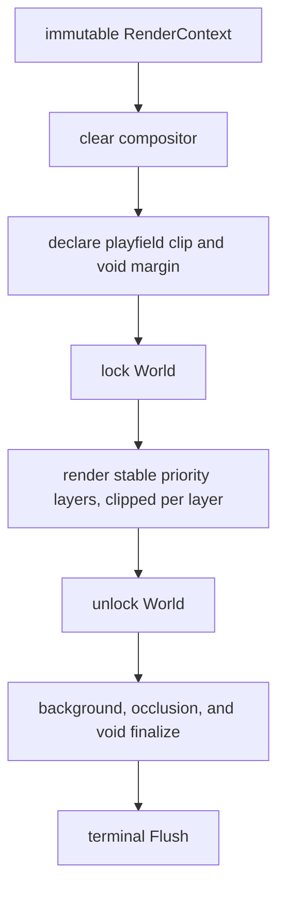
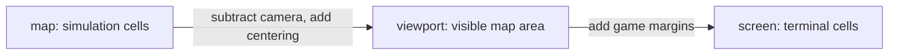

# Rendering Architecture

Vi-Fighter renders a layered simulation into a terminal-cell compositor. The
renderer reads the ECS; it never owns gameplay state. The external terminal and
color modules provide host I/O and color primitives, while this repository owns
camera transforms, layer ordering, masks, visual policy, and every game-specific
renderer.

## 1. Frame pipeline

The app targets a 16 ms frame interval. `RenderOrchestrator` owns one reusable
`RenderBuffer`, clears it, acquires the world lock, invokes visible renderers in
ascending priority, and releases the lock. Finalization and terminal flushing
happen outside the world lock so a stalled host write cannot block game ticks,
event delivery, or input routing.

Before the lock the orchestrator derives the frame's playfield rectangle and
sets it as the compositor clip for every simulation layer, restoring the full
buffer for screen-space layers. See section 2.1.

Renderers are registered during application assembly. Insertion sort preserves
priority order, and registration index is the stable tie-breaker. A renderer
that implements `VisibilityToggle` can be registered permanently and skipped
without rebuilding the pipeline, as used by debug projections.

## 2. Render context and coordinates

`RenderContext` is passed by value and snapshots the frame data needed by all
renderers:

| Group | Fields |
|---|---|
| Timing | pause-aware game time, frame delta, paused flag |
| Player | local-cursor map coordinates and validity |
| Layout | game-area screen offsets |
| View | viewport width/height and camera top-left |
| Map | logical map width/height and centering offsets |
| Host | complete terminal screen width/height |

There are three coordinate spaces:

- Map coordinates are authoritative for positions, walls, collisions, and
  cursor motion.
- Viewport coordinates crop a map larger than the terminal or center a smaller
  map.
- Screen coordinates include UI/game margins and address the render buffer.

`MapToViewport`, `ViewportToScreen`, `MapToScreen`, `IsInViewport`, and
`VisibleMapBounds` centralize conversion. New renderers should use these helpers
instead of duplicating camera arithmetic. `MapToViewport` and `MapToScreen`
report a coordinate visible only when it is both a map cell and inside the
viewport, so an out-of-map coordinate that projects into a centered map's margin
answers false. Both still return the projection, so a renderer anchoring a shape
on an off-map centre can use it and let the clip trim the result. Area renderers
should still intersect their iteration bounds with `VisibleMapBounds` to avoid
the wasted work; the quasar zap ellipse does.

### 2.1 The playfield clip

A map smaller than the viewport is centered inside it, and the margin that
leaves belongs to no cell any entity, effect, or field can occupy. It appears
whenever the render area outgrows the simulation: a `crop_on_resize = false`
scenario such as `wad/game/td`, a multi-participant session whose bounds were
latched by the first joiner, or a tmux pane zoomed after the map was fixed.

Three rectangles describe it, all derived from `RenderContext`:

| Helper | Space | Meaning |
|---|---|---|
| `PlayfieldViewportRect` | viewport | the map's extent inside the viewport |
| `PlayfieldRect` | screen | the cells a simulation coordinate can reach |
| `GameAreaRect` | screen | the whole viewport; the part outside the playfield is the margin |

Confinement is enforced in two independent places, because the two failure
modes are different:

- **Coordinate layer.** `MapToScreen` and friends reject off-map coordinates, so
  every renderer that projects map cells is bounded by construction. This covers
  shapes drawn per-cell from a possibly off-map anchor: splash bitmaps, health
  bars, cleaner trails, marker areas.
- **Compositor layer.** `RenderBuffer.SetClip` bounds every write path, and the
  orchestrator sets it per layer from `RenderPriority.ClipsToPlayfield`. This
  covers renderers that never convert a map coordinate at all because they
  iterate the viewport directly — ping lines, materialize beams, the explosion
  accumulation buffer — and it holds for effects nobody has written yet.

`ClipsToPlayfield` is the single classification of layers into simulation and
screen space; post-processing, UI, and debug layers address the whole screen by
design and stay unclipped. `TestEveryLayerDeclaresItsClip` fails when a priority
is added without a declared side.

Where a renderer's own geometry depends on the bound rather than merely being
trimmed by it, it reads `PlayfieldViewportRect` directly: ping spans the map
rather than the viewport, materialize beams run from the map edge so their
length and intensity gradient stay correct, and the indicator gutters number
only reachable rows and columns.

When the map fills the game area — every `crop_on_resize` run, and every
camera-cropped map — the playfield equals the game area and the clip is a no-op,
so the common path composes exactly as it did before the clip existed.

The centering offset itself has one definition, `ConfigResource.MapOffset`, with
`ConfigResource.ViewportToMap` as its inverse. Mouse routing uses the inverse, so
the cell under the pointer is the cell the renderer drew there; deriving the two
separately is what made a click on a centered map land short by half the margin.

Replay separates simulation geometry from presentation geometry. The journal
anchor fixes the former; terminal resize only resizes the orchestrator, and
`h/j/k/l` shifts presentation offsets without mutating the recorded camera or
viewport. The current render buffer is still terminal-sized, so a recording
wider than the viewer terminal is clipped before pan and the pan control can
reach only cells that entered that buffer. A future windowed composite is
needed to pan over the whole recorded surface.

## 3. Compositor data model

The buffer allocates parallel arrays sized to `width * height`:

| Array/state | Purpose |
|---|---|
| terminal cells | Rune, foreground, background, attributes. |
| `touched` | Whether a background channel has been explicitly drawn. |
| masks | Semantic layer bits accumulated for post-processing. |
| current write mask | Mask applied by subsequent drawing calls. |
| clip rectangle | Writable area; set per layer by the orchestrator, reopened by `Clear`. |
| background overlay | Deferred color/intensity for otherwise untouched cells. |
| void region | Game area and playfield rectangles plus the color the margin is filled with. |
| finalizer function | Selected once from color mode and occlusion configuration. |

Resize reuses capacity when possible and synchronizes the terminal. Clear
zeroes cells and metadata, reopens the clip to the whole buffer, and keeps
allocations. Out-of-bounds draw calls are safe no-ops, and so are draws outside
the clip: `inBounds` tests the clip, which `SetClip` keeps intersected with the
buffer so the check stays a single range test. `CellAt` deliberately reads
through buffer bounds rather than the clip, so a test can read back the cells a
layer was prevented from reaching. `MutateDim` and `MutateGrayscale` iterate the
clip, so a clipped layer cannot post-process outside it either.

### Drawing operations

`Set` optionally writes a rune and composites foreground/background channels.
Focused helpers preserve the other channel:

| Operation | Semantics |
|---|---|
| `SetFgOnly` | Replace rune/foreground/foreground attributes and retain background. |
| `SetBgOnly` | Replace only background and mark it touched. |
| `SetWithBg` | Opaque cell replacement with the current mask. |
| `SetBg256` | Store a palette index in the background channel and set the palette attribute. |

Terminal attributes identify whether RGB channel bytes represent truecolor or
an xterm-256 palette index. Any effect that mutates colors must preserve those
attributes and avoid treating an index as an RGB component.

## 4. Blend modes

Blend mode is encoded as an operation plus foreground/background flags.

| Operation | Typical visual use |
|---|---|
| Replace | Opaque glyphs, UI, and hard field cells. |
| Alpha | Fades and translucent overlays. |
| Add | Energy glows, explosions, storm/pylon fields. |
| Max | Retain the brightest participant when fields overlap. |
| Soft light | Subtle shield glow. |
| Screen | Light-emitting fields, lightning, pulses. |
| Overlay | Ember ring/color shaping. |

Predefined modes include both-channel variants plus foreground-only screen,
replace, and add, and background-only max. A renderer should choose the
narrowest channel set it needs so later layers can preserve existing content.

The actual color math comes from `lixenwraith/color`; the selection and
composition policy lives in `internal/render` and the concrete renderers.

## 5. Semantic masks and post-processing

Renderers call `SetWriteMask` before drawing. Current mask categories are:

| Mask | Content |
|---|---|
| `MaskPing` | Cursor crosshair/grid guidance. |
| `MaskGlyph` | Normal typeable text. |
| `MaskField` | Shield/ember and related fields. |
| `MaskTransient` | Projectiles, particles, materialization, lines, sigils. |
| `MaskComposite` | Species, structures, gold, composite members. |
| `MaskUI` | Meters, status, cursor, overlays, debug UI. |
| `MaskHealthBar` | Dedicated high bit used by health bars. |

Masks allow late renderers to transform selected prior layers without knowing
which concrete renderer produced them:

- grayout desaturates glyphs while excluding guidance, fields, transients,
  composites, health bars, and UI;
- dim scales every category except UI;
- the truecolor finalizer dims selected occupied backgrounds under glyphs;
- strobe supplies a deferred background overlay for otherwise untouched cells.

`MutateDim` and `MutateGrayscale` skip foreground/background channels marked as
256-color indices. This avoids corrupting palette values with RGB arithmetic.

## 6. Finalization and color modes

The buffer chooses one of two finalizers at construction:

| Mode | Finalization |
|---|---|
| Truecolor with occlusion enabled | Fill untouched backgrounds, then dim touched backgrounds under runes whose masks match the occlusion set. |
| 256-color or occlusion disabled | Fill untouched backgrounds only. |

Both use the normal background unless a renderer set a deferred background
overlay, in which case its precomputed color/intensity fills untouched cells.

A third pass then repaints the void region: the part of the game area outside
the playfield is filled with `visual.RgbVoid` so the non-playable margin reads
as out of play rather than as empty map. Only untouched cells are repainted, so
a UI or debug layer that legitimately reaches into the margin keeps the colors
it composed, and the pass walks the four margin bands rather than the whole
area. Setting `RgbVoid` to `RgbBackground` restores the undifferentiated look.

Finalization is immediately followed by the terminal module's full-buffer
`Flush`.

The CLI can force xterm-256 (`-color 256`) or truecolor (`-color true`);
`-color auto`, the default, lets the terminal capability select the mode. Visual parameter files provide truecolor and
palette-specific values. Renderer logic should not assume every color channel
contains RGB.

## 7. Layer inventory

The manifest is the authoritative renderer list. The conceptual order below is
also the visual stacking order; exact integer priorities are in
`internal/render/priority.go`.

| Layer group | Renderers |
|---|---|
| Background/guidance | `ping` |
| Environment/guidance | `wall`, `chargeline` |
| Base entities | `sigil`, `glyph`, `gold`, `healthbar` |
| Species/structures | `pylon`, `tower`, `storm`, `eye`, `snake`, `drain`, `quasar`, `swarm` |
| Cleaner/materialize | `cleaner`, `materialize`, `teleportline` |
| Fields/projectiles | `shield`, `ember`, `orb`, `lightning`, `missile`, `pulse`, `bullet` |
| Particles | `flash`, `fadeout`, `explosion`, `spirit` |
| Overlay effects | `splash`, `marker` |
| Post-process | `grayout`, `strobe`, `dim` |
| UI | `heat`, `indicator`, `statusbar`, `peer_cursor`, `cursor` |
| Debug | `overlay`, `flowfield` |

Some rendered concepts do not have a same-named component or system. For
example, charge/teleport lines are projections of species state, ember is a
heat phase, and status/overlay renderers read resources/adapters. Conversely,
a game component needs no renderer if another renderer deliberately projects
it (nuggets use their visual/sigil representation rather than a registered
`nugget` renderer).

The cleaner renderer is intentionally background-only: every sampled trail
cell writes no rune/foreground, so typeable text remains readable as a cleaner
crosses it. `BlendMaxBg` bounds overlapping auto-fire at the brighter input
instead of accumulating color, and the visible ring-buffer prefix contracts as
a blocked cleaner drains to its stop point.

### Local and peer cursors

Two renderers rather than one loop, and they answer different questions. The local
cursor answers "where am I, and what am I about to act on", so it takes the colour
of whatever it is standing on and follows the local input mode. A peer answers
"where is that player", so it keeps one colour per roster slot whatever it stands
on — drawing them the same way would make the two indistinguishable exactly when it
matters, which is when they overlap. `PriorityPeerCursor` sits directly under
`PriorityCursor` so an overlap resolves in favour of the one the player is steering.

Before `peer_cursor` existed a participant was visible only through the effects it
happened to be projecting — its shield, its ember — so one holding none was not on
the map at all. Both renderers read the cell underneath through one
`cursorCellContent`, so they cannot disagree about what is there.

A peer player shield keeps its owner's polarity color and geometry but screen-
composes at 30% of the local shield intensity over the existing background, or
the theme background when no lower layer touched the cell. Indexed-color rendering
quantizes that same dimmed screen blend. This keeps the local cursor legible when
equal-polarity shields overlap without changing transported shield state.

## 8. Renderer responsibilities

Concrete renderers should:

1. read the component/resource stores they own while the orchestrator holds the
   world lock;
2. cull by visible map bounds before expensive work, and derive any geometry
   that depends on the map's extent from `PlayfieldViewportRect` rather than the
   viewport dimensions;
3. convert map coordinates through `RenderContext`;
4. select a semantic write mask and explicit blend/channel behavior;
5. derive animation from game time/delta without mutating simulation data;
6. keep reusable scratch buffers/caches on the renderer instance;
7. leave terminal flushing and buffer lifetime to the orchestrator.

Rendering must not publish gameplay events or alter components. If a visual
requires durable simulation state, a system should compute/store that state and
the renderer should project it.

## 9. UI and debug projections

The heat bar, indicators, status bar, and cursor are late layers marked as UI
so normal dimming does not make control information unreadable. The status bar
uses a fixed priority of messages: FSM phase, energy, damage multiplier, boost,
grid state, and lower-priority metrics that are dropped first when space is
tight. The relative row and column gutters number only the rows and columns the
playfield covers and mark the rest with the void color, so the chrome agrees
with the margin it borders rather than numbering cells no motion can reach.

The overlay renderer adapts help/about/debug content into buffer cells. Flow
debug can show a target group's flow field or route graph and is controlled via
`:flow [group]` and `:graph [group]`. Debug layers are part of the normal
pipeline but are visibility-gated.

## 10. Patterns and image-derived assets

`internal/pattern` bridges terminal image assets into the game: it converts a
dual-mode `.vifimg` into wall cells, which `WallSystem` spawns as one composite
wall. Pattern results become simulation spawn data; they are not drawn by
bypassing the ECS/render pipeline.

The `cmd/ascimage` tool performs image conversion and viewing. The external
terminal/color modules now own general terminal and RGB primitives; Vi-Fighter
retains only game-specific asset interpretation and layering.

## 11. Adding a renderer

1. Implement `render.SystemRenderer` under `internal/render/renderer` and keep
   its world dependency read-only.
2. Add an explicit priority or reuse a deliberate shared priority, and declare
   the new priority's side in `RenderPriority.ClipsToPlayfield`.
3. Register the constructor in `internal/manifest/definition.go`.
4. Run manifest generation.
5. Select/test truecolor and 256-color paths, including foreground/background
   palette attributes.
6. Verify behavior under camera cropping, centered small maps, terminal resize,
   pause, grayout/dim/strobe, and overlapping fields.
7. Check that terminal flush remains outside the world lock and that no
   renderer retains store pointers across frames.

## 12. Source map

| Concern | Primary source |
|---|---|
| Orchestration | `internal/render/orchestrator.go`, `interface.go` |
| Context/transforms | `internal/render/context.go` |
| Replay presentation and pan | `internal/app/play.go` |
| Buffer/finalization | `internal/render/buffer.go` |
| Blending | `internal/render/blender.go`, `color.go` |
| Layer priorities and clip classification | `internal/render/priority.go` |
| Rectangles and clipping geometry | `internal/render/rect.go`, `context.go` |
| Visual constants/masks | `internal/parameter/visual/*.go` |
| Concrete projections | `internal/render/renderer/*.go` |
| Registry | `internal/manifest/definition.go` |
| Image conversion/patterns | `pkg/ascimage`, `internal/pattern`, `cmd/ascimage` |
