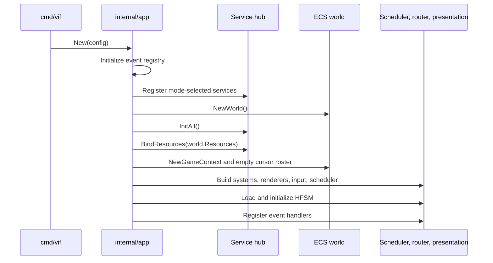
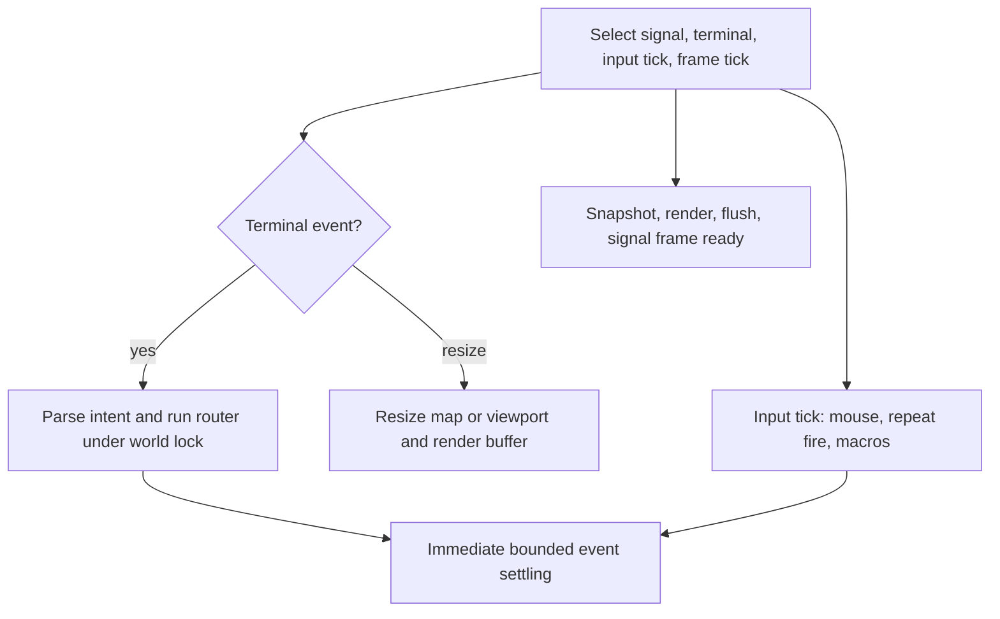
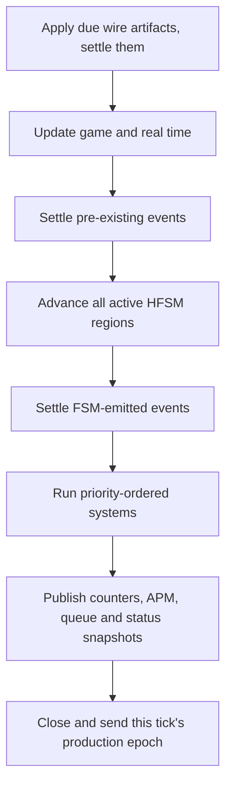

# Runtime, Scheduling, and Concurrency

This document describes all three application runtime shapes and the
synchronization contract that makes the ECS safe. For the data structures
operated on by the runtime, see [ECS and events](ecs-and-events.md).

## 1. Process modes

`app.Mode` chooses which services, clock, and goroutines an `App` owns:

| Mode | Presents | Driven | Geometry/input owner | Audio | Execution |
|---|---:|---:|---|---:|---|
| `ModePlay` | Yes | No | terminal / terminal | Yes | `PausableClock`; scheduler and event goroutines |
| `ModeHeadless` | No | Yes | caller / caller | No | `ManualClock`; caller invokes `App.Tick` and `App.Inject` |
| `ModeReplay` | Yes | Yes | journal / playback controls | Yes | `ManualClock`; `ReplayDriver` invokes ticks and injections |

The five predicates in `internal/app/config.go` are the policy boundary:
`Presents`, `Driven`, `OwnsGeometry`, `OwnsInput`, and `Audio`. Assembly checks
them rather than scattering mode comparisons through the runtime. A driven
config defaults to terminal-equivalent geometry 80x24 when dimensions are not
supplied, rejects a simulation speed setting because only `Tick` advances its
clock, and rejects I/O settings the selected mode cannot honor.

`cmd/vif` normally constructs `ModePlay`; `-replay <file>` constructs a replay
from the journal anchor. `-check` and `-schema` are non-runtime tool paths:

| Tool path | Entry | Terminal initialized? | Result |
|---|---|---:|---|
| Validate | `app.Check` | No | Resolve and load FSM plus corpus; print accepted/rejected sources. |
| Export schema | `app.Schema` | No | Emit schema version 1 JSON for events, fields, actions, guards, operators, and config fields. |

Diagnostics are configured before the terminal enters its alternate screen so
startup failures and runtime reports remain recoverable.

## 2. Composition sequence

`-join` adds a pre-composition step: `Run` dials, receives the host's
`JournalAnchor`, validates/adopts its seed and configuration identity, and only
then calls `New`. `-host` composes first so its acceptor can snapshot the live
tick-zero anchor. After service start, both roles complete the start/ready gate
before the first frame token releases the scheduler.

The detailed construction order is significant:

1. Validate the application config and configure any embedder-provided log
   scope.
2. Initialize the generated event registry. FSM trigger resolution and
   `:emit` reflection depend on it.
3. Register services selected by the mode: content always; terminal for
   presenting modes; audio for play/replay; network for play in `RoleNone`,
   `RoleHost`, or `RolePeer` according to startup configuration.
4. Create an empty world and initialize services in deterministic topological
   order.
5. Let initialized services contribute typed resources to the world.
6. Resolve geometry from the terminal or config and create `GameContext`, which
   initializes the status registry, map/camera config, selected clock, event
   queue, game state, transient state, empty player roster, and target resource.
7. Publish corpus telemetry now that the status registry exists.
8. Construct systems from the generated manifest. `World.AddSystem` sorts them
   by priority and preserves manifest order for equal priorities.
9. For a presenting mode, construct and priority-sort renderers.
10. Create the input parser and mode router for semantic injection in every
    mode; merge the live keymap and bind terminal mouse control only when the
    terminal owns simulation input.
11. Create frame synchronization channels and the clock scheduler.
12. Resolve and load the external or embedded FSM, initialize its regions,
    enqueue their entry actions (including the shipped cursor spawn request),
    and apply global/region system toggles.
13. Register the event-only `MetaSystem`, then every constructed system that
    implements `event.Handler`.

If any step fails, `App.New` calls `Close` on the partially built application.
Services therefore must make `Stop` idempotent and able to release resources
acquired by `Init` even when `Start` was never reached.

## 3. Runtime clocks and cadence

Play mode has separate cadences rather than treating a rendered frame as the
only clock.

| Path | Default interval | Owner | Purpose |
|---|---:|---|---|
| Render frame | 16 ms | main goroutine | Snapshot frame state, render, flush, and release the next simulation tick. |
| Input tick | 16 ms | main goroutine | Reconcile terminal mouse mode, repeat held/automatic fire, and advance macros. |
| Simulation tick | 50 ms | scheduler goroutine | Advance pause-aware game time, FSM, systems, APM, and telemetry. |
| Event attempt | 4 ms | event goroutine | Settle queued events between simulation ticks, including while paused. |
| Audio buffer | 50 ms | audio mixer goroutine | Drain audio commands, synthesize/mix the next PCM buffer, and write it. |

The simulation is fixed-step but frame-gated. The main loop primes one
`frameReady` token. After a simulation update signals `updateDone`, the next
render completes and then returns another token. The scheduler also has a
bounded timeout while waiting, so a missed render token does not block forever.
This limits the simulation to one outstanding update and prevents rendering a
world that is being advanced concurrently.

Headless and replay modes replace `PausableClock` with `ManualClock`. They do
not call `ClockScheduler.Start`, so there is no scheduler loop, event loop, or
frame gate racing the world lock. `App.Tick(n)` advances the manual instant by
exactly the fixed interval and executes `n` tick bodies on the caller's
goroutine; `App.Settle` drains an injected event group without advancing time.
`Tick` deliberately executes even when operator pause state is true, because
the caller is the clock authority.

For a driven App, the resulting run is a pure function of seed, resolved
config, and injected event groups. Concurrent Apps in one process are still
not fully isolated: the status recorder trigger hook, navigation debug
pointers, help key table, and vlog correlation stamp are package/process-wide.
They do not enter a simulation snapshot, but harnesses should run Apps
sequentially unless those observer surfaces are deliberately coordinated.

## 4. Play and playback loops

### Interactive play

Terminal key and mouse events flow through the input machine. A complete intent
is handled under `World.RunSafe`; afterward the scheduler immediately settles
events so the next frame can see its effects. A resize updates the main-loop
dimensions, then modifies map/viewport state under the world lock and resizes
the render buffer.

The input ticker is independent of rendering so held-button fire and macro
playback have stable cadence even when frames fluctuate. Macro intents re-enter
the same locked `handleIntent` path as physical input.

For a render frame, the application:

1. increments and publishes the frame counter;
2. under the world lock, copies `TimeResource`, local-cursor position, map,
   viewport, and camera data into a value `RenderContext`;
3. while paused, updates real time so pause visuals continue animating;
4. invokes the orchestrator, which separately locks the world while concrete
   renderers read components;
5. flushes terminal cells outside the world lock;
6. when the previous simulation update is complete and the game remains
   unpaused, sends a non-blocking `frameReady` token.

### Replay playback

`app.PlayJournal` loads journal records, rebuilds config and geometry from the
first anchor, verifies the resolved config/corpus fingerprint, and drives a
`ModeReplay` App with `ReplayDriver`. Terminal input never enters the keymap or
mode router. These viewer keys are fixed:

The reader API accepts several files and sorts/deduplicates them by `jseq`, so
a rotated set can be reassembled. The current `cmd/vif -replay <file>` surface
passes one path. A set whose first anchor says `StartRun != 0` or
`StartTick != 0` is refused by `ConfigFromAnchor`: input records alone cannot
reconstruct the missing initial world without a world snapshot.

| Key | Playback action |
|---|---|
| `SPACE` | Pause/resume. |
| `.` | Advance one tick while paused. |
| `+` / `-` | Move the viewer rate up/down the rational scale ladder. |
| `h j k l` | Pan presentation left/down/up/right by four cells. |
| `0` | Reset pan. |
| `q` | Quit. |

Terminal resize changes presentation only; the simulation retains recorded
geometry. Playback pacing converts the recorded tick interval and recorded
speed to wall time, then applies the viewer's relative speed. Audio is enabled
and starts unmuted because journal anchors do not carry the original mute
state.

The current render buffer is terminal-sized. If a recording is wider than the
viewer terminal, content outside that buffer is clipped before pan is applied;
pan can move toward the recorded area but cannot recover cells that were never
rendered into the buffer. A windowed composite is the planned seam.

## 5. Simulation tick steps

`ClockScheduler.processTick` holds the world lock for steps 1–9:

1. apply the wire artifacts whose fixed playout deadline has arrived and, if any
   did, settle them in their own `"wire"` group — before the tick stamp advances,
   so both copies of a crossing land at the same absolute tick (see the domain
   model, §6). With no live peer this step returns zero and creates no group;
2. open the next journal tick stamp, then update pause-aware `GameTime`,
   `RealTime`, and fixed `DeltaTime`;
3. update elapsed-time status;
4. consume/dispatch events accumulated before the tick until the queue is empty
   or the settling cap is reached;
5. advance the FSM by the fixed interval, then publish foreground telemetry and
   one metric set per declared region;
6. settle events emitted by state transitions and actions;
7. run all systems sequentially against that settled state;
8. snapshot position-derived entity counts before unlocking;
9. close this tick's production epoch and hand it to the transport, so a peer
   receives one tick's artifacts as one tick's worth.

Step 8 is inside the critical section deliberately: `Position` has no internal
lock, so counting entities after unlocking would race removals on the
event-loop and main goroutines.

After the lock is released, the scheduler uses only atomic or internally
synchronized paths to increment tick count, roll APM windows, publish entity
and event counters, report queue overflow, sample the flight recorder,
optionally emit a grouped status snapshot, and drain any pending recorder
flush request.

That tail is not a barrier. Because the lock is already released, the event
loop, input path and render goroutine can commit between step 8 and the
sample, so a status snapshot or recorder window is stamped with tick *n* but
reads "at or after tick *n*" for anything not written inside the locked body.
See [Logging and diagnostics](logging-and-diagnostics.md) §6.

`ClockScheduler.Prepare`, reached from `Start` or the first driven operation,
calls `Registry.Freeze` immediately after `World.Seal`. Both close a
registration surface before any tick reads it:
`Seal` freezes the system list, `Freeze` freezes the metric set and lays out
the recorder ring.

Systems may emit events during `Update`. Those events are normally handled by
the inter-tick event loop before the next frame; if contention delays that loop,
the next tick's initial settling is the fallback.

Each completed event-settle group advances the journal `boundary` counter.
This preserves distinctions between separately injected groups whose system
events would be ordered differently if merged. See
[Logging and diagnostics](logging-and-diagnostics.md) for the complete journal
stamp lattice.

## 6. Event-loop concurrency

The queue accepts multiple producers, but `Consume` is a single-consumer
operation. The world lock is therefore both an ECS lock and the consumer token.
No path may consume the event queue without holding it.

This goroutine exists only in `ModePlay`. Driven Apps use `Tick` and `Settle`
on the caller goroutine and therefore do not need the `TryLock` backoff path.

On each event-loop interval:

- an empty approximate queue length avoids lock contention;
- `World.TryLock` handles short idle windows cheaply;
- a miss increments backoff telemetry;
- after a configured number of misses, the event loop takes a blocking lock to
  guarantee progress after a long tick or render pass;
- one consume/dispatch pass runs, then the lock is released.

Each dispatched event goes to the HFSM first and then to registered handlers in
registration order. The FSM's answer — whether any active region consumed the
event — is recorded in the pass summary, so a system-handler count of zero is
no longer ambiguous.
A handler may enqueue another event; bounded settling loops repeat consume 
passes up to `EventLoopIterations` (currently 16) for immediate paths.
The queue capacity is 2,048. Producers that overrun it evict the oldest
unread events and increment a monotonic dropped counter; this represents real
state loss and is logged when observed.

## 7. Lock and ownership matrix

| State | Synchronization owner | Allowed access |
|---|---|---|
| Entity IDs, component stores, component masks, positions, spatial grid, map/camera mutation | `World.updateMutex` | Tick, event dispatch, input/router, reset, and renderers while holding the same lock. |
| Event queue writes | Lock-free MPSC producer protocol | Any producer; payload lifetime rules still apply. |
| Event queue consume | World lock as single-consumer token | Scheduler tick, event loop, immediate dispatch, or reset only. |
| System list | Single-threaded construction, then `World.Seal` | Read-only after scheduler start. |
| Render buffer | Render orchestrator | Main/render path only; cleared and reused per frame. |
| Context flags/counters | Atomics | Cross-goroutine reads for pause, macros, mouse, auto-fire, frame/status strings. |
| APM history | `GameState.mu` plus atomic published totals | Scheduler rolls history; router atomically admits weighted actions. |
| Target groups | `TargetResource` RW lock | Navigation writes; species/genetic code reads snapshots. |
| Status metric values | Per-value atomics; set closed by `Registry.Freeze` | Systems cache pointers during construction; snapshots and the recorder load atomically off the world lock. |
| Audio sequencer, voices, active effects | Mixer-goroutine confinement | Other goroutines send bounded commands or read atomic mirrors. |
| Service registry/lifecycle | `service.Hub.mu` | Composition/start/stop paths only. |
| Network inbound buffer | Bounded channel | Transport callbacks push without blocking; active `NetworkSystem` sessions drain at the tick poll boundary. |

### Non-reentrant router rule

`App.handleIntent` acquires the world lock before calling
`mode.Router.Handle`. Nothing reachable from the router may call
`World.RunSafe`, `World.Lock`, or another lock wrapper for the same mutex. The
router can directly access stores because its caller already provides the
critical section.

### Operator commands hold the lock

`App.handleIntent` runs command mode under the world lock, so a command that
performs I/O stalls the tick, the event loop and rendering for its duration.
Two do: `:log on` opens the session file, and `:d save` opens a second logger,
fills it, drains it and closes it, bounded by a 3 s drain timeout. Both are
deliberate operator costs and neither is reachable from gameplay input.
`:log off` and `:log rec flush` are explicitly not in this class — the first
detaches the sink and drains on another goroutine, the second only sets a flag
the tick goroutine reads.

### Pointer and slice lifetime rules

Sparse-set `GetPtr` pointers and dense entity slices are live views. Structural
store changes can invalidate pointers or reorder swap-removed entries. They must
not escape the world-locked operation that obtained them unless a component's
API explicitly guarantees otherwise. Similarly, pooled event payloads and
scratch slices must not be retained by asynchronous logging or later work;
logging call sites pass primitive values or copies.

## 8. Pause semantics

Pause freezes simulation ticks through `PausableClock` and the scheduler's
pause gate. It does not freeze the whole process:

- terminal input and signals still arrive;
- the event loop still dispatches queued events;
- the pause/overlay frame still renders using wall-clock time;
- mouse reporting state can still be reconciled;
- gameplay pointer input, auto-fire, and macros are withheld while input is
  suspended;
- `AudioSystem` propagates pause to the mixer, which fades the audio path.

`MetaSystem` is the single owner that keeps pause flag, clock, and pause-change
events aligned.

In a driven App, pause remains observable/operator state but never revokes the
caller's authority: `App.Tick` uses the stepped tick path and still advances.

## 9. Time control

`TimeScale` is an exact rational `Num/Den`, not a float. Operator-visible rates
are the fixed ladder `1/8`, `1/4`, `1/2`, `1`, `2`, `4`, `8`; `+` and `-` step
along it and clamp at the ends. `PausableClock` re-anchors game time on a rate
change, so there is no time jump or catch-up burst. Above 1x the scheduler
skips render backpressure so the world can outrun the display.

`-speed <rate>` sets the initial play-mode rate. Runtime commands are:

| Command | Effect |
|---|---|
| `:speed` | Report the current rate. |
| `:speed <rate>` | Select one ladder rate. |
| `:speed +`, `-`, `reset` | Step faster/slower or restore 1x. |
| `:step [n]` | Pause and grant one or `n` complete ticks, capped at 10,000. |
| `:step [rate] fsm [region] [pause]` | Run until the next matching region transition. |
| `:step [rate] ev <Event> [pause]` | Run until the named event is dispatched. |
| `:step off` | Disarm and restore 1x. |

A run-until request stores the pre-request rate in `BreakState.Restore`, switches
to the optional run rate, and trips exactly once. The `pause` suffix pauses at
the match; without it, the previous rate is restored and execution continues.
FSM and event modes are probed at the transition and dispatch sites rather than
by polling telemetry. `Expiry` self-disarms a request after 20,000 game ticks
so a misspelled assumption cannot run forever; a hit or expiry triggers a
`break` flight-recorder flush. Reset cancels tick allowances and run-until
requests because their region/event context was destroyed, while the ordinary
rate remains operator-owned.

These controls are operator pacing under `ModePlay`. Replay records and
reinjects their events, but its manual clock advances only under
`ReplayDriver`; viewer `+`/`-` controls presentation pacing instead.

## 10. Reset and operator state

A `:new` command emits `EventGameResetRequest` and requests scheduler reset
without reconstructing the process. `MetaSystem` first pauses audio/time,
clears entities, the cursor roster, and `GameState`, advances the journal run
while rebasing its tick to zero, restores viewport-sized map/camera/mode state,
and cancels pending step controls. The reset FSM entry actions subsequently
request replacement cursors. The scheduler serializes these phases with the
world lock:

1. drain and discard stale queued events;
2. reset deadlines and elapsed-time anchors;
3. reset all initially configured HFSM regions, variables, and delayed actions;
4. reapply global and active-region system toggles;
5. enqueue an unpause request and settle reset/unpause events;
6. advance the RNG session and emit a fresh journal anchor.

Simulation state is rebuilt; operator state describes how that simulation is
being driven or observed and survives plain `:new`. Its explicit contract is:

- free-mouse and auto-fire preferences;
- the current time scale;
- debug HUD visibility and pinned overlay cards.

Both `:new` and `:new!` clear recorded/playing macros, close overlays, return to
Normal mode, and clear command/search/status text. `:new!` additionally purges
the operator contract: free mouse and auto-fire become off, speed returns to
1x, and the debug HUD/pins are cleared. Logging target, level, scope, snapshot
period, and recorder depth are process diagnostics and are never part of this
purge.

Other session-observer fields have explicit behavior rather than belonging to
that purge list: the render frame remains monotonic, reset ends paused state,
and the terminal-wide `MouseDisabled` flag currently survives both reset
forms. The full `session` snapshot record reports these values even though
replay comparison omits the record.

The genetic registry is not recreated. Its reset drops proposals and in-flight
evaluations but retains scored archives, so evolution continues across `:new`
within the process.

### Replay comparison boundary

`App.Snapshot` includes the full observer surface. Replay verification uses
`App.SnapshotSimulation`, which drops the `session` context record and the
exact `denySim` keys in `internal/app/snapshot.go`:

| Surface | Excluded keys |
|---|---|
| Operator time control | `engine.paused`, `engine.speed`, `engine.speed_pct`, `engine.step`, `engine.breakpoint` |
| Presentation | `engine.fps`, `context.frame` |
| Live contention | `event.backoffs` |
| Recorder bookkeeping | `rec.depth`, `rec.flushes`, `rec.records`, `rec.skipped` |
| Snapshot bookkeeping | `stat.late`, `stat.groups`, `stat.metrics` |

`engine.fps` is meaningless under a manual clock; the other entries describe
pacing, contention, or telemetry rather than world behavior. The deny-list
uses exact keys, not whole prefixes, because the same metric groups also
contain simulation counters that must still compare.

## 11. Shutdown and failure handling

Normal shutdown is triggered by quit intent, terminal close/error, or an OS
signal. `App.Close` stops the scheduler before stopping services so no tick can
use an I/O resource after it is released. The hub stops every initialized
service in reverse dependency order.

Crash handling is designed around terminal restoration:

- scheduler and logger goroutines are launched through `core.Go`, which routes
  panics to the central crash handler;
- the terminal polling goroutine has its own emergency reset because it owns a
  particularly sensitive raw-mode boundary;
- the optional logger receives a crash record and bounded flush opportunity;
- race/fatal/panic text written to stderr can be redirected and drained into
  structured diagnostics on supported native builds;
- terminal finalization is unconditional if terminal initialization succeeded,
  even when service startup did not.

The audio engine bounds its wait for a blocked backend writer so shutdown does
not indefinitely leave the terminal in raw mode.

## 12. Source map

| Concern | Primary source |
|---|---|
| Runtime modes and composition | `internal/app/config.go`, `app.go`, `headless.go` |
| Interactive and playback loops | `internal/app/loop.go`, `play.go` |
| Replay driver and comparison boundary | `internal/app/replay.go`, `snapshot.go` |
| Tick and event scheduling | `internal/engine/clock_scheduler.go` |
| World locking and system execution | `internal/engine/world.go`, `sync_*.go` |
| Play/manual clocks and time control | `internal/engine/pausable_clock.go`, `manual_clock.go`, `time_control.go` |
| Game context, reset flags, and snapshots | `internal/engine/game_context.go`, `game_state.go`, `snapshot.go` |
| Event queue and routing | `internal/event/queue.go`, `router.go` |
| Pause/reset owner | `internal/system/meta.go` |
| Service teardown | `internal/service/hub.go`, `adapter_terminal.go`, `adapter_audio.go` |
