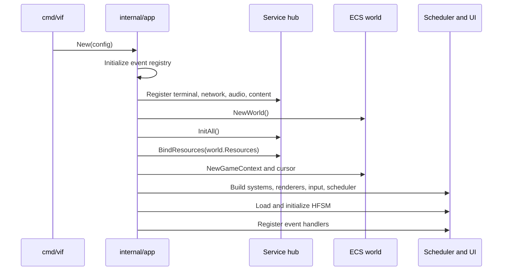
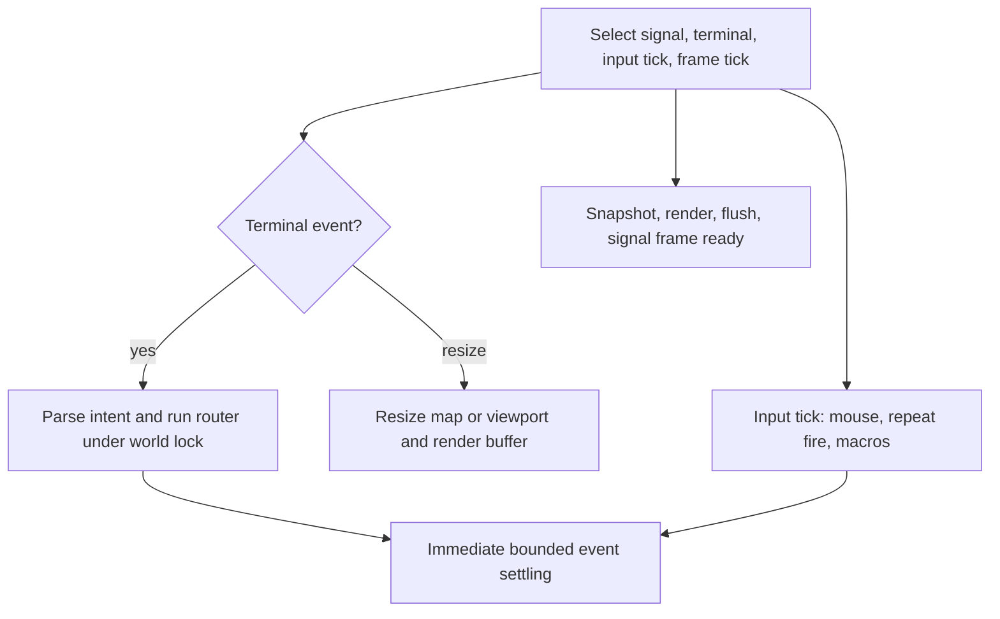
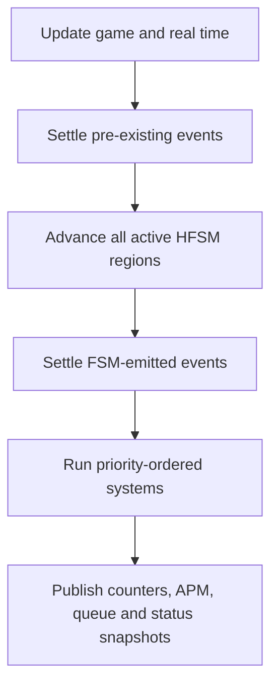

# Runtime, Scheduling, and Concurrency

This document describes the lifetime of a normal `cmd/vif` process and the
synchronization contract that makes the ECS safe. For the data structures
operated on by the runtime, see [ECS and events](ecs-and-events.md).

## 1. Process modes

`cmd/vif` parses flags, configures diagnostics, and selects one of three paths:

| Mode | Entry | Terminal initialized? | Result |
|---|---|---:|---|
| Run game | `app.Run` | Yes | Compose the application, run until quit/signal, then stop it. |
| Validate | `-check`, `app.Check` | No | Resolve and load FSM plus corpus; print accepted/rejected sources. |
| Export schema | `-schema`, `app.Schema` | No | Emit schema version 1 JSON for events, fields, actions, guards, operators, and config fields. |

Diagnostics are configured before the terminal enters its alternate screen so
startup failures and runtime reports remain recoverable.

## 2. Composition sequence

The detailed construction order is significant:

1. Validate the application config and configure any embedder-provided log
   scope.
2. Initialize the generated event registry. FSM trigger resolution and
   `:emit` reflection depend on it.
3. Register terminal, disabled-by-default network, audio, and resolved content
   services.
4. Create an empty world and initialize services in deterministic topological
   order.
5. Let initialized services contribute typed resources to the world.
6. Obtain terminal dimensions and create `GameContext`, which initializes the
   status registry, map/camera config, clocks, event queue, game state,
   transient state, player cursor, and target resource.
7. Publish corpus telemetry now that the status registry exists.
8. Construct systems from the generated manifest. `World.AddSystem` sorts them
   by priority and preserves manifest order for equal priorities.
9. Construct and priority-sort renderers.
10. Create the input parser, merge any keymap, create the mode router, and bind
    the router's mouse-mode callback to the terminal.
11. Create frame synchronization channels and the clock scheduler.
12. Resolve and load the external or embedded FSM, initialize its regions, and
    apply global/region system toggles.
13. Register the event-only `MetaSystem`, then every constructed system that
    implements `event.Handler`.

If any step fails, `App.New` calls `Close` on the partially built application.
Services therefore must make `Stop` idempotent and able to release resources
acquired by `Init` even when `Start` was never reached.

## 3. Runtime clocks and cadence

The runtime has separate cadences rather than treating a rendered frame as the
only clock.

| Path | Default interval | Owner | Purpose |
|---|---:|---|---|
| Render frame | 16 ms | main goroutine | Snapshot frame state, render, flush, and release the next simulation tick. |
| Input tick | 16 ms | main goroutine | Reconcile terminal mouse mode, repeat held/automatic fire, and advance macros. |
| Simulation tick | 50 ms | scheduler goroutine | Advance pause-aware game time, FSM, systems, APM, and telemetry. |
| Event attempt | 4 ms | event goroutine | Settle queued events between simulation ticks, including while paused. |
| Audio buffer | 50 ms | audio mixer goroutine | Drain audio commands, synthesize/mix the next PCM buffer, and write it. |

The simulation is fixed-step but frame-gated. The main loop primes one
`frameReady` token. After a simulation update signals `updateDone`, the next
render completes and then returns another token. The scheduler also has a
bounded timeout while waiting, so a missed render token does not block forever.
This limits the simulation to one outstanding update and prevents rendering a
world that is being advanced concurrently.

## 4. Main-loop behavior

Terminal key and mouse events flow through the input machine. A complete intent
is handled under `World.RunSafe`; afterward the scheduler immediately settles
events so the next frame can see its effects. A resize updates the main-loop
dimensions, then modifies map/viewport state under the world lock and resizes
the render buffer.

The input ticker is independent of rendering so held-button fire and macro
playback have stable cadence even when frames fluctuate. Macro intents re-enter
the same locked `handleIntent` path as physical input.

For a render frame, the application:

1. increments and publishes the frame counter;
2. under the world lock, copies `TimeResource`, cursor position, map, viewport,
   and camera data into a value `RenderContext`;
3. while paused, updates real time so pause visuals continue animating;
4. invokes the orchestrator, which separately locks the world while concrete
   renderers read components;
5. flushes terminal cells outside the world lock;
6. when the previous simulation update is complete and the game remains
   unpaused, sends a non-blocking `frameReady` token.

## 5. Simulation tick phases

`ClockScheduler.processTick` holds the world lock for phases 1–7:

1. update pause-aware `GameTime`, wall-clock `RealTime`, and fixed `DeltaTime`;
2. update elapsed-time status;
3. consume/dispatch events accumulated before the tick until the queue is empty
   or the settling cap is reached;
4. advance the FSM by the fixed interval, then publish foreground telemetry and
   one metric set per declared region;
5. settle events emitted by state transitions and actions;
6. run all systems sequentially against that settled state;
7. snapshot position-derived entity counts before unlocking.

Phase 7 is inside the critical section deliberately: `Position` has no internal
lock, so counting entities after unlocking would race removals on the
event-loop and main goroutines.

After the lock is released, the scheduler uses only atomic or internally
synchronized paths to increment tick count, roll APM windows, publish entity
and event counters, report queue overflow, sample the flight recorder,
optionally emit a grouped status snapshot, and drain any pending recorder
flush request.

That tail is not a barrier. Because the lock is already released, the event
loop, input path and render goroutine can commit between phase 7 and the
sample, so a status snapshot or recorder window is stamped with tick *n* but
reads "at or after tick *n*" for anything not written inside the locked body.
See [Logging and diagnostics](logging-and-diagnostics.md) §6.

`ClockScheduler.Start` calls `Registry.Freeze` immediately after `World.Seal`.
Both close a registration surface before the goroutines that read it start:
`Seal` freezes the system list, `Freeze` freezes the metric set and lays out
the recorder ring.

Systems may emit events during `Update`. Those events are normally handled by
the inter-tick event loop before the next frame; if contention delays that loop,
the next tick's initial settling is the fallback.

## 6. Event-loop concurrency

The queue accepts multiple producers, but `Consume` is a single-consumer
operation. The world lock is therefore both an ECS lock and the consumer token.
No path may consume the event queue without holding it.

On each event-loop interval:

- an empty approximate queue length avoids lock contention;
- `World.TryLock` handles short idle windows cheaply;
- a miss increments backoff telemetry;
- after a configured number of misses, the event loop takes a blocking lock to
  guarantee progress after a long tick or render pass;
- one consume/dispatch pass runs, then the lock is released.

Each dispatched event goes to the HFSM first and then to registered handlers in
registration order. The FSM's answer — whether any active region consumed the
event — is recorded in the pass summary, so a system-handler count of zero is
no longer ambiguous.
A handler may enqueue another event; bounded settling loops repeat consume 
passes up to `EventLoopIterations` (currently 16) for immediate paths.
The queue capacity is 2,048. Producers that overrun it evict the oldest
unread events and increment a monotonic dropped counter; this represents real
state loss and is logged when observed.

## 7. Lock and ownership matrix

| State | Synchronization owner | Allowed access |
|---|---|---|
| Entity IDs, component stores, component masks, positions, spatial grid, map/camera mutation | `World.updateMutex` | Tick, event dispatch, input/router, reset, and renderers while holding the same lock. |
| Event queue writes | Lock-free MPSC producer protocol | Any producer; payload lifetime rules still apply. |
| Event queue consume | World lock as single-consumer token | Scheduler tick, event loop, immediate dispatch, or reset only. |
| System list | Single-threaded construction, then `World.Seal` | Read-only after scheduler start. |
| Render buffer | Render orchestrator | Main/render path only; cleared and reused per frame. |
| Context flags/counters | Atomics | Cross-goroutine reads for pause, macros, mouse, auto-fire, frame/status strings. |
| APM history | `GameState.mu` plus atomic published totals | Scheduler rolls history; router atomically admits weighted actions. |
| Target groups | `TargetResource` RW lock | Navigation writes; species/genetic code reads snapshots. |
| Status metric values | Per-value atomics; set closed by `Registry.Freeze` | Systems cache pointers during construction; snapshots and the recorder load atomically off the world lock. |
| Audio sequencer, voices, active effects | Mixer-goroutine confinement | Other goroutines send bounded commands or read atomic mirrors. |
| Service registry/lifecycle | `service.Hub.mu` | Composition/start/stop paths only. |
| Network inbound buffer | Bounded channel | Transport callbacks push without blocking; a future active `NetworkSystem` drains on tick. |

### Non-reentrant router rule

`App.handleIntent` acquires the world lock before calling
`mode.Router.Handle`. Nothing reachable from the router may call
`World.RunSafe`, `World.Lock`, or another lock wrapper for the same mutex. The
router can directly access stores because its caller already provides the
critical section.

### Operator commands hold the lock

`App.handleIntent` runs command mode under the world lock, so a command that
performs I/O stalls the tick, the event loop and rendering for its duration.
Two do: `:log on` opens the session file, and `:d save` opens a second logger,
fills it, drains it and closes it, bounded by a 3 s drain timeout. Both are
deliberate operator costs and neither is reachable from gameplay input.
`:log off` and `:log rec flush` are explicitly not in this class — the first
detaches the sink and drains on another goroutine, the second only sets a flag
the tick goroutine reads.

### Pointer and slice lifetime rules

Sparse-set `GetPtr` pointers and dense entity slices are live views. Structural
store changes can invalidate pointers or reorder swap-removed entries. They must
not escape the world-locked operation that obtained them unless a component's
API explicitly guarantees otherwise. Similarly, pooled event payloads and
scratch slices must not be retained by asynchronous logging or later work;
logging call sites pass primitive values or copies.

## 8. Pause semantics

Pause freezes simulation ticks through `PausableClock` and the scheduler's
pause gate. It does not freeze the whole process:

- terminal input and signals still arrive;
- the event loop still dispatches queued events;
- the pause/overlay frame still renders using wall-clock time;
- mouse reporting state can still be reconciled;
- gameplay pointer input, auto-fire, and macros are withheld while input is
  suspended;
- `AudioSystem` propagates pause to the mixer, which fades the audio path.

`MetaSystem` is the single owner that keeps pause flag, clock, and pause-change
events aligned.

## 9. Reset semantics

A `:new` command emits `EventGameResetRequest` and requests scheduler reset without
reconstructing the process. Reset is serialized with the same world lock:

1. advance the diagnostic run correlation ID;
2. drain and discard stale queued events;
3. reset scheduler deadlines and elapsed-time anchors;
4. reset all initially configured HFSM regions, variables, and delayed actions;
5. reapply global and active-region system toggles;
6. enqueue an unpause request;
7. settle reset/unpause events before releasing the lock.

Systems that handle `EventGameResetRequest` reinitialize their session state.
`MetaSystem` performs the world-level entity/resource cleanup, while user-owned
session preferences such as mouse free mode and auto-fire are intentionally
stored in context flags rather than reconstructed. The mode router observes a
flag to clear recorded/playing macros.

The genetic registry is not recreated. Its reset drops proposals and in-flight
evaluations but retains scored archives, so evolution continues across `:new`
within the process.

## 10. Shutdown and failure handling

Normal shutdown is triggered by quit intent, terminal close/error, or an OS
signal. `App.Close` stops the scheduler before stopping services so no tick can
use an I/O resource after it is released. The hub stops every initialized
service in reverse dependency order.

Crash handling is designed around terminal restoration:

- scheduler and logger goroutines are launched through `core.Go`, which routes
  panics to the central crash handler;
- the terminal polling goroutine has its own emergency reset because it owns a
  particularly sensitive raw-mode boundary;
- the optional logger receives a crash record and bounded flush opportunity;
- race/fatal/panic text written to stderr can be redirected and drained into
  structured diagnostics on supported native builds;
- terminal finalization is unconditional if terminal initialization succeeded,
  even when service startup did not.

The audio engine bounds its wait for a blocked backend writer so shutdown does
not indefinitely leave the terminal in raw mode.

## 11. Source map

| Concern | Primary source |
|---|---|
| Application composition | `internal/app/app.go`, `config.go`, `path.go` |
| Main input/render loop | `internal/app/loop.go` |
| Tick and event scheduling | `internal/engine/clock_scheduler.go` |
| World locking and system execution | `internal/engine/world.go`, `sync_*.go` |
| Pause-aware clocks and time resource | `internal/engine/pausable_clock.go`, `resource.go` |
| Game context, reset flags, and snapshots | `internal/engine/game_context.go`, `game_state.go`, `snapshot.go` |
| Event queue and routing | `internal/event/queue.go`, `router.go` |
| Pause/reset owner | `internal/system/meta.go` |
| Service teardown | `internal/service/hub.go`, `adapter_terminal.go`, `adapter_audio.go` |
