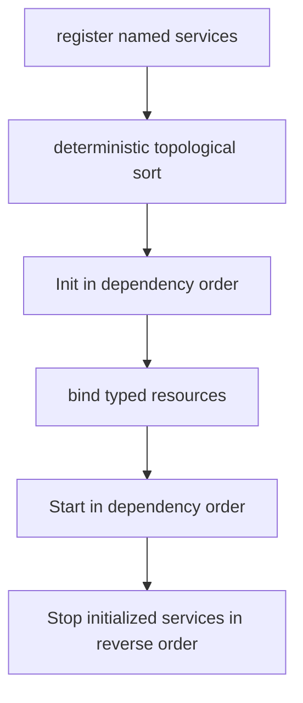
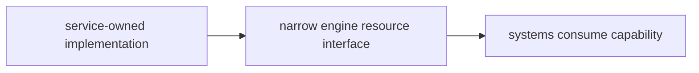
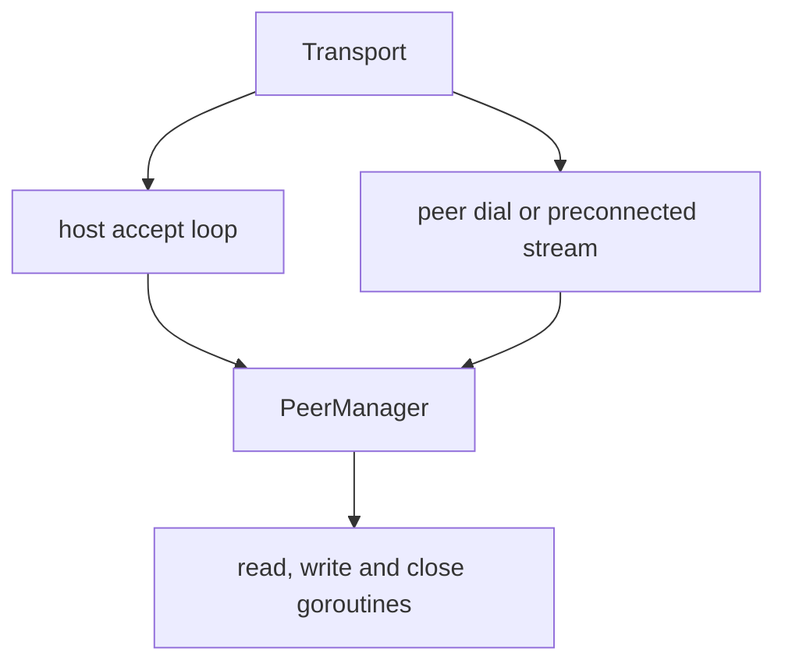

# Services and Networking

Services own process/host resources whose lifecycle differs from ECS systems:
terminal raw mode, audio output, the immutable content corpus, and an optional
network transport. Networking is assembled for a trusted-peer session of up to
`parameter.MaxPlayers` participants; a normal run still contributes no active
network capability. The current failure model and recovery alternatives are
analysed in [Desynchronisation and recovery](desync.md).

## 1. Service lifecycle contract

```go
type Service interface {
    Name() string
    Dependencies() []string
    Init() error
    Start() error
    Stop() error
}
```

| Phase | Contract |
|---|---|
| Registration | Single-threaded composition; names must be unique. |
| `Init` | Acquire/configure resources but do not start background goroutines. |
| Resource binding | Optional `Contribute(*engine.Resource)` exposes a typed capability after every service initialized. |
| `Start` | Begin goroutines/process work after the whole application is assembled. |
| `Stop` | Idempotently stop work and release both Init- and Start-acquired resources. |

The separation prevents a service goroutine from observing a half-constructed
world. `Hub.StartAll` runs before the scheduler, input, and render loops; reverse
shutdown completes before process exit.

## 2. Dependency ordering and rollback



The hub delegates to `core.TopoSort`, the same Kahn implementation the system
dependency graph resolves with. Names and dependent lists are sorted so
unrelated siblings have deterministic order; service init order feeds RNG
seeding, so it must not vary between runs. Missing dependencies and cycles are
startup errors, and the resolver reports them as typed errors the hub renders
in service terms.

If `Init` fails, already initialized services are stopped in reverse order. If
`Start` fails, already started services are rolled back; the app's final close
then stops the initialized superset. Normal `StopAll` visits every initialized
service in reverse order and logs individual errors without preventing later
cleanup.

All current services declare no dependency, so the registered subset initializes
alphabetically. The dependency mechanism exists for future capabilities that
actually require another service; do not invent dependencies merely to choose
an arbitrary order.

## 3. Current service inventory

| Service | `Init` | `Start` | Resource contribution |
|---|---|---|---|
| `terminal` | Construct terminal, enter raw/alternate-screen state, detect/force color mode. | Start blocking poll loop. | Exposed directly to app/render/input rather than as an ECS resource. |
| `content` | Resolve, load, sanitize, and freeze corpus/cursor. | No-op. | `ContentResource.Provider`. |
| `audio` | Build engine/config and load optional documents. | Freeze/register sounds, probe backend, start mixer/supervisor. | `AudioResource.Engine` when available. |
| `network` | If enabled, build transport/handlers. | Listen or connect. | `NetworkResource.Port`; absent in default disabled role. |

Assembly is mode-dependent:

| App mode | Registered services |
|---|---|
| `ModePlay` | terminal, content, audio, and network; `RoleNone` normally, `RoleHost`/`RolePeer` with startup flags |
| `ModeHeadless` | content only for ordinary harnesses; `app.RunScript` additionally registers `RoleHost`/`RolePeer` network when a startup flag is present |
| `ModeReplay` | terminal, content, and audio |

The predicates in `internal/app/config.go` are authoritative for terminal and
audio capabilities. Network is role-selected separately: play always constructs
the no-op-capable adapter, while an authored headless script constructs it only
for `-host`/`-join`. Replay input controls playback rather than the mode router,
and its terminal resize affects presentation rather than recorded geometry.

Content and audio details are covered in
[Content, assets, and tools](content-assets-and-tools.md) and
[Audio architecture](audio.md).

## 4. Terminal service

The external `lixenwraith/terminal` module owns OS terminal capabilities. The
adapter in this repository owns application lifecycle:

- `Init` creates the terminal and calls its initialization exactly once;
- `Start` spawns one poll goroutine;
- terminal events enter a buffered 256-element channel;
- Stop closes the loop by posting a synthetic closed event, waits for the
  goroutine, and always finalizes the terminal—even when Init succeeded but
  Start did not;
- a panic in the poll loop performs an emergency terminal reset, flushes stdio,
  prints a stack, and exits to avoid leaving the shell unusable.

The polling channel applies backpressure rather than silently dropping normal
terminal events: if the app stops consuming, the poll loop waits until space or
shutdown. Terminal flush is performed by the render orchestrator outside the
world lock.

## 5. Capability injection

Services do not receive a `World` constructor argument. After `InitAll`, the hub
calls contributors in dependency order and fills only the capability fields
they own. `GameContext` then creates the remaining simulation resources.



This direction prevents the I/O layer from directly mutating component stores.
Content exposes `NextBlock`; audio exposes the audio engine; networking exposes
a `NetworkPort` that drains notifications and sends opaque framed messages.

## 6. Operator session surface

`ModePlay` registers `NetworkService` on every run. With neither startup flag it
uses `RoleNone`, so Init/Start are no-ops and no `NetworkResource` is contributed.
`app.RunScript` can register the same active service without a terminal; ordinary
`NewHeadless` deliberately rejects address flags so no caller can bypass the
start/ready gate. Two flags activate the shared composition path:

| Entry point | Behavior |
|---|---|
| `-host <bind-address>` | Build the host App, start a listener, show or log the lobby, and hold the scheduler at tick zero until the requested peers are ready. |
| `-join <host:port>` | Dial and receive the anchor before App construction, adopt host identity, then take the world and the roster from the start gate. |
| `:host <addr>` | Open a run that is **already playing**. The port is created, started and attached; the world latches as shared (D-14) and the barrier takes ownership of this instance's crossings from that tick. |
| `:session` | Report the role, address, participant identity, peer count and tick. |

The flags and the command reach the same place. `-host` freezes tick zero for a
fixed lobby, which is the right shape when every participant is present before the
run starts; `:host` opens the same acceptor on a run that is hundreds of ticks in.
Both hand a joiner the same thing: the closed roster, then the world that roster
names, as a chunked `MsgStateSnapshot`. A host can be canceled in the lobby with
`Ctrl-C`/`Ctrl-Q`. After a connected peer leaves, the remote cursor is removed and
the survivor continues; the listener stays active and the same participant may
dial again, which is the reconnect path and is not a separate mechanism.

`:host` runs inside `App.handleIntent`'s critical section, because the whole
router path does — so `engine.SessionController`'s methods are the *locked* forms
and `App.BeginHosting` is the wrapper for a caller holding nothing. Getting that
backwards deadlocks the instance at the tick the command lands on, which is what it
did the first time it was wired through a script.

**The join, in order.** The ordering is D-22 and it is not the obvious one:

1. The acceptor allocates an identity and exchanges offer/reply.
2. The stream becomes a **peer** — so this instance's crossings start reaching it.
3. *Then* the world is read, under one acquisition of the world lock, and sent with
   the closed roster.
4. The joiner holds the session traffic that arrives while it reads, installs the
   capture into a staging world, swaps at a tick boundary, hands the held frames to
   its port, and simulates the ticks the transfer cost.
5. It confirms with `MsgReady`, and the coordinator crosses `EventParticipantJoined`
   so every instance creates its cursor at one agreed tick.

Reading the world before admitting the peer would lose every artifact produced in
between — not in the capture, because the capture predates it; not on the wire,
because the participant was not yet a peer. Nothing would detect that.

The join anchor owns the seed, RNG session, tick rate, config, corpus fingerprint
and D-14 map latch. `ConfigForJoin` runs before `New`, so `initWorld` cannot draw a
different seed. The coordinator assigns canonical participant IDs and roster
slots; both instances create the roster in slot order and mark only their own
cursor human-controlled.

The status bar shows `NET:WAIT/LOCK`, `NET:1P/LOCK`, or `NET:DOWN/LOCK`: the
D-14 latch is a property of the run, not of the current peer count, so a session
run keeps it from before its first joiner to after its last one leaves. `OPEN`
belongs to a solo run, which is the only one whose terminal may still crop.
The `network.session` debug card exposes state, peer count, connected state and
map latch separately.

## 7. Transport roles and lifecycle

| Role | Current behavior |
|---|---|
| `RoleNone` | Disabled/no-op. |
| `RoleServer` | Generic TCP/TLS listener. |
| `RoleHost` | Listener with `HostAcceptor`: allocates a participant identity and slot per connection and offers the anchor. `Config.OnAdmit` then runs the mid-run gate on the accept goroutine once the stream is a peer, which serialises joins by construction. |
| `RoleClient` | Generic dialer. |
| `RolePeer` | Dialed/preconnected stream admitted after the join and start gates. |



Host uses `tls.Listen` when a TLS config is supplied programmatically, otherwise
`net.Listen`; peer uses the corresponding dialer. The CLI deliberately supplies
no TLS configuration in this trusted-peer proof. Every admitted stream is keyed
by the coordinator's participant ID rather than accept order. The peer manager
enforces the configured cap and duplicate-ID rejection.

Each peer owns a bounded send queue, exact-frame read loop, encode/flush loop and
close monitor. `Stop` closes the listener and peers and waits for the accept loop;
peer close removes it from the manager and emits one poll notification.

## 8. Wire frame and session messages

Every message begins with a fixed 12-byte big-endian header:

| Byte range | Width | Field |
|---|---:|---|
| 0 | 1 | message type |
| 1 | 1 | flags |
| 2–5 | 4 | sender sequence |
| 6–9 | 4 | latest received sequence/ack |
| 10–11 | 2 | payload length |
| 12 onward | 0–65,535 | payload |

`Encode` completes short writes and `Decode` uses `io.ReadFull` for header and
payload, so a partial stream read never reaches the game. Per-peer send assigns
sequence and ack values at actual write time; broadcast clones a message per peer.
Ack is observational—there is no retransmission policy.

Control messages carry heartbeat, join offer/reply, start/ready gates and
disconnect notices. Gameplay uses `MsgEvent` for a closed crossing
epoch, `MsgStateSync` for one owner-authored cursor snapshot, and
`MsgStateDigest` for the periodic shared-world parity probe. The epoch is JSON
containing journal-registry TOML payloads; representative complete-frame budgets
are pinned by `TestWireEncodingBudget`. The remaining codes in `protocol.go` are
reserved placeholders that nothing sends and `NetworkSystem` counts as drops.
Raw participant input is not among them, and 0x10 stays reserved — a peer sends
the resolved D-3 artifact, never the keystroke that produced it.

`MsgLinkProbe` (0x14) and `MsgLinkEcho` (0x15) are the only round trip this
protocol makes. Everything else is one-directional — what this instance sent, and
how far behind the newest tick it has *heard about* it stands — which is why the
correction cadence had a constant and nothing else to be chosen from before
Phase 5. They are unusual in one way that matters: **neither ever reaches the
game**. `SocketPort` answers a probe from the read goroutine and swallows an echo
there, `MeshPort` does the same inside `Drain`, so what the measurement describes
is the wire rather than how often an instance runs a tick — and no timing value
has to enter the world for the cadence to exist.

| Frame | Bytes | Layout |
|---|---:|---|
| probe | 12 | `[Seq:4][SentNano:8]` |
| echo | 45 | the probe's 12 bytes untouched, then `[InBytes:8]` and a 25-byte `LinkReport` |
| `LinkReport` | 25 | `[Tick:8][LagTicks:4][Magnitude:4][CursorX:4][CursorY:4][Flags:1]` |

The probe's own timestamp comes back untouched, so the round trip is computed
against the clock that started it and neither end has to agree with the other
about what time it is. `InBytes` is what the answering end has received on this
link, which turns two consecutive echoes into a delivery rate and one echo into a
backlog — the difference between a fast link and an idle sender. The `LinkReport`
is the only game state that travels here, it is opaque to the transport, and every
field in it is a scheduling hint: a host may publish to that participant sooner
because of one, and a wrong or stale one costs a correction sent early and nothing
else.

A probe arriving during a join handshake is answered by the gate rather than
refused. A host admits a participant before it reads the world for it (D-22), so
the stream is a peer — and therefore probed — while the gate is still reading;
ignoring the probe would score the whole transfer as loss on the link it is
measuring, which is exactly backwards, since the transfer is the busiest that link
will ever be.

`MsgStateSnapshot` (0x26, the code the retired replay-based join reserved) carries
one chunk of a shared-world capture. It is the only message whose size is a
function of the world rather than of the format — the measured storm high water is
176 KiB against a 65,535-byte frame — so it is the only one that is split. Each
chunk carries a 20-byte header before its payload:

| Byte range | Width | Field |
|---|---:|---|
| 0–7 | 8 | the tick this capture describes |
| 8–11 | 4 | chunk index |
| 12–15 | 4 | chunk count |
| 16–19 | 4 | total body length |

`SnapshotAssembly` admits chunks in order only and refuses a skipped predecessor, a
frame that names a different transfer, a body that overruns its declared length and
a frame shorter than the header. Each of those would otherwise reassemble into a
world that looks installed and is not, which is worse than a refused join. The
gate's `SessionOffer` names `snapshot_tick` and `snapshot_bytes` before the
transfer starts, so a stream that stops halfway is a failed join rather than a
world installed from a prefix.

## 9. Poll boundary and lockstep barrier

Socket goroutines never touch `World`, the event queue or component stores.
`SocketPort` appends `Inbound` notifications to its configured bounded receive
channel (256 by default); a full buffer increments `Dropped` rather than blocking
the socket. `NetworkService` contributes that port through `NetworkResource`.

`NetworkSystem` is manifest-registered with a `dual` profile. At tick open,
`WireSink.Receive` drains notifications and applies scheduled local/peer artifacts;
at tick close, `Flush` sends the closed production epoch. `Cross` withholds the
local artifact so every participant applies it at the same fixed-delay boundary.
The default lead is three 50 ms ticks and never waits for a per-tick round trip.
The barrier is engaged for the life of a session run rather than while a peer is
attached: the tick an artifact applies at is what a replay or a mid-run catch-up
has to reach, and a reproduction holds no link. A journaled crossing is already
stamped past the lead, so a replay republishes it directly; the crossings the
simulation re-derives take the lead as the recorded run took it.
`ActivateSession` closes the lobby-to-first-tick input window before the main loop
reads terminal events. The game clock is frozen before FSM deadlines are created
and released only after the common start gate, so the host's lobby wait cannot age
shared timers before a later-created joiner reaches tick one.

An instance sends only to the peers it is linked to, so an epoch reaches the rest
of the session by being forwarded: each node floods an epoch it has not seen to
every link but the one it arrived on, and the per-source epoch window is what stops
the flood. Because every frame names the absolute tick it applies at, a relayed
artifact still lands on the same tick as the producer's own copy. A roster change
travels the same way, produced only by the coordinator so it has one apply tick.

`MsgStateSync` periodically copies only the D-13 owner-authored cursor set, and is
applied only when the payload's entity and roster slot agree and its sequence is
newer than that slot's last. Disconnect drains through the same poll boundary and
raises a local eight-second status message. While the coordinator remains
reachable, its roster crossing despawns only cursors owned by that participant,
releases that slot's sync sequence, and leaves both the barrier and the map latch
in place: a session's
playout lead and its bounds are properties of the run, so a stretch with no peer
attached still defers its crossings by the same lead and still keeps the bounds
every participant adopted. A departure is itself a crossing and lands at that lead
rather than where the lost link was observed.

At the same six-tick cadence, direct neighbours exchange a run/tick/hash sample
over the exact `SnapshotShared` comparison surface, plus category hashes that
identify position, kinetic, combat, context or status as the first differing
surface. A mismatch increments `network.digest_mismatches` and names the surface in
`network.drift_part` with `network.drift_tick`, and that is the whole of what it
does. It used to escalate — amber `DESYNC` after two consecutive disagreements, red
`DIVERGED` after five — and that was a statement about two instances re-deriving one
world from one artifact stream: a disagreement meant a lost artifact and nothing
re-derives one. Under an authoritative host a guest is *expected* to disagree
between corrections, so the verdict was retired with the failure state it described.
The digest does not flood, select an authority, repair state, or cross a partition;
what repairs a disagreement is the next correction. Losing the comparison edge is
still reported directly, and a guest that loses participant one is explicitly told
that the session cannot recover automatically.

The host publishes its world as a whole capture and a delta against the last whole
one in between, chunked under `MsgStateCorrection` and reassembled per peer. A node
relays the chunks it admitted, on the same argument the epoch flood uses, so the
authority reaches a participant the host is not linked to directly. A guest queues
what arrives and installs the newest that resolves between two ticks, into a staging
world built once and re-used; the `snapshot.correction` group carries what it cost
and how far its prediction had drifted. Measured at the storm high water, a delta is
29 KiB against a 176 KiB keyframe — 215 KiB/s at the 5 Hz nominal cadence where
full snapshots would be 859.

**The cadence is chosen, not fixed.** `SnapshotCorrectionTicks` and
`SnapshotKeyframeCorrections` are the *nominal* operating point now; what a peer
actually receives comes from a bounded controller fed by that link's round trip,
its variation and the rate bytes are arriving at (D-24). Under pressure the
keyframe interval stretches before the cadence slows, because a keyframe costs
several times a delta and stretching it spends recovery time rather than
freshness. The session publishes on one timeline with one baseline — the base
cadence is the fastest peer's and the keyframe period the longest any peer
planned, capped by the floor — so a correction is still computed once and is still
exact; what is per peer is which corrections a peer is sent. A keyframe goes to
every peer whatever its cadence, since a guest that missed one refuses every delta
that follows it.

Both are bounded by `SnapshotFloorKeyframeTicks`, the convergence floor: the most
ticks a participant may go without a whole authoritative world. Adaptation may
never cross it. A link that cannot carry one whole world per floor window is
refused at admission — measured from the join's own transfer, which is the only
rate available before a probe has completed a round trip — and reported as an
unrecoverable operating condition mid-session, on the host from its estimate and
on the guest from `snapshot.cadence_keyframe_age_ticks`, which is whether one
actually arrived.

Three measurements are in the status bar now. `network.lag_ticks` is how far
behind the newest tick any peer has been seen closing this instance stands, taken
every tick rather than once at admission, with `network.stale` set past the playout
lead — the point at which this participant's own crossings reach the host after the
ticks they name. `snapshot.correction_entities` is how much of the world the last
correction moved. And the `snapshot.cadence` group with `network.link` beside it is
the operating point: the cadence in force, the ticks between whole worlds, the
round trip and its variation, the measured rate, and which of two conditions holds
— `cadence_constrained`, which is the design working, or `cadence_floor_breached`,
which is not. The bar draws them as `LNK` and `LINK!` for that reason, and
`:session` prints the whole set.

Loss that happens outside the barrier is published rather than swallowed, because
either direction would otherwise desynchronise silently:
`network.transport_lost_in` counts
inbound notifications a full poll buffer discarded, `network.transport_lost_out`
counts outbound frames a peer's bounded send queue refused. A new loss is logged
once as well as counted.

## 10. Timeouts, limits and security

`network.Config` applies connection/read/write deadlines, heartbeat and silent
disconnect intervals, read/write buffer sizes, bounded send/receive queues, peer
cap, barrier delay and optional TLS. Heartbeats are framed control messages and a
silent connection closes through the normal disconnect path. The defaults send a
heartbeat every 10 seconds and declare the peer silent after 30 seconds; clean EOF
is observed immediately.

What the operator surface still does not cover:

- `-join` dials one address, so the links form a star even though the relay makes
  any graph work. Per-peer correction cadence follows the same shape: it is a
  property of a direct link, and a participant reached by relay rides its
  neighbour's schedule;
- the playout lead is a constant rather than a function of the graph's diameter,
  and a partition has no digest edge between its components. The *correction
  cadence* is measured and adaptive (D-24); the lead deliberately is not, because
  it decides the tick an artifact applies at;
- live pause/speed/step are refused, because a suspended participant has no way
  back into the running session;
- no lag compensation;
- trusted plaintext peers; no authentication or CLI TLS identity;
- no cross-version compatibility negotiation beyond anchor schema/tick/config/
  corpus equality;
- sequence/ack fields detect ordering but do not retransmit, and a frame refused
  by a full send queue is counted, not resent.

## 11. Verification and manual run

`TestTwoLiveParticipantsStayInLockstep` proves two independent drivers over the
in-process mesh; `TestTwoLiveParticipantsStayInLockstepOverTCP` repeats 1,200
paired boundaries over `127.0.0.1`, uses the production startup gates, checks
disconnect continuation while the listener stays up.
`TestChainRelayReachesANonAdjacentParticipant` and
`TestMeshPropagatesEveryParticipantToEveryOther` cover relayed propagation,
`TestDepartureReachesTheWholeMesh` its membership half, and
`TestThreeParticipantLobbyClosesOnOneRoster` the socket handshake for a lobby
larger than a pair. `TestActivatedSessionDefersCrossingBeforeFirstTick` covers
input immediately after the lobby gate.
`TestRuntimeDigestReportsAndClearsSharedDivergence` deliberately corrupts and
restores shared state to cover the alert/clear path;
`TestSharedSnapshotExcludesLocalSchedulerTiming` keeps wall origins, tick slips
and display-only deadline remainder out of that surface. Framing, timeout,
mismatch and encoding budgets have focused tests in `internal/network` and
`internal/event`.
`TestCoordinatorLossRaisesLocalStatus` pins the direct guest warning that does not
depend on a surviving digest edge.

The adaptive cadence splits its verification in three, because the three questions
are different. `pkg/linkpace` holds the arithmetic and is tested on an explicit
clock the caller carries: the estimator's three claims, the controller's
degradation order and hysteresis, and — swept and then fuzzed — that no plan
leaves its declared bounds or the convergence floor. `internal/network` covers the
round trip itself, including that a probe and its echo are answered inside the
transport and never reach a game-side drain. `internal/app` covers the
composition over a deterministically shaped in-process link:
`TestAHealthyLinkStaysAtTheNominalOperatingPoint`,
`TestAConstrainedLinkSlowsTheCadenceAndSaysSo`,
`TestASlowPeerDoesNotSlowAFastOne`,
`TestCorrectionMagnitudeStaysBoundedOnAConstrainedLink`,
`TestAGuestRecoversAtTheFloorAfterTheLinkComesBack`,
`TestAJoinIsRefusedWhenTheLinkCannotCarryTheFloor` and
`TestLinkMeasurementNeverEntersTheComparedSurface`.

The in-process shape models when a frame becomes visible, whether it arrives, and
how many bytes a tick will pass — deterministically, with no clock. It does not
model a kernel queue, a retransmit or a send buffer that fills, which is where a
cadence chosen from a delivery-rate estimate is most likely to be wrong. So the
same claims are taken once over a real socket the kernel is shaping:
`TestStagedLinkShapingKeepsCorrectionsBoundedAndRecovers` walks four `tc netem`
stages — latency, jitter, loss, bandwidth — and requires bounded magnitude through
all of them and recovery when the qdisc is removed. It is opt-in behind
`VIF_NETEM=1` and needs root, because a qdisc on `lo` shapes every loopback flow
on the machine. `script/phase5-linkshape.sh` is the operator form of the same run,
driving the checked-in `script/phase5-host.toml` and `script/phase5-guest.toml`
pair and reading the answer out of both journals.

The mid-run join has its own set. `TestSoloRunBecomesAHostAndAdmitsAParticipantMidRun`
runs the whole thing over a socket — a solo run opens a port hundreds of ticks in,
a joiner installs the world it is sent, closes the tick gap the transfer opened and
takes its cursor from the arrival crossing — with the host ticking throughout, so
the gap is real rather than arranged away. `TestAReconnectIsTheSameJoin` runs it
twice against one host with a disconnect between.
`TestHostCommandRunsUnderTheWorldLock` types `:host` through the intent pipeline,
which is the only path that runs it where the runtime does, and is the regression
for the deadlock a direct call cannot see. `TestSnapshotChunksRoundTrip` and
`TestSnapshotAssemblyRefusesAConfusedTransfer` cover the chunk framing in
`internal/network`.

```bash
# terminal 1
./bin/vif -d -host 127.0.0.1:7777

# terminal 2
./bin/vif -join 127.0.0.1:7777
```

Both sides should reach `NET:1P/LOCK`, display two cursors and agree on shared
actors, scoring and progression while both participants move/type/fire; a healthy
run shows a small `COR` and never `LAG`. Give the two terminals different sizes and
resize one mid-run: the map must not move and neither side may fall behind. The host's
`:new` resets both rosters and a guest's is refused. Quit the guest; the host must
show a participant-disconnected message and continue at `NET:DOWN/LOCK`. Quit the
host; the guest must show `Host connection lost; this session cannot recover
automatically` and remain at `NET:DOWN/LOCK`. Add `-players <n>`
to the host for a larger lobby, which closes only once every participant has
arrived. Bind the host to `:7777` for a LAN. Internet routing uses the same TCP
path but is not safe for untrusted peers until authentication and TLS
configuration are exposed.

To open a session on a run already in progress, type `:host :7777` instead of
passing the flag; the guest dials it the same way. `:session` on either side
reports what it is part of.

For a repeatable no-terminal run, combine the flags with the paired authored
scripts in `script/phase3-host.toml` and `script/phase3-guest.toml`. Their manual
clocks are wall-paced after the ready gate so socket delivery observes the same
tick cadence as play mode. `script/phase4-host.toml` and `script/phase4-guest.toml`
are the mid-run pair: the host half takes **no** flag, runs flat out to tick 400,
opens hosting there with `:host`, and is wall-paced from that point — pacing is a
property of the run rather than of the flags, so a script that opens a session
starts keeping step with its peer the moment it has one. See
[Development](development.md) for the exact commands and script schema.

## 12. Adding a service

- Give it a stable unique name and declare only real dependencies.
- Keep `Init` goroutine-free and make `Stop` safe after partial initialization.
- Do not expose a concrete I/O implementation when a narrow resource interface
  suffices.
- Ensure service callbacks never mutate the ECS directly; drain at a controlled
  world-owned boundary.
- Bound all channels/queues and define overflow/backpressure policy.
- Roll back subprocesses, terminal modes, files, listeners, and goroutines on
  every error path.
- Add lifecycle tests for Init failure, Start failure, duplicate Stop, and
  shutdown with blocked I/O.

## 13. Source map

| Concern | Primary source |
|---|---|
| Service contract/hub | `internal/service/interface.go`, `hub.go` |
| Mode-to-service policy | `internal/app/config.go`, `app.go` |
| Terminal adapter | `internal/service/adapter_terminal.go` |
| Content/audio adapters | `internal/service/adapter_content.go`, `adapter_audio.go` |
| Network adapter | `internal/service/adapter_network.go` |
| Transport/protocol | `internal/network/*.go` |
| Tick-owned ECS wire bridge | `internal/system/network.go` |
| Startup session assembly | `internal/app/session.go`, `app.go`, `loop.go` |
