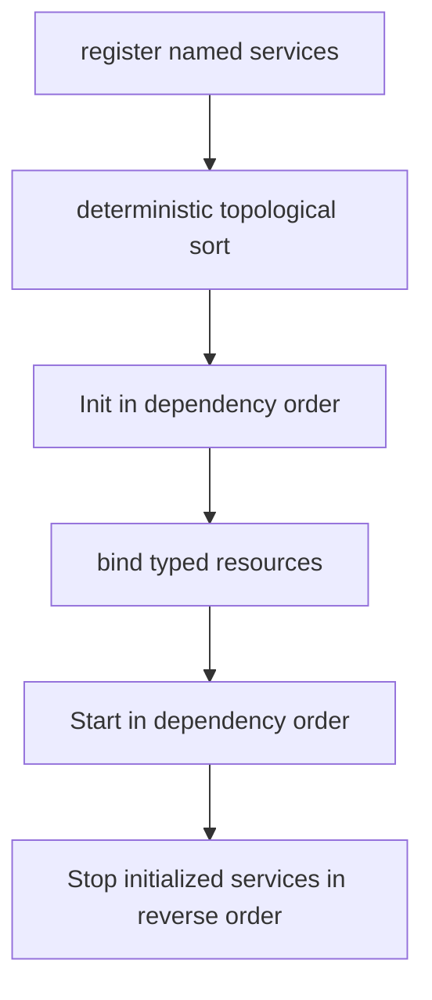
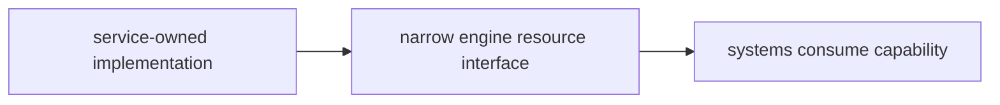
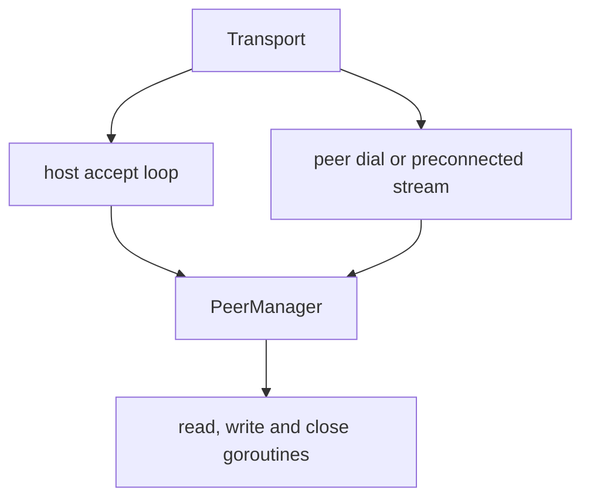

# Services and Networking

Services own process/host resources whose lifecycle differs from ECS systems:
terminal raw mode, audio output, the immutable content corpus, and an optional
network transport. Networking is assembled for a startup-only two-participant
trusted-peer mode; a normal run still contributes no active network capability.

## 1. Service lifecycle contract

```go
type Service interface {
    Name() string
    Dependencies() []string
    Init() error
    Start() error
    Stop() error
}
```

| Phase | Contract |
|---|---|
| Registration | Single-threaded composition; names must be unique. |
| `Init` | Acquire/configure resources but do not start background goroutines. |
| Resource binding | Optional `Contribute(*engine.Resource)` exposes a typed capability after every service initialized. |
| `Start` | Begin goroutines/process work after the whole application is assembled. |
| `Stop` | Idempotently stop work and release both Init- and Start-acquired resources. |

The separation prevents a service goroutine from observing a half-constructed
world. `Hub.StartAll` runs before the scheduler, input, and render loops; reverse
shutdown completes before process exit.

## 2. Dependency ordering and rollback



The hub delegates to `core.TopoSort`, the same Kahn implementation the system
dependency graph resolves with. Names and dependent lists are sorted so
unrelated siblings have deterministic order; service init order feeds RNG
seeding, so it must not vary between runs. Missing dependencies and cycles are
startup errors, and the resolver reports them as typed errors the hub renders
in service terms.

If `Init` fails, already initialized services are stopped in reverse order. If
`Start` fails, already started services are rolled back; the app's final close
then stops the initialized superset. Normal `StopAll` visits every initialized
service in reverse order and logs individual errors without preventing later
cleanup.

All current services declare no dependency, so the registered subset initializes
alphabetically. The dependency mechanism exists for future capabilities that
actually require another service; do not invent dependencies merely to choose
an arbitrary order.

## 3. Current service inventory

| Service | `Init` | `Start` | Resource contribution |
|---|---|---|---|
| `terminal` | Construct terminal, enter raw/alternate-screen state, detect/force color mode. | Start blocking poll loop. | Exposed directly to app/render/input rather than as an ECS resource. |
| `content` | Resolve, load, sanitize, and freeze corpus/cursor. | No-op. | `ContentResource.Provider`. |
| `audio` | Build engine/config and load optional documents. | Freeze/register sounds, probe backend, start mixer/supervisor. | `AudioResource.Engine` when available. |
| `network` | If enabled, build transport/handlers. | Listen or connect. | `NetworkResource.Port`; absent in default disabled role. |

Assembly is mode-dependent:

| App mode | Registered services |
|---|---|
| `ModePlay` | terminal, content, audio, and network; `RoleNone` normally, `RoleHost`/`RolePeer` with startup flags |
| `ModeHeadless` | content only |
| `ModeReplay` | terminal, content, and audio |

The predicates in `internal/app/config.go` are authoritative: presenting modes
own a terminal, audio modes register audio, and only play constructs the
network adapter. Replay input controls playback rather than the mode router,
and its terminal resize affects presentation rather than recorded geometry.

Content and audio details are covered in
[Content, assets, and tools](content-assets-and-tools.md) and
[Audio architecture](audio.md).

## 4. Terminal service

The external `lixenwraith/terminal` module owns OS terminal capabilities. The
adapter in this repository owns application lifecycle:

- `Init` creates the terminal and calls its initialization exactly once;
- `Start` spawns one poll goroutine;
- terminal events enter a buffered 256-element channel;
- Stop closes the loop by posting a synthetic closed event, waits for the
  goroutine, and always finalizes the terminal—even when Init succeeded but
  Start did not;
- a panic in the poll loop performs an emergency terminal reset, flushes stdio,
  prints a stack, and exits to avoid leaving the shell unusable.

The polling channel applies backpressure rather than silently dropping normal
terminal events: if the app stops consuming, the poll loop waits until space or
shutdown. Terminal flush is performed by the render orchestrator outside the
world lock.

## 5. Capability injection

Services do not receive a `World` constructor argument. After `InitAll`, the hub
calls contributors in dependency order and fills only the capability fields
they own. `GameContext` then creates the remaining simulation resources.



This direction prevents the I/O layer from directly mutating component stores.
Content exposes `NextBlock`; audio exposes the audio engine; networking exposes
a `NetworkPort` that drains notifications and sends opaque framed messages.

## 6. Operator session surface

`ModePlay` registers `NetworkService` on every run. With neither startup flag it
uses `RoleNone`, so Init/Start are no-ops and no `NetworkResource` is contributed.
Two flags activate the same composition path:

| Flag | Startup behavior |
|---|---|
| `-host <bind-address>` | Build the host App, start a listener, render a lobby, and hold the scheduler at tick zero until one peer is ready. |
| `-join <host:port>` | Dial and receive the anchor before App construction, adopt host identity, build the mirrored roster, then pass the start/ready gate. |

They are flags rather than ex commands because the protocol has no mid-run world
snapshot. A host can be canceled in the lobby with `Ctrl-C`/`Ctrl-Q`. After a
connected peer leaves, the remote cursor is removed and the survivor continues;
the host listener remains active, but a later join is rejected with
`ErrJoinMidRun` at the current position.

The join anchor owns the seed, RNG session, tick rate, config, corpus fingerprint
and D-14 map latch. `ConfigForJoin` runs before `New`, so `initWorld` cannot draw a
different seed. The coordinator assigns canonical participant IDs and roster
slots; both instances create the roster in slot order and mark only their own
cursor human-controlled.

The status bar shows `NET:WAIT/OPEN`, `NET:1P/LOCK`, or `NET:DOWN/OPEN`.
The `network.session` debug card exposes state, peer count, connected state and
map latch separately.

## 7. Transport roles and lifecycle

| Role | Current behavior |
|---|---|
| `RoleNone` | Disabled/no-op. |
| `RoleServer` | Generic TCP/TLS listener. |
| `RoleHost` | Listener with `HostAcceptor`, anchor verification and canonical participant assignment. |
| `RoleClient` | Generic dialer. |
| `RolePeer` | Dialed/preconnected stream admitted after the join and start gates. |



Host uses `tls.Listen` when a TLS config is supplied programmatically, otherwise
`net.Listen`; peer uses the corresponding dialer. The CLI deliberately supplies
no TLS configuration in this trusted-peer proof. Every admitted stream is keyed
by the coordinator's participant ID rather than accept order. The peer manager
enforces the configured cap and duplicate-ID rejection.

Each peer owns a bounded send queue, exact-frame read loop, encode/flush loop and
close monitor. `Stop` closes the listener and peers and waits for the accept loop;
peer close removes it from the manager and emits one poll notification.

## 8. Wire frame and session messages

Every message begins with a fixed 12-byte big-endian header:

| Byte range | Width | Field |
|---|---:|---|
| 0 | 1 | message type |
| 1 | 1 | flags |
| 2–5 | 4 | sender sequence |
| 6–9 | 4 | latest received sequence/ack |
| 10–11 | 2 | payload length |
| 12 onward | 0–65,535 | payload |

`Encode` completes short writes and `Decode` uses `io.ReadFull` for header and
payload, so a partial stream read never reaches the game. Per-peer send assigns
sequence and ack values at actual write time; broadcast clones a message per peer.
Ack is observational—there is no retransmission policy.

Control messages carry heartbeat, join offer/reply and start/ready gates.
Gameplay uses `MsgEvent` for a closed crossing epoch and `MsgStateSync` for one
owner-authored cursor snapshot. The epoch is JSON containing journal-registry TOML
payloads; representative complete-frame budgets are pinned by
`TestWireEncodingBudget`. Those, plus the heartbeat, are the whole live set: the
remaining codes in `protocol.go` are reserved placeholders that nothing sends and
`NetworkSystem` counts as drops. Raw participant input is not among them, and
0x10 stays reserved — a peer sends the resolved D-3 artifact, never the keystroke
that produced it.

## 9. Poll boundary and lockstep barrier

Socket goroutines never touch `World`, the event queue or component stores.
`SocketPort` appends `Inbound` notifications to its configured bounded receive
channel (256 by default); a full buffer increments `Dropped` rather than blocking
the socket. `NetworkService` contributes that port through `NetworkResource`.

`NetworkSystem` is manifest-registered with a `dual` profile. At tick open,
`WireSink.Receive` drains notifications and applies scheduled local/peer artifacts;
at tick close, `Flush` sends the closed production epoch. `Cross` withholds the
local artifact so every participant applies it at the same fixed-delay boundary.
The default lead is three 50 ms ticks and never waits for a per-tick round trip.
`ActivateSession` closes the lobby-to-first-tick input window before the main loop
reads terminal events.

`MsgStateSync` periodically copies only the D-13 owner-authored cursor set, and is
applied only when the payload's entity and roster slot agree and its sequence is
newer than that slot's last. Disconnect drains through the same poll boundary,
despawns only cursors owned by that participant, releases that slot's sync
sequence, disables the barrier when no peer remains, and restores local map-size
authority.

Loss that happens outside the barrier is published rather than swallowed, because
either direction desynchronises silently: `network.transport_lost_in` counts
inbound notifications a full poll buffer discarded, `network.transport_lost_out`
counts outbound frames a peer's bounded send queue refused. A new loss is logged
once as well as counted.

## 10. Timeouts, limits and security

`network.Config` applies connection/read/write deadlines, heartbeat and silent
disconnect intervals, read/write buffer sizes, bounded send/receive queues, peer
cap, barrier delay and optional TLS. Heartbeats are framed control messages and a
silent connection closes through the normal disconnect path.

The current operator feature is deliberately narrower than the transport shape:

- exactly two participants and one startup join;
- no world snapshot, reconnect or lag compensation;
- trusted plaintext peers; no authentication or CLI TLS identity;
- no cross-version compatibility negotiation beyond anchor schema/tick/config/
  corpus equality;
- sequence/ack fields detect ordering but do not retransmit, and a frame refused
  by a full send queue is counted, not resent.

The participant roster, source ordering and epoch format are vectors rather than
two-peer pairs. Supporting four startup participants requires a coordinator
allocator and lobby target count; supporting a mid-run participant additionally
requires a world snapshot. Neither change replaces the port or barrier shape.

## 11. Verification and manual run

`TestTwoLiveParticipantsStayInLockstep` proves two independent drivers over
`Loopback`; `TestTwoLiveParticipantsStayInLockstepOverTCP` repeats 1,200 paired
boundaries over `127.0.0.1`, uses the production startup gates, checks disconnect
continuation and rejects a later join with `ErrJoinMidRun` while the listener stays
up. `TestActivatedSessionDefersCrossingBeforeFirstTick` covers input immediately
after the lobby gate. Framing, timeout, mismatch and encoding budgets have focused
tests in `internal/network` and `internal/event`.

```bash
# terminal 1
./bin/vif -d -host 127.0.0.1:7777

# terminal 2
./bin/vif -join 127.0.0.1:7777
```

Both sides should reach `NET:1P/LOCK`, display two cursors and agree on shared
actors, scoring and progression while both participants move/type/fire. Quit one;
the other must continue at `NET:DOWN/OPEN`. Bind the host to `:7777` for a LAN.
Internet routing uses the same TCP path but is not safe for untrusted peers until
authentication and TLS configuration are exposed.

## 12. Adding a service

- Give it a stable unique name and declare only real dependencies.
- Keep `Init` goroutine-free and make `Stop` safe after partial initialization.
- Do not expose a concrete I/O implementation when a narrow resource interface
  suffices.
- Ensure service callbacks never mutate the ECS directly; drain at a controlled
  world-owned boundary.
- Bound all channels/queues and define overflow/backpressure policy.
- Roll back subprocesses, terminal modes, files, listeners, and goroutines on
  every error path.
- Add lifecycle tests for Init failure, Start failure, duplicate Stop, and
  shutdown with blocked I/O.

## 13. Source map

| Concern | Primary source |
|---|---|
| Service contract/hub | `internal/service/interface.go`, `hub.go` |
| Mode-to-service policy | `internal/app/config.go`, `app.go` |
| Terminal adapter | `internal/service/adapter_terminal.go` |
| Content/audio adapters | `internal/service/adapter_content.go`, `adapter_audio.go` |
| Network adapter | `internal/service/adapter_network.go` |
| Transport/protocol | `internal/network/*.go` |
| Tick-owned ECS wire bridge | `internal/system/network.go` |
| Startup session assembly | `internal/app/session.go`, `app.go`, `loop.go` |
