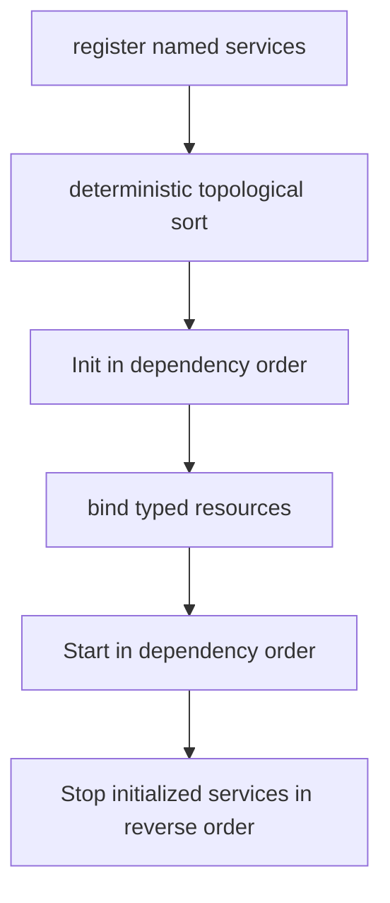
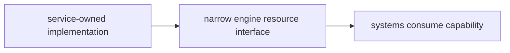
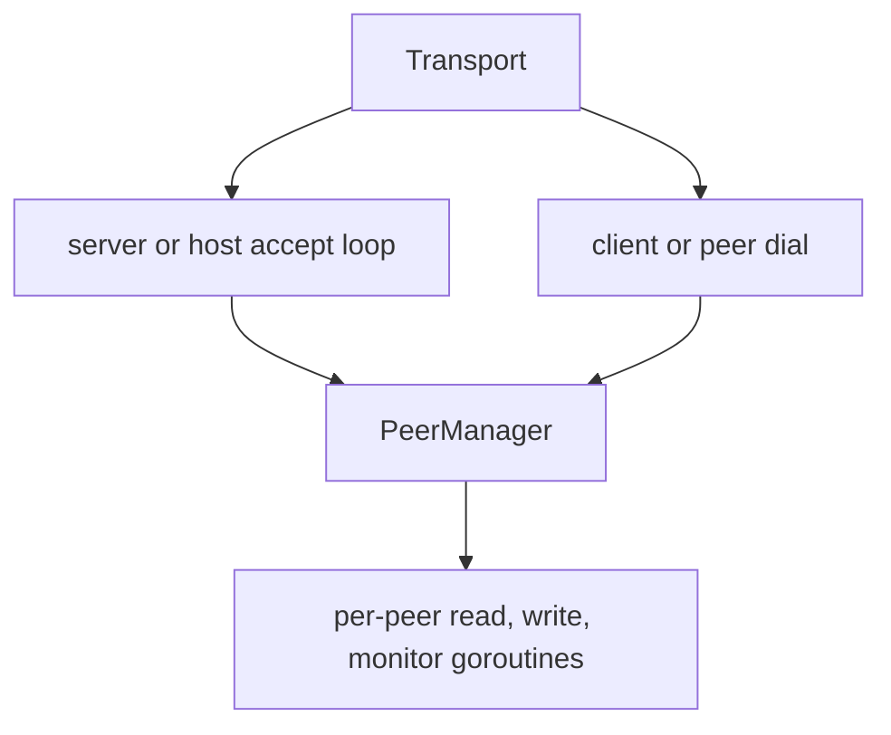

# Services and Experimental Networking

Services own process/host resources whose lifecycle differs from ECS systems:
terminal raw mode, audio output, the immutable content corpus, and an optional
network transport. The network code is scaffolding and is disabled/unassembled
in the current game; this document explicitly separates implemented transport
pieces from a supported multiplayer feature.

## 1. Service lifecycle contract

```go
type Service interface {
    Name() string
    Dependencies() []string
    Init() error
    Start() error
    Stop() error
}
```

| Phase | Contract |
|---|---|
| Registration | Single-threaded composition; names must be unique. |
| `Init` | Acquire/configure resources but do not start background goroutines. |
| Resource binding | Optional `Contribute(*engine.Resource)` exposes a typed capability after every service initialized. |
| `Start` | Begin goroutines/process work after the whole application is assembled. |
| `Stop` | Idempotently stop work and release both Init- and Start-acquired resources. |

The separation prevents a service goroutine from observing a half-constructed
world. `Hub.StartAll` runs before the scheduler, input, and render loops; reverse
shutdown completes before process exit.

## 2. Dependency ordering and rollback



The hub delegates to `core.TopoSort`, the same Kahn implementation the system
dependency graph resolves with. Names and dependent lists are sorted so
unrelated siblings have deterministic order; service init order feeds RNG
seeding, so it must not vary between runs. Missing dependencies and cycles are
startup errors, and the resolver reports them as typed errors the hub renders
in service terms.

If `Init` fails, already initialized services are stopped in reverse order. If
`Start` fails, already started services are rolled back; the app's final close
then stops the initialized superset. Normal `StopAll` visits every initialized
service in reverse order and logs individual errors without preventing later
cleanup.

All current services declare no dependency, so the registered subset initializes
alphabetically. The dependency mechanism exists for future capabilities that
actually require another service; do not invent dependencies merely to choose
an arbitrary order.

## 3. Current service inventory

| Service | `Init` | `Start` | Resource contribution |
|---|---|---|---|
| `terminal` | Construct terminal, enter raw/alternate-screen state, detect/force color mode. | Start blocking poll loop. | Exposed directly to app/render/input rather than as an ECS resource. |
| `content` | Resolve, load, sanitize, and freeze corpus/cursor. | No-op. | `ContentResource.Provider`. |
| `audio` | Build engine/config and load optional documents. | Freeze/register sounds, probe backend, start mixer/supervisor. | `AudioResource.Engine` when available. |
| `network` | If enabled, build transport/handlers. | Listen or connect. | `NetworkResource.Port`; absent in default disabled role. |

Assembly is mode-dependent:

| App mode | Registered services |
|---|---|
| `ModePlay` | terminal, content, audio, and network in disabled `RoleNone` |
| `ModeHeadless` | content only |
| `ModeReplay` | terminal, content, and audio |

The predicates in `internal/app/config.go` are authoritative: presenting modes
own a terminal, audio modes register audio, and only play constructs the
network adapter. Replay input controls playback rather than the mode router,
and its terminal resize affects presentation rather than recorded geometry.

Content and audio details are covered in
[Content, assets, and tools](content-assets-and-tools.md) and
[Audio architecture](audio.md).

## 4. Terminal service

The external `lixenwraith/terminal` module owns OS terminal capabilities. The
adapter in this repository owns application lifecycle:

- `Init` creates the terminal and calls its initialization exactly once;
- `Start` spawns one poll goroutine;
- terminal events enter a buffered 256-element channel;
- Stop closes the loop by posting a synthetic closed event, waits for the
  goroutine, and always finalizes the terminal—even when Init succeeded but
  Start did not;
- a panic in the poll loop performs an emergency terminal reset, flushes stdio,
  prints a stack, and exits to avoid leaving the shell unusable.

The polling channel applies backpressure rather than silently dropping normal
terminal events: if the app stops consuming, the poll loop waits until space or
shutdown. Terminal flush is performed by the render orchestrator outside the
world lock.

## 5. Capability injection

Services do not receive a `World` constructor argument. After `InitAll`, the hub
calls contributors in dependency order and fills only the capability fields
they own. `GameContext` then creates the remaining simulation resources.



This direction prevents the I/O layer from directly mutating component stores.
Content exposes `NextBlock`; audio exposes the audio engine; networking exposes
a `NetworkPort` that drains notifications and sends opaque framed messages.

## 6. Network status: not a playable feature

Play mode calls `NewNetworkService(nil)`, which produces `RoleNone`; headless
and replay do not register the adapter. There is no CLI/network configuration
path. Disabled service Init and Start are no-ops and it contributes no network
resource.

Although `NetworkSystem` can translate inbound notifications to game events,
it is absent from `internal/manifest/definition.go`, so normal application
assembly never constructs it. `internal/app/app.go` contains an explicit TODO
for network event handling. No outbound gameplay protocol, state authority,
serialization model, reconciliation, authentication, or determinism contract
has been implemented.

The code should therefore be described as an experimental TCP/TLS transport
foundation, not multiplayer support.

## 7. Transport roles and lifecycle

The transport recognizes:

| Role | Current behavior |
|---|---|
| `RoleNone` | Disabled/no-op. |
| `RoleServer` | Listen and accept multiple TCP/TLS peers. |
| `RoleHost` | Same transport behavior as server; P2P semantics are not implemented above it. |
| `RoleClient` | Dial one TCP/TLS endpoint. |
| `RolePeer` | Same transport behavior as client; coordination semantics are not implemented. |



Server/host uses `tls.Listen` when a TLS configuration is present, otherwise
plain `net.Listen`. Client/peer uses a dialer with the configured connection
timeout and optional `tls.DialWithDialer`. TLS is `nil` by default and plaintext
is intended only for local/debug use.

The peer manager caps connections (default 16), assigns monotonically
increasing process-local peer IDs, and maintains a mutex-protected map. Each
accepted peer gets:

- one blocking decode loop;
- one queued encode/flush loop;
- one monitor waiting for close and removing it from the manager;
- a bounded send channel (default 256).

Close is one-shot, closes the connection, and causes both I/O loops to unwind.
The transport closes the listener/all peers and waits for its accept loop.

## 8. Wire frame

Every message begins with a fixed 12-byte big-endian header:

| Byte range | Width | Field |
|---|---:|---|
| 0 | 1 | message type |
| 1 | 1 | flags |
| 2–5 | 4 | sender sequence |
| 6–9 | 4 | latest received sequence/ack |
| 10–11 | 2 | payload length |
| 12 onward | 0–65,535 | opaque payload |

```text
[type:1][flags:1][seq:4][ack:4][length:2][payload:length]
```

Message types reserve ranges for heartbeat/connect/disconnect/ack, input/state
sync/event, peer list/role assignment, and future authentication. Flags declare
need-ack and future compression. Encoding enforces the 65,535-byte payload cap;
decoding uses `io.ReadFull` for exact framing.

Per-peer `Send` assigns its own outbound sequence and copies the current inbound
sequence into `Ack`. Broadcast clones the message for each peer so sequences do
not race.

## 9. Transport-to-game handoff

Transport callbacks must not touch the world. `NetworkService` enqueues
connect, disconnect, or message notifications into a 1,024-entry channel
without blocking I/O goroutines; overflow increments a drop counter.

If assembled, `NetworkSystem.Update` drains at most 64 notifications per game
tick and translates:

| Transport item | Game event |
|---|---|
| connect | `EventNetworkConnect` |
| disconnect | `EventNetworkDisconnect` |
| `MsgInput` | `EventRemoteInput` with opaque payload |
| `MsgStateSync` | `EventStateSync` with peer, sequence, payload |
| `MsgEvent` | `EventNetworkEvent` with opaque payload |

Other message types are currently ignored by the system. The port also exposes
send, broadcast, peer count, and running state, but `NetworkSystem` has no
outbound request subscriptions yet.

## 10. Incomplete and misleading configuration

`network.Config` declares read/write timeouts, heartbeat/disconnect intervals,
read/write buffer sizes, and receive queue size. In the current implementation:

- only connection timeout, address, role, TLS, max peers, and send queue size
  materially affect behavior;
- per-peer readers/writers use hard-coded 64 KiB buffers;
- no read/write deadlines are applied;
- heartbeat and disconnect timeout logic does not run;
- `RecvQueueSize` is unused; the service owns a separate fixed 1,024 channel;
- acknowledgment fields/flags are recorded but retransmission or required-ack
  policy is absent;
- compression and auth message semantics are reserved only.

Do not present `DefaultConfig` as production-safe merely because its fields have
values. TLS identity/verification, protocol validation, resource limits, and
application authority must be designed before enabling untrusted connections.

## 11. Work required for real networking

At minimum, a supported feature needs:

1. an explicit product topology and authoritative simulation owner;
2. CLI/configuration and secure TLS/auth identity handling;
3. versioned typed payload schemas with validation and compatibility rules;
4. input/state/event ownership, ordering, replay, and reconciliation semantics;
5. heartbeat/deadline/ack behavior or removal of misleading fields;
6. bounded memory and rate limits for decoded payloads and event translation;
7. manifest registration plus outbound system events;
8. an authoritative server state or snapshot/delta design—the manual-clock
   harness and seeded streams do not make float64 world state a cross-platform
   lockstep protocol;
9. integration, adversarial, disconnect, slow-peer, and saturation tests;
10. telemetry for peers, bytes, queue drops, protocol rejects, latency, and
    reconnect state.

Until then, keep RoleNone as the only normal application path.

## 12. Adding a service

- Give it a stable unique name and declare only real dependencies.
- Keep `Init` goroutine-free and make `Stop` safe after partial initialization.
- Do not expose a concrete I/O implementation when a narrow resource interface
  suffices.
- Ensure service callbacks never mutate the ECS directly; drain at a controlled
  world-owned boundary.
- Bound all channels/queues and define overflow/backpressure policy.
- Roll back subprocesses, terminal modes, files, listeners, and goroutines on
  every error path.
- Add lifecycle tests for Init failure, Start failure, duplicate Stop, and
  shutdown with blocked I/O.

## 13. Source map

| Concern | Primary source |
|---|---|
| Service contract/hub | `internal/service/interface.go`, `hub.go` |
| Mode-to-service policy | `internal/app/config.go`, `app.go` |
| Terminal adapter | `internal/service/adapter_terminal.go` |
| Content/audio adapters | `internal/service/adapter_content.go`, `adapter_audio.go` |
| Network adapter | `internal/service/adapter_network.go` |
| Transport/protocol | `internal/network/*.go` |
| Optional ECS translator | `internal/system/network.go` |
| Current assembly status | `internal/app/app.go`, `internal/manifest/definition.go` |
