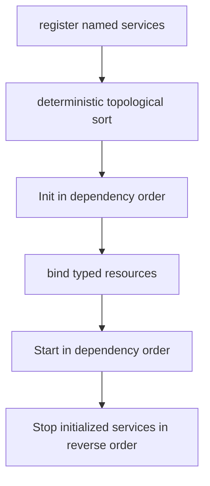
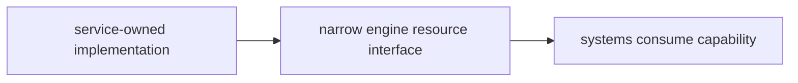
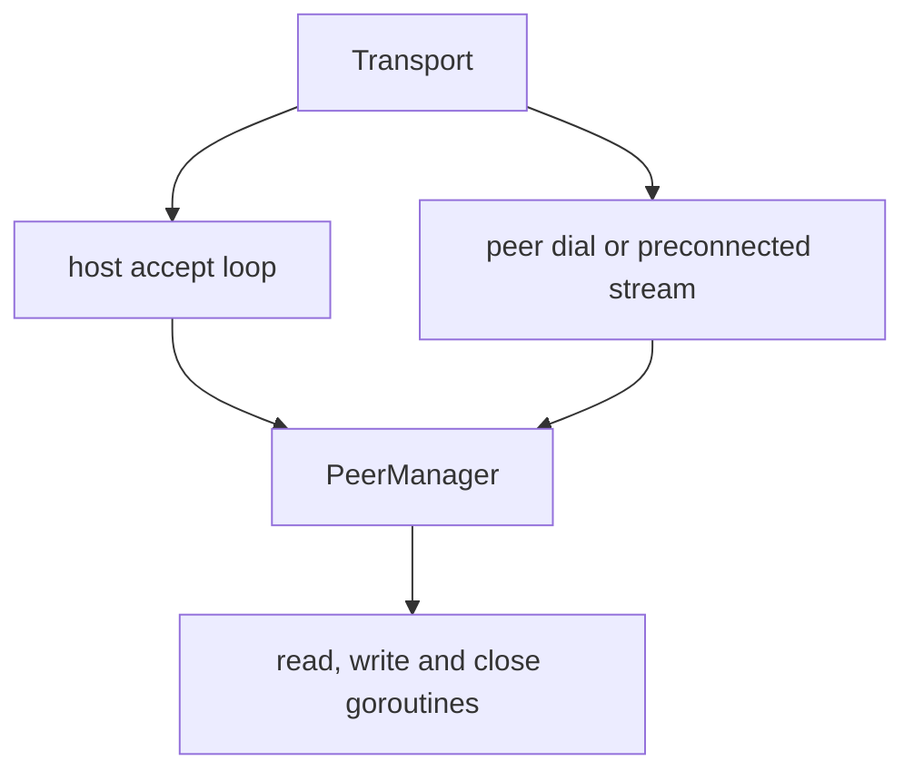

# Services and Networking

Services own process/host resources whose lifecycle differs from ECS systems:
external file access, terminal raw mode, audio output, the immutable content
corpus, and an optional network transport. Networking is assembled for a
trusted-peer session of up to `parameter.MaxPlayers` participants; a normal run
still contributes no active network capability. The session contract, the
correction path and what remains of both are in
[Multiplayer](multi-player.md).

## 1. Service lifecycle contract

```go
type Service interface {
    Name() string
    Dependencies() []string
    Init() error
    Start() error
    Stop() error
}
```

| Phase | Contract |
|---|---|
| Registration | Single-threaded composition; names must be unique. |
| `Init` | Acquire/configure resources but do not start background goroutines. |
| Resource binding | Optional `Contribute(*engine.Resource)` exposes a typed capability after every service initialized. |
| `Start` | Begin goroutines/process work after the whole application is assembled. |
| `Stop` | Idempotently stop work and release both Init- and Start-acquired resources. |

The separation prevents a service goroutine from observing a half-constructed
world. `Hub.StartAll` runs before the scheduler, input, and render loops; reverse
shutdown completes before process exit.

## 2. Dependency ordering and rollback



The hub delegates to `core.TopoSort`, the same Kahn implementation the system
dependency graph resolves with. Names and dependent lists are sorted so
unrelated siblings have deterministic order; service init order feeds RNG
seeding, so it must not vary between runs. Missing dependencies and cycles are
startup errors, and the resolver reports them as typed errors the hub renders
in service terms.

If `Init` fails, already initialized services are stopped in reverse order. If
`Start` fails, already started services are rolled back; the app's final close
then stops the initialized superset. Normal `StopAll` visits every initialized
service in reverse order and logs individual errors without preventing later
cleanup.

All current services declare no dependency, so the registered subset initializes
alphabetically. The dependency mechanism exists for future capabilities that
actually require another service; do not invent dependencies merely to choose
an arbitrary order.

## 3. Current service inventory

| Service | `Init` | `Start` | Resource contribution |
|---|---|---|---|
| `file` | Retain the ordered configuration roots. | No-op. | `FileResource.Provider`, a generic categorized open capability. |
| `terminal` | Construct terminal, enter raw/alternate-screen state, detect/force color mode. | Start blocking poll loop. | Exposed directly to app/render/input rather than as an ECS resource. |
| `content` | Resolve, load, sanitize, and freeze corpus/cursor. | No-op. | `ContentResource.Provider`. |
| `audio` | Build engine/config and load optional documents. | Freeze/register sounds, probe backend, start mixer/supervisor. | `AudioResource.Engine` when available. |
| `network` | If enabled, build transport/handlers. | Listen or connect. | `NetworkResource.Port`; absent in default disabled role. |

Assembly is mode-dependent:

| App mode | Registered services |
|---|---|
| `ModePlay` | file, terminal, content, audio, and network; `RoleNone` normally, `RoleHost`/`RolePeer` with startup flags |
| `ModeHeadless` | file and content for ordinary harnesses; `app.RunScript` additionally registers `RoleHost`/`RolePeer` network when a startup flag is present |
| `ModeReplay` | file, terminal, content, and audio |
| `ModeScript` | file, terminal, content, audio, and the same `RoleHost`/`RolePeer` network a headless script registers |
| `ModeServer` | file, content, and `RoleHost` network; no terminal and no audio |

The predicates in `internal/app/config.go` are authoritative for terminal and
audio capabilities, then build capabilities constrain them further. A
`vif_headless` build has no terminal or audio adapter; `vif_noaudio` and browser
builds have no audio adapter. Native networking is role-selected separately:
play constructs the no-op-capable socket adapter, while an authored headless
script constructs it only for `-host`/`-join`. A browser registers the same adapter
for a `-join` naming the same-origin route `wss://<site>/vif/ws/<session>`, and is
refused `-host`, `-serve` and a `host:port` target, none of which it could bind or
dial. The route reaches a bridge sidecar in the session's pod, which is the only
thing on the path that speaks WebSocket; native clients retain raw TCP. Replay
input controls playback rather than the mode router, and its terminal resize
affects presentation rather than recorded geometry.

Content and audio details are covered in
[Content, assets, and tools](content-assets-and-tools.md) and
[Audio architecture](audio.md).

## 4. Terminal service

The external `lixenwraith/terminal` module owns OS terminal capabilities. The
adapter in this repository owns application lifecycle:

- `Init` creates the terminal and calls its initialization exactly once;
- `Start` spawns one poll goroutine;
- terminal events enter a buffered 256-element channel;
- Stop closes the loop by posting a synthetic closed event, waits for the
  goroutine, and always finalizes the terminal—even when Init succeeded but
  Start did not;
- a panic in the poll loop performs an emergency terminal reset, flushes stdio,
  prints a stack, and exits to avoid leaving the shell unusable.

The polling channel applies backpressure rather than silently dropping normal
terminal events: if the app stops consuming, the poll loop waits until space or
shutdown. Terminal flush is performed by the render orchestrator outside the
world lock.

## 5. Capability injection

Services do not receive a `World` constructor argument. After `InitAll`, the hub
calls contributors in dependency order and fills only the capability fields
they own. `GameContext` then creates the remaining simulation resources.



This direction prevents the I/O layer from directly mutating component stores.
Files expose a categorized `Open` capability; content exposes `NextBlock`; audio
exposes the audio engine; networking exposes a `NetworkPort` that drains
notifications and sends opaque framed messages.

## 6. Operator session surface

`ModePlay` registers `NetworkService` on every run. With neither startup flag it
uses `RoleNone`, so Init/Start are no-ops and no `NetworkResource` is contributed.
`app.RunScript` can register the same active service without a terminal; ordinary
`NewHeadless` deliberately rejects address flags so no caller can bypass the
start/ready gate. Two flags activate the shared composition path:

| Entry point | Behavior |
|---|---|
| `-host <bind-address>` | Play at once and open the listener when the clock starts, exactly as `:host` does. A bind that fails leaves the game playing solo. |
| `-join <host:port>` | Dial and receive the anchor before App construction, adopt host identity, then take the world and the roster from the start gate. Also accepts `[vif://]host:port/name`, which is the link shape a deployment hands a player. |
| `-name <name>` | With `-host` or `-serve`, the name this session answers to, so one address can serve several. A host that sets one refuses a dial that names nothing, so it is taken with a front door that routes on the name or not at all. |
| `:host <addr> [host\|migrate]` | Open a run that is **already playing**, under the authority policy named. The port is created, started and attached; the world latches as shared (D-14) and the barrier takes ownership of this instance's crossings from that tick. |
| `:session` | Report the role, address, participant identity, its cursor slot, peer count and tick. |

`-host` and `:host` are one path: the host plays from its first tick and a joiner
takes the roster, then the world it names, as a chunked `MsgStateSnapshot` from
the mid-run gate. Only `-serve`, which has nobody to play, holds tick zero in a
lobby until its first guest. After a connected peer leaves, the remote cursor is removed and
the survivor continues; the listener stays active and the same participant may
dial again, which is the reconnect path and is not a separate mechanism.

`:host` runs inside `App.handleIntent`'s critical section, because the whole
router path does — so `engine.SessionController`'s methods are the *locked* forms
and `App.BeginHosting` is the wrapper for a caller holding nothing. Getting that
backwards deadlocks the instance at the tick the command lands on, which is what it
did the first time it was wired through a script.

**The join, in order.** The ordering is D-22 and it is not the obvious one:

1. The acceptor allocates an identity and exchanges offer/reply.
2. The stream becomes a **peer** — so this instance's crossings start reaching it.
3. *Then* the world is read, under one acquisition of the world lock, and sent with
   the closed roster.
4. The joiner holds the session traffic that arrives while it reads, installs the
   capture into a staging world, swaps at a tick boundary, hands the held frames to
   its port, and simulates the ticks the transfer cost.
5. It confirms with `MsgReady`, and the coordinator crosses `EventParticipantJoined`
   so every instance creates its cursor at one agreed tick.

Reading the world before admitting the peer would lose every artifact produced in
between — not in the capture, because the capture predates it; not on the wire,
because the participant was not yet a peer. Nothing would detect that.

The join anchor owns the seed, RNG session, tick rate, config, corpus fingerprint
and D-14 map latch. `ConfigForJoin` runs before `New`, so `initWorld` cannot draw a
different seed. The coordinator assigns canonical participant IDs and roster
slots; both instances create the roster in slot order and mark only their own
cursor human-controlled.

The status bar shows `Net: wait`, `<players>P <round trip>` or `Net: down` — one
badge, chosen by severity. The D-14 latch used to be printed beside each of them, and it is not a
thing to watch: it is on for every session run from before its first joiner to
after its last one leaves, and off for every solo run, which is the only one whose
terminal may still crop. It is a fact about the run, so `:session` names it and the
`network.session` telemetry card exposes state, peer count, connected state and map
latch separately.

## 7. Transport roles and lifecycle

| Role | Current behavior |
|---|---|
| `RoleNone` | Disabled/no-op. |
| `RoleServer` | Generic TCP/TLS listener. |
| `RoleHost` | Listener with `HostAcceptor`: admits the dialling address against a per-host budget, then allocates a participant identity and slot and offers the anchor. Each handshake runs on a goroutine of its own, bounded by `Config.MaxHandshakes`; `Config.OnAdmit` then runs the mid-run gate, which `App.midRunGate` serialises. |
| `RoleClient` | Generic dialer. |
| `RolePeer` | Dialed/preconnected stream admitted after the join and start gates. |
| `RoleRelay` | A *session* role rather than a transport mode: a participant with more than one link, which forwards the authority's artifacts to the participants behind it and retains what it forwards so it can answer their selective requests. The transport treats it exactly as `RolePeer` — it dials — because what makes it a relay is what it does with the artifacts, not how the stream was established. `network.SessionRole(authoring, links)` is what the protocol reads. |



Host uses `tls.Listen` when a TLS config is supplied programmatically, otherwise
`net.Listen`; peer uses the corresponding dialer. The CLI deliberately supplies
no TLS configuration in this trusted-peer proof. `dial` is also where a browser
diverges and stops diverging: a `ws://` or `wss://` target is opened as the page's
own WebSocket wrapped in a `net.Conn`, and every layer above it — handshake,
admission, fences, snapshot assembly — is the code a native client runs. A
WebSocket message is not a frame boundary; `Decode` reassembles the stream exactly
as it does from a socket. Every admitted stream is keyed
by the coordinator's participant ID rather than accept order. The peer manager
enforces the configured cap and duplicate-ID rejection.

Each peer owns a bounded send queue, exact-frame read loop, encode/flush loop and
close monitor. `Stop` closes the listener, then the handshakes still in flight,
then the peers, and waits for all of them; peer close removes it from the manager
and emits one poll notification.

### 7.1 Admission

The handshake reads from a socket the far end controls, so it does not run on the
accept goroutine. One dialer that connected and never wrote used to hold every
other join for a whole `ConnectTimeout` — the cheapest denial there is, one socket
per five seconds of lobby. Each accepted connection now gets a goroutine, and
`Config.MaxHandshakes` bounds how many may be in flight at once; past the budget a
dial is refused rather than queued, because queueing would put the accept loop back
behind the same read. The budget is released the moment `AcceptSession` returns:
what it bounds is unauthenticated work, and everything after that point concerns a
peer the roster ceiling already bounds.

The acceptance a joiner sends back carries its own terminal-equivalent geometry
(`network.JoinerReport`). It travels with the reply rather than the dial because
only after construction does a joiner know the terminal it got, and it is advisory:
a coordinator that was given a `-size` ignores it, and one that was not uses the
first to size the session (see [Runtime](runtime.md) §1.2).

### 7.2 Join identity, and who decides it

The same acceptance carries something that is not advisory at all:
`network.PeerIdentity`, what the joiner turned out to be.

The join used to be self-policed. The coordinator sent its anchor, the joiner
compared it against its own build and refused itself, and a joiner that did not
perform that comparison — an older client, a modified one, one that simply skipped
it — was admitted on its word. The host is the authority over the session, so the
host is what refuses: the joiner reports, and the coordinator decides.

The identity has two halves, because they become knowable at different moments:

| Half | Fields | Checked |
|---|---|---|
| Build | `protocol`, `simulation`, `capture_schema`, `journal_schema`, `tick_ns` | By the dialer against the offer, before it constructs a world; and again by the coordinator. |
| Session | `seed`, `session`, `scenario_digest` | By the coordinator only. A dialer has no world yet, so it has none of these. |

`scenario_digest` is the SHA-256 of the scenario's canonical form and the only
scenario field compared: two roots may install the same scenario under different
names, and the same name may cover an edit. The anchor's `scenario_id` is a lookup
hint and what the log records say. The corpus is player domain and not compared.

`MsgSessionRestart` is the coordinator saying the session is rebuilding on another
scenario. It carries nothing — each participant already knows the address it came
in on, and the offer it is given when it redials names what is being played — and
it is taken only from the participant the term names, because one that could make
its peers tear down and redial on demand could empty a session. See
[Runtime and concurrency](runtime.md) for the restart itself.

A joiner whose own roots hold no scenario with that digest asks the coordinator
for one, between the offer and the reply: `MsgScenarioRequest` names the digest,
`MsgScenarioBody` carries the deflated canonical form in capture-sized chunks. It
sits there so the participant is running the session's scenario before it reports
an identity that would otherwise be refused, and one request fits by construction
— what follows the answer has to be the reply. The coordinator serves only the
digest it is playing, refusing anything else rather than acting as a file service.

The received scenario is held in memory for the life of the run and never written
to disk, including into the staging world a correction resolves against. The whole
container is one deflate stream rather than one per file, because the files are
near-identical TOML and a shared window is most of the saving; the container is
length-prefixed rather than delimited, so a file that is truncated, malformed or
deliberately unterminated cannot run into the next one, and the inflate is bounded
at the same ceiling a scenario read from disk is held to. The digest is taken over
what deflate was given, so a receiver verifies exactly what the sender hashed.

`simulation` is `manifest.Fingerprint()`: a hash over the component list and the
system list — names, domains, snapshot obligations, dependencies and order — which
is what actually decides whether two participants converge. Renderers are excluded
deliberately: presentation decides nothing about the simulation, and refusing a
session over it would refuse one for something that could not have caused a
divergence.

The values a peer is measured against are the coordinator's own, derived from the
anchor it offered rather than read again at reply time, so a reset between the offer
and the acceptance cannot turn a valid join into a mismatch or the reverse. A
mismatch names one field and both values, and carries `IdentityRefusalTag` so the
joiner can recognise it across the wire — unlike a handoff refusal it is not worth
retrying, because nothing about the peer will be different a second later.

An offer that names no identity verifies nothing, which is what leaves a harness
free to dial a hand-built fixture.

`Coordinator.Admit` runs before `Assign`, and it is the one decision made about a
dialer before it costs the session anything. The expensive part of a join is not
the handshake but what follows it: on a running host the admission reads, encodes
and sends a whole world, so a peer that joins and leaves in a loop spends one
connect per capture. `network.AdmissionLimiter` gives each dialling host
`parameter.NetworkAdmitBurst` admissions per `NetworkAdmitWindow`, keyed by address
rather than by identity — an identity is what the attack consumes and is released
the moment the connection drops. A refusal is written back as a `MsgJoinReply`
carrying its reason, for the same reason a mid-succession refusal is: a dialer that
can read why it was turned away backs off, where one that only sees the stream end
retries immediately.

The limiter's own table is bounded by `NetworkAdmitTracked` and swept when an
unseen host arrives. Past that ceiling it fails closed: a completed TCP handshake
proves the source address, so a table that wide is many real hosts at once rather
than one forging them.

## 8. Wire frame and session messages

Every message begins with a fixed 12-byte big-endian header:

| Byte range | Width | Field |
|---|---:|---|
| 0 | 1 | message type |
| 1 | 1 | flags |
| 2–5 | 4 | sender sequence |
| 6–9 | 4 | latest received sequence/ack |
| 10–11 | 2 | payload length |
| 12 onward | 0–65,535 | payload |

`Encode` completes short writes and `Decode` uses `io.ReadFull` for header and
payload, so a partial stream read never reaches the game. Per-peer send assigns
sequence and ack values at actual write time; broadcast clones a message per peer.
Ack is observational—there is no retransmission policy.

The handshake travels plain. From the join reply on, each direction of a link is
one deflate stream (`NetworkStreamLevel`), so a frame compresses against every frame
before it. The writer takes the frames queued within `NetworkWriteLinger` of a
burst's first and sync-flushes once. Go's levels 1-6 drop their history on a flushed
block under 128 bytes, which is most bursts; 7 keeps it.

Control messages carry heartbeat, join offer/reply, start/ready gates and
disconnect notices. `MsgSessionRoute` (0x05) is the exception to the coordinator
speaking first: a dialer that was given a session name sends it as one frame before
it reads, so a front door can place the connection on an address serving several
sessions and the session it reaches can refuse a name that is not its own. A host
started without `-name` expects no such frame, which is every interactive run. A join refused before an identity is allocated — a dial that
landed while the session was electing a new authority — is answered with a
`MsgJoinReply` carrying the reason rather than by closing the stream, so the dialer
can tell "retry against the new authority" from a connection that ended for no
stated reason (`network.IsHandoffRefusal`). Gameplay uses `MsgEvent` for a closed crossing
epoch, `MsgStateSync` for one owner-authored cursor snapshot, and
`MsgStateDigest` for the periodic shared-world parity probe. Authority travels as
`MsgStateSnapshot`/`MsgStateCorrection` chunks and, in the steady state, as the
`MsgStateManifest`/`MsgStateRequest`/`MsgStateShard` exchange below, with
`MsgStateUnserved` (0x2B) as the answer a retention holder gives to a request it
cannot produce pages for. `MsgAuthorityReport` (0x2C) and `MsgAuthorityHandoff`
(0x2E) carry the succession; 0x2D was the vote and is retired. The epoch is JSON
containing journal-registry TOML payloads; representative complete-frame budgets
are pinned by `TestWireEncodingBudget`. The remaining codes in `protocol.go` are
reserved placeholders that nothing sends and `NetworkSystem` counts as drops.
Raw participant input is not among them, and 0x10 stays reserved — a peer sends
the resolved D-3 artifact, never the keystroke that produced it.

`MsgLinkProbe` (0x14) and `MsgLinkEcho` (0x15) are the only round trip this
protocol makes. Everything else is one-directional — what this instance sent, and
how far behind the newest tick it has *heard about* it stands — which is why the
correction cadence had a constant and nothing else to be chosen from before
Phase 5. They are unusual in one way that matters: **neither ever reaches the
game**. `SocketPort` answers a probe from the read goroutine and swallows an echo
there, `MeshPort` does the same inside `Drain`, so what the measurement describes
is the wire rather than how often an instance runs a tick — and no timing value
has to enter the world for the cadence to exist.

| Frame | Bytes | Layout |
|---|---:|---|
| probe | 12 | `[Seq:4][SentNano:8]` |
| echo | 45 | the probe's 12 bytes untouched, then `[InBytes:8]` and a 25-byte `LinkReport` |
| `LinkReport` | 25 | `[Tick:8][LagTicks:4][Magnitude:4][CursorX:4][CursorY:4][Flags:1]` |

The probe's own timestamp comes back untouched, so the round trip is computed
against the clock that started it and neither end has to agree with the other
about what time it is. `InBytes` is what the answering end has received on this
link, which turns two consecutive echoes into a delivery rate and a backlog — the
difference between a fast link and an idle sender. A backlog is saturation only
once it stands across two echoes: one can land just behind a keyframe larger than
the threshold, which a fast link has drained by the next. The `LinkReport`
is the only game state that travels here, it is opaque to the transport, and every
field in it is a scheduling hint: a host may publish to that participant sooner
because of one, and a wrong or stale one costs a correction sent early and nothing
else.

A probe arriving during a join handshake is answered by the gate rather than
refused. A host admits a participant before it reads the world for it (D-22), so
the stream is a peer — and therefore probed — while the gate is still reading;
ignoring the probe would score the whole transfer as loss on the link it is
measuring, which is exactly backwards, since the transfer is the busiest that link
will ever be. The gate counts what it reads and the port that takes over counts
from zero, so the joiner's `MsgReady` rebases the host's meter; otherwise the
capture stands as backlog for the whole session.

`MsgStateSnapshot` (0x26, the code the retired replay-based join reserved) carries
one chunk of a shared-world capture. It is the only message whose size is a
function of the world rather than of the format, so it is the only one that may be
split. The schema JSON first enters a 10-byte bounded compression envelope:
`[magic:4][version:1][codec:1][plain bytes:4]`, followed by deflate data. The
reassembled wire size is capped at `MaxSnapshotBytes` and the declared plain size
at `MaxSnapshotPlainBytes`, which is eight times it. The two differ because the
ratio is large and world-dependent: the storm high water compresses from about
176 KiB to 15.4 KiB, and the largest map the grid holds — 500x250 walled, which
`wad/scenario/td` approaches — from 24.3 MiB to 1.1 MiB. One cap for both would
refuse at the encoder a world whose bytes fit on the wire four times over.

The wire cap is a sanity bound rather than the defence. A declared length is a claim
by whoever sent the chunk, and `NetworkSystem` holds one `SnapshotAssembly` per
source: reserving for the declared total let one twenty-byte header make a receiver
hold the whole ceiling, once per participant. The reservation is now bounded by
`snapshotReserve` and the buffer grows with the bytes that actually arrive, so what
a peer can make a receiver hold is what that peer sends. Each
chunk carries a 20-byte header before its payload:

| Byte range | Width | Field |
|---|---:|---|
| 0–7 | 8 | the tick this capture describes |
| 8–11 | 4 | chunk index |
| 12–15 | 4 | chunk count |
| 16–19 | 4 | total body length |

`SnapshotAssembly` admits chunks in order only and refuses a skipped predecessor, a
frame that names a different transfer, a body that overruns its declared length and
a frame shorter than the header. Each of those would otherwise reassemble into a
world that looks installed and is not, which is worse than a refused join. The
gate's `SessionOffer` names `snapshot_tick` and `snapshot_bytes` before the
transfer starts, so a stream that stops halfway is a failed join rather than a
world installed from a prefix.

`MsgStateManifest` (0x28), `MsgStateRequest` (0x29) and `MsgStateShard` (0x2A) are
the Phase 6 selective exchange, and they are the only three messages in this
protocol that form a request/response pair carrying game state. A manifest is a
compact index over the same capture a correction would have carried: the root and
the capture header, and one summary per section once a receiver whose root differed
asks for them with `index`. A request is a receiver's answer to one: an
acknowledgement that the roots agreed, that ask, or the page hashes of the sections
that did not. A shard set is the repair the second kind provokes.

None of the three is chunked. Each is bounded to one transport frame by
construction — `parameter.SnapshotShardBytesMax` caps a repair well inside the
65,535-byte payload field — and a repair too wide for one frame is not a repair:
the host answers it with a keyframe, which is chunked, self-sufficient and already
part of the protocol. All three use a capture's 10-byte envelope. A shard set is
deflated in it; a manifest and a request carry the plain codec, because they repeat
their predecessors and compress against them on the link's stream.

A manifest travels one hop past the authority and no further. A participant with
more than one link forwards it to the participants behind it — but only for a tick
it can itself answer, so a question is never passed to someone whose neighbour
would have to refuse it — and their requests come back to that neighbour, which
serves them from its retention. A request and a repair are never forwarded: a relay
that does not hold the manifest a request names answers `MsgStateUnserved` rather
than routing the request onward, and the receiver degrades to the whole world the
keyframe cadence is flooding anyway.

Retention is what makes a relayed answer sound. Every instance keeps an index over
each authoritative capture it can *prove* it holds — a whole correction that
re-checked its own integrity hash, or a comparison that reproduced the authority's
root — bounded by `parameter.SnapshotManifestRetention`. A relay therefore never
holds a baseline of its own to serve from. The answer carries the authority's
header, root and section summaries and names the serving participant in `Served`;
a receiver refuses a set whose root is not the one its manifest declared, and then
re-derives that root from the repaired capture. Substitution, truncation and a
self-consistent set from another baseline each fail one of those two checks, by the
mechanism that already catches a corrupt wire.

The same ring is a successor's eligibility evidence, which is why the two Phase 7
deliverables are one primitive rather than two features.

### The authority term and the succession

Every authoritative artifact carries the term it was produced under: the session
offer, the capture header a correction and a keyframe travel in, the manifest, the
request and the shard set. A receiver ignores an artifact from a term it has left
(`network.term_stale`), acts on one from the term it holds, and *refuses* one from
a term it was never handed (`network.term_refused`) — a term is granted by a
handoff record and never adopted from an artifact, so an unheralded higher term is
a split brain to report rather than a fast successor to follow.

| Message | Payload | Sent by |
|---|---|---|
| `MsgAuthorityReport` (0x2C) | term, sender, the participant lost | every survivor, flooded once |
| `MsgAuthorityHandoff` (0x2E) | term, authority, predecessor, the roster, the anchor, the barrier delay, and the newest tick the successor retains | the designated successor, before it publishes anything |

Both are flooded and deduplicated by content rather than by a hop count: a report
says one thing once and a handoff is adopted once. The report carries no election
input, because the election has none — it carries the *news*, which is load-bearing
on its own: the departure crossing that would have said the authority is gone has
exactly one producer and that producer is what went, so a participant two links away
learns of the loss here or not at all. The successor's first act under the new term
is to cross that departure itself.

There is no vote. The successor is the first survivor in the succession chain,
which every survivor computes from state it already holds, so at most one instance
can conclude that it is the successor and at most one can claim the term — the property a quorum was there for, obtained without a round trip. A quorum
cannot supply it here anyway: a star's survivors are mutually unreachable the moment
its centre goes, so none of them can ever collect a vote. The successor's one
self-check is retention, because an instance with nothing retained has no baseline
for a delta to name; a receiver's check is that the record names the successor its
own roster designates. `0x2D` is retired rather than reused.

A survivor that hears no record within `parameter.NetworkSuccessionTicks` cannot
reach the successor, continues locally, and says so.

The closed roster the succession counts against is read from the *world* rather
than from the offer that admitted this instance: a mid-run joiner is offered the
lobby as it stood when it dialled, so two participants admitted a minute apart hold
two different lists, while the cursor roster is barrier-bound and therefore the same
list everywhere.

The join gate holds these three frames for replay after the port takes the stream
over, because who is allowed to author is exactly what a joiner cannot re-derive.
It swallows the correction and selective kinds instead, for the reason it swallows
a correction chunk: they are questions about a world this stream's owner does not
hold yet.

## 9. Poll boundary and receive lead

Socket goroutines never touch `World`, the event queue or component stores.
`SocketPort` appends `Inbound` notifications to its configured bounded receive
channel (256 by default); a full buffer increments `Dropped` rather than blocking
the socket. `NetworkService` contributes that port through `NetworkResource`.

`NetworkSystem` is manifest-registered with a `dual` profile. At tick open,
`WireSink.Receive` drains notifications and applies scheduled local/peer artifacts;
at tick close, `Flush` sends the closed production epoch. For an ordinary D-3
crossing, `Cross` retains the peer copy but lets the producer publish its original
immediately; remote copies apply after the fixed receive lead. A crossing that
creates or destroys shared identity, or advances the progression a region gates
its spawns on, stays barrier-bound on its producer — `barrierBound` names the set.
The default lead is three 50 ms ticks and never waits for a per-tick round trip.
An arriving epoch is admitted only inside a forward window. The schedule keeps what
is not yet due, so an apply tick beyond anything this run reaches is not a schedule
but a reservation nothing retires — and `epochWindow.admit` takes any tick above a
source's high-water mark, so one frame naming a large one would carry that mark
there and make every ordinary epoch that followed look late, on this instance and
on everything it relays to. The window is therefore checked before the epoch window
rather than after it, and it is `NetworkApplyWindowTicks`: the join catch-up
ceiling, which is the largest gap two participants legitimately hold at once, plus
one convergence floor for a peer running ahead. `NetworkScheduledMax` and
`NetworkScheduledBytes` bound what is held inside that window — a count for many
small artifacts and a byte total for few large ones, the same pair the replay
suffix uses. Both refusals are counted separately from a decode failure
(`network.artifacts_refused_tick`, `network.artifacts_schedule_full`), because a
frame this instance read and refused is a different diagnosis from one it could not
read.

The barrier is engaged for the life of a session run rather than while a peer is
attached: the tick an artifact applies at is what a replay or a mid-run catch-up
has to reach, and a reproduction holds no link. A journaled crossing is already
stamped past the lead, so a replay republishes it directly; the crossings the
simulation re-derives take the lead as the recorded run took it.
`ActivateSession` closes the lobby-to-first-tick input window before the main loop
reads terminal events. The game clock is frozen before FSM deadlines are created
and released only after the common start gate, so the host's lobby wait cannot age
shared timers before a later-created joiner reaches tick one.

An instance sends only to the peers it is linked to, so an epoch reaches the rest
of the session by being forwarded: each node floods an epoch it has not seen to
every link but the one it arrived on, and the per-source epoch window is what stops
the flood. Because every frame names the absolute tick it applies at, a relayed
artifact still lands on the same tick as the producer's own copy. A roster change
travels the same way, produced only by the coordinator so it has one apply tick.

`MsgStateSync` periodically copies only the D-13 owner-authored cursor set, is
written at the tick the authority committed it to, and only when the payload's
entity and roster slot agree and its sequence is newer than that slot's last. Disconnect drains through the same poll boundary and
raises a local eight-second status message. While the coordinator remains
reachable, its roster crossing despawns only cursors owned by that participant,
releases that slot's sync sequence, and leaves both the barrier and the map latch
in place: the barrier and the bounds are properties of the run, so a stretch with
no peer attached still stamps its crossings by the lead it last adopted and still
keeps the bounds every participant adopted. A departure is itself a crossing and lands at that lead
rather than where the lost link was observed.

At the same six-tick cadence, direct neighbours exchange a run/tick/hash sample
over the exact `SnapshotShared` comparison surface, plus category hashes that
identify position, kinetic, combat, context or status as the first differing
surface. A mismatch increments `network.digest_mismatches` and names the surface in
`network.drift_part` with `network.drift_tick`, and that is the whole of what it
does. It used to escalate — amber `DESYNC` after two consecutive disagreements, red
`DIVERGED` after five — and that was a statement about two instances re-deriving one
world from one artifact stream: a disagreement meant a lost artifact and nothing
re-derives one. Under an authoritative host a guest is *expected* to disagree
between corrections, so the verdict was retired with the failure state it described.
The digest does not flood, select an authority, repair state, or cross a partition;
what repairs a disagreement is the next correction. Losing the comparison edge is
still reported directly. A game guest that loses participant one continues its
local fork from the last authoritative state and keeps `Host lost` visible; that is
not coordinated election or state migration.

The host publishes its world as a whole capture and a delta against the last whole
one in between, chunked under `MsgStateCorrection` and reassembled per peer. A node
relays the chunks it admitted, on the same argument the epoch flood uses, so the
authority reaches a participant the host is not linked to directly. A guest queues
what arrives and installs the newest that resolves between two ticks, into a staging
world built once and re-used; the `snapshot.correction` group carries what it cost
and how far its prediction had drifted. Measured at the storm high water, the
schema's 29 KiB delta and 176 KiB keyframe compress to about 7.1 KiB and 15.4 KiB.
With one keyframe in ten that is about 39.6 KiB/s at the 5 Hz nominal cadence;
full compressed keyframes would be about 76.9 KiB/s.

**The cadence is chosen, not fixed.** `SnapshotCorrectionTicks` and
`SnapshotKeyframeCorrections` are the *nominal* operating point now; what a peer
actually receives comes from a bounded controller fed by that link's round trip,
its variation and the rate bytes are arriving at (D-24). Under pressure the
keyframe interval stretches before the cadence slows, because a keyframe costs
several times a delta and stretching it spends recovery time rather than
freshness. The session publishes on one timeline with one baseline — the base
cadence is the fastest peer's and the keyframe period the longest any peer
planned, capped by the floor — so a correction is still computed once and is still
exact; what is per peer is which corrections a peer is sent. A keyframe goes to
every peer whatever its cadence, since a guest that missed one refuses every delta
that follows it.

Both are bounded by `SnapshotFloorKeyframeTicks`, the convergence floor: the most
ticks a participant may go without a whole authoritative world. Adaptation may
never cross it. A link that cannot carry one whole world per floor window is
refused at admission — measured from the join's own transfer, which is the only
rate available before a probe has completed a round trip — and reported as an
unrecoverable operating condition mid-session, on the host from its estimate and
on the guest from `snapshot.cadence_keyframe_age_ticks`, which is whether one
actually arrived.

Beside them the authority surface says who is publishing at all.
`network.authority` groups the term this instance holds, the participant it
believes is authoring, how many handoffs it has adopted, how many artifacts the
term gate ignored or refused, and two run-level facts: `network.fork`, set when
this instance is a local continuation rather than part of a session, and
`network.migrating`, which draws a transient `Migrating` badge for
`NetworkMigrationBadgeTicks` after a handoff is adopted — carrying
`network.rejoin_attempts` beside it while a survivor with no link is walking the
succession list. `Host lost` remains for the case where no succession is possible,
and `:session` prints the term, the authority when it is somebody else, the
handoff count once there has been one, the fork state, how many succession
candidates the chain holds and whether this one is listening.

Reachability has a surface of its own: `network.listening` says this instance bound
a port for the session to dial back, `network.chain` how many candidates it holds,
and `network.barrier_delay_ticks` the lead this instance stamps its own crossings
with. See [Multiplayer](multi-player.md) §3.5 and §5.3.

The relay's own surface is `snapshot.relay`: how many authoritative records this
instance is holding for a neighbour to ask about, how many repairs it answered from
them, how many requests it had to refuse, and the bytes it forwarded and served.
Those bytes are priced into *this* participant's link plan, never the authority's.

Four measurements reach the status bar, as one badge rather than four items.
`network.link_rtt_us` is the round trip to the worst peer, which the badge always
draws and colours by `StatusNetLatencyWarn`/`Bad`: it is the number a player
already reads in every other networked game, and the one they can act on without
knowing what a cadence is. `network.lag_ticks` is how far behind the newest tick
any peer has been seen closing this instance stands, taken every tick rather than
once at admission, with `network.stale` set past the playout lead — the point at
which this participant's own crossings reach the host after the ticks they name;
the badge names it `desync`, since a lag measured in ticks is not the delay the
round trip already states. `network.link_loss_pct` is the share of probes sent
while no echo had come back for `NetworkProbeLostAfter`, named past
`StatusNetLossWarnPct`. And the `snapshot.cadence` group is the operating point,
of which the bar draws only which of two conditions holds — `cadence_constrained`,
which is the design working, drawn as `slow`, or `cadence_floor_breached`, which
is not, drawn as `slow!`. The rest — jitter, the cadence itself, the keyframe
interval, the byte rates — is a diagnostic panel rather than a glance, and
`:session` and the status snapshot are where they can be read against each other.

Loss that happens outside the barrier is published rather than swallowed, because
either direction would otherwise desynchronise silently:
`network.transport_lost_in` counts
inbound notifications a full poll buffer discarded, `network.transport_lost_out`
counts outbound frames a peer's bounded send queue refused. A new loss is logged
once as well as counted.

## 10. Timeouts, limits and security

`network.Config` applies connection/read/write deadlines, heartbeat and silent
disconnect intervals, read/write buffer sizes, bounded send/receive queues, peer
cap, barrier delay and optional TLS. Heartbeats are framed control messages and a
silent connection closes through the normal disconnect path. The defaults send a
heartbeat every 10 seconds and declare the peer silent after 30 seconds; clean EOF
is observed immediately.

What the operator surface still does not cover:

- `-join` dials one address, so the links a shipped binary builds form a star even
  though the relay makes any graph work. Per-peer correction cadence follows the
  same shape: it is a property of a direct link, and a participant reached by relay
  rides its neighbour's schedule for *corrections* while being answered by that
  neighbour's retention for *repairs*. It is also what the succession rule is
  shaped around: a star's leaves reach nobody once its centre goes, so the
  successor has to be a function of the roster rather than of a vote;
- each participant's lead follows its own link to the authority, which commits
  every crossing (multi-player.md §3.5); a guest reached only by relay has its raw
  epochs passed on toward the authority. A partition still has no digest edge
  between its components;
- live pause/speed/step are refused, because a suspended participant has no way
  back into the running session;
- no lag compensation;
- trusted plaintext peers; no authentication or CLI TLS identity;
- host loss hands the term to the roster's lowest survivor, and leaves an explicit
  independent local fork on every survivor that cannot reach it. Losing that
  survivor as well as the authority elects nobody. Partition merging is still not
  built, and refusing to merge is what happens instead: a fork that meets a higher
  term refuses it and reports it;
- the succession is unauthenticated. A peer that claims another participant's
  identity can make itself the successor; the structural checks bound races rather
  than hostility;
- no cross-version compatibility negotiation beyond anchor schema/tick/config/
  corpus equality;
- sequence/ack fields detect ordering but do not retransmit, and a frame refused
  by a full send queue is counted, not resent.

## 11. Verification and manual run

`TestTwoLiveParticipantsConvergeOnCorrections` proves two independent drivers over
the in-process mesh; `TestTwoLiveParticipantsConvergeOverTCP` repeats 1,200
paired boundaries over `127.0.0.1`, uses the production startup gates, checks
disconnect continuation while the listener stays up.
`TestChainRelayReachesANonAdjacentParticipant` and
`TestMeshPropagatesEveryParticipantToEveryOther` cover relayed propagation,
`TestDepartureReachesTheWholeMesh` its membership half, and
`TestThreeParticipantLobbyClosesOnOneRoster` the socket handshake for a lobby
larger than a pair. `TestActivatedSessionDefersCrossingBeforeFirstTick` covers
input immediately after the lobby gate.
`TestRuntimeDigestReportsAndClearsSharedDivergence` deliberately corrupts and
restores shared state to cover the alert/clear path;
`TestSharedSnapshotExcludesLocalSchedulerTiming` keeps wall origins, tick slips
and display-only deadline remainder out of that surface. Framing, timeout,
mismatch and encoding budgets have focused tests in `internal/network` and
`internal/event`.
`TestCoordinatorLossRaisesLocalStatus` pins the direct guest warning that does not
depend on a surviving digest edge.

The adaptive cadence splits its verification in three, because the three questions
are different. `pkg/linkpace` holds the arithmetic and is tested on an explicit
clock the caller carries: the estimator's three claims, the controller's
degradation order and hysteresis, and — swept and then fuzzed — that no plan
leaves its declared bounds or the convergence floor. `internal/network` covers the
round trip itself, including that a probe and its echo are answered inside the
transport and never reach a game-side drain. `internal/app` covers the
composition over a deterministically shaped in-process link:
`TestAHealthyLinkStaysAtTheNominalOperatingPoint`,
`TestAConstrainedLinkSlowsTheCadenceAndSaysSo`,
`TestASlowPeerDoesNotSlowAFastOne`,
`TestCorrectionMagnitudeStaysBoundedOnAConstrainedLink`,
`TestAGuestRecoversAtTheFloorAfterTheLinkComesBack`,
`TestAJoinIsRefusedWhenTheLinkCannotCarryTheFloor` and
`TestLinkMeasurementNeverEntersTheComparedSurface`.

The in-process shape models when a frame becomes visible, whether it arrives, and
how many bytes a tick will pass — deterministically, with no clock. It does not
model a kernel queue, a retransmit or a send buffer that fills, which is where a
cadence chosen from a delivery-rate estimate is most likely to be wrong. So the
same claims are taken once over a real socket the kernel is shaping:
`TestStagedLinkShapingKeepsCorrectionsBoundedAndRecovers` walks four `tc netem`
stages — latency, jitter, loss, bandwidth — and requires bounded magnitude through
all of them and recovery when the qdisc is removed. It is opt-in behind
`VIF_NETEM=1` and needs root, because a qdisc on `lo` shapes every loopback flow
on the machine.

The authority term and the succession have their own set, and it is split the same
way for the same reason. The election rule is a pure function of a roster and a set
of reports, so `TestASuccessorWithStaleRetentionIsNotElected` and
`TestOneTermHasOneAuthority` take it apart directly: a candidate that is behind is
skipped, a minority elects nothing, and no split of five votes lets two candidates
reach a majority. The whole handoff is driven over the in-process mesh, where a
topology that is not a star can be expressed —
`TestSuccessionElectsOneParticipantOnEverySurvivor`,
`TestMembershipIsByteIdenticalAcrossAHandoff`,
`TestTheFirstCorrectionAfterAHandoffIsHashOnly` and
`TestMeshParityAcrossAHandoff`. The wire gate and the refusals are
`TestTheTermGateIgnoresTheOldAndRefusesTheUnheralded`,
`TestASecondHandoffForOneTermIsRefused` and
`TestALocalForkRejoiningAHigherTermIsRefused`; the admission half is
`TestAJoinerDiallingMidHandoffIsRefusedAndRetries`, over a real socket.

The relay role's are `TestARelayedParticipantKeepsTheSelectiveStream`,
`TestARelayCannotForgeAPage`, `TestARelayThatDroppedTheManifestSaysSo` and
`TestARelayWithNoRetentionLeavesTheSessionOnWholeBodies`.

What sockets can demonstrate and the mesh suite cannot is the fallback and the
no-two-authorities invariant: `-join` dials one address, so real processes start as
a star, and a star's leaves cannot reach a majority. The elected-successor half
belongs to the mesh suite, where a topology that is not a star can be expressed.
`script/test.sh host-loss` is the operator form of the first half.

The mid-run join has its own set. `TestSoloRunBecomesAHostAndAdmitsAParticipantMidRun`
runs the whole thing over a socket — a solo run opens a port hundreds of ticks in,
a joiner installs the world it is sent, closes the tick gap the transfer opened and
takes its cursor from the arrival crossing — with the host ticking throughout, so
the gap is real rather than arranged away. `TestAReconnectIsTheSameJoin` runs it
twice against one host with a disconnect between.
`TestHostCommandRunsUnderTheWorldLock` types `:host` through the intent pipeline,
which is the only path that runs it where the runtime does, and is the regression
for the deadlock a direct call cannot see. `TestSnapshotChunksRoundTrip` and
`TestSnapshotAssemblyRefusesAConfusedTransfer` cover the chunk framing in
`internal/network`.

```bash
# terminal 1
./bin/vif -d -host 127.0.0.1:7777

# terminal 2
./bin/vif -join 127.0.0.1:7777
```

Both sides should reach `Net: 1` with a green round trip, display two cursors and
agree on shared actors, scoring and progression while both participants
move/type/fire; a healthy run never qualifies the badge with `desync` or `loss`. Give the two terminals different sizes and resize one
mid-run: the map must not move and neither side may fall behind. The host's `:new`
resets both rosters and a guest's is refused. Quit the guest; the host must show a
participant-disconnected message and continue at `Net: down`. Quit the host; the
guest takes the term where the session allows it and the map confirms the guest,
and otherwise says that it is continuing locally, shows `Host lost` and keeps
ticking at `Net: down` — `:session` then names the term it still holds and that it
is a local fork. Restarting the host and rejoining is a *new* session, not a merge: an
old fork left running would refuse its artifacts and say so. `-players <n>` caps
the roster a host admits, `-host` or a later `:host` alike; unset, it is
`MaxPlayers`. Bind the
host to `:7777` for a LAN. Internet routing uses the same TCP
path but is not safe for untrusted peers until authentication and TLS
configuration are exposed.

Use an unmodified loadout when checking for duplicated presentation. `:god` is an
intentional stress mode: it sets the invoking cursor's energy to 100 billion,
grants rod, launcher and disruptor, and the default auto-fire then drives the main
cleaners, specials and every ready weapon about four times per second. Those
entities and effects are the invoking peer's Player domain; they are deliberately
visible there and are not evidence that a correction copied another participant's
visual world.

To open a session on a run already in progress, type `:host :7777` instead of
passing the flag; the guest dials it the same way. `:session` on either side
reports what it is part of.

For a repeatable no-terminal run, combine the flags with the paired authored
scripts in `script/sparring-host.toml` and `script/sparring-guest.toml`, which
`script/test.sh pair` runs together. Their manual clocks are wall-paced after the
ready gate so socket delivery observes the same tick cadence as play mode. A
mid-run pair is the same files with no flag on the host half: it runs flat out,
opens hosting with `:host`, and is wall-paced from that point — pacing is a
property of the run rather than of the flags, so a script that opens a session
starts keeping step with its peer the moment it has one. See
[Development](development.md) for the exact commands and script schema.

## 12. The supervised run's endpoint

`-probe <address>` binds `internal/probe`, a stdlib HTTP server carrying two paths.
It exists because a dedicated host has no screen: what a person reads from a status
bar an orchestrator has to read over a socket, and the periodic session summary is
inside a process nothing can reach.

| Path | Code | Body |
|---|---|---|
| `/health` | 200 while the run is live; 503 when the scheduler is running, unpaused, and the tick has not moved in `parameter.ProbeStallInterval` | `live`, `ready`, a `reason` when either is false, then `tick`, `clock`, `guests`, `capacity`, `address`, `phase`, and `expires_in` when a countdown is running |
| `/metrics` | always 200 | the status registry in the Prometheus text format |

There is one health path rather than a liveness one and a readiness one. They were
separate while the fleet routed players through a Service that had to stop selecting
a full pod; an allocated session is one pod behind one endpoint an allocator hands
out directly, so the routing decision moved to the allocator, and the admission
decision was always the application's own — a dial to a session that cannot take it
is refused by the handshake, not by a load balancer.

So the code answers one question, "should this process still be running", and
readiness became a body field. It is a different question with a different audience:
a full or draining session is not broken, and answering it with a failure code would
say that it was. `ready` is the whole answer, liveness included, because it is read
rather than inferred from a code. The reasons are ordered by which outranks which —
not live, then ending, then closing, then at capacity — so a draining session never
reads as merely full.

Liveness is sampled across reads rather than measured inside one, because a probe
cannot wait for a tick. Each read compares against the last, and a pause resets the
window rather than accumulating under it: pause is an operator state, not a fault.
The `clock` field reports what it found — `running`, `paused`, `stopped` or
`stalled` — whatever the verdict, because a lobby that has not started is worth
seeing and is not a fault to explain.

The server binds before the lobby wait, so a run that is starting answers rather
than refusing connections for the whole window in which it is starting.

`/metrics` renames registry keys onto the Prometheus grammar — `vif_` plus the key
with every character outside `[A-Za-z0-9_]` replaced by an underscore — and reports
every value as a gauge, because the counters among them are monotone only within a
run and a reset re-bases them. String cells are omitted: they are states whose
natural exposition is a label set this does not model. Nothing is instrumented for
it; it is a rendering of `internal/status`, unchanged — and the same registry is
already emitted into the log on a tick cadence, which is what makes a log stream a
metric stream. See [Runtime](runtime.md) §1.2 for the flags and the phases.

## 13. Adding a service

- Give it a stable unique name and declare only real dependencies.
- Keep `Init` goroutine-free and make `Stop` safe after partial initialization.
- Do not expose a concrete I/O implementation when a narrow resource interface
  suffices.
- Ensure service callbacks never mutate the ECS directly; drain at a controlled
  world-owned boundary.
- Bound all channels/queues and define overflow/backpressure policy.
- Roll back subprocesses, terminal modes, files, listeners, and goroutines on
  every error path.
- Add lifecycle tests for Init failure, Start failure, duplicate Stop, and
  shutdown with blocked I/O.

## 14. Source map

| Concern | Primary source |
|---|---|
| Service contract/hub | `internal/service/interface.go`, `hub.go` |
| Mode-to-service policy | `internal/app/config.go`, `app.go` |
| File adapter | `internal/service/adapter_file.go` |
| Terminal adapter | `internal/service/adapter_terminal.go` |
| Content/audio adapters | `internal/service/adapter_content.go`, `adapter_audio.go` |
| Network adapter | `internal/service/adapter_network.go` |
| Transport/protocol | `internal/network/*.go` |
| Tick-owned ECS wire bridge | `internal/system/network.go` |
| Startup session assembly | `internal/app/session.go`, `app.go`, `loop.go` |
